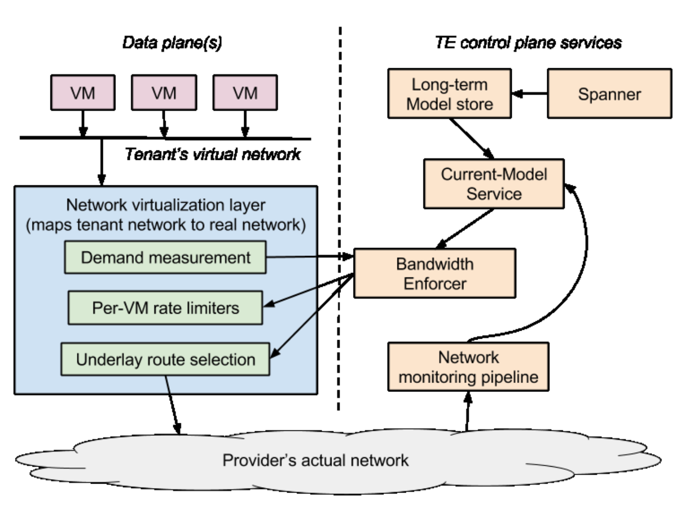

# Thinking about Availability in Large Service Infrastructures

Jeffrey C. Mogul, Rebecca Isaacs, and Brent Welch – Google Inc., Mountain View, CA

**ACM Reference format:**

Jeffrey C. Mogul, Rebecca Isaacs, and Brent Welch – _Google Inc.,
Mountain View, CA_. 2017. Thinking about Availability in Large Service
Infrastructures. In _Proceedings of HotOS ’17, Whistler, BC, Canada,
May 08-10, 2017,_ 6 pages.

https://doi.org/10.1145/3102980.

## 1 Introduction

With the rise of the Internet, the Web, and cloud computing,
we have come to depend on a complex stack of interdependent
online services. Successful operation of a cloud-hosted service,
such as NetFlix or SnapChat, can depend on dozens of underlying distributed systems, some of which in turn depend on each
other. While most people (excepting teenagers) do not view
SnapChat as a life-critical service, past failures of systems such
as Healthcare.gov [12, 33] have had real-world consequences.
Cloud providers are under pressure to deliver more “nines” of
availability as traditional enterprise computing moves tothe
cloud.

The need for an end-to-end approach to availability is
highlighted by the “blameless postmortem” culture of some
providers [5, Ch. 15]. However, learning the patterns of successful and harmful practices does not in itself lead to the creation
of principles that can defend against the unexpected. Meanwhile, the research community has not given the same attention
to these end-to-end availability issues, especially for large-scale
infrastructures, as it has to various point solutions, suchas distributed consensus and state-machine replication (see § 5).

We have observed that system designers struggle to define
overall availability goals suitable for large infrastructures, and
then struggle again to convert these to goals for component services. In this paper, we describe the challenges of providing a
precise and principled definition for availability (§ 3), the possibility of thinking about availability in much the same way that
we have learned to think about security (§ 4), and some general
ideas for designing highly-available infrastructures (§ 6). _We do
not claim to have solved these challenges._

### 1.1 Context

Our company has learned to design and operate planetaryscale services with reasonably high availability. Historically,
these have been Software as a Service (SaaS) systems (search,
YouTube, GMail, etc.), implemented as scale-out distributed
systems that could tolerate all sorts of failures in lower layers,
through the use of traditional techniques such as replication,
distributed consensus algorithms (e.g. Paxos), and transactions,
or newer techniques like straggler-tolerance [17]. Our underlying infrastructure is based on a large number of relatively small
compute and storage nodes, and on networks built from large
numbers of small switches [39]. So, as long as low-level faults
are uncorrelated, the overall SaaS systems keep running.

Two trends have driven us to improve the availability of our
infrastructure , while continuing to exploit the cost advantages
of relatively unreliable components. First, users who originally
adopted low-cost SaaS services as useful novelties now increasingly rely on these services. (E.g., automobile drivers have
shifted from paper maps, to GPS devices with self-contained
maps, to online apps with real-time traffic reports.)

Second, and more challenging, the growth of Infrastructureas-a-Service (IaaS) cloud-computing platforms makes availability of the underlying infrastructure significantly more critical, since many IaaS tenants lack the expertise or scale to build applications that tolerate low-level faults , yet desire the low
costs associated with cheap scale-out hardware.

Prior work by colleagues [21] categorizes and analyzes a
large data set of network failures, and describes techniques for
improving availability. Here we focus on broader aspects of
availability, and we look at distributed systems in general.

## 2 A simple case study


In parts of this paper, we will use an existing, moderately
complex stack of services, depicted in Fig. 1, as an example to
make our discussions more concrete.

 <center>**`Figure 1: Traffic engineering (TE) infrastructure`**</center>

Consider a cloud VM that wishes to communicate over the
network. To meet its bandwidth needs while isolating it from
other tenants, we route its packets over less-utilized links, while
throttling its maximum rate; these are two aspects of traffic
engineering (TE), which we implement using Bandwidth Enforcer (BwE) [29]. BwE in turn depends on a Current-Model
Service, which builds an abstract model of the network’s current state (link utilization and link failures). That service uses
low-level network monitoring data delivered by a scalable network monitoring pipeline, as well as static models of the network’s intended state. Models reside in a Long-term Model
Store, using Spanner [16] for consistent storage.

## 3 Defining infrastructural availability

Without a precise definition of infrastructural availability, it
is impossible to evaluate whether availability goals are being
met, yet we continually struggle to find such a definition. We
believe this confusion results from (1) the underlying _multidimensionality_ of a precise definition, (2) the need to reduce
this dimensionality to something that is feasible to measure and
explain, and (3) the need to then decompose a top-level goal
into goals for the component services.

Defining availability starts with choosing Service Level Indicators (SLIs): something _feasibly measurable_ about the utility
of a system, like latency, packet loss or network path length.
A simple Service Level Objective (SLO) is just a tuple: (SLI,
comparator, threshold) [5, Ch. 4]. In reality, meaningful SLOs
are multi-dimensional, which means that we must define a function over multiple SLIs that says whether the system is meeting
its objectives. Much of the confusion around availability definitions involves choosing this composition function, as well as
the underlying SLIs.^2

### 3.1 Reasons for multi-dimensional SLOs

What makes real-world availability SLOs multidimensional? We discuss several dimensions below (there
are others!)

**Probabilistic SLOs** : We generally cannot afford to build systems that truly never fail, so SLOs are often probabilistic in several dimensions. An SLO of “99.9% of packets will arrive with
low delay, during 99.5% of the minutes during a month” allows
for some minor short-term congestion and some rare switch reboots, but complicates SLO definition by requiring us to choose
a second threshold and several measurement intervals.

**Performance** : Performance and availability are often treated
as orthogonal. For example, Brewer writes that “the CAP theorem ignores latency, although in practice, latency and partitions are deeply related”. A system that never times out its internal communication is placing consistency over availability [7].
However, for a tenant whose VMs can communicate but only
with inadequate bandwidth, its virtual network is “unavailable"
for practical purposes.

Therefore, useful _availability_ SLOs are best defined over _performance_ SLIs; e.g., “the service handles 1000 requests/sec at
a 99%ile latency < 100msec. during 99.99% of the minutes
in a month.” (Note that even a performance-only SLO can be
multi-dimensional, requiring a minimal throughput at a maximum latency.)

There are numerous public examples that demonstrate a lack
of integration between the measurement of performance and
availability. The root cause of a major AWS outage was described as a complicated inter-dependency between a brief network disruption and service load. AWS proposed “stricter monitoring on performance dimensions” as one defense [3].

**Multiple kinds of operation** : Systems are often required to
have different availability guarantees for different types of operation, e.g., reads vs writes, sends vs receives. Thus, we may
wish to define SLIs for each individually; e.g., travellers can
check flight status even if they cannot update reservations (favoring reads over writes), while security logging systems value
uninterrupted appends over read availability.

We may also need separate SLOs for control-plane and dataplane availability (e.g., existing VMs should keep runningeven
when we cannot create new ones). Complex control-plane APIs
might provide higher availability for local operations (create
a new VM) than for global ones (create an administrator account).

Fig. 1 helps to illustrate these points. The VMs should be
able to communicate, perhaps with degradation that increases
over time, even if BwE is down (data-plane availability>
control-plane availability). BwE can continue to throttlebased
on new demand measurements even if the Current Model Store
is down, but with less accuracy (read-stale>read-consistent).

### 3.2 Dimensionality reduction


The second source of difficulty in defining availability is
the need for dimensionality reduction. In practice, nobodyuses
SLOs defined via all relevant dimensions; they are too hard to
understand, and measuring all the SLIs costs too much. So, we
need a way to reduce this complexity, either by using proxy
SLIs (e.g., packet-loss rates as a proxy for TCP throughput), or
by constructing weighted sums over SLIs. Much of the debate
we observe is over how to balance utility with feasibility inthis
dimensionality reduction.

One common approach is to define tiered SLOs, where you
pay more for a better threshold, or set thereof. (These are often called “gold,” “silver,” and “bronze” SLOs.) This shifts
some control over dimensionality reduction to customers, but
also shifts conceptual complexity, which can create confusing
choices [15]. Another is to sweep the complexity under the rug:
Azure user documentation [20] alludes to “effective availability” as the cumulative effect on total system availability of all
the constituent service SLAs, but the SLAs do not cover performance, and the advice to users is simply to “take care.”

### 3.3 Choosing sub-system SLOs

After choosing top-level SLOs, one must then decompose
this into individual SLOs for component sub-systems. The relationship between component and end-to-end SLOs is nontrivial; naive approaches (such as multiplying probabilities or
subdividing downtime budgets) can mislead in both directions:

- Good choices for subsystem SLOs depend on an accurate un    derstanding of dependencies between components in a com    plex, multi-layered infrastructure; unknown correlations can
    cause underestimates of systemic risk [19].
- We often design higher-level components that tolerate lower    level failures, or that convert total failures at a lower level to
    degraded service at a higher level. Such fault-masking tech    niques can yield higher overall availability than simple math
    suggests, reducing the utility of trying to improve component
    SLOs.

These sub-system SLO choices also require balancing costs;
it might be much cheaper to improve some components vs. others, or it might be necessary to re-architect the entire system
instead of throwing resources at bullet-proofing a particular dependency.

### 3.4 Tactical vs. strategic SLOs

We use SLOs for both tactical (operational) decisions –
should pagers go off? Do we need to fix something _now_? – and
strategic (compositional) decisions – what can the designers of
client systems rely on?

Tactical SLOs, to be useful, must be easily and cheaply measured on short timescales, and must make sense to service operators, but do not need to be sensible for customers. E.g.,
“packet loss rate” could be a tactical SLO; it is easy to measure, and early operator intervention can avoid a strategic-SLO
(user-visible) failure. (Note that tactical SLOs can also be used
in automatic control loops, not just for operator interventions.)
Strategic SLOs must be stated in terms that a client system’s
designer can understand and build on, but can often be stated
and measured over relatively long timescales. If these are not
high-nines SLOs, that is OK; the client designers at least know
they must compensate for that.

It is tempting to use one SLO for both tactical and strategic purposes, but we believe that leads to trouble; end-to-end
composition of systems from components is not the same problem as managing the operation of each component. The metrics
and timescales for tactical and strategic SLOs often could and
should be different.

In another paper in this workshop, Huang _et al._ point out
that mechanisms for checking compliance with tactical SLOs
can suffer from “gray failure,” where subtle faults in the infrastructure go un-detected by the provider’s failure detectors, but
still cause outages to end-user applications [23]. They discuss
this problem of “differential observability” and propose some
possible approaches to ameliorating it.

## 4 Availability is like security ... somewhat

We have explained why defining availability SLOs can be
difficult. In this section, we argue that one should think about
availability with the same kind of mindset that we have learned
to use when thinking about security [36]. Of course availability
is not exactly the same as security – but it is also not exactly
the same as fault tolerance, either. This analogy to security has
helped us clarify our thinking about availability.

Many aspects of the analogy reflect the need, in both domains, for “adversarial thinking” on the part of system designers and operators:

- When designing a system for either security or availability,
    one should start with a well-defined _threat model_ [42]. Both
    kinds of “threats” include misconfigurations, unknown depen    dencies, poor assumptions, and system overload.
- In a system that actually approaches 6 nines of availability, al    most every loss-of-availability failure is a new one (e.g.,over
    2 years, Google’s networks experienced at least 103 previ    ously unknown outages [21]). Therefore, these are hard to an    ticipate, analogous to “zero-day” security vulnerabilities.
- Measuring past availability of 6 nines cannot tell you whether
    you’ll get the same in the future, in the same way that measur       ing past security compromises cannot tell you whether you
       are immune from future ones.
          
Other aspects of the analogy relate to mitigation:
             
- Configuration errors afflict both security [31] and availabil                ity [21], especially because configurations are often updatedby operators who have less understanding of a system’s design than its developers, and who are under time pressure.
The overall system needs to tolerate misconfiguration, not
merely detect it (although detecting misconfigurations is certainly worth the effort); designs that make it hard to express a
misconfiguration are even better.
- A service can be designed to “fail-static”: to continue to op                erate when another service, on which it depends, has failed.
(We discuss this more in § 6.) Fail-static for availability is
analogous to default-deny [36] in security mechanisms. Both
follow the principle of “if you don’t know what to do, do the
least harmful thing.”
- Systems need to detect and mitigate large-scale, fast                spreading failures, both for availability and security, even be                fore you know what caused them. Security practices can involve locking down a system during crisis (e.g., disconnecting it from the Internet, or disabling changes to the userauthentication database). Similar availability-preserving practices include mechanisms to rapidly, sometimes automatically, roll back to a known-good configuration [41] or to implement a “Big Red Button” [21] that disconnects a complex,
new part of a system from the simpler, older part.

The analogy can also guide system-wide choices:

- Security and availability both conflict with execution ve                locity. In both cases, we have to discourage or prevent
                user/developer/operator short-cuts, which become sources of
                risk. Also, we avoid new-feature introductions into a system
whose availability has been poor.
- Practical solutions require defense in depth, rather than rely                ing only on proof-based and test-based confidence in the sys                tem’s behavior. No one mechanism guarantees overall avail                ability, in the same way that no one mechanism provides full security.
                   
The analogy is not perfect: availability is _not_ like security in many ways. For example, redundancy is far more useful in preventing availability problems than security problems,and while attackers have incentives and skills to seek out new exploits, many causes of unavailability (aside from DoS attacks) are benign. But when a design or implementation flaw takes a provider’s infrastructure offline, customers might not care whether the proximate cause was malice or just bad luck.

### 4.1 Analogous operational practices

Availability, like security, also requires adherence to good
operational practices, which cannot be implemented entirely by
added or improved software. Instances abound where serious
security breaches have been attributed to poor organizational
practices, for example [35] and [37].

**Reviews**: Good security begins with early-stage design reviews by outside experts. These reviews require consultation with security experts, rather than relying on the limited security-related experience of the average engineer.Similarly, availability-conscious organizations should use an expertconsultant process for early-stage availability reviews.

**Penetration testing** : In a “penetration test,” a team of security experts, distinct from the system designers and operators, attempts to defeat or evade the system’s security mechanisms. System designers cannot be expected to fully understand either their security-threat or availability-threat models,
or to test whether their designs properly defend against these
threats. Our Site Reliability Engineers regularly play a “Wheel
of Misfortune” game to role-play human responses to possible disasters [5, Ch. 28]. Regular testing of disaster recovery
mechanisms is critical to ensure they will actually work when
needed.

## 5 Past research: successes and gaps

Fifty years of active research into networked-systems availability has had only limited impact on engineering practice.
Why? We posit that the most influential outcomes from that
body of research have largely been point solutions that are either domain-specific or address just one aspect of availability.

For example, Byzantine Fault Tolerance (BFT) protocols [2,
11, 14, 28, 45] are not widely deployed. This could be due to
performance and scaling concerns, or the perceived risk to overall availability associated with running a synchronous protocol
in the data center [6]. As a real-world example, we had a router
within the network in Fig. 1 that falsely reported a lightlyloaded link as 100% utilized. Control-plane services faithfully
reported this “alternative fact” to BwE, which tried to throttle
server traffic until the reported link utilization dropped –which
it never did. The network risked becoming unavailable to some
servers, even though all of the services were fully “available.”
While this is a form of Bzyantine failure, 3 f+ 1 replication of
routers is infeasible; we must instead engineer the controlplane
to detect anomalous inputs. Critically, while we can quantify
the risk of Byzantine faults, we lack a framework for systematically trading off that risk against availability and performance
guarantees.

Providers have not entirely ignored research results.
Paxos [30] is widely used within Google [4, 8] and elsewhere [24]. Many academics and practitioners have explored
the tradeoffs between consistency, performance and availability [1, 9, 18, 43, 46], efforts that have had tangible impact on
global-scale production services.

The notion of _performability_ [32] captures, via a Markov
model, how the performance of a multi-node hardware or software system degrades as a function of the availability of individual nodes. To model availability, we would like to have the
dual of performability: a formal way to express how availability
varies as a function of the performance of the nodes.

Several authors have provided useful taxonomies. Jain provides a taxonomy of performance evaluation metrics [25] in
which availability is as important as speed and reliability. Sterbenz _et al._ offer an architectural framework for network resilience [40], identifying classes of engineering solutions to operational threats, and metrics to assess effectiveness of these
techniques. However, we are not aware of widespread adoption
of either approach; industry mostly seems to treat performance
and availability as unrelated issues.

## 6 Techniques for improving availability

Here we discuss a few techniques to address end-to-end infrastructure availability, which are distinct from prior pointsolutions research and the fundamental technique of redundancy. A precise and principled definition of availability for the target system is, of course, a prerequisite.

**Don’t try to solve availability in one layer**: While an IaaS
provider cannot expect its tenants to tolerate high failurerates,
it can work cooperatively with them to achieve higher redundancy at lower cost than it could provide unilaterally. Specifically, providers encourage tenants to replicate their services

across VMs in different zones or regions.
Such cooperation allows a provider to engineer single zones
for somewhat lower availability (therefore lower cost) than a
tenant requires overall; this is analogous to defense-in-depth.
However, any services that are inherently global, such as account creation and authentication, or BwE in Fig. 1, must meet
higher availability targets. Providers therefore need to be cautious about introducing dependencies on too many global-scope
services.

**Fail-static**: Govindan et al. discuss how a network’s realtime packet-forwarding layer can keep operating even when
its SDN controller crashes and restarts^3 ; this is analogous to
default-deny. We can also apply fail-static to service stacks, between multiple layers. For example, in Fig. 1, BwE can stash a
recent model from the current-model service, to use if the latter
service fails. During such a failure, BwE’s view of the network
will grow stale, as links fail or recover, so its throttling might
need to gradually become more conservative, but it can stillrespond to new demands.

Generalizing fail-static poses challenges: reliably detecting
component failure, designing a system to continue to operate
in such cases, testing against hard-to-anticipate failures, and estimating overall system availability with fail-static enabled for
sub-components. Availability is no longer as simple as multiplying failure probabilities.

Fail-static also requires retraining developers. Insteadof writing fail-stop code using ASSERT and PANIC, they must reason
about unwinding gracefully after errors.

**Avoid cyclic dependencies**: Large organizations that build
complex distributed systems tend to accidentally introduce dependency cycles, which can create unexpected correlationsbetween apparently independent systems, and can make it extremely hard to recover when all instances of a component have
failed. Or, if a failure detector depends on a system that has
failed, failures can go unnoticed (and similarly for accessto
logs necessary to understand the cause of a failure [21]). Cycles
can be detected if the global graph is known, but developers often have only a local and informal understanding of the dependency graph; requiring explicit registrations of inter-component
dependencies can help build such a graph. However, some cycles are hard to live without.

We lack space for details on these other techniques:

- Replicated systems suffer when replica failures are correlated;
    pushing the same configuration change to all replicas at once
    creates a correlation, so config-push policies and mechanism
    should exploit “canarying” and gradual rollout [21].
- Emergency systems must be tested before actual emergencies;
    if the system design can execute its “emergency” code paths
    even in normal operation, at least occasionally, recovery times
    tend to improve [5, Ch. 17].
- Capacity planning, to avoid “outages” caused by predictable
    increases in demand that would lead to overloading even non    failed resources.
- Partitioning a larger system intoNdistinct scopes (“colors”)
    with almost no sharing, means that faults (especially miscon       figurations and maintenance errors) remove only 1 /Ncapac       ity [21].
- Continuous assessment of _risk_ of failures due to faults that
    reduce redundancy without _yet_ causing capacity loss; redun    dant systems are hard to probe for risk from outside, unless
    designed to support this [21, 38]. This includes monitoring
    implementation-internal metrics, such as queue lengths, mem    ory consumption, and RPC delays, to detect if the system is at
    risk of reaching internal limits. (E.g., hard-coded timeout val    ues can be an implicit threat to availability, unless response
    times are monitored w.r.t. this risk.)

### 6.1 Availability is not just avoiding failure

Availability suffers when Mean Time Between Failures
(MTBF) is too low, but also when Mean Time To Repair
(MTTR) is too high. Govindan _et al._ [21] report MTTRs of 10s100s of minutes, so one such failure per year limits availability
to no better than 4 nines. Overall availability might be better
served by improving MTTR, together with rapid and accurate
failure detection [13], rather than by expensive approaches to
reducing MTBF.

This point is recognized by some past work that addresses
MTTR (e.g., Recovery Oriented Computing [34] and Microreboot [10]). Nevertheless, in a recent high-profile incident, code
in Cloudflare’s “RRDNS” DNS proxy saw time go backward
as a result of the leap second in December 2017, starting a
chain of events that caused “some DNS resolutions to some
Cloudflare managed web properties” to fail. While the original
non-monotonic time anomaly lasted just one second, it took 9 0
minutes to restore DNS service [22]. (This also illustratesthe
need to define unusual SLOs in order to support composition;
here, the DNS proxy needs to cope with a time-service SLO
in which time might go backwards, but not by much, and not
often.)

## 7 Next Steps

We have explained why defining and measuring availability
is difficult, and we have described a number of techniques for
improving availability. We identify a way to think about availability that draws from how we think about security, analogous
to Saltzer & Schroeder on security [36]. We hope this approach
leads to a general framework that provides principles and mechanisms for:

- Clearly defining multi-dimensional SLIs and their composi    tion into system-level SLOs, and then choosing sub-system
    SLOs.
- Defining sub-system SLOs to minimize overall system cost
    while attaining end-to-end SLOs, rather than focusing on
       point solutions that try to provide “perfect” availabilityfor
       just one layer.
- Given a system or component SLO, predicting whether the
             system’s design will actually meet that SLO, especially given
             complex dependency graphs, and partial or cascading failures.
(Keeton _et al._ applied this approach to storage systems [26]).
- Deciding when to use design patterns such as fail-static vs.
             fail-stop, and how best to use them.
             
**Acknowledgments** : We thank our colleagues Martín Abadi,
          Yaniv Aknin, Emilie Danna, Dina Papagiannaki, John Reese,
          David Wetherall, and John Wilkes for their help. The anony          mous reviewers made wonderful suggestions; we wish we had
          space to simply include their reviews verbatim.

## References

```
[1] Daniel J. Abadi. Consistency Tradeoffs in Modern Distributed Database
System Design. Computer , pages 37–42, February 2012.
[2] Michael Abd-El-Malek, Gregory R. Ganger, Garth R. Goodson, Michael K.
Reiter, and Jay J. Wylie. Fault-Scalable Byzantine Fault-Tolerant Services.
In Proc. SOSP. ACM, 2005.
[3] Amazon. Summary of the Amazon DynamoDB Service
Disruption and Related Impacts in the US-East Region.
https://aws.amazon.com/message/5467D2/, September 2015. Last
accessed on Jan 12, 2017.
[4] Jason Baker, Chris Bond, James C. Corbett, JJ Furman, Andrey Khorlin,
James Larson, Jean-Michel Leon, Yawei Li, Alexander Lloyd,and Vadim
Yushprakh. Megastore: Providing Scalable, Highly Available Storage for
Interactive Services. In Proceedings of the Conference on Innovative Data
system Research (CIDR) , pages 223–234, 2011.
[5] Betsy Beyer, Chris Jones, Jennifer Petoff, and Niall Richard Murphy, editors. Site Reliability Engineering. O’Reilly Media, Inc., 2016.
[6] Ken Birman, Gregory Chockler, and Robbert van Renesse. Toward a cloud
computing research agenda. SIGACT News , 40:68–80, June 2009.
[7] Eric Brewer. CAP Twelve Years Later: How the ”Rules" HaveChanged.
Computer , 45(2):23–29, Feb 2012.
[8] Mike Burrows. The Chubby lock service for loosely-coupled distributed
systems. In Proc. OSDI , pages 335–350, 2006.
[9] Brad Calder, Ju Wang, Aaron Ogus, Niranjan Nilakantan, Arild Skjolsvold,
Sam McKelvie, Yikang Xu, Shashwat Srivastav, Jiesheng Wu, Huseyin
Simitci, Jaidev Haridas, Chakravarthy Uddaraju, Hemal Khatri, Andrew
Edwards, Vaman Bedekar, Shane Mainali, Rafay Abbasi, ArpitAgarwal,
Mian Fahim ul Haq, Muhammad Ikram ul Haq, Deepali Bhardwaj, Sowmya
Dayanand, Anitha Adusumilli, Marvin McNett, Sriram Sankaran, Kavitha
Manivannan, and Leonidas Rigas. Windows Azure Storage: A Highly Available Cloud Storage Service with Strong Consistency. In Proc. SOSP. ACM,
2011.
[10] George Candea, Shinichi Kawamoto, Yuichi Fujiki, GregFriedman, and
Armando Fox. Microreboot — A Technique for Cheap Recovery. In Proc.
OSDI , 2004.
[11] Miguel Castro and Barbara Liskov. Practical ByzantineFault Tolerance and
Proactive Recovery. Transactions on Computer Systems (TOCS) , 20:398–
461, November 2002.
[12] HealthCare.gov Progress and Performance Report. Centers for Medicare & Medicaid Services,
https://www.cms.gov/newsroom/mediareleasedatabase/pressreleases/2013-press-releases-items/2013-12-01.html.
[13] Mike Y. Chen, Emre Kiciman, Eugene Fratkin, Armando Fox, and Eric
Brewer. Pinpoint: Problem Determination in Large, DynamicInternet Services. In Proc. DSN , pages 595–604, 2002.
[14] Allen Clement, Edmund Wong, Lorenzo Alvisi, and Mike Dahlin. Making
Byzantine Fault Tolerant Systems Tolerate Byzantine Faults. In Proc. NSDI.
USENIX, 2009.
[15] Michael Conley, Amin Vahdat, and George Porter. Achieving Cost-efficient,
Data-intensive Computing in the Cloud. In Proc. SoCC , pages 302–314,
2015.
[16] James C. Corbett, Jeffrey Dean, Michael Epstein, Andrew Fikes, Christopher Frost, J. J. Furman, Sanjay Ghemawat, Andrey Gubarev, Christopher
Heiser, Peter Hochschild, Wilson Hsieh, Sebastian Kanthak, Eugene Kogan, Hongyi Li, Alexander Lloyd, Sergey Melnik, David Mwaura, David
Nagle, Sean Quinlan, Rajesh Rao, Lindsay Rolig, Yasushi Saito, Michal
Szymaniak, Christopher Taylor, Ruth Wang, and Dale Woodford. Spanner: Google’s Globally Distributed Database. ACM Trans. Comput. Syst. ,
31(3):8:1–8:22, August 2013.
[17] Jeffrey Dean and Luiz André Barroso. The Tail at Scale. CACM , 56(2):74–
80, February 2013.
[18] Giuseppe DeCandia, Deniz Hastorun, Madan Jampani, Gunavardhan Kakulapati, Avinash Lakshman, Alex Pilchin, Swaminathan Sivasubramanian,
Peter Vosshall, and Werner Vogels. Dynamo: Amazon’s HighlyAvailable
Key-value Store. In Proc. SOSP. ACM, 2007.
[19] Bryan Ford. Icebergs in the Clouds: the Other Risks of Cloud Computing.
In _Proc. HotCloud_ , 2012.
[20] Adam Glick, Jason Roth, Ralph Squillace, and Simon Rolfe. Disaster recovery and high availability for applications built on Microsoft Azure. https://docs.microsoft.com/en-us/azure/resiliency/resiliencydisaster-recovery-high-availability-azure-applications, August 2016. Last
accessed on Jan 12, 2017.
[21] Ramesh Govindan, Ina Minei, Mahesh Kallahalla, BikashKoley, and Amin
Vahdat. Evolve or Die: High-Availability Design Principles Drawn from
Google’s Network Infrastructure. In _Proc. SIGCOMM_ , pages 58–72, 2016.
[22] John Graham-Cumming. How and why the leap second affected Cloudflare
DNS. https://blog.cloudflare.com/how-and-why-the-leap-second-affectedcloudflare-dns/, January 2017.
[23] Peng Huang, Chuanxiong Guo, Lidong Zhou, Jacob R. Lorch, Yingnong
Dang, Murali Chintalapati, and Randolph Yao. Gray failure:The
achillesâA ̆Z heel of cloud-scale systems. In ́ _Proc. HotOS_ , May 2017.
[24] Patrick Hunt, Mahadev Konar, Flavio P. Junqueira, and Benjamin Reed.
ZooKeeper: Wait-free Coordination for Internet-scale Systems. In _Proc.
USENIX ATC_ , 2010.
[25] Raj Jain. _The Art of Computer Systems Performance Analysis_ , chapter 3.
John Wiley, 1991.
[26] Kimberley Keeton, Cipriano Santos, Dirk Beyer, Jeffrey Chase, and John
Wilkes. Designing for Disasters. In _Proc. FAST_ , pages 59–62, 2004.
[27] James J. Kistler and M. Satyanarayanan. Disconnected Operation in the
Coda File System. _Trans. Comput. Syst._ , 10(1):3–25, February 1992.
[28] Ramakrishna Kotla, Lorenzo Alvisi, Mike Dahlin, AllenClement, and Edmund Wong. Zyzzyva: Speculative Byzantine Fault Tolerance. In _Proc.
SOSP_. ACM, 2007.
[29] Alok Kumar, Sushant Jain, Uday Naik, Anand Raghuraman,Nikhil Kasinadhuni, Enrique Cauich Zermeno, C. Stephen Gunn, Jing Ai, Björn Carlin,
Mihai Amarandei-Stavila, Mathieu Robin, Aspi Siganporia,Stephen Stuart,
and Amin Vahdat. BwE: Flexible, Hierarchical Bandwidth Allocation for
WAN Distributed Computing. In _Proc. SIGCOMM ’15_ , 2015.
[30] Leslie Lamport. The part-time parliament. _Transactions on Computer Systems (TOCS)_ , 16:133–169, May 1998.
[31] Butler W. Lampson. Computer Security in the Real World. _Computer_ ,
37(6):37–46, June 2004.
[32] John F. Meyer. Performability: a retrospective and some pointers to the
future. _Performance Evaluation_ , 14:139–156, 1992.
[33] Robinson Meyer. The Secret Startup That Saved the WorstWebsite in America. _The Atlantic_ , July 2015.
[34] David Patterson, Aaron Brown, Pete Broadwell, George Candea, Mike
Chen, James Cutler, Patricia Enriquez, Armando Fox, Emre KÄ ́scÄ ́sman,
Matthew Merzbacher, David Oppenheimer, Naveen Sastry, William Tetzlaff, Jonathan Traupman, and Noah Treuhaft. Recovery Oriented Computing (ROC): Motivation, Definition, Techniques, and CaseStudies. Technical Report UCB//CSD-02-1175, U.C. Berkeley Computer Science, March
2002.
[35] Teri Radichel. Case Study: Critical Controls that Could Have Prevented
Target Breach. SANS Institute InfoSec Reading Room, August2014.
[36] Jerome H. Saltzer and Michael D. Schroeder. The Protection of Information
in Computer Systems. _Proc. IEEE_ , 63(9):1278–1308, September 1975.
[37] Gabriel Sanchez. Case Study: Critical Controls that Sony Should Have
Implemented. SANS Institute InfoSec Reading Room, June 2015.
[38] Mehul A. Shah, Mary Baker, Jeffrey C. Mogul, and Ram Swaminathan. Auditing to Keep Online Storage Services Honest. In _Proc. HOTOS_ , pages
11:1–11:6, 2007.
[39] Arjun Singh, Joon Ong, Amit Agarwal, Glen Anderson, Ashby Armistead,
Roy Bannon, Seb Boving, Gaurav Desai, Bob Felderman, PaulieGermano,
Anand Kanagala, Jeff Provost, Jason Simmons, Eiichi Tanda,Jim Wanderer,
Urs Hölzle, Stephen Stuart, and Amin Vahdat. Jupiter Rising: A Decade of
Clos Topologies and Centralized Control in Google’s Datacenter Network.
In _Proc. SIGCOMM_ , pages 183–197, 2015.
[40] James P. G. Sterbenz, David Hutchison, Egemen K. Çetinkaya, Abdul Jabbar, Justin P. Rohrer, Marcus Schöller, and Paul Smith. Resilience and survivability in communication networks: Strategies, principles, and survey of
disciplines. _Computer Networks_ , 54:1245–1265, 2010.
[41] Yu-Wei Eric Sung, Xiaozheng Tie, Starsky H.Y. Wong, andHongyi Zeng.
Robotron: Top-down Network Management at Facebook Scale. In _Proc.
SIGCOMM_ , pages 426–439, 2016.
[42] Frank Swiderski and Window Snyder. _Threat Modeling_. Microsoft Press,
Redmond, WA, USA, 2004.
[43] Douglas B. Terry, Vijayan Prabhakaran, Ramakrishna Kotla, Mahesh Balakrishnan, Marcos K. Aguilera, and Hussam Abu-Libdeh. Consistencybased Service Level Agreements for Cloud Storage. In _Proc. SOSP_. ACM,
2013.
[44] John Wilkes. Utility Functions, Prices, and Negotiation. In Rajkumar Buyya
and Kris Bubendorfer, editors, _Market-Oriented Grid and Utility Computing_ , Wiley Series on Parallel and Distributed Computing, chapter 4, pages
67–88. John Wiley & Sons, Hoboken, NJ, October 2009.
[45] Jian Yin, Jean-Philippe Martin, Arun Venkataramani, Lorenzo Alvisi, and
Mike Dahlin. Separating Agreement from Execution for Byzantine Fault
Tolerant Services. In Proc. SOSP. ACM, 2003.
[46] Haifeng Yu and Amin Vahdat. Design and evaluation of a continuous consistency model for replicated services. In Proc. OSDI , 2000.
```

