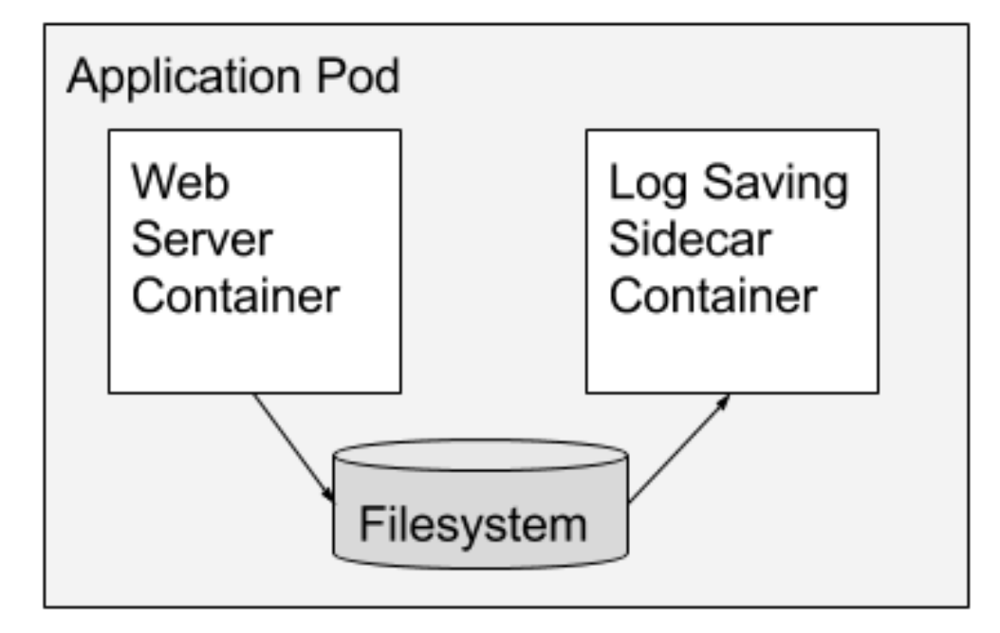
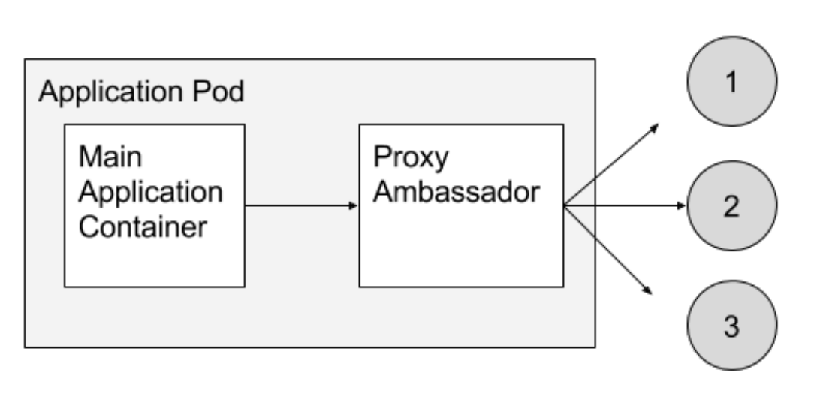
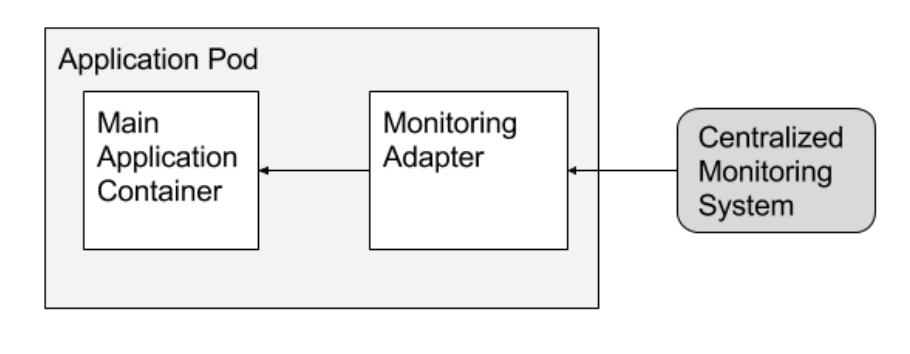
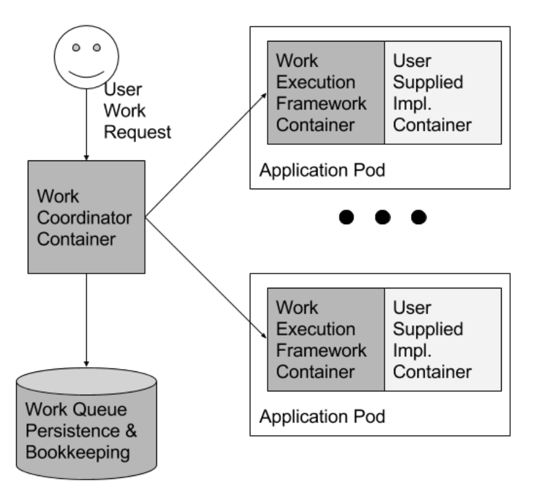
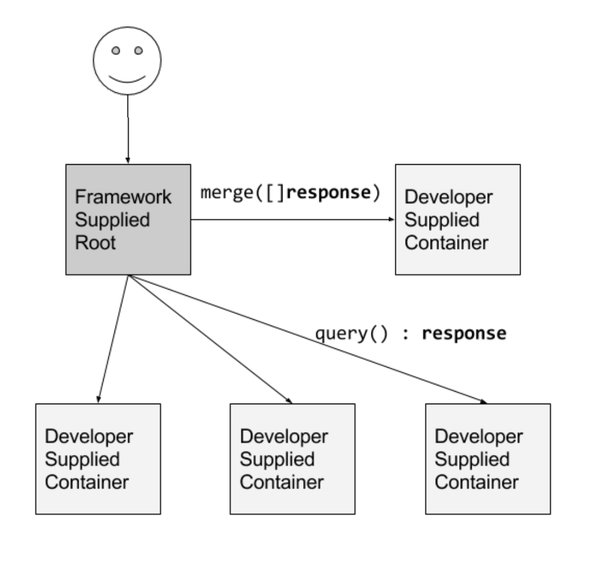

# Design patterns for container-based distributed systems

Brendan Burns David Oppenheimer

Google

## 1 Introduction

In the late 1980s and early 1990s, object-oriented programming revolutionized software development, popularizing the approach of building of applications as collections of modular components. Today we are seeing
a similar revolution in distributed system development,
with the increasing popularity of microservice architectures built from containerized software components.
Containers [15] [22] [1] [2] are particularly well-suited
as the fundamental “object” in distributed systems by
virtue of the walls they erect at the container boundary. As this architectural style matures, we are seeing the
emergence of design patterns, much as we did for objectoriented programs, and for the same reason – thinking in
terms of objects (or containers) abstracts away the lowlevel details of code, eventually revealing higher-level
patterns that are common to a variety of applications and
algorithms.

This paper describes three types of design patterns
that we have observed emerging in container-based distributed systems: single-container patterns for container
management, single-node patterns of closely cooperating containers, and multi-node patterns for distributed
algorithms. Like object-oriented patterns before them,
these patterns for distributed computation encode best
practices, simplify development, and make the systems
where they are used more reliable.

## 2 Distributed system design patterns

After object-oriented programming had been used for
some years, design patterns emerged and were documented [3]. These patterns codified and regularized general approaches to solving particular common programming problems. This codification further improved the
general state of the art in programming because it made it
easier for less experienced programmers to produce wellengineered code, and led to the development of reusable
libraries that made code more reliable and faster to develop.

The state-of-the-art in distributed system engineering
today looks significantly more like the world of early
1980s programming than it does the world of objectoriented development. Yet it’s clear from the success
of the MapReduce pattern [4] in bringing the power of
“Big Data” programming to a broad set of fields and developers, that putting in place the right set of patterns
can dramatically improve the quality, speed, and accessibility of distributed system programming. But even the
success of MapReduce is largely limited to a single programming language, insofar as the Apache Hadoop [5]
ecosystem is primarily written in and for Java. Developing a truly comprehensive suite of patterns for distributed
system design requires a very generic, language-neutral
vehicle to represent the atoms of the system.

Thus it is fortunate that the last two years have seen a
dramatic rise in adoption of Linux container technology.
The container and the container image are exactly the abstractions needed for the development of distributed systems patterns. To date, containers and container images
have achieved the large measure of their popularity simply by being a better, more reliable method for delivering
software from development all the way through production. By being hermetically sealed, carrying their dependencies with them, and providing an atomic deployment
signal (“succeeded”/“failed”), they dramatically improve
on the previous state of the art in deploying software in
the datacenter or cloud. But containers have the potential
to be much more than just a better deployment vehicle
- we believe they are destined to become analogous to
objects in object-oriented software systems, and as such
will enable the development of distributed system design
patterns. In the following sections we explain why we
believe this to be the case, and describe some patterns
that we see emerging to regularize and guide the engineering of distributed systems over the coming years.


## 3 Single-container management patterns

The container provides a natural boundary for defining
an interface, much like the object boundary. Containers can expose not only application-specific functionality, but also hooks for management systems, via this interface.

The traditional container management interface is extremely limited. A container effectively exports three
verbs: run(), pause(), and stop(). Though this interface
is useful, a richer interface can provide even more utility to system developers and operators. And given the
ubiquitous support for HTTP web servers in nearly every
modern programming language and widespread support
for data formats like JSON, it is easy to define an HTTPbased management API that can be “implemented” by
having the container host a web server at specific endpoints, in addition to its main functionality.

In the “upward” direction the container can expose a rich set of application information, including
application-specific monitoring metrics (QPS, application health, etc.), profiling information of interest to developers (threads, stack, lock contention, network message statistics, etc.), component configuration information, and component logs. As a concrete example of this,
Kubernetes [6], Aurora [7], Marathon [8], and other container management systems allow users to define health
checks via specified HTTP endpoints (e.g. “/health”).
Standardized support for other elements of the “upward”
API we have described is more rare.

In the “downward” direction, the container interface
provides a natural place to define a lifecycle that makes
it easier to write software components that are controlled
by a management system. For example, a cluster management system will typically assign “priorities” to tasks,
with high-priority tasks guaranteed to run even when the
cluster is oversubscribed. This guarantee is enforced by
evicting already-running lower-priority tasks, that will
then have to wait until resources become available. Eviction can be implemented by simply killing the lowerpriority task, but this puts an undue burden on the developer to respond to arbitrary death anywhere in their
code. If instead, a formal lifecycle is defined between
application and management system, then the application components become more manageable, since they
conform to a defined contract, and the development of
the system becomes easier, since the developer can rely
on the contract. For example, Kubernetes uses a “graceful deletion” feature of Docker that warns a container,
via the SIGTERM signal, that it is going to be terminated, an application-defined amount of time before it is
sent the SIGKILL signal. This allows the application to
terminate cleanly by finishing in-flight operations, flushing state to disk, etc. One can imagine extending such a
mechanism to provide support for state serialization and
recovery that makes state management significantly easier for stateful distributed systems.

As a concrete example of a more complex lifecycle,
consider the Android Activity model [9], which features
a series of callbacks (e.g. onCreate(), onStart(), onStop(), ...) and a formally defined state machine for how
the system triggers these callbacks. Without this formal
lifecycle, robust, reliable Android applications would
be significantly harder to develop. In the context of
container-based systems, this generalizes to applicationdefined hooks that are invoked when a container is created, when it is started, just before termination, etc. Another example of a “downward” API that a container
might support is “replicate yourself” (to scale up the service).

## 4 Single-node, multi-container application patterns


Beyond the interface of a single container, we also see
design patterns emerging that span containers. We have
previously identified several such patterns [10]. These
single-node patterns consist of symbiotic containers that
are co-scheduled onto a single host machine. Container
management system support for co-scheduling multiple
containers as an atomic unit, an abstraction Kubernetes
calls “Pods” and Nomad [11] calls “task groups,” is thus
a required feature for enabling the patterns we describe
in this section.

## 4.1 Sidecar pattern

The first and most common pattern for multi-container
deployments is the sidecar pattern. Sidecars extend and
enhance the main container. For example, the main container might be a web server, and it might be paired
with a “logsaver” sidecar container that collects the web
server’s logs from local disk and streams them to a cluster storage system. Figure 1 shows an example of the
sidecar pattern. Another common example is a web
server that serves from local disk content that is populated by a sidecar container that periodically synchronizes the content from a git repository, content management system, or other data source. Both of these examples are common at Google. Sidecars are possible because containers on the same machine can share a local
disk volume.

While it is always possible to build the functionality
of a sidecar container into the main container, there are
several benefits to using separate containers. First, the
container is the unit ofresource accounting and allocation, so for example a web server container’s cgroup


> Figure 1: An example of a sidecar container augmenting
an application with log saving.

[15] can be configured so that it provides consistent lowlatency responses to queries, while the logsaver container
is configured to scavenge spare CPU cycles when the
web server is not busy. Second, the container is the unit
of _packaging_, so separating serving and log saving into
different containers makes it easy to divide responsibility for their development between two separate programming teams, and allows them to be tested independently
as well as together. Third, the container is the unit of
_reuse_, so sidecar containers can be paired with numerous different “main” containers (e.g. a log saver container could be used with any component that produces
logs). Fourth, the container provides a _failure containment boundary_, making it possible for the overall system to degrade gracefully (for example, the web server
can continue serving even if the log saver has failed).
Lastly, the container is the unit of _deployment_, which
allows each piece of functionality to be upgraded and,
when necessary, rolled back, independently. (Though it
should be noted that this last benefit also comes with a
downside – the test matrix for the overall system must
consider all of the container version combinations that
might be seen in production, which can be large since
sets of containers generally can’t be upgraded atomically.
Of course while a monolithic application doesn’t have
this issue, componentized systems are easier to test in
some regards, since they are built from smaller units that
can be independently tested.) Note that these five benefits apply to all of the container patterns we describe in
the remainder of this paper.

## 4.2 Ambassador pattern

The next pattern that we have observed is the ambassador
pattern. Ambassador containers proxy communication
to and from a main container. For example, a developer
might pair an application that is speaking the memcache
protocol with a twemproxy ambassador. The application
believes that it is simply talking to a single memcache
on localhost, but in reality twemproxy is sharding the requests across a distributed installation of multiple memcache


> Figure 2: An example of the ambassador pattern applied
to proxying to different memcache shards.


nodes elsewhere in the cluster. This container pattern simplifies the programmer’s life in three ways: they
only have to think and program in terms of their application connecting to a single server on localhost, they
can test their application standalone by running a real
memcache instance on their local machine instead of the
ambassador, and they can reuse the twemproxy ambassador with other applications that might even be coded in
different languages. Ambassadors are possible because
containers on the same machine share the same localhost
network interface. An example of this pattern is shown
in Figure 2.

## 4.3 Adapter pattern

The final single-node pattern we have observed is the
adapter pattern. In contrast to the ambassador pattern,
which presents an application with a simplified view of
the outside world, adapters present the outside world
with a simplified, homogenized view of an application. They do this by standardizing output and interfaces
across multiple containers. A concrete example of the
adapter pattern is adapters that ensure all containers in a
system have the same monitoring interface. Applications
today use a wide variety of methods to export their metrics (e.g. JMX, statsd, etc). But it is easier for a single
monitoring tool to collect, aggregate, and present metrics
from a heterogenous set of applications if all the applications present a consistent monitoring interface. Within
Google, we have achieved this via code convention, but
this is only possible if you build your software from
scratch. The adapter pattern enables the heterogenous
world of legacy and open-source applications to present
a uniform interface without requiring modification of the
original application. The main container can communicate with the adapter through localhost or a shared local
volume. This is shown in Figure 3. Note that while some
existing monitoring solutions are able to communicate
with multiple types of back-ends, they use applicationspecific code in the monitoring system itself, which provides a less clean separation of concerns.


> Figure 3: An example of the adapter pattern applied to
normalizing the monitoring interface.

## 5 Multi-node application patterns

Moving beyond cooperating containers on a single machine, modular containers make it easier to build coordinated multi-node distributed applications. We describe
three of these distributed system patterns next. Like the
patterns in the previous section, these also require system
support for the Pod abstraction.

## 5.1 Leader election pattern

One of the most common problems in distributed systems is leader election (e.g. [20]). While replication is
commonly used to share load among multiple identical
instances of a component, another, more complex use of
replication is in applications that need to distinguish one
replica from a set as the “leader.” The other replicas are
available to quickly take the place of the leader if it fails.
A system may even run multiple leader elections in parallel, for example to determine the leader of each of multiple shards. There are numerous libraries for performing leader election. They are generally complicated to
understand and use correctly, and additionally, they are
limited by being implemented in a particular programming language. An alternative to linking a leader election library into the application is to use a leader election container. A set of leader-election containers, each
one co-scheduled with an instance of the application that
requires leader election, can perform election amongst
themselves, and they can present a simplified HTTP API
over localhost to each application container that requires
leader election (e.g. becomeLeader, renewLeadership,
etc.). These leader election containers can be built once,
by experts in this complicated area, and then the subsequent simplified interface can be re-used by application
developers regardless of their choice of implementation
language. This represents the best of abstraction and encapsulation in software engineering.

## 5.2 Work queue pattern

Although work queues, like leader election, are a wellstudied subject with many frameworks implementing
them, they too are an example of a distributed system


> Figure 4: An illustration of the generic work queue.
Reusable framework containers are shown in dark gray,
while developer containers are shown in light gray.

pattern that can benefit from container-oriented architectures. In previous systems, the framework limited programs to a single language environment (e.g. Celery for
Python [13]), or the distribution of work and binary were
exercises left to the implementer (e.g. Condor [21]). The
availability of containers that implement the run() and
mount() interfaces makes it fairly straightforward to implement a generic work queue framework that can take
arbitrary processing code packaged as a container, and
arbitrary data, and build a complete work queue system.
The developer only has to build a container that can take
an input data file on the filesystem, and transform it to an
output file; this container would become one stage of the
work queue. All of the other work involved in developing a complete work queue can be handled by the generic
work queue framework that can be reused whenever such
a system is needed. The manner in which a user’s code
integrates into this shared work queue framework is illustrated in Figure 4.

## 5.3 Scatter/gather pattern


The last distributed systems pattern we highlight is scatter/gather. In such a system, an external client sends an
initial request to a “root” or “parent” node. This root
fans the request out to a large number of servers to perform computations in parallel. Each shard returns partial data, and the root gathers this data into a single response to the original request. This pattern is common
in search engines. Developing such a distributed system involves a great deal of boilerplate code: fanning out
the requests, gathering the responses, interacting with the
client, etc. Much of this code is quite generic, and again,
as in object-oriented programming, can be refactored in
such a way that a single implementation can be provided
that can be used with arbitrary containers so long as they


> Figure 5: An illustration of the scatter/gather pattern. A
reusable root container (dark gray) implements client interactions and request fan-out to developer-supplied leaf
containers and to a developer-supplied container responsible for merging the results (all in light gray).

implement a specific interface. In particular, to implement a scatter/gather system, a user is required to supply two containers. First, the container that implements
the leaf node computation; this container performs the
partial computation and returns the corresponding result.
The second container is the merge container; this container takes the aggregated output of all of the leaf containers, and groups them into a single response. It is easy
to see how a user can implement a scatter/gather system
of arbitrary depth (including parents, in addition to roots,
if necessary) simply by providing containers that implement these relatively simple interfaces. Such a system is
illustrated in Figure 5.

## 6 Related work

Service-oriented architectures (SOA) [16] pre-date, and
share a number of characteristics with, container-based
distributed systems. For example, both emphasize
reusable components with well-defined interfaces that
communicate over a network. On the other hand, components in SOA systems tend to be larger-grain and
more loosely-coupled than the multi-container patterns
we have described. Additionally, components in SOA often implement business activities, while the components
we have focused on here are more akin to generic libraries that make it easier to build distributed systems.
The term “microservice” has recently emerged to describe the types of components we have discussed in this paper.

The concept of standardized management interfaces to
networked components dates back at least to SNMP [19].
SNMP focuses primarily on managing hardware components, and no standard has yet emerged for managing
microservice/container-based systems. This has not prevented the development of numerous container management systems, including Aurora [7], ECS [17], Docker
Swarm [18], Kubernetes [6], Marathon [8], and Nomad
[11].

All of the distributed algorithms we mentioned in Section 5 have a long history. One can find a number
of leader election implementations in Github, though
they appear to be structured as libraries rather than standalone components. There are a number of popular work
queue implementations, including Celery [13] and Amazon SQS [14]. Scatter-gather has been identified as an
Enterprise Integration Pattern [12].

## 7 Conclusion

Much as object-oriented programming led to the emergence and codification of object-oriented “design patterns,” we see container architectures leading to design
patterns for container-based distributed systems. In this
paper we identified three types of patterns we have seen
emerging: single-container patterns for system management, single-node patterns of closely-cooperating containers, and multi-node patterns for distributed algorithms. In all cases, containers provide many of the same
benefits as objects in object-oriented systems, such as
making it easy to divide implementation among multiple
teams and to reuse components in new contexts. In addition, they provide some benefits unique to distributed
systems, such as enabling components to be upgraded independently, to be written in a mixture of languages, and
for the system a whole to degrade gracefully. We believe
that the set of container patterns will only grow, and that
in the coming years they will revolutionize distributed
systems programming much as object-oriented programming did in earlier decades, in this case by enabling a
standardization and regularization of distributed system
development.

## 8 Acknowledgements


Ideas don’t simply appear in our heads from a vaccum.
The work in this paper has been influenced heavily by
conversations with Brian Grant, Tim Hockin, Joe Beda
and Craig McLuckie.

## References

```
[1] Docker Engine http://www.docker.com

[2] rkt: a security-minded standards-based container engine https://coreos.com/rkt/

[3] Erich Gamma, John Vlissides, Ralph Johnson,
Richard Helm, Design Patterns: Elements of

Reusable Object-Oriented Software, AddisonWesley, Massachusetts, 1994.

[4] Jeffrey Dean, Sanjay Ghemawat, MapReduce: Simplified Data Processing on Large Clusters, Sixth
Symposium on Operating System Design and Implementation, San Francisco, CA 2004.

[5] Apache Hadoop, [http://hadoop.apache.org](http://hadoop.apache.org)

[6] Kubernetes, [http://kubernetes.io](http://kubernetes.io)

[7] Apache Aurora, https://aurora.apache.org.

[8] Marathon: A cluster-wide init and control system for
services, https://mesosphere.github.io/marathon/

[9] Managing the Activity Lifecycle,
[http://developer.android.com/training/basics/activity-](http://developer.android.com/training/basics/activity-)
lifecycle/index.html

[10] Brendan Burns, The Distributed System
ToolKit: Patterns for Composite Containers,
[http://blog.kubernetes.io/2015/06/the-distributed-](http://blog.kubernetes.io/2015/06/the-distributed-)
system-toolkit-patterns.html

[11] Nomad by Hashicorp,
https://www.nomadproject.io/

[12] Gregor Hohpe, Enterprise Integration Patterns,
Addison-Wesley, Massachusetts, 2004.

[13] Celery: Distributed Task Queue,
[http://www.celeryproject.org/](http://www.celeryproject.org/)

[14] Amazon Simple Queue Service,
https://aws.amazon.com/sqs/

[15] https://www.kernel.org/doc/Documentation/cgroupv1/cgroups.txt

[16] Service Oriented Architecture,
https://en.wikipedia.org/wiki/Serviceorientedarchitecture

[17] Amazon EC2 Container Service,
https://aws.amazon.com/ecs/

[18] Docker Swarm https://docker.com/swarm

[19] J. Case, M. Fedor, M. Schoffstall, J. Davin, A
Simple Network Management Protocol (SNMP),
https://www.ietf.org/rfc/rfc1157.txt, 1990.

[20] R. G. Gallager, P. A. Humblet, P. M. Spira, A
distributed algorithm for minimum-weight spanning
trees, ACM Transactions on Programming Languages and Systems, January, 1983.

[21] M.J. Litzkow, M. Livny, M. W. Mutka, Condor: a
hunter of idle workstations, IEEE Distributed Computing Systems, 1988.

[22] https://linuxcontainers.org/
```
