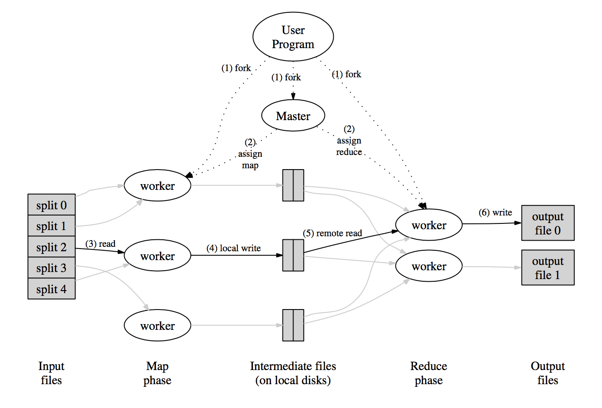
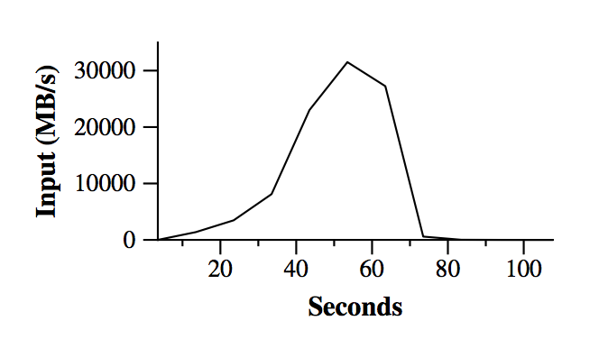
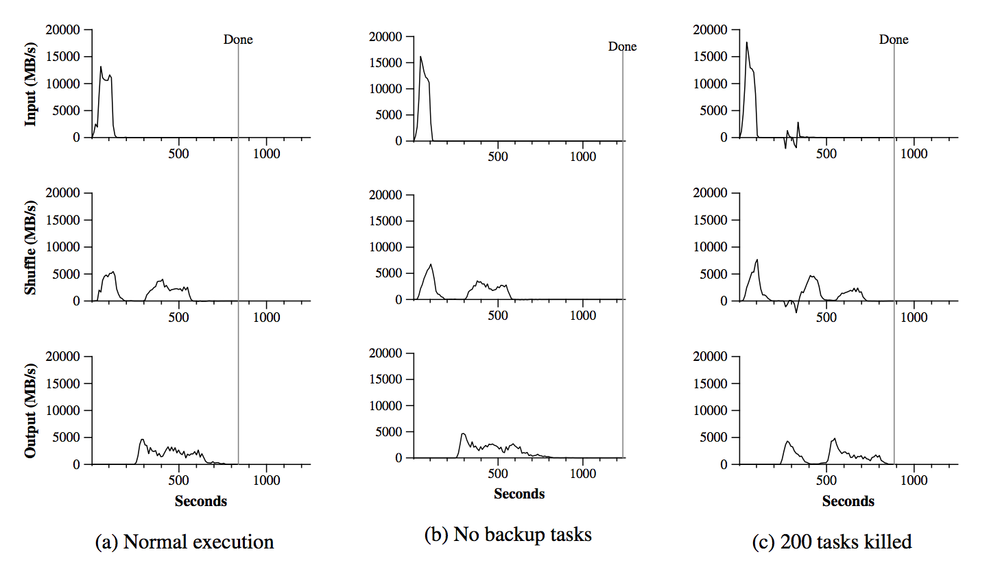
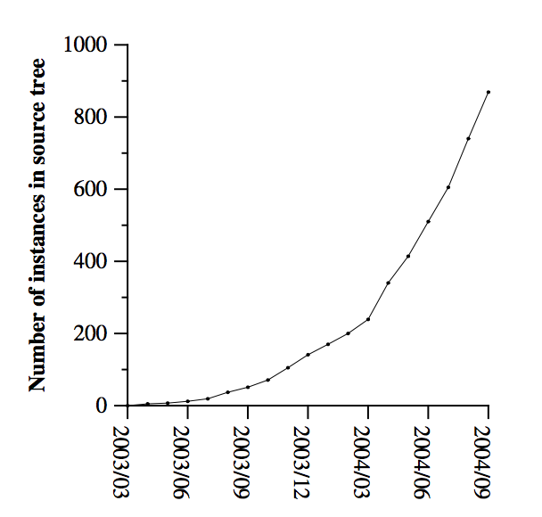
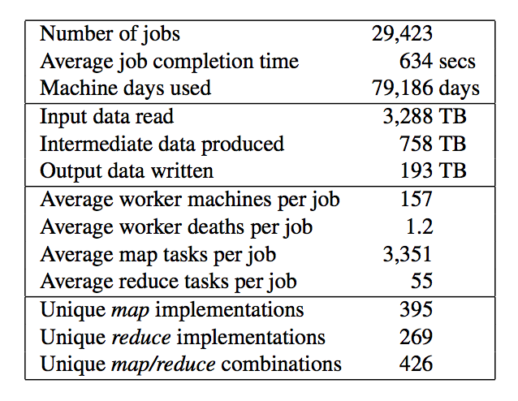

# MapReduce: Simplified Data Processing on Large Clusters

Jeffrey Dean and Sanjay Ghemawat


jeff@google.com,sanjay@google.com

 _Google, Inc._

## Abstract

MapReduce is a programming model and an associated implementation for processing and generating large
data sets. Users specify a map function that processes a
key/value pair to generate a set of intermediate key/value
pairs, and a reduce function that merges all intermediate
values associated with the same intermediate key. Many
real world tasks are expressible in this model, as shown
in the paper.

Programs written in this functional style are automatically parallelized and executed on a large cluster of commodity machines. The run-time system takes care of the
details of partitioning the input data, scheduling the program’s execution across a set of machines, handling machine failures, and managing the required inter-machine
communication. This allows programmers without any
experience with parallel and distributed systems to easily utilize the resources of a large distributed system.

Our implementation of MapReduce runs on a large
cluster of commodity machines and is highly scalable:
a typical MapReduce computation processes many terabytes of data on thousands of machines. Programmers
find the system easy to use: hundreds of MapReduce programs have been implemented and upwards of one thousand MapReduce jobs are executed on Google’s clusters
every day.

## 1 Introduction

Over the past five years, the authors and many others at
Google have implemented hundreds of special-purpose
computations that process large amounts of raw data,
such as crawled documents, web request logs, etc., to
compute various kinds of derived data, such as inverted
indices, various representations of the graph structure
of web documents, summaries of the number of pages
crawled per host, the set of most frequent queries in a
given day, etc. Most such computations are conceptually straightforward. However, the input data is usually
large and the computations have to be distributed across
hundreds or thousands of machines in order to finish in
a reasonable amount of time. The issues of how to parallelize the computation, distribute the data, and handle
failures conspire to obscure the original simple computation with large amounts of complex code to deal with
these issues.

As a reaction to this complexity, we designed a new
abstraction that allows us to express the simple computations we were trying to perform but hides the messy details of parallelization, fault-tolerance, data distribution
and load balancing in a library. Our abstraction is inspired by the map and reduce primitives present in Lisp
and many other functional languages. We realized that
most of our computations involved applying a map operation to each logical “record” in our input in order to
compute a set of intermediate key/value pairs, and then
applying a reduce operation to all the values that shared
the same key, in order to combine the derived data appropriately. Our use of a functional model with userspecified map and reduce operations allows us to parallelize large computations easily and to use re-execution
as the primary mechanism for fault tolerance.

The major contributions of this work are a simple and
powerful interface that enables automatic parallelization
and distribution of large-scale computations, combined
with an implementation of this interface that achieves
high performance on large clusters of commodity PCs.

Section 2 describes the basic programming model and
gives several examples. Section 3 describes an implementation of the MapReduce interface tailored towards
our cluster-based computing environment. Section 4 describes several refinements of the programming model
that we have found useful. Section 5 has performance
measurements of our implementation for a variety of
tasks. Section 6 explores the use of MapReduce within
Google including our experiences in using it as the basis
for a rewrite of our production indexing system. Section 7 discusses related and future work.

## 2 Programming Model

The computation takes a set of input _key/value_ pairs, and
produces a set of output _key/value_ pairs. The user of
the MapReduce library expresses the computation as two
functions: _Map_ and _Reduce_.

_Map_ , written by the user, takes an input pair and produces a set of intermediate key/value pairs. The MapReduce library groups together all intermediate values associated with the same intermediate keyIand passes them
to the Reduce function.

The _Reduce_ function, also written by the user, accepts
an intermediate keyIand a set of values for that key. It
merges together these values to form a possibly smaller
set of values. Typically just zero or one output value is
produced per _Reduce_ invocation. The intermediate values are supplied to the user’s reduce function via an iterator. This allows us to handle lists of values that are too large to fit in memory.

### 2.1 Example

Consider the problem of counting the number of occurrences of each word in a large collection of documents. The user would write code similar to the following pseudo-code:

```java
map(String key, String value):
	// key: document name
	// value: document contents
	for each word w in value:
		EmitIntermediate(w, "1");

reduce(String key, Iterator values):
	// key: a word
	// values: a list of counts
	int result = 0;
	for each v in values:
		result += ParseInt(v);
	Emit(AsString(result));
```

The `map` function emits each word plus an associated
count of occurrences (just ‘1’ in this simple example).
The `reduce` function sums together all counts emitted
for a particular word.

In addition, the user writes code to fill in a mapreduce
specification object with the names of the input and output files, and optional tuning parameters. The user then
invokes the _MapReduce_ function, passing it the specification object. The user’s code is linked together with the
MapReduce library (implemented in C++). Appendix A
contains the full program text for this example.

### 2.2 Types

Even though the previous pseudo-code is written in terms
of string inputs and outputs, conceptually the map and
reduce functions supplied by the user have associated
types:

```
map (k1,v1) →list(k2,v2)
reduce (k2,list(v2)) →list(v2)
```

I.e., the input keys and values are drawn from a different
domain than the output keys and values. Furthermore,
the intermediate keys and values are from the same domain as the output keys and values.

Our C++ implementation passes strings to and from
the user-defined functions and leaves it to the user code
to convert between strings and appropriate types.

### 2.3 More Examples

Here are a few simple examples of interesting programs
that can be easily expressed as MapReduce computations.

**Distributed Grep**: The map function emits a line if it
matches a supplied pattern. The reduce function is an
identity function that just copies the supplied intermediate data to the output.

**Count of URL Access Frequency**: The map function processes logs of web page requests and outputs
`〈URL, 1 〉`. The reduce function adds together all values
for the same URL and emits a `〈URL,total count〉`
pair.

**Reverse Web-Link Graph**: The map function outputs
〈target,source〉pairs for each link to atarget
URL found in a page namedsource. The reduce
function concatenates the list of all source URLs associated with a given target URL and emits the pair:
`〈target, list(source)〉`

**Term-Vector per Host**: A term vector summarizes the
most important words that occur in a document or a set
of documents as a list of〈word, f requency〉pairs. The
map function emits a 〈hostname,term vector〉
pair for each input document (where the hostname is
extracted from the URL of the document). The reduce function is passed all per-document term vectors
for a given host. It adds these term vectors together,
throwing away infrequent terms, and then emits a final
〈hostname,term vector〉pair.



> <center>Figure 1: Execution overview</center>


**Inverted Index**: The map function parses each document, and emits a sequence of〈word,document ID〉
pairs. The reduce function accepts all pairs for a given
word, sorts the corresponding document IDs and emits a
〈word, list(document ID)〉pair. The set of all output
pairs forms a simple inverted index. It is easy to augment
this computation to keep track of word positions.

**Distributed Sort**: The map function extracts the key
from each record, and emits a〈key,record〉pair. The
reduce function emits all pairs unchanged. This computation depends on the partitioning facilities described in
Section 4.1 and the ordering properties described in Section 4.2.

## 3 Implementation

Many different implementations of the MapReduce interface are possible. The right choice depends on the
environment. For example, one implementation may be
suitable for a small shared-memory machine, another for
a large NUMA multi-processor, and yet another for an
even larger collection of networked machines.

This section describes an implementation targeted
to the computing environment in wide use at Google:
large clusters of commodity PCs connected together with
switched Ethernet [4]. In our environment:

(1) Machines are typically dual-processor x86 processors
running Linux, with 2-4 GB of memory per machine.

(2) Commodity networking hardware is used – typically
either 100 megabits/second or 1 gigabit/second at the
machine level, but averaging considerably less in overall bisection bandwidth.

(3) A cluster consists of hundreds or thousands of machines, and therefore machine failures are common.

(4) Storage is provided by inexpensive IDE disks attached directly to individual machines. A distributed file
system [8] developed in-house is used to manage the data
stored on these disks. The file system uses replication to
provide availability and reliability on top of unreliable
hardware.

(5) Users submit jobs to a scheduling system. Each job
consists of a set of tasks, and is mapped by the scheduler
to a set of available machines within a cluster.

### 3.1 Execution Overview

The _Map_ invocations are distributed across multiple
machines by automatically partitioning the input data

into a set of _M splits_. The input splits can be processedin parallel by different machines. Reduce invocations are distributed by partitioning the intermediate key
space intoRpieces using a partitioning function (e.g.,
hash(key) mod R). The number of partitions (R) and
the partitioning function are specified by the user.

Figure 1 shows the overall flow of a MapReduce operation in our implementation. When the user program
calls theMapReducefunction, the following sequence
of actions occurs (the numbered labels in Figure 1 correspond to the numbers in the list below):

1. The MapReduce library in the user program first
    splits the input files intoMpieces of typically 16
    megabytes to 64 megabytes (MB) per piece (con    trollable by the user via an optional parameter). It
    then starts up many copies of the program on a clus    ter of machines.
2. One of the copies of the program is special – the
    master. The rest are workers that are assigned work
    by the master. There areMmap tasks andRreduce
    tasks to assign. The master picks idle workers and
    assigns each one a map task or a reduce task.
3. A worker who is assigned a map task reads the
    contents of the corresponding input split. It parses
    key/value pairs out of the input data and passes each
    pair to the user-defined _Map_ function. The interme    diate key/value pairs produced by the _Map_ function
    are buffered in memory.
4. Periodically, the buffered pairs are written to local
    disk, partitioned intoRregions by the partitioning
    function. The locations of these buffered pairs on
    the local disk are passed back to the master, who
    is responsible for forwarding these locations to the
    reduce workers.
5. When a reduce worker is notified by the master
    about these locations, it uses remote procedure calls
    to read the buffered data from the local disks of the
    map workers. When a reduce worker has read all in    termediate data, it sorts it by the intermediate keys
    so that all occurrences of the same key are grouped
    together. The sorting is needed because typically
    many different keys map to the same reduce task. If
    the amount of intermediate data is too large to fit in
    memory, an external sort is used.
6. The reduce worker iterates over the sorted interme    diate data and for each unique intermediate key en    countered, it passes the key and the corresponding
    set of intermediate values to the user’s _Reduce_ func    tion. The output of the _Reduce_ function is appended
    to a final output file for this reduce partition.
7. When all map tasks and reduce tasks have been
          completed,the master wakes up the user program.
          At this point, theMapReducecall in the user pro          gram returns back to the user code.

After successful completion, the output of the mapreduce execution is available in theRoutput files (one per
reduce task, with file names as specified by the user).
Typically, users do not need to combine theseRoutput
files into one file – they often pass these files as input to
another MapReduce call, or use them from another distributed application that is able to deal with input that is
partitioned into multiple files.

### 3.2 MasterDataStructures


The master keeps several data structures. For each map
task and reduce task, it stores the state ( idle , in-progress ,
or completed ), and the identity of the worker machine
(for non-idle tasks).

The master is the conduit through which the location
of intermediate file regions is propagated from map tasks
to reduce tasks. Therefore, for each completed map task,
the master stores the locations and sizes of theRintermediate file regions produced by the map task. Updates
to this location and size information are received as map
tasks are completed. The information is pushed incrementally to workers that have in-progress reduce tasks.

### 3.3 FaultTolerance

Since the MapReduce library is designed to help process
very large amounts of data using hundreds or thousands
of machines, the library must tolerate machine failures
gracefully.

**Worker Failure**

The master pings every worker periodically. If no response is received from a worker in a certain amount of
time, the master marks the worker as failed. Any map
tasks completed by the worker are reset back to their initial idle state, and therefore become eligible for scheduling on other workers. Similarly, any map task or reduce
task in progress on a failed worker is also reset to idle
and becomes eligible for rescheduling.

Completed map tasks are re-executed on a failure because their output is stored on the local disk(s) of the
failed machine and is therefore inaccessible. Completed
reduce tasks do not need to be re-executed since their
output is stored in a global file system.
When a map task is executed first by workerAand
then later executed by workerB(becauseAfailed), all
workers executing reduce tasks are notified of the reexecution. Any reduce task that has not already read the
data from workerAwill read the data from worker _B_.

MapReduceis resilient to large-scale worker failures.
For example, during one MapReduce operation, network
maintenance on a running cluster was causing groups of
80 machines at a time to become unreachable for several minutes. The MapReduce master simply re-executed
the work done by the unreachable worker machines, and
continued to make forward progress, eventually completing the MapReduce operation.

**Master Failure**

It is easy to make the master write periodic checkpoints
of the master data structures described above. If the master task dies, a new copy can be started from the last
checkpointed state. However, given that there is only a
single master, its failure is unlikely; therefore our current implementation aborts the MapReduce computation
if the master fails. Clients can check for this condition
and retry the MapReduce operation if they desire.

**Semantics in the Presence of Failures**

When the user-supplied map and reduce operators are deterministic functions of their input values, our distributed
implementation produces the same output as would have
been produced by a non-faulting sequential execution of
the entire program.

We rely on atomic commits of map and reduce task
outputs to achieve this property. Each in-progress task
writes its output to private temporary files. A reduce task
produces one such file, and a map task producesRsuch
files (one per reduce task). When a map task completes,
the worker sends a message to the master and includes
the names of theRtemporary files in the message. If
the master receives a completion message for an already
completed map task, it ignores the message. Otherwise,
it records the names ofRfiles in a master data structure.

When a reduce task completes, the reduce worker
atomically renames its temporary output file to the final
output file. If the same reduce task is executed on multiple machines, multiple rename calls will be executed for
the same final output file. We rely on the atomic rename
operation provided by the underlying file system to guarantee that the final file system state contains just the data
produced by one execution of the reduce task.

The vast majority of our map and reduce operators are
deterministic, and the fact that our semantics are equivalent to a sequential execution in this case makes it very
easyfor programmers to reason about their program’s behavior. When the map and/or reduce operators are nondeterministic, we provide weaker but still reasonable semantics. In the presence of non-deterministic operators,
the output of a particular reduce taskR 1 is equivalent to
the output forR 1 produced by a sequential execution of
the non-deterministic program. However, the output for
a different reduce taskR 2 may correspond to the output
forR 2 produced by a different sequential execution of
the non-deterministic program.

Consider map task M and reduce tasks R 1 and R 2.
Let e(Ri) be the execution ofRithat committed (there
is exactly one such execution). The weaker semantics
arise because e(R1) may have read the output produced
by one execution of M and e(R2) may have read the
output produced by a different execution of M.

### 3.4 Locality

Network bandwidth is a relatively scarce resource in our
computing environment. We conserve network bandwidth by taking advantage of the fact that the input data
(managed by GFS [8]) is stored on the local disks of the
machines that make up our cluster. GFS divides each
file into 64 MB blocks, and stores several copies of each
block (typically 3 copies) on different machines. The
MapReduce master takes the location information of the
input files into account and attempts to schedule a map
task on a machine that contains a replica of the corresponding input data. Failing that, it attempts to schedule
a map task near a replica of that task’s input data (e.g., on
a worker machine that is on the same network switch as
the machine containing the data). When running large
MapReduce operations on a significant fraction of the
workers in a cluster, most input data is read locally and
consumes no network bandwidth.

### 3.5 Task Granularity

We subdivide the map phase intoMpieces and the reduce phase intoRpieces, as described above. Ideally,M
and R should be much larger than the number of worker
machines. Having each worker perform many different
tasks improves dynamic load balancing, and also speeds
up recovery when a worker fails: the many map tasks
it has completed can be spread out across all the other
worker machines.

There are practical bounds on how largeMandRcan
be in our implementation, since the master must make
O(M+R) scheduling decisions and keeps O(M∗R)
state in memory as described above. (The constant factors for memory usage are small however: the O(M∗R)
piece of the state consists of approximately one byte of
data per map task/reduce task pair.)

Furthermore,Ris often constrained by users because
theoutput of each reduce task ends up in a separate output file. In practice, we tend to chooseMso that each
individual task is roughly 16 MB to 64 MB of input data
(so that the locality optimization described above is most
effective), and we make R a small multiple of the number of worker machines we expect to use. We often perform MapReduce computations with M=200,000 and
R=5,000 , using 2,000 worker machines.

### 3.6 Backup Tasks


One of the common causes that lengthens the total time
taken for a MapReduce operation is a “straggler”: a machine that takes an unusually long time to complete one
of the last few map or reduce tasks in the computation.
Stragglers can arise for a whole host of reasons. For example, a machine with a bad disk may experience frequent correctable errors that slow its read performance
from 30 MB/s to 1 MB/s. The cluster scheduling system may have scheduled other tasks on the machine,
causing it to execute the MapReduce code more slowly
due to competition for CPU, memory, local disk, or network bandwidth. A recent problem we experienced was
a bug in machine initialization code that caused processor caches to be disabled: computations on affected machines slowed down by over a factor of one hundred.

We have a general mechanism to alleviate the problem of stragglers. When a MapReduce operation is close
to completion, the master schedules backup executions
of the remaining in-progress tasks. The task is marked
as completed whenever either the primary or the backup
execution completes. We have tuned this mechanism so
that it typically increases the computational resources
used by the operation by no more than a few percent.
We have found that this significantly reduces the time
to complete large MapReduce operations. As an example, the sort program described in Section 5.3 takes 44%
longer to complete when the backup task mechanism is
disabled.

## 4 Refinements

Although the basic functionality provided by simply
writing Map and Reduce functions is sufficient for most
needs, we have found a few extensions useful. These are
described in this section.

### 4.1 Partitioning Function

The users of MapReduce specify the number of reduce
tasks/output files that they desire (R). Data gets partitioned across these tasks using a partitioning function on
the intermediate key. A default partitioning function is
provided that uses hashing (e.g. “hash(key) mod R”).
This tends to result in fairly well-balanced partitions. In
some cases, however, it is useful to partition data by
some other function of the key. For example, sometimes
the output keys are URLs, and we want all entries for a
single host to end up in the same output file. To support
situations like this, the user of the MapReduce library
can provide a special partitioning function. For example,
using “hash(Hostname(urlkey)) mod R” as the partitioning function causes all URLs from the same host to
end up in the same output file.

### 4.2 Ordering Guarantees

We guarantee that within a given partition, the intermediate key/value pairs are processed in increasing key order. This ordering guarantee makes it easy to generate
a sorted output file per partition, which is useful when
the output file format needs to support efficient random
access lookups by key, or users of the output find it convenient to have the data sorted.

### 4.3 Combiner Function


In some cases, there is significant repetition in the intermediate keys produced by each map task, and the userspecified Reduce function is commutative and associative. A good example of this is the word counting example in Section 2.1. Since word frequencies tend to follow
a Zipf distribution, each map task will produce hundreds
or thousands of records of the form <the, 1>. All of
these counts will be sent over the network to a single reduce task and then added together by the Reduce function
to produce one number. We allow the user to specify an
optional Combiner function that does partial merging of
this data before it is sent over the network.

The Combiner function is executed on each machine
that performs a map task. Typically the same code is used
to implement both the combiner and the reduce functions. The only difference between a reduce function and
a combiner function is how the MapReduce library handles the output of the function. The output of a reduce
function is written to the final output file. The output of
a combiner function is written to an intermediate file that
will be sent to a reduce task.

Partial combining significantly speeds up certain
classes of MapReduce operations. Appendix A contains
an example that uses a combiner.

### 4.4 Input and Output Types


The MapReduce library provides support for reading input data in several different formats. For example, “text”
mode input treats each line as a key/value pair: the key
is the offset in the file and the value is the contents of
the line. Another common supported format stores a
sequence of key/value pairs sorted by key. Each input
type implementation knows how to split itself into meaningful ranges for processing as separate map tasks (e.g.
text mode’s range splitting ensures that range splits occur only at line boundaries). Users can add support for a
new input type by providing an implementation of a simple reader interface, though most users just use one of a
small number of predefined input types.

A reader does not necessarily need to provide data
read from a file. For example, it is easy to define a reader
that reads records from a database, or from data structures mapped in memory.

In a similar fashion, we support a set of output types
for producing data in different formats and it is easy for
user code to add support for new output types.

### 4.5 Side-effects

In some cases, users of MapReduce have found it convenient to produce auxiliary files as additional outputs
from their map and/or reduce operators. We rely on the
application writer to make such side-effects atomic and
idempotent. Typically the application writes to a temporary file and atomically renames this file once it has been
fully generated.

We do not provide support for atomic two-phase commits of multiple output files produced by a single task.
Therefore, tasks that produce multiple output files with
cross-file consistency requirements should be deterministic. This restriction has never been an issue in practice.

### 4.6 Skipping Bad Records

Sometimes there are bugs in user code that cause the Map
or Reduce functions to crash deterministically on certain
records. Such bugs prevent a MapReduce operation from
completing. The usual course of action is to fix the bug,
but sometimes this is not feasible; perhaps the bug is in
a third-party library for which source code is unavailable. Also, sometimes it is acceptable to ignore a few
records, for example when doing statistical analysis on
a large data set. We provide an optional mode of execution where the MapReduce library detects which records
cause deterministic crashes and skips these records in order to make forward progress.

Each worker process installs a signal handler that
catches segmentation violations and bus errors. Before
invoking a user Map or Reduce operation, the MapReduce library stores the sequence number of the argument
in a global variable. If the user code generates a signal,
```
```
the signal handler sends a “last gasp” UDP packet that
contains the sequence number to the MapReduce master. When the master has seen more than one failure on
a particular record, it indicates that the record should be
skipped when it issues the next re-execution of the corresponding Map or Reduce task.

### 4.7 Local Execution

Debugging problems in Map or Reduce functions can be
tricky, since the actual computation happens in a distributed system, often on several thousand machines,
with work assignment decisions made dynamically by
the master. To help facilitate debugging, profiling, and
small-scale testing, we have developed an alternative implementation of the MapReduce library that sequentially
executes all of the work for a MapReduce operation on
the local machine. Controls are provided to the user so
that the computation can be limited to particular map
tasks. Users invoke their program with a special flag and
can then easily use any debugging or testing tools they
find useful (e.g.gdb).

### 4.8 Status Information

The master runs an internal HTTP server and exports
a set of status pages for human consumption. The status pages show the progress of the computation, such as
how many tasks have been completed, how many are in
progress, bytes of input, bytes of intermediate data, bytes
of output, processing rates, etc. The pages also contain
links to the standard error and standard output files generated by each task. The user can use this data to predict how long the computation will take, and whether or
not more resources should be added to the computation.
These pages can also be used to figure out when the computation is much slower than expected.

In addition, the top-level status page shows which
workers have failed, and which map and reduce tasks
they were processing when they failed. This information is useful when attempting to diagnose bugs in the
user code.

### 4.9 Counters


The MapReduce library provides a counter facility to
count occurrences of various events. For example, user
code may want to count total number of words processed
or the number of German documents indexed, etc.

To use this facility, user code creates a named counter
object and then increments the counter appropriately in
the Map and/or Reduce function. For example:

```cpp
Counter* uppercase;
uppercase = GetCounter("uppercase");

map(String name, String contents):
	for each word w in contents:
		if (IsCapitalized(w)):
			uppercase->Increment();
		EmitIntermediate(w, "1");
```

The counter values from individual worker machines
are periodically propagated to the master (piggybacked
on the ping response). The master aggregates the counter
values from successful map and reduce tasks and returns
them to the user code when the MapReduce operation
is completed. The current counter values are also displayed on the master status page so that a human can
watch the progress of the live computation. When aggregating counter values, the master eliminates the effects of
duplicate executions of the same map or reduce task to
avoid double counting. (Duplicate executions can arise
from our use of backup tasks and from re-execution of
tasks due to failures.)

Some counter values are automatically maintained
by the MapReduce library, such as the number of input key/value pairs processed and the number of output
key/value pairs produced.

Users have found the counter facility useful for sanity checking the behavior of MapReduce operations. For
example, in some MapReduce operations, the user code
may want to ensure that the number of output pairs
produced exactly equals the number of input pairs processed, or that the fraction of German documents processed is within some tolerable fraction of the total number of documents processed.

## 5 Performance

In this section we measure the performance of MapReduce on two computations running on a large cluster of
machines. One computation searches through approximately one terabyte of data looking for a particular pattern. The other computation sorts approximately one terabyte of data.

These two programs are representative of a large subset of the real programs written by users of MapReduce –
one class of programs shuffles data from one representation to another, and another class extracts a small amount
of interesting data from a large data set.

### 5.1 Cluster Configuration

All of the programs were executed on a cluster that
consisted of approximately 1800 machines. Each machine had two 2GHz Intel Xeon processors with HyperThreading enabled, 4GB of memory, two 160GB IDE



> <center>Figure2: Data transfer rate over time</center>

disks, and a gigabit Ethernet link. The machines were
arranged in a two-level tree-shaped switched network
with approximately 100-200 Gbps of aggregate bandwidth available at the root. All of the machines were
in the same hosting facility and therefore the round-trip
time between any pair of machines was less than a millisecond.

Out of the 4GB of memory, approximately 1-1.5GB
was reserved by other tasks running on the cluster. The
programs were executed on a weekend afternoon, when
the CPUs, disks, and network were mostly idle.

### 5.2 Grep

The _grep_ program scans through 10^10 100-byte records,
searching for a relatively rare three-character pattern (the
pattern occurs in 92,337 records). The input is split into
approximately 64MB pieces (M = 15000), and the entire output is placed in one file (R=1).

Figure 2 shows the progress of the computation over
time. The Y-axis shows the rate at which the input data is
scanned. The rate gradually picks up as more machines
are assigned to this MapReduce computation, and peaks
at over 30 GB/s when 1764 workers have been assigned.
As the map tasks finish, the rate starts dropping and hits
zero about 80 seconds into the computation. The entire
computation takes approximately 150 seconds from start
to finish. This includes about a minute of startup overhead. The overhead is due to the propagation of the program to all worker machines, and delays interacting with
GFS to open the set of 1000 input files and to get the
information needed for the locality optimization.

### 5.3 Sort

The sort program sorts 1010 100-byte records (approximately 1 terabyte of data). This program is modeled after
the TeraSort benchmark [10].
The sorting program consists of less than 50 lines of
user code. A three-line Map function extracts a 10-byte
sorting key from a text line and emits the key and the



> <center>Figure 3: Data transfer rates over time for different executions of the sort program</center>


original text line as the intermediate key/value pair. We
used a built-in Identity function as the Reduce operator.
This functions passes the intermediate key/value pair unchanged as the output key/value pair. The final sorted
output is written to a set of 2-way replicated GFS files
(i.e., 2 terabytes are written as the output of the program).

As before, the input data is split into 64MB pieces
(M= 15000). We partition the sorted output into 4000
files (R= 4000). The partitioning function uses the initial bytes of the key to segregate it into one ofRpieces.
Our partitioning function for this benchmark has builtin knowledge of the distribution of keys. In a general
sorting program, we would add a pre-pass MapReduce
operation that would collect a sample of the keys and
use the distribution of the sampled keys to compute splitpoints for the final sorting pass.

Figure 3 (a) shows the progress of a normal execution
of the sort program. The top-left graph shows the rate
at which input is read. The rate peaks at about 13 GB/s
and dies off fairly quickly since all map tasks finish before 200 seconds have elapsed. Note that the input rate
is less than for grep. This is because the sort map tasks
spend about half their time and I/O bandwidth writing intermediate output to their local disks. The corresponding
intermediate output for grep had negligible size.

The middle-left graph shows the rate at which data
is sent over the network from the map tasks to the reduce tasks. This shuffling starts as soon as the first
map task completes. The first hump in the graph is for
the first batch of approximately 1700 reduce tasks (the
entire MapReduce was assigned about 1700 machines,
and each machine executes at most one reduce task at a
time). Roughly 300 seconds into the computation, some
of these first batch of reduce tasks finish and we start
shuffling data for the remaining reduce tasks. All of the
shuffling is done about 600 seconds into the computation.

The bottom-left graph shows the rate at which sorted
data is written to the final output files by the reduce tasks.
There is a delay between the end of the first shuffling period and the start of the writing period because the machines are busy sorting the intermediate data. The writes
continue at a rate of about 2-4 GB/s for a while. All of
the writes finish about 850 seconds into the computation.
Including startup overhead, the entire computation takes
891 seconds. This is similar to the current best reported
result of 1057 seconds for the TeraSort benchmark [18].

A few things to note: the input rate is higher than the
shuffle rate and the output rate because of our locality
optimization – most data is read from a local disk and
bypasses our relatively bandwidth constrained network.
The shuffle rate is higher than the output rate because
the output phase writes two copies of the sorted data (we
make two replicas of the output for reliability and availability reasons). We write two replicas because that is
the mechanism for reliability and availability provided
by our underlying file system. Network bandwidth requirements for writing data would be reduced if the underlying file system used erasure coding [14] rather than
replication.


### 5.4 Effect of Backup Tasks


In Figure 3 (b), we show an execution of the sort program with backup tasks disabled. The execution flow is
similar to that shown in Figure 3 (a), except that there is
a very long tail where hardly any write activity occurs.
After 960 seconds, all except 5 of the reduce tasks are
completed. However these last few stragglers don’t finish until 300 seconds later. The entire computation takes
1283 seconds, an increase of 44% in elapsed time.

### 5.5 Machine Failures

In Figure 3 (c), we show an execution of the sort program
where we intentionally killed 200 out of 1746 worker
processes several minutes into the computation. The
underlying cluster scheduler immediately restarted new
worker processes on these machines (since only the processes were killed, the machines were still functioning
properly).

The worker deaths show up as a negative input rate
since some previously completed map work disappears
(since the corresponding map workers were killed) and
needs to be redone. The re-execution of this map work
happens relatively quickly. The entire computation finishes in 933 seconds including startup overhead (just an
increase of 5% over the normal execution time).

## 6 Experience

We wrote the first version of the MapReduce library in
February of 2003, and made significant enhancements to
it in August of 2003, including the locality optimization,
dynamic load balancing of task execution across worker
machines, etc. Since that time, we have been pleasantly
surprised at how broadly applicable the MapReduce library has been for the kinds of problems we work on.
It has been used across a wide range of domains within
Google, including:


- large-scale machine learning problems,
- clustering problems for the Google News and
    Froogle products,
- extraction of data used to produce reports of popular
    queries (e.g. Google Zeitgeist),
- extraction of properties of web pages for new exper    iments and products (e.g. extraction of geographi    cal locations from a large corpus of web pages for
    localized search), and
- large-scale graph computations.


> <center>Figure 4: MapReduce instances over time</center>



> <center>Table 1: MapReduce jobs run in August 2004</center>


Figure 4 shows the significant growth in the number of
separate MapReduce programs checked into our primary
source code management system over time, from 0 in
early 2003 to almost 900 separate instances as of late
September 2004. MapReduce has been so successful because it makes it possible to write a simple program and
run it efficiently on a thousand machines in the course
of half an hour, greatly speeding up the development and
prototyping cycle. Furthermore, it allows programmers
who have no experience with distributed and/or parallel
systems to exploit large amounts of resources easily.

At the end of each job, the MapReduce library logs
statistics about the computational resources used by the
job. In Table 1, we show some statistics for a subset of
MapReduce jobs run at Google in August 2004.

### 6.1 Large-Scale Indexing

One of our most significant uses of MapReduce to date
has been a complete rewrite of the production indexing system that produces the data structures used for the
Google web search service. The indexing system takes
as input a large set of documents that have been retrieved
by our crawling system, stored as a set of GFS files. The
raw contents for these documents are more than 20 terabytes of data. The indexing process runs as a sequence
of five to ten MapReduce operations. Using MapReduce
(instead of the ad-hoc distributed passes in the prior version of the indexing system) has provided several benefits:

- The indexing code is simpler, smaller, and easier to
    understand, because the code that deals with fault
    tolerance, distribution and parallelization is hidden
    within the MapReduce library. For example, the
    size of one phase of the computation dropped from
    approximately 3800 lines of C++ code to approx    imately 700 lines when expressed using MapRe    duce.
- The performance of the MapReduce library is good
    enough that we can keep conceptually unrelated
    computations separate, instead of mixing them to    gether to avoid extra passes over the data. This
    makes it easy to change the indexing process. For
    example, one change that took a few months to
    make in our old indexing system took only a few
    days to implement in the new system.
- The indexing process has become much easier to
    operate, because most of the problems caused by
    machine failures, slow machines, and networking
    hiccups are dealt with automatically by the MapRe    duce library without operator intervention. Further    more, it is easy to improve the performance of the
    indexing process by adding new machines to the in    dexing cluster.

## 7 Related Work

Many systems have provided restricted programming
models and used the restrictions to parallelize the computation automatically. For example, an associative function can be computed over all prefixes of anNelement
array inlogNtime onNprocessors using parallel prefix
computations [6, 9, 13]. MapReduce can be considered
a simplification and distillation of some of these models
based on our experience with large real-world computations. More significantly, we provide a fault-tolerant
implementation that scales to thousands of processors.
In contrast, most of the parallel processing systems have
only been implemented on smaller scales and leave the
details of handling machine failures to the programmer.

Bulk Synchronous Programming [17] and some MPI
primitives [11] provide higher-level abstractions that
make it easier for programmers to write parallel programs. A key difference between these systems and
MapReduceis that MapReduce exploits a restricted programming model to parallelize the user program automatically and to provide transparent fault-tolerance.

Our locality optimization draws its inspiration from
techniques such as active disks [12, 15], where computation is pushed into processing elements that are close
to local disks, to reduce the amount of data sent across
I/O subsystems or the network. We run on commodity
processors to which a small number of disks are directly
connected instead of running directly on disk controller
processors, but the general approach is similar.

Our backup task mechanism is similar to the eager
scheduling mechanism employed in the Charlotte System [3]. One of the shortcomings of simple eager
scheduling is that if a given task causes repeated failures,
the entire computation fails to complete. We fix some instances of this problem with our mechanism for skipping
bad records.

The MapReduce implementation relies on an in-house
cluster management system that is responsible for distributing and running user tasks on a large collection of
shared machines. Though not the focus of this paper, the
cluster management system is similar in spirit to other
systems such as Condor [16].

The sorting facility that is a part of the MapReduce
library is similar in operation to NOW-Sort [1]. Source
machines (map workers) partition the data to be sorted
and send it to one ofRreduce workers. Each reduce
worker sorts its data locally (in memory if possible). Of
course NOW-Sort does not have the user-definable Map
and Reduce functions that make our library widely applicable.

River [2] provides a programming model where processes communicate with each other by sending data
over distributed queues. Like MapReduce, the River
system tries to provide good average case performance
even in the presence of non-uniformities introduced by
heterogeneous hardware or system perturbations. River
achieves this by careful scheduling of disk and network
transfers to achieve balanced completion times. MapReduce has a different approach. By restricting the programming model, the MapReduce framework is able
to partition the problem into a large number of finegrained tasks. These tasks are dynamically scheduled
on available workers so that faster workers process more
tasks. The restricted programming model also allows
us to schedule redundant executions of tasks near the
end of the job which greatly reduces completion time in
the presence of non-uniformities (such as slow or stuck
workers).

BAD-FS [5] has a very different programming model
from MapReduce, and unlike MapReduce, is targeted to
the execution of jobs across a wide-area network. However, there are two fundamental similarities. (1) Both
systems use redundant execution to recover from data
loss caused by failures. (2) Both use locality-aware
scheduling to reduce the amount of data sent across congested network links.

TACC [7] is a system designed to simplify construction of highly-available networked services. Like
MapReduce, it relies on re-execution as a mechanism for
implementing fault-tolerance.

## 8 Conclusions

The MapReduce programming model has been successfully used at Google for many different purposes. We
attribute this success to several reasons. First, the model
is easy to use, even for programmers without experience
with parallel and distributed systems, since it hides the
details of parallelization, fault-tolerance, locality optimization, and load balancing. Second, a large variety
of problems are easily expressible as MapReduce computations. For example, MapReduce is used for the generation of data for Google’s production web search service, for sorting, for data mining, for machine learning,
and many other systems. Third, we have developed an
implementation of MapReduce that scales to large clusters of machines comprising thousands of machines. The
implementation makes efficient use of these machine resources and therefore is suitable for use on many of the
large computational problems encountered at Google.

We have learned several things from this work. First,
restricting the programming model makes it easy to parallelize and distribute computations and to make such
computations fault-tolerant. Second, network bandwidth
is a scarce resource. A number of optimizations in our
system are therefore targeted at reducing the amount of
data sent across the network: the locality optimization allows us to read data from local disks, and writing a single
copy of the intermediate data to local disk saves network
bandwidth. Third, redundant execution can be used to
reduce the impact of slow machines, and to handle machine failures and data loss.

## Acknowledgements

Josh Levenberg has been instrumental in revising and
extending the user-level MapReduce API with a number of new features based on his experience with using
MapReduce and other people’s suggestions for enhancements. MapReduce reads its input from and writes its
output to the Google File System [8]. We would like to
thank Mohit Aron, Howard Gobioff, Markus Gutschke,
David Kramer, Shun-Tak Leung, and Josh Redstone for
their work in developing GFS. We would also like to
thank Percy Liang and Olcan Sercinoglu for their work
in developing the cluster management system used by
MapReduce. Mike Burrows, Wilson Hsieh, Josh Levenberg, Sharon Perl, Rob Pike, and Debby Wallach provided helpful comments on earlier drafts of this paper. The anonymous OSDI reviewers, and our shepherd,
Eric Brewer, provided many useful suggestions of areas
where the paper could be improved. Finally, we thank all
the users of MapReduce within Google’s engineering organization for providing helpful feedback, suggestions,
and bug reports.

## References

```
[1] Andrea C. Arpaci-Dusseau, Remzi H. Arpaci-Dusseau,
David E. Culler, Joseph M. Hellerstein, and David A. Patterson. High-performance sorting on networks of workstations. In Proceedings of the 1997 ACM SIGMOD International Conference on Management of Data , Tucson,
Arizona, May 1997.
[2] Remzi H. Arpaci-Dusseau, Eric Anderson, Noah
Treuhaft, David E. Culler, Joseph M. Hellerstein, David
Patterson, and Kathy Yelick. Cluster I/O with River:
Making the fast case common. In Proceedings of the Sixth
Workshop on Input/Output in Parallel and Distributed
Systems (IOPADS ’99) , pages 10–22, Atlanta, Georgia,
May 1999.
[3] Arash Baratloo, Mehmet Karaul, Zvi Kedem, and Peter
Wyckoff. Charlotte: Metacomputing on the web. In Proceedings of the 9th International Conference on Parallel
and Distributed Computing Systems , 1996.
[4] Luiz A. Barroso, Jeffrey Dean, and Urs H ̈olzle. Web
search for a planet: The Google cluster architecture. IEEE
Micro , 23(2):22–28, April 2003.
[5] John Bent, Douglas Thain, Andrea C.Arpaci-Dusseau,
Remzi H. Arpaci-Dusseau, and Miron Livny. Explicit
control in a batch-aware distributed file system. In Proceedings of the 1st USENIX Symposium on Networked
Systems Design and Implementation NSDI , March 2004.
[6] Guy E. Blelloch. Scans as primitive parallel operations.
IEEE Transactions on Computers , C-38(11), November
1989.
[7] Armando Fox, Steven D. Gribble, Yatin Chawathe,
Eric A. Brewer, and Paul Gauthier. Cluster-based scalable network services. In Proceedings of the 16th ACM
Symposium on Operating System Principles , pages 78–
91, Saint-Malo, France, 1997.
[8] Sanjay Ghemawat, Howard Gobioff, and Shun-Tak Leung. The Google file system. In 19th Symposium on Operating Systems Principles , pages 29–43, Lake George,
New York, 2003.
[9] S. Gorlatch. Systematic efficient parallelization of scan
and other list homomorphisms. In L. Bouge, P. Fraigniaud, A. Mignotte, and Y. Robert, editors, Euro-Par’96.
Parallel Processing , Lecture Notes in Computer Science
1124, pages 401–408. Springer-Verlag, 1996.
[10] Jim Gray. Sort benchmark home page.
http://research.microsoft.com/barc/SortBenchmark/.
[11] William Gropp, Ewing Lusk, and Anthony Skjellum.
Using MPI: Portable Parallel Programming with the
Message-Passing Interface. MIT Press, Cambridge, MA,
1999.
[12]L. Huston, R. Sukthankar, R. Wickremesinghe, M. Satyanarayanan, G. R. Ganger, E. Riedel, and A. Ailamaki. Diamond: A storage architecture for early discard in interactive search. In Proceedings of the 2004 USENIX File
and Storage Technologies FAST Conference , April 2004.
[13] Richard E. Ladner and Michael J. Fischer. Parallel prefix
computation. Journal of the ACM , 27(4):831–838, 1980.
[14] Michael O. Rabin. Efficient dispersal of information for
security, load balancing and fault tolerance. Journal of
the ACM , 36(2):335–348, 1989.
[15] Erik Riedel, Christos Faloutsos, Garth A. Gibson, and
David Nagle. Active disks for large-scale data processing. IEEE Computer , pages 68–74, June 2001.
[16] Douglas Thain, Todd Tannenbaum, and Miron Livny.
Distributed computing in practice: The Condor experience. Concurrency and Computation: Practice and Experience , 2004.
[17] L. G. Valiant. A bridging model for parallel computation.
Communications of the ACM , 33(8):103–111, 1997.
[18] Jim Wyllie. Spsort: How to sort a terabyte quickly.
http://alme1.almaden.ibm.com/cs/spsort.pdf.
```
## A Word Frequency

This section contains a program that counts the number
of occurrences of each unique word in a set of input files
specified on the command line.

```c++
#include "mapreduce/mapreduce.h"
// User’s map function
class WordCounter : public Mapper {
public:
virtual void Map(const MapInput& input) {
const string& text = input.value();
const int n = text.size();
for (int i = 0; i < n; ) {
// Skip past leading whitespace
while ((i < n) && isspace(text[i]))
i++;

// Find word end
int start = i;
while ((i < n) && !isspace(text[i]))
i++;

if (start < i)
Emit(text.substr(start,i-start),"1");
}
}
};
REGISTER_MAPPER(WordCounter);

// User’s reduce function
class Adder : public Reducer {
virtual void Reduce(ReduceInput* input) {
// Iterate over all entries with the
// same key and add the values
int64 value = 0;
while (!input->done()) {
value += StringToInt(input->value());
input->NextValue();
}

// Emit sum for input->key()
Emit(IntToString(value));
}
};
REGISTER_REDUCER(Adder);

int main(int argc, char** argv) {
ParseCommandLineFlags(argc, argv);

MapReduceSpecification spec;

// Store list of input files into "spec"
for (int i = 1; i < argc; i++) {
MapReduceInput* input = spec.add_input();
input->set_format("text");
input->set_filepattern(argv[i]);
input->set_mapper_class("WordCounter");
}

// Specify the output files:
// /gfs/test/freq-00000-of// /gfs/test/freq-00001-of// ...
MapReduceOutput* out = spec.output();
out->set_filebase("/gfs/test/freq");
out->set_num_tasks(100);
out->set_format("text");
out->set_reducer_class("Adder");

// Optional: do partial sums within map
// tasks to save network bandwidth
out->set_combiner_class("Adder");

// Tuning parameters: use at most 2000
// machines and 100 MB of memory per task
spec.set_machines(2000);
spec.set_map_megabytes(100);
spec.set_reduce_megabytes(100);

// Now run it
MapReduceResult result;
if (!MapReduce(spec, &result)) abort();

// Done: ’result’ structure contains info
// about counters, time taken, number of
// machines used, etc.

return 0;
}
```


