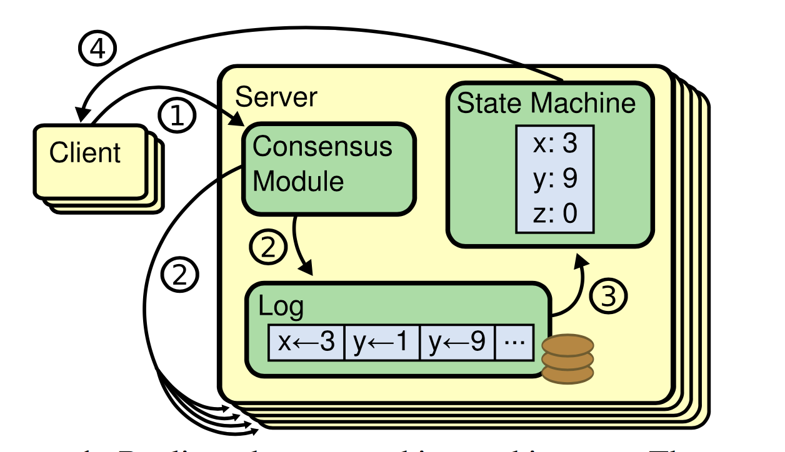

# In Search of an Understandable Consensus Algorithm(Extended Version)

Diego Ongaro and John Ousterhout

Stanford University

## Abstract

Raft is a consensus algorithm for managing a replicated
log. It produces a result equivalent to (multi-)Paxos, and
it is as efficient as Paxos, but its structure is different
from Paxos; this makes Raft more understandable than
Paxos and also provides a better foundation for building practical systems. In order to enhance understandability, Raft separates the key elements of consensus, such as
leader election, log replication, and safety, and it enforces
a stronger degree of coherency to reduce the number of
states that must be considered. Results from a user study
demonstrate that Raft is easier for students to learn than
Paxos. Raft also includes a new mechanism for changing
the cluster membership, which uses overlapping majori-
ties to guarantee safety.

## 1 Introduction

Consensus algorithms allow a collection of machines
to work as a coherent group that can survive the fail-
ures of some of its members. Because of this, they play a
key role in building reliable large-scale software systems.
Paxos [15, 16] has dominated the discussion of consen-
sus algorithms over the last decade: most implementations
of consensus are based on Paxos or influenced by it, and
Paxos has become the primary vehicle used to teach stu-
dents about consensus.

Unfortunately, Paxos is quite difficult to understand, in
spite of numerous attempts to make it more approachable.
Furthermore, its architecture requires complex changes
to support practical systems. As a result, both system
builders and students struggle with Paxos.

After struggling with Paxos ourselves, we set out to
find a new consensus algorithm that could provide a better foundation for system building and education. Our approach was unusual in that our primary goal was *understandability:* could we define a consensus algorithm for
practical systems and describe it in a way that is significantly easier to learn than Paxos? Furthermore, we wanted
the algorithm to facilitate the development of intuitions
that are essential for system builders. It was important not
just for the algorithm to work, but for it to be obvious why
it works.

The result of this work is a consensus algorithm called
Raft. In designing Raft we applied specific techniques to
improve understandability,including decomposition (Raft
separates leader election, log replication, and safety) and
state space reduction (relative to Paxos, Raft reduces the
degree of nondeterminism and the ways servers can be inconsistent with each other). A user study with 43 students
at two universities shows that Raft is significantly easier
to understand than Paxos: after learning both algorithms,
33 of these students were able to answer questions about
Raft better than questions about Paxos.

Raft is similar in many ways to existing consensus al-
gorithms (most notably, Oki and Liskov’s Viewstamped
Replication [29, 22]), but it has several novel features:

- **Strong leader**: Raft uses a stronger form of leadership than other consensus algorithms. For example, log entries only flow from the leader to other servers. This simplifies the management of the replicated log and makes Raft easier to understand.
- **Leader election**: Raft uses randomized timers to elect leaders. This adds only a small amount of mechanism to the heartbeats already required for any consensus algorithm, while resolving conflicts simply and rapidly.
- **Membership changes**: Raft’s mechanism for changing the set of servers in the cluster uses a new joint consensusapproach where the majorities of two different configurations overlap during transitions. This allows the cluster to continue operating normally during configuration changes.

We believe that Raft is superior to Paxos and other con-
sensus algorithms, both for educational purposes and as a
foundation for implementation. It is simpler and more un-
derstandable than other algorithms; it is described com-
pletely enough to meet the needs of a practical system;
it has several open-source implementations and is used
by several companies; its safety properties have been for-
mally specified and proven; and its efficiency is compara-
ble to other algorithms.

The remainder of the paper introduces the replicated
state machine problem (Section 2), discusses the strengths
and weaknesses of Paxos (Section 3), describes our gen-
eral approach to understandability (Section 4), presents
the Raft consensus algorithm (Sections 5–8), evaluates
Raft (Section 9), and discusses related work (Section 10).

## 2 Replicated statemachines

Consensus algorithms typically arise in the context of
replicated state machines[37]. In this approach, state ma-
chines on a collection of servers compute identical copies
of the same state and can continue operating even if some
of the servers are down. Replicated state machines are

used to solve a variety of fault tolerance problems in dis-
tributed systems. For example, large-scale systems that
have a single cluster leader, such as GFS [8], HDFS [38],
and RAMCloud [33], typically use a separate replicated
state machine to manage leader election and store config-
uration information that must survive leader crashes. Ex-
amples of replicated state machines include Chubby [2]
and ZooKeeper [11].

Replicated state machines are typically implemented
using a replicated log, as shown in Figure 1. Each server
stores a log containing a series of commands, which its
state machine executes in order. Each log contains the
same commands in the same order, so each state ma-
chine processes the same sequence of commands. Since
the state machines are deterministic, each computes the
same state and the same sequence of outputs.

Keeping the replicated log consistent is the job of the
consensus algorithm. The consensus module on a server
receives commands from clients and adds them to its log.
It communicates with the consensus modules on other
servers to ensure that every log eventually contains the
same requests in the same order, even if some servers fail.
Once commands are properly replicated, each server’s
state machine processes them in log order, and the out-
puts are returned to clients. As a result, the servers appear
to form a single, highly reliable state machine.

Consensus algorithms for practical systems typically
have the following properties:

- They ensuresafety(never returning an incorrect re-
    sult) under all non-Byzantine conditions, including
    network delays, partitions, and packet loss, duplica-
    tion, and reordering.
- They are fully functional (available)aslongasany
    majority of the servers are operational and can communicate with each other and with clients. Thus, a
    typical cluster of five servers can tolerate the failure
    of any two servers. Servers are assumed to fail by
    stopping; they may later recover from state on stable
    storage and rejoin the cluster.
- They do not depend on timing to ensure the consistency of the logs: faulty clocks and extreme message
delays can, at worst, cause availability problems.
- In the common case, a command can complete as
    soon as a majority of the cluster has responded to a
    single round of remote procedure calls; a minority of
    slow servers need not impact overall system performance.

## 3 What’s wrong with Paxos?


Over the last ten years, Leslie Lamport’s Paxos proto-
col [15] has become almost synonymous with consensus:
it is the protocol most commonly taught in courses, and
most implementations of consensus use it as a starting
point. Paxos first defines a protocol capable of reaching
agreement on a single decision, such as a single replicated
log entry. We refer to this subset assingle-decree Paxos.
Paxos then combines multiple instances of this protocol to
facilitate a series of decisions such as a log (multi-Paxos).
Paxos ensures both safety and liveness, and it supports
changes in cluster membership. Its correctness has been
proven, and it is efficient in the normal case.

Unfortunately, Paxos has two significant drawbacks.
The first drawback is that Paxos is exceptionally difficult to understand. The full explanation [15] is notoriously opaque; few people succeed in understanding it, and
only with great effort. As a result, there have been several
attempts to explain Paxos in simpler terms [16, 20, 21].
These explanations focus on the single-decree subset, yet
they are still challenging. In an informal survey of attendees at NSDI 2012, we found few people who were comfortable with Paxos, even among seasoned researchers.
We struggled with Paxos ourselves; we were not able to
understand the complete protocol until after reading several simplified explanations and designing our own alternative protocol, a process that took almost a year.

We hypothesize that Paxos’ opaqueness derives from
its choice of the single-decree subset as its foundation.
Single-decree Paxos is dense and subtle: it is divided into
two stages that do not have simple intuitive explanations
and cannot be understood independently. Because of this,
it is difficult to develop intuitions about why the singledecree protocol works. The composition rules for multi-
Paxos add significant additional complexity and subtlety.
We believe that the overall problem of reaching consensus
on multiple decisions (i.e., a log instead of a single entry)
can be decomposed in other ways that are more direct and
obvious.

The second problem with Paxos is that it does not pro-
vide a good foundation for building practical implemen-
tations. One reason is that there is no widely agreed-
upon algorithm for multi-Paxos. Lamport’s descriptions
are mostly about single-decree Paxos; he sketched possi-
ble approaches to multi-Paxos, but many details are miss-
ing. There have been several attempts to flesh out and op-
timize Paxos, such as [26], [39], and [13], but these differ
from each other and from Lamport’s sketches. Systems
such as Chubby [4] have implemented Paxos-like algo-
rithms, but in most cases their details have not been pub-
lished.

Furthermore, the Paxos architecture is a poor one for
building practical systems; this is another consequence of
the single-decree decomposition. For example, there is lit-
tle benefit to choosing a collection of log entries indepen-
dently and then melding them into a sequential log; this
just adds complexity. It is simpler and more efficient to
design a system around a log, where new entries are ap-
pended sequentially in a constrained order. Another prob-
lem is that Paxos uses a symmetric peer-to-peer approach
at its core (though it eventually suggests a weak form of
leadership as a performance optimization). This makes
sense in a simplified world where only one decision will
be made, but few practical systems use this approach. If a
series of decisions must be made, it is simpler and faster
to first elect a leader, then have the leader coordinate the
decisions.

As a result, practical systems bear little resemblance
to Paxos. Each implementation begins with Paxos, dis-
covers the difficulties in implementing it, and then de-
velops a significantly different architecture. This is time-
consuming and error-prone, and the difficulties of under-
standing Paxos exacerbate the problem. Paxos’ formula-
tion may be a good one for proving theorems about its cor-
rectness, but real implementations are so different from
Paxos that the proofs have little value. The following com-
ment from the Chubby implementers is typical:

> There are significant gaps between the description of
the Paxos algorithm and the needs of a real-world
system.... the final system will be based on an un-
proven protocol [4].

Because of these problems, we concluded that Paxos
does not provide a good foundation either for system
building or for education. Given the importance of con-
sensus in large-scale software systems, we decided to see
if we could design an alternative consensus algorithm
with better properties than Paxos. Raft is the result of that
experiment.

## 4 Designing for understandability

We had several goals in designing Raft: it must provide
acompleteandpracticalfoundationforsystembuilding,
so that it significantly reduces the amount of design work
required of developers; it must be safe under all conditions
and available under typical operating conditions; and it
must be efficient for common operations. But our most
important goal—and most difficult challenge—wasun-
derstandability.Itmustbepossibleforalargeaudienceto
understand the algorithm comfortably. In addition, it must
be possible to develop intuitions about the algorithm, so
that system builders can make the extensions that are in-
evitable in real-world implementations.
There were numerous points in the design of Raft
where we had to choose among alternative approaches.
In these situations we evaluated the alternatives based on
understandability: how hard is it to explain each alterna-
tive (for example, how complex is its state space, and does
it have subtle implications?), and how easy will it be for a
reader to completely understand the approach and its im-
plications?
We recognize that there is a high degree of subjectiv-
ity in such analysis; nonetheless, we used two techniques
that are generally applicable. The first technique is the
well-known approach of problem decomposition: wher-
ever possible, we divided problems into separate pieces
that could be solved, explained, and understood relatively
independently. For example, in Raft we separated leader
election, log replication, safety, and membership changes.
Our second approach was to simplify the state space
by reducing the number of states to consider, making the
system more coherent and eliminating nondeterminism
where possible. Specifically, logs are not allowed to have
holes, and Raft limits the ways in which logs can become
inconsistent with each other. Although in most cases we
tried to eliminate nondeterminism, there are some situ-
ations where nondeterminism actually improves under-
standability. In particular, randomized approaches intro-
duce nondeterminism, but they tend to reduce the state
space by handling all possible choices in a similar fashion
(“choose any; it doesn’t matter”). We used randomization
to simplify the Raft leader election algorithm.

## 5 The Raft consensus algorithm

Raft is an algorithm for managing a replicated log of
the form described in Section 2. Figure 2 summarizes the
algorithm in condensed form for reference, and Figure 3
lists key properties of the algorithm; the elements of these
figures are discussed piecewise over the rest of this sec-
tion.
Raft implements consensus by first electing a distin-
guishedleader,thengivingtheleadercompleteresponsi-
bility for managing the replicated log. The leader accepts
log entries from clients, replicates them on other servers,
and tells servers when it is safe to apply log entries to
their state machines. Having a leader simplifies the man-
agement of the replicated log. For example, the leader can
decide where to place new entries in the log without con-
sulting other servers, and data flows in a simple fashion
from the leader to other servers. A leader can fail or be-
come disconnected from the other servers, in which case
anewleaderiselected.
Given the leader approach, Raft decomposes the con-
sensus problem into three relatively independent subprob-
lems, which are discussed in the subsections that follow:

- Leader election:anewleadermustbechosenwhen
    an existing leader fails (Section 5.2).
- Log replication:the leader must accept log entries


Invoked by candidates to gather votes (§5.2).
Arguments:
term candidate’s term
candidateId candidate requesting vote
lastLogIndex index of candidate’s last log entry (§5.4)
lastLogTerm term of candidate’s last log entry (§5.4)
Results:
term currentTerm, for candidate to update itself
voteGranted true means candidate received vote
Receiver implementation:
```
1. Reply false if term < currentTerm (§5.1)
2. If votedFor is null or candidateId, and candidate’s log is at
    least as up-to-date as receiver’s log, grant vote (§5.2, §5.4)

### RequestVote RPC

```
Invoked by leader to replicate log entries (§5.3); also used as
heartbeat (§5.2).
Arguments:
term leader’s term
leaderId so follower can redirect clients
prevLogIndex index of log entry immediately preceding
new ones
prevLogTerm term of prevLogIndex entry
entries[] log entries to store (empty for heartbeat;
may send more than one for efficiency)
leaderCommit leader’s commitIndex
Results:
term currentTerm, for leader to update itself
success true if follower contained entry matching
prevLogIndex and prevLogTerm
Receiver implementation:
```
1. Reply false if term < currentTerm (§5.1)
2. Reply false if log doesn’t contain an entry at prevLogIndex
    whose term matches prevLogTerm (§5.3)
3. If an existing entry conflicts with a new one (same index
    but different terms), delete the existing entry and all that
    follow it (§5.3)
4. Append any new entries not already in the log
5. If leaderCommit > commitIndex, set commitIndex =
    min(leaderCommit, index of last new entry)

### AppendEntries RPC

```
Persistent state on all servers:
(Updated on stable storage before responding to RPCs)
currentTerm latest term server has seen (initialized to 0
on first boot, increases monotonically)
votedFor candidateId that received vote in current
term (or null if none)
log[] log entries; each entry contains command
for state machine, and term when entry
was received by leader (first index is 1)
Volatile state on all servers:
commitIndex index of highest log entry known to be
committed (initialized to 0, increases
monotonically)
lastApplied index of highest log entry applied to state
machine (initialized to 0, increases
monotonically)
Volatile state on leaders:
(Reinitialized after election)
nextIndex[] for each server, index of the next log entry
to send to that server (initialized to leader
last log index + 1)
matchIndex[] for each server, index of highest log entry
known to be replicated on server
(initialized to 0, increases monotonically)
```
### State

```
All Servers:
```
- If commitIndex > lastApplied: increment lastApplied, apply
    log[lastApplied] to state machine (§5.3)
- If RPC request or response contains term T > currentTerm:
    set currentTerm = T, convert to follower (§5.1)
**Followers (§5.2):**
- Respond to RPCs from candidates and leaders
- If election timeout elapses without receiving AppendEntries
    RPC from current leader or granting vote to candidate:
    convert to candidate
**Candidates (§5.2):**
- On conversion to candidate, start election:
    - Increment currentTerm
    - Vote for self
    - Reset election timer
    - Send RequestVote RPCs to all other servers
- If votes received from majority of servers: become leader
- If AppendEntries RPC received from new leader: convert to
    follower
- If election timeout elapses: start new election
**Leaders:**
- Upon election: send initial empty AppendEntries RPCs
    (heartbeat) to each server; repeat during idle periods to
    prevent election timeouts (§5.2)
- If command received from client: append entry to local log,
    respond after entry applied to state machine (§5.3)
- If last log index ≥ nextIndex for a follower: send
    AppendEntries RPC with log entries starting at nextIndex
    - If successful: update nextIndex and matchIndex for
       follower (§5.3)
    - If AppendEntries fails because of log inconsistency:
       decrement nextIndex and retry (§5.3)
- If there exists an N such that N > commitIndex, a majority
    of matchIndex[i] ≥ N, and log[N].term == currentTerm:
    set commitIndex = N (§5.3, §5.4).

### Rules for Servers

Figure 2:AcondensedsummaryoftheRaftconsensusalgorithm(excluding membership changes and log compaction). The server
behavior in the upper-left box is described as a set of rules that trigger independently and repeatedly. Section numberssuch as§5.
indicate where particular features are discussed. A formalspecification [31] describes the algorithm more precisely.


```
Election Safety:at most one leader can be elected in a
given term.§5.
Leader Append-Only:aleaderneveroverwritesordeletes
entries in its log; it only appends new entries.§5.
Log Matching:if two logs contain an entry with the same
index and term, then the logs are identical in all entries
up through the given index.§5.
Leader Completeness:if a log entry is committed in a
given term, then that entry will be present in the logs
of the leaders for all higher-numbered terms.§5.
State Machine Safety:if a server has applied a log entry
at a given index to its state machine, no other server
will ever apply a different log entry for the same index.
§5.4.
Figure 3:Raft guarantees that each of these properties is true
at all times. The section numbers indicate where each prop-
erty is discussed.
```


from clients and replicate them across the cluster,
forcing the other logs to agree with its own (Sec-
tion 5.3).
- Safety:the key safety property for Raft is the State
    Machine Safety Property in Figure 3: if any server
    has applied a particular log entry to its state machine,
    then no other server may apply a different command
    for the same log index. Section 5.4 describes how
    Raft ensures this property; the solution involves an
    additional restriction on the election mechanism de-
    scribed in Section 5.2.

After presenting the consensus algorithm, this section dis-
cusses the issue of availability and the role of timing in the
system.

### 5.1 Raft basics

ARaftclustercontainsseveralservers;fiveisatypical
number, which allows the system to tolerate two failures.
At any given time each server is in one of three states:
leader,follower,orcandidate.Innormaloperationthere
is exactly one leader and all of the other servers are fol-
lowers. Followers are passive: they issue no requests on
their own but simply respond to requests from leaders
and candidates. The leader handles all client requests (if
aclientcontactsafollower,thefollowerredirectsittothe
leader). The third state, candidate, is used to elect a new
leader as described in Section 5.2. Figure 4 shows the
states and their transitions; the transitions are discussed
below.

Raft divides time intoterms of arbitrary length, as
shown in Figure 5. Terms are numbered with consecutive
integers. Each term begins with anelection,inwhichone
or more candidates attempt to become leader as described
in Section 5.2. If a candidate wins the election, then it
serves as leader for the rest of the term. In some situations
an election will result in a split vote. In this case the term
will end with no leader; a new term (with a new election)

```
Figure 4:Server states. Followers only respond to requests
from other servers. If a follower receives no communication,
it becomes a candidate and initiates an election. A candidate
that receives votes from a majority of the full cluster becomes
the new leader. Leaders typically operate until they fail.
```
```
Figure 5:Time is divided into terms, and each term begins
with an election. After a successful election, a single leader
manages the cluster until the end of the term. Some elections
fail, in which case the term ends without choosing a leader.
The transitions between terms may be observed at different
times on different servers.
```
will begin shortly. Raft ensures that there is at most one
leader in a given term.
Different servers may observe the transitions between
terms at different times, and in some situations a server
may not observe an election or even entire terms. Terms
act as a logical clock [14] in Raft, and they allow servers
to detect obsolete information such as stale leaders. Each
server stores acurrent term number, which increases
monotonically over time. Current terms are exchanged
whenever servers communicate; if one server’s current
term is smaller than the other’s, then it updates its current
term to the larger value. If a candidate or leader discovers
that its term is out of date, it immediately reverts to fol-
lower state. If a server receives a request with a stale term
number, it rejects the request.
Raft servers communicate using remote procedure calls
(RPCs), and the basic consensus algorithm requires only
two types of RPCs. RequestVote RPCs are initiated by
candidates during elections (Section 5.2), and Append-
Entries RPCs are initiated by leaders to replicate log en-
tries and to provide a form of heartbeat (Section 5.3). Sec-
tion 7 adds a third RPC for transferring snapshots between
servers. Servers retry RPCs if they do not receive a re-
sponse in a timely manner, and they issue RPCs in parallel
for best performance.
### 5.2 Leader election
Raft uses a heartbeat mechanism to trigger leader elec-
tion. When servers start up, they begin as followers. A
server remains in follower state as long as it receives valid

RPCs from a leader or candidate. Leaders send periodic
heartbeats (AppendEntries RPCs that carry no log entries)
to all followers in order to maintain their authority. If a
follower receives no communication over a period of time
called theelection timeout,thenitassumesthereisnovi-
able leader and begins an election to choose a new leader.

To begin an election, a follower increments its current
term and transitions to candidate state. It then votes for
itself and issues RequestVote RPCs in parallel to each of
the other servers in the cluster. A candidate continues in
this state until one of three things happens: (a) it wins the
election, (b) another server establishes itself as leader,or
(c) a period of time goes by with no winner. These out-
comes are discussed separately in the paragraphs below.

Acandidatewinsanelectionifitreceivesvotesfrom
amajorityoftheserversinthefullclusterforthesame
term. Each server will vote for at most one candidate in a
given term, on a first-come-first-served basis (note: Sec-
tion 5.4 adds an additional restriction on votes). The ma-
jority rule ensures that at most one candidate can win the
election for a particular term (the Election Safety Prop-
erty in Figure 3). Once a candidate wins an election, it
becomes leader. It then sends heartbeat messages to all of
the other servers to establish its authority and prevent new
elections.

While waiting for votes, a candidate may receive an
AppendEntries RPC from another server claiming to be
leader. If the leader’s term (included in its RPC) is at least
as large as the candidate’s current term, then the candidate
recognizes the leader as legitimate and returns to follower
state. If the term in the RPC is smaller than the candidate’s
current term, then the candidate rejects the RPC and con-
tinues in candidate state.

The third possible outcome is that a candidate neither
wins nor loses the election: if many followers become
candidates at the same time, votes could be split so that
no candidate obtains a majority. When this happens, each
candidate will time out and start a new election by incre-
menting its term and initiating another round of Request-
Vote RPCs. However, without extra measures split votes
could repeat indefinitely.

Raft uses randomized election timeouts to ensure that
split votes are rare and that they are resolved quickly. To
prevent split votes in the first place, election timeouts are
chosen randomly from a fixed interval (e.g., 150–300ms).
This spreads out the servers so that in most cases only a
single server will time out; it wins the election and sends
heartbeats before any other servers time out. The same
mechanism is used to handle split votes. Each candidate
restarts its randomized election timeout at the start of an
election, and it waits for that timeout to elapse before
starting the next election; this reduces the likelihood of
another split vote in the new election. Section 9.3 shows
that this approach elects a leader rapidly.

```
Figure 6:Logs are composed of entries, which are numbered
sequentially. Each entry contains the term in which it was
created (the number in each box) and a command for the state
machine. An entry is consideredcommittedif it is safe for that
entry to be applied to state machines.
```
Elections are an example of how understandability
guided our choice between design alternatives. Initially
we planned to use a ranking system: each candidate was
assigned a unique rank, which was used to select between
competing candidates. If a candidate discovered another
candidate with higher rank, it would return to follower
state so that the higher ranking candidate could more eas-
ily win the next election. We found that this approach
created subtle issues around availability (a lower-ranked
server might need to time out and become a candidate
again if a higher-ranked server fails, but if it does so too
soon, it can reset progress towards electing a leader). We
made adjustments to the algorithm several times, but after
each adjustment new corner cases appeared. Eventually
we concluded that the randomized retry approach is more
obvious and understandable.
### 5.3 Log replication
Once a leader has been elected, it begins servicing
client requests. Each client request contains a command to
be executed by the replicated state machines. The leader
appends the command to its log as a new entry, then is-
sues AppendEntries RPCs in parallel to each of the other
servers to replicate the entry. When the entry has been
safely replicated (as described below), the leader applies
the entry to its state machine and returns the result of that
execution to the client. If followers crash or run slowly,
or if network packets are lost, the leader retries Append-
Entries RPCs indefinitely (even after it has responded to
the client) until all followers eventually store all log en-
tries.
Logs are organized as shown in Figure 6. Each log en-
try stores a state machine command along with the term
number when the entry was received by the leader. The
term numbers in log entries are used to detect inconsis-
tencies between logs and to ensure some of the properties
in Figure 3. Each log entry also has an integer index iden-
tifying its position in the log.

The leader decides when it is safe to apply a log en-
try to the state machines; such an entry is calledcommit-
ted.Raftguaranteesthatcommittedentriesaredurable
and will eventually be executed by all of the available
state machines. A log entry is committed once the leader
that created the entry has replicated it on a majority of
the servers (e.g., entry 7 in Figure 6). This also commits
all preceding entries in the leader’s log, including entries
created by previous leaders. Section 5.4 discusses some
subtleties when applying this rule after leader changes,
and it also shows that this definition of commitment is
safe. The leader keeps track of the highest index it knows
to be committed, and it includes that index in future
AppendEntries RPCs (including heartbeats) so that the
other servers eventually find out. Once a follower learns
that a log entry is committed, it applies the entry to its
local state machine (in log order).

We designed the Raft log mechanism to maintain a high
level of coherency between the logs on different servers.
Not only does this simplify the system’s behavior and
make it more predictable, but it is an important component
of ensuring safety. Raft maintains the following proper-
ties, which together constitute the Log Matching Property
in Figure 3:

- If two entries in different logs have the same index
    and term, then they store the same command.
- If two entries in different logs have the same index
    and term, then the logs are identical in all preceding
    entries.
    
The first property follows from the fact that a leader
creates at most one entry with a given log index in a given
term, and log entries never change their position in the
log. The second property is guaranteed by a simple con-
sistency check performed by AppendEntries. When send-
ing an AppendEntries RPC, the leader includes the index
and term of the entry in its log that immediately precedes
the new entries. If the follower does not find an entry in
its log with the same index and term, then it refuses the
new entries. The consistency check acts as an induction
step: the initial empty state of the logs satisfies the Log
Matching Property, and the consistency check preserves
the Log Matching Property whenever logs are extended.
As a result, whenever AppendEntries returns successfully,
the leader knows that the follower’s log is identical to its
own log up through the new entries.

During normal operation, the logs of the leader and
followers stay consistent, so the AppendEntries consis-
tency check never fails. However, leader crashes can leave
the logs inconsistent (the old leader may not have fully
replicated all of the entries in its log). These inconsisten-
cies can compound over a series of leader and follower
crashes. Figure 7 illustrates the ways in which followers’
logs may differ from that of a new leader. A follower may

```
Figure 7:When the leader at the top comes to power, it is
possible that any of scenarios (a–f) could occur in follower
logs. Each box represents one log entry; the number in the
box is its term. A follower may be missing entries (a–b), may
have extra uncommitted entries (c–d), or both (e–f). For ex-
ample, scenario (f) could occur if that server was the leader
for term 2, added several entries to its log, then crashed before
committing any of them; it restarted quickly, became leader
for term 3, and added a few more entries to its log; before any
of the entries in either term 2 or term 3 were committed, the
server crashed again and remained down for several terms.
be missing entries that are present on the leader, it may
have extra entries that are not present on the leader, or
both. Missing and extraneous entries in a log may span
multiple terms.
```
In Raft, the leader handles inconsistencies by forcing
the followers’ logs to duplicate its own. This means that
conflicting entries in follower logs will be overwritten
with entries from the leader’s log. Section 5.4 will show
that this is safe when coupled with one more restriction.
To bring a follower’s log into consistency with its own,
the leader must find the latest log entry where the two
logs agree, delete any entries in the follower’s log after
that point, and send the follower all of the leader’s entries
after that point. All of these actions happen in response
to the consistency check performed by AppendEntries
RPCs. The leader maintains anextIndexfor each follower,
which is the index of the next log entry the leader will
send to that follower. When a leader first comes to power,
it initializes all nextIndex values to the index just after the
last one in its log (11 in Figure 7). If a follower’s log is
inconsistent with the leader’s, the AppendEntries consis-
tency check will fail in the next AppendEntries RPC. Af-
ter a rejection, the leader decrements nextIndex and retries
the AppendEntries RPC. Eventually nextIndex will reach
apointwheretheleaderandfollowerlogsmatch.When
this happens, AppendEntries will succeed, which removes
any conflicting entries in the follower’s log and appends
entries from the leader’s log (if any). Once AppendEntries
succeeds, the follower’s log is consistent with the leader’s,
and it will remain that way for the rest of the term.
If desired, the protocol can be optimized to reduce the
number of rejected AppendEntries RPCs. For example,
when rejecting an AppendEntries request, the follower
can include the term of the conflicting entry and the first
index it stores for that term. With this information, the
leader can decrement nextIndex to bypass all of the con-
flicting entries in that term; one AppendEntries RPC will
be required for each term with conflicting entries, rather
than one RPC per entry. In practice, we doubt this opti-
mization is necessary, since failures happen infrequently
and it is unlikely that there will be many inconsistent en-
tries.
With this mechanism, a leader does not need to take any
special actions to restore log consistency when it comes to
power. It just begins normal operation, and the logs auto-
matically converge in response to failures of the Append-
Entries consistency check. A leader never overwrites or
deletes entries in its own log (the Leader Append-Only
Property in Figure 3).
This log replication mechanism exhibits the desirable
consensus properties described in Section 2: Raft can ac-
cept, replicate, and apply new log entries as long as a ma-
jority of the servers are up; in the normal case a new entry
can be replicated with a single round of RPCs to a ma-
jority of the cluster; and a single slow follower will not
impact performance.

### 5.4 Safety
The previous sections described how Raft elects lead-
ers and replicates log entries. However, the mechanisms
described so far are not quite sufficient to ensure that each
state machine executes exactly the same commands in the
same order. For example, a follower might be unavailable
while the leader commits several log entries, then it could
be elected leader and overwrite these entries with new
ones; as a result, different state machines might execute
different command sequences.
This section completes the Raft algorithm by adding a
restriction on which servers may be elected leader. The
restriction ensures that the leader for any given term con-
tains all of the entries committed in previous terms (the
Leader Completeness Property from Figure 3). Given the
election restriction, we then make the rules for commit-
ment more precise. Finally, we present a proof sketch for
the Leader Completeness Property and show how it leads
to correct behavior of the replicated state machine.

#### 5.4.1 Election restriction
In any leader-based consensus algorithm, the leader
must eventually store all of the committed log entries. In
some consensus algorithms, such as Viewstamped Repli-
cation [22], a leader can be elected even if it doesn’t
initially contain all of the committed entries. These al-
gorithms contain additional mechanisms to identify the
missing entries and transmit them to the new leader, ei-
ther during the election process or shortly afterwards. Un-
fortunately, this results in considerable additional mecha-
nism and complexity. Raft uses a simpler approach where
it guarantees that all the committed entries from previous

```
Figure 8:Atimesequenceshowingwhyaleadercannotde-
termine commitment using log entries from older terms. In
(a) S1 is leader and partially replicates the log entry at index

2. In (b) S1 crashes; S5 is elected leader for term 3 with votes
from S3, S4, and itself, and accepts a different entry at log
index 2. In (c) S5 crashes; S1 restarts, is elected leader, and
continues replication. At this point, the log entry from term
has been replicated on a majority of the servers, but it is not
committed. If S1 crashes as in (d), S5 could be elected leader
(with votes from S2, S3, and S4) and overwrite the entry with
its own entry from term 3. However, if S1 replicates an en-
try from its current term on a majority of the servers before
crashing, as in (e), then this entry is committed (S5 cannot
win an election). At this point all preceding entries in the log
are committed as well.

```

terms are present on each new leader from the moment of
its election, without the need to transfer those entries to
the leader. This means that log entries only flow in one di-
rection, from leaders to followers, and leaders never over-
write existing entries in their logs.
Raft uses the voting process to prevent a candidate from
winning an election unless its log contains all committed
entries. A candidate must contact a majority of the cluster
in order to be elected, which means that every committed
entry must be present in at least one of those servers. If the
candidate’s log is at least as up-to-date as any other log
in that majority (where “up-to-date” is defined precisely
below), then it will hold all the committed entries. The
RequestVote RPC implements this restriction: the RPC
includes information about the candidate’s log, and the
voter denies its vote if its own log is more up-to-date than
that of the candidate.
Raft determines which of two logs is more up-to-date
by comparing the index and term of the last entries in the
logs. If the logs have last entries with different terms, then
the log with the later term is more up-to-date. If the logs
end with the same term, then whichever log is longer is
more up-to-date.

#### 5.4.2 Committing entries from previous terms
As described in Section 5.3, a leader knows that an en-
try from its current term is committed once that entry is
stored on a majority of the servers. If a leader crashes be-
fore committing an entry, future leaders will attempt to
finish replicating the entry. However, a leader cannot im-
mediately conclude that an entry from a previous term is
committed once it is stored on a majority of servers. Fig-

```
Figure 9:If S1 (leader for term T) commits a new log entry
from its term, and S5 is elected leader for a later term U, then
there must be at least one server (S3) that accepted the log
entry and also voted for S5.
```
ure 8 illustrates a situation where an old log entry is stored
on a majority of servers, yet can still be overwritten by a
future leader.
To eliminate problems like the one in Figure 8, Raft
never commits log entries from previous terms by count-
ing replicas. Only log entries from the leader’s current
term are committed by counting replicas; once an entry
from the current term has been committed in this way,
then all prior entries are committed indirectly because
of the Log Matching Property. There are some situations
where a leader could safely conclude that an older log en-
try is committed (for example, if that entry is stored on ev-
ery server), but Raft takes a more conservative approach
for simplicity.
Raft incurs this extra complexity in the commitment
rules because log entries retain their original term num-
bers when a leader replicates entries from previous
terms. In other consensus algorithms, if a new leader re-
replicates entries from prior “terms,” it must do so with
its new “term number.” Raft’s approach makes it easier
to reason about log entries, since they maintain the same
term number over time and across logs. In addition, new
leaders in Raft send fewer log entries from previous terms
than in other algorithms (other algorithms must send re-
dundant log entries to renumber them before they can be
committed).

#### 5.4.3 Safety argument
Given the complete Raft algorithm, we can now ar-
gue more precisely that the Leader Completeness Prop-
erty holds (this argument is based on the safety proof; see
Section 9.2). We assume that the Leader Completeness
Property does not hold, then we prove a contradiction.
Suppose the leader for term T (leaderT)commitsalog
entry from its term, but that log entry is not stored by the
leader of some future term. Consider the smallest term U
>Twhoseleader(leaderU)doesnotstoretheentry.

1. The committed entry must have been absent from
    leaderU’s log at the time of its election (leaders never
    delete or overwrite entries).
2. leaderTreplicated the entry on a majority of the clus-
    ter, and leaderUreceived votes from a majority of
    the cluster. Thus, at least one server (“the voter”)
    both accepted the entry from leaderTand voted for
    leaderU,asshowninFigure9.Thevoteriskeyto
    reaching a contradiction.
3. The voter must have accepted the committed entry
    from leaderTbeforevoting for leaderU;otherwiseit
    would have rejected the AppendEntries request from
    leaderT(its current term would have been higher than
    T).
4. The voter still stored the entry when it voted for
    leaderU,sinceeveryinterveningleadercontainedthe
    entry (by assumption), leaders never remove entries,
    and followers only remove entries if they conflict
    with the leader.
5. The voter granted its vote to leaderU,soleaderU’s
    log must have been as up-to-date as the voter’s. This
    leads to one of two contradictions.
6. First, if the voter and leaderUshared the same last
    log term, then leaderU’s log must have been at least
    as long as the voter’s, so its log contained every entry
    in the voter’s log. This is a contradiction, since the
    voter contained the committed entry and leaderUwas
    assumed not to.
7. Otherwise, leaderU’s last log term must have been
    larger than the voter’s. Moreover, it was larger than
    T, since the voter’s last log term was at least T (it con-
    tains the committed entry from term T). The earlier
    leader that created leaderU’s last log entry must have
    contained the committed entry in its log (by assump-
    tion). Then, by the Log Matching Property, leaderU’s
    log must also contain the committed entry, which is
    acontradiction.
8. This completes the contradiction. Thus, the leaders
    of all terms greater than T must contain all entries
    from term T that are committed in term T.
9. The Log Matching Property guarantees that future
    leaders will also contain entries that are committed
    indirectly, such as index 2 in Figure 8(d).

Given the Leader Completeness Property, we can prove
the State Machine Safety Property from Figure 3, which
states that if a server has applied a log entry at a given
index to its state machine, no other server will ever apply a
different log entry for the same index. At the time a server
applies a log entry to its state machine, its log must be
identical to the leader’s log up through that entry and the
entry must be committed. Now consider the lowest term
in which any server applies a given log index; the Log
Completeness Property guarantees that the leaders for all
higher terms will store that same log entry, so servers that
apply the index in later terms will apply the same value.
Thus, the State Machine Safety Property holds.
Finally, Raft requires servers to apply entries in log in-
dex order. Combined with the State Machine Safety Prop-
erty, this means that all servers will apply exactly the same
set of log entries to their state machines, in the same order.


### 5.5 Follower and candidate crashes
Until this point we have focused on leader failures. Fol-
lower and candidate crashes are much simpler to han-
dle than leader crashes, and they are both handled in the
same way. If a follower or candidate crashes, then fu-
ture RequestVote and AppendEntries RPCs sent to it will
fail. Raft handles these failures by retrying indefinitely;
if the crashed server restarts, then the RPC will complete
successfully. If a server crashes after completing an RPC
but before responding, then it will receive the same RPC
again after it restarts. Raft RPCs are idempotent, so this
causes no harm. For example, if a follower receives an
AppendEntries request that includes log entries already
present in its log, it ignores those entries in the new re-
quest.

### 5.6 Timing and availability
One of our requirements for Raft is that safety must
not depend on timing: the system must not produce incor-
rect results just because some event happens more quickly
or slowly than expected. However, availability (the ability
of the system to respond to clients in a timely manner)
must inevitably depend on timing. For example, if mes-
sage exchanges take longer than the typical time between
server crashes, candidates will not stay up long enough to
win an election; without a steady leader, Raft cannot make
progress.
Leader election is the aspect of Raft where timing is
most critical. Raft will be able to elect and maintain a
steady leader as long as the system satisfies the follow-
ingtiming requirement:

> broadcastTime≪electionTimeout≪MTBF

In this inequalitybroadcastTimeis the average time it
takes a server to send RPCs in parallel to every server
in the cluster and receive their responses;electionTime-
outis the election timeout described in Section 5.2; and
MTBFis the average time between failures for a single
server. The broadcast time should be an order of mag-
nitude less than the election timeout so that leaders can
reliably send the heartbeat messages required to keep fol-
lowers from starting elections; given the randomized ap-
proach used for election timeouts, this inequality also
makes split votes unlikely. The election timeout should be
afewordersofmagnitudelessthanMTBFsothatthesys-
tem makes steady progress. When the leader crashes, the
system will be unavailable for roughly the election time-
out; we would like this to represent only a small fraction
of overall time.
The broadcast time and MTBF are properties of the un-
derlying system, while the election timeout is something
we must choose. Raft’s RPCs typically require the recip-
ient to persist information to stable storage, so the broad-
cast time may range from 0.5ms to 20ms, depending on
storage technology. As a result, the election timeout is
likely to be somewhere between 10ms and 500ms. Typical

```
Figure 10:Switching directly from one configuration to an-
other is unsafe because different servers will switch at dif-
ferent times. In this example, the cluster grows from three
servers to five. Unfortunately, there is a point in time where
two different leaders can be elected for the same term, one
with a majority of the old configuration (Cold)andanother
with a majority of the new configuration (Cnew).
```
server MTBFs are several months or more, which easily
satisfies the timing requirement.

## 6 Cluster membership changes


Up until now we have assumed that the clusterconfig-
uration(the set of servers participating in the consensus
algorithm) is fixed. In practice, it will occasionally be nec-
essary to change the configuration, for example to replace
servers when they fail or to change the degree of replica-
tion. Although this can be done by taking the entire cluster
off-line, updating configuration files, and then restarting
the cluster, this would leave the cluster unavailable dur-
ing the changeover. In addition, if there are any manual
steps, they risk operator error. In order to avoid these is-
sues, we decided to automate configuration changes and
incorporate them into the Raft consensus algorithm.
For the configuration change mechanism to be safe,
there must be no point during the transition where it
is possible for two leaders to be elected for the same
term. Unfortunately, any approach where servers switch
directly from the old configuration to the new configura-
tion is unsafe. It isn’t possible to atomically switch all of
the servers at once, so the cluster can potentially split into
two independent majorities during the transition (see Fig-
ure 10).
In order to ensure safety, configuration changes must
use a two-phase approach. There are a variety of ways
to implement the two phases. For example, some systems
(e.g., [22]) use the first phase to disable the old configura-
tion so it cannot process client requests; then the second
phase enables the new configuration. In Raft the cluster
first switches to a transitional configuration we calljoint
consensus;oncethejointconsensushasbeencommitted,
the system then transitions to the new configuration. The
joint consensus combines both the old and new configu-
rations:

- Log entries are replicated to all servers in both con-
    figurations.


```
Figure 11:Timeline for a configuration change. Dashed lines
show configuration entries that have been created but not
committed, and solid lines show the latest committed configu-
ration entry. The leader first creates theCold,newconfiguration
entry in its log and commits it toCold,new(a majority ofCold
and a majority ofCnew). Then it creates theCnewentry and
commits it to a majority ofCnew.Thereisnopointintimein
whichColdandCnewcan both make decisions independently.
```
- Any server from either configuration may serve as
    leader.
- Agreement (for elections and entry commitment) re-
    quires separate majorities fromboththe old and new
    configurations.
    
The joint consensus allows individual servers to transition
between configurations at different times without com-
promising safety. Furthermore, joint consensus allows the
cluster to continue servicing client requests throughout
the configuration change.
Cluster configurations are stored and communicated
using special entries in the replicated log; Figure 11 illus-
trates the configuration change process. When the leader
receives a request to change the configuration fromCold
toCnew,itstorestheconfigurationforjointconsensus
(Cold,newin the figure) as a log entry and replicates that
entry using the mechanisms described previously. Once a
given server adds the new configuration entry to its log,
it uses that configuration for all future decisions (a server
always uses the latest configuration in its log, regardless
of whether the entry is committed). This means that the
leader will use the rules ofCold,newto determine when the
log entry forCold,newis committed. If the leader crashes,
anewleadermaybechosenundereitherColdorCold,new,
depending on whether the winning candidate has received
Cold,new.Inanycase,Cnewcannot make unilateral deci-
sions during this period.
OnceCold,newhas been committed, neitherColdnorCnew
can make decisions without approval of the other, and the
Leader Completeness Property ensures that only servers
with theCold,newlog entry can be elected as leader. It is
now safe for the leader to create a log entry describing
Cnewand replicate it to the cluster. Again, this configura-
tion will take effect on each server as soon as it is seen.
When the new configuration has been committed under
the rules ofCnew,theoldconfigurationisirrelevantand
servers not in the new configuration can be shut down. As
shown in Figure 11, there is no time whenColdandCnew
can both make unilateral decisions; this guarantees safety.

There are three more issues to address for reconfigura-
tion. The first issue is that new servers may not initially
store any log entries. If they are added to the cluster in
this state, it could take quite a while for them to catch
up, during which time it might not be possible to com-
mit new log entries. In order to avoid availability gaps,
Raft introduces an additional phase before the configu-
ration change, in which the new servers join the cluster
as non-voting members (the leader replicates log entries
to them, but they are not considered for majorities). Once
the new servers have caught up with the rest of the cluster,
the reconfiguration can proceed as described above.
The second issue is that the cluster leader may not be
part of the new configuration. In this case, the leader steps
down (returns to follower state) once it has committed the
Cnewlog entry. This means that there will be a period of
time (while it is committingCnew)whentheleaderisman-
aging a cluster that does not include itself; it replicates log
entries but does not count itself in majorities. The leader
transition occurs whenCnewis committed because this is
the first point when the new configuration can operate in-
dependently (it will always be possible to choose a leader
fromCnew). Before this point, it may be the case that only
aserverfromColdcan be elected leader.
The third issue is that removed servers (those not in
Cnew)candisruptthecluster.Theseserverswillnotre-
ceive heartbeats, so they will time out and start new elec-
tions. They will then send RequestVote RPCs with new
term numbers, and this will cause the current leader to
revert to follower state. A new leader will eventually be
elected, but the removed servers will time out again and
the process will repeat, resulting in poor availability.
To prevent this problem, servers disregard RequestVote
RPCs when they believe a current leader exists. Specif-
ically, if a server receives a RequestVote RPC within
the minimum election timeout of hearing from a cur-
rent leader, it does not update its term or grant its vote.
This does not affect normal elections, where each server
waits at least a minimum election timeout before starting
an election. However, it helps avoid disruptions from re-
moved servers: if a leader is able to get heartbeats to its
cluster, then it will not be deposed by larger term num-
bers.

## 7 Log compaction


Raft’s log grows during normal operation to incorpo-
rate more client requests, but in a practical system, it can-
not grow without bound. As the log grows longer, it oc-
cupies more space and takes more time to replay. This
will eventually cause availability problems without some
mechanism to discard obsolete information that has accu-
mulated in the log.
Snapshotting is the simplest approach to compaction.
In snapshotting, the entire current system state is written
to asnapshoton stable storage, then the entire log up to

```
Figure 12:Aserverreplacesthecommittedentriesinitslog
(indexes 1 through 5) with a new snapshot, which stores just
the current state (variablesxandyin this example). The snap-
shot’s last included index and term serve to position the snap-
shot in the log preceding entry 6.
```
that point is discarded. Snapshotting is used in Chubby
and ZooKeeper, and the remainder of this section de-
scribes snapshotting in Raft.

Incremental approaches to compaction, such as log
cleaning [36] and log-structured merge trees [30, 5], are
also possible. These operate on a fraction of the data at
once, so they spread the load of compaction more evenly
over time. They first select a region of data that has ac-
cumulated many deleted and overwritten objects, then
they rewrite the live objects from that region more com-
pactly and free the region. This requires significant addi-
tional mechanism and complexity compared to snapshot-
ting, which simplifies the problem by always operating
on the entire data set. While log cleaning would require
modifications to Raft, state machines can implement LSM
trees using the same interface as snapshotting.

Figure 12 shows the basic idea of snapshotting in Raft.
Each server takes snapshots independently, covering just
the committed entries in its log. Most of the work con-
sists of the state machine writing its current state to the
snapshot. Raft also includes a small amount of metadata
in the snapshot: thelast included indexis the index of the
last entry in the log that the snapshot replaces (the last en-
try the state machine had applied), and thelast included
termis the term of this entry. These are preserved to sup-
port the AppendEntries consistency check for the first log
entry following the snapshot, since that entry needs a pre-
vious log index and term. To enable cluster membership
changes (Section 6), the snapshot also includes the latest
configuration in the log as of last included index. Once a
server completes writing a snapshot, it may delete all log
entries up through the last included index, as well as any
prior snapshot.

Although servers normally take snapshots indepen-
dently, the leader must occasionally send snapshots to
followers that lag behind. This happens when the leader
has already discarded the next log entry that it needs to
send to a follower. Fortunately, this situation is unlikely
in normal operation: a follower that has kept up with the

```
Invoked byleader to send chunks of a snapshot to a follower.
Leaders always send chunks in order.
Arguments:
term leader’s term
leaderId so follower can redirect clients
lastIncludedIndex the snapshot replaces all entries up through
and including this index
lastIncludedTerm term of lastIncludedIndex
offset byte offset where chunk is positioned in the
snapshot file
data[] raw bytes of the snapshot chunk, starting at
offset
done true if this is the last chunk
Results:
term currentTerm, for leader to update itself
Receiver implementation:
```
1. Reply immediately if term < currentTerm
2. Create new snapshot file if first chunk (offset is 0)
3. Write data into snapshot file at given offset
4. Reply and wait for more data chunks if done is false
5. Save snapshot file, discard any existing or partial snapshot
    with a smaller index
6. If existing log entry has same index and term as snapshot’s
    last included entry, retain log entries following it and reply
7. Discard the entire log
8. Reset state machine using snapshot contents (and load
    snapshot’s cluster configuration)

```
InstallSnapshotRPC
```
```
Figure 13:AsummaryoftheInstallSnapshotRPC.Snap-
shots are split into chunks for transmission; this gives thefol-
lower a sign of life with each chunk, so it can reset its election
timer.
```
leader would already have this entry. However, an excep-
tionally slow follower or a new server joining the cluster
(Section 6) would not. The way to bring such a follower
up-to-date is for the leader to send it a snapshot over the
network.
The leader uses a new RPC called InstallSnapshot to
send snapshots to followers that are too far behind; see
Figure 13. When a follower receives a snapshot with this
RPC, it must decide what to do with its existing log en-
tries. Usually the snapshot will contain new information
not already in the recipient’s log. In this case, the follower
discards its entire log; it is all superseded by the snapshot
and may possibly have uncommitted entries that conflict
with the snapshot. If instead the follower receives a snap-
shot that describes a prefix of its log (due to retransmis-
sion or by mistake), then log entries covered by the snap-
shot are deleted but entries following the snapshot are still
valid and must be retained.
This snapshotting approach departs from Raft’s strong
leader principle, since followers can take snapshots with-
out the knowledge of the leader. However, we think this
departure is justified. While having a leader helps avoid
conflicting decisions in reaching consensus, consensus
has already been reached when snapshotting, so no de-
cisions conflict. Data still only flows from leaders to followers, just followers can now reorganize their data.
We considered an alternative leader-based approach in
which only the leader would create a snapshot, then it
would send this snapshot to each of its followers. How-
ever, this has two disadvantages. First, sending the snap-
shot to each follower would waste network bandwidth and
slow the snapshotting process. Each follower already has
the information needed to produce its own snapshots, and
it is typically much cheaper for a server to produce a snap-
shot from its local state than it is to send and receive one
over the network. Second, the leader’s implementation
would be more complex. For example, the leader would
need to send snapshots to followers in parallel with repli-
cating new log entries to them, so as not to block new
client requests.
There are two more issues that impact snapshotting per-
formance. First, servers must decide when to snapshot. If
aserversnapshotstoooften,itwastesdiskbandwidthand
energy; if it snapshots too infrequently, it risks exhaust-
ing its storage capacity, and it increases the time required
to replay the log during restarts. One simple strategy is
to take a snapshot when the log reaches a fixed size in
bytes. If this size is set to be significantly larger than the
expected size of a snapshot, then the disk bandwidth over-
head for snapshotting will be small.
The second performance issue is that writing a snap-
shot can take a significant amount of time, and we do
not want this to delay normal operations. The solution is
to use copy-on-write techniques so that new updates can
be accepted without impacting the snapshot being writ-
ten. For example, state machines built with functional data
structures naturally support this. Alternatively, the operat-
ing system’s copy-on-write support (e.g., fork on Linux)
can be used to create an in-memory snapshot of the entire
state machine (our implementation uses this approach).

## 8 Client interaction

This section describes how clients interact with Raft,
including how clients find the cluster leader and how Raft
supports linearizable semantics [10]. These issues apply
to all consensus-based systems, and Raft’s solutions are
similar to other systems.
Clients of Raft send all of their requests to the leader.
When a client first starts up, it connects to a randomly-
chosen server. If the client’s first choice is not the leader,
that server will reject the client’s request and supply in-
formation about the most recent leader it has heard from
(AppendEntries requests include the network address of
the leader). If the leader crashes, client requests will time
out; clients then try again with randomly-chosen servers.
Our goal for Raft is to implement linearizable seman-
tics (each operation appears to execute instantaneously,
exactly once, at some point between its invocation and
its response). However, as described so far Raft can exe-
cute a command multiple times: for example, if the leader
crashes after committing the log entry but before respond-
ing to the client, the client will retry the command with a
new leader, causing it to be executed a second time. The
solution is for clients to assign unique serial numbers to
every command. Then, the state machine tracks the latest
serial number processed for each client, along with the as-
sociated response. If it receives a command whose serial
number has already been executed, it responds immedi-
ately without re-executing the request.
Read-only operations can be handled without writing
anything into the log. However, with no additional mea-
sures, this would run the risk of returning stale data, since
the leader responding to the request might have been su-
perseded by a newer leader of which it is unaware. Lin-
earizable reads must not return stale data, and Raft needs
two extra precautions to guarantee this without using the
log. First, a leader must have the latest information on
which entries are committed. The Leader Completeness
Property guarantees that a leader has all committed en-
tries, but at the start of its term, it may not know which
those are. To find out, it needs to commit an entry from
its term. Raft handles this by having each leader com-
mit a blankno-opentry into the log at the start of its
term. Second, a leader must check whether it has been de-
posed before processing a read-only request (its informa-
tion may be stale if a more recent leader has been elected).
Raft handles this by having the leader exchange heart-
beat messages with a majority of the cluster before re-
sponding to read-only requests. Alternatively, the leader
could rely on the heartbeat mechanism to provide a form
of lease [9], but this would rely on timing for safety (it
assumes bounded clock skew).

## 9 Implementation and evaluation

We have implemented Raft as part of a replicated
state machine that stores configuration information for
RAMCloud [33] and assists in failover of the RAMCloud
coordinator. The Raft implementation contains roughly
2000 lines of C++ code, not including tests, comments, or
blank lines. The source code is freely available [23]. There
are also about 25 independent third-party open source im-
plementations [34] of Raft in various stages of develop-
ment, based on drafts of this paper. Also, various compa-
nies are deploying Raft-based systems [34].
The remainder of this section evaluates Raft using three
criteria: understandability, correctness, and performance.
### 9.1 Understandability
To measure Raft’s understandability relative to Paxos,
we conducted an experimental study using upper-level un-
dergraduate and graduate students in an Advanced Oper-
ating Systems course at Stanford University and a Dis-
tributed Computing course at U.C. Berkeley. We recorded
avideolectureofRaftandanotherofPaxos,andcreated
corresponding quizzes. The Raft lecture covered the con-
tent of this paper except for log compaction; the Paxos
```
Figure 14:Ascatterplotcomparing43participants’perfor-
mance on the Raft and Paxos quizzes. Points above the diag-
onal (33) represent participants who scored higher for Raft.
```
lecture covered enough material to create an equivalent
replicated state machine, including single-decree Paxos,
multi-decree Paxos, reconfiguration, and a few optimiza-
tions needed in practice (such as leader election). The
quizzes tested basic understanding of the algorithms and
also required students to reason about corner cases. Each
student watched one video, took the corresponding quiz,
watched the second video, and took the second quiz.
About half of the participants did the Paxos portion first
and the other half did the Raft portion first in order to
account for both individual differences in performance
and experience gained from the first portion of the study.
We compared participants’ scores on each quiz to deter-
mine whether participants showed a better understanding
of Raft.

We tried to make the comparison between Paxos and
Raft as fair as possible. The experiment favored Paxos in
two ways: 15 of the 43 participants reported having some
prior experience with Paxos, and the Paxos video is 14%
longer than the Raft video. As summarized in Table 1, we
have taken steps to mitigate potential sources of bias. All
of our materials are available for review [28, 31].

On average, participants scored 4.9 points higher on the
Raft quiz than on the Paxos quiz (out of a possible 60
points, the mean Raft score was 25.7 and the mean Paxos
score was 20.8); Figure 14 shows their individual scores.
Apairedt-test states that, with 95% confidence, the true
distribution of Raft scores has a mean at least 2.5 points
larger than the true distribution of Paxos scores.

We also created a linear regression model that predicts
anewstudent’squizscoresbasedonthreefactors:which
quiz they took, their degree of prior Paxos experience, and

```
表格
```
```
Figure 15:Using a 5-point scale, participants were asked
(left) which algorithm they felt would be easier to implement
in a functioning, correct, and efficient system, and (right)
which would be easier to explain to a CS graduate student.
```
the order in which they learned the algorithms. The model
predicts that the choice of quiz produces a 12.5-point dif-
ference in favor of Raft. This is significantly higher than
the observed difference of 4.9 points, because many of the
actual students had prior Paxos experience, which helped
Paxos considerably, whereas it helped Raft slightly less.
Curiously, the model also predicts scores 6.3 points lower
on Raft for people that have already taken the Paxos quiz;
although we don’t know why, this does appear to be sta-
tistically significant.
We also surveyed participants after their quizzes to see
which algorithm they felt would be easier to implement
or explain; these results are shown in Figure 15. An over-
whelming majority of participants reported Raft would be
easier to implement and explain (33 of 41 for each ques-
tion). However, these self-reported feelings may be less
reliable than participants’ quiz scores, and participants
may have been biased by knowledge of our hypothesis
that Raft is easier to understand.
AdetaileddiscussionoftheRaftuserstudyisavailable
at [31].
### 9.2 Correctness
We have developed a formal specification and a proof
of safety for the consensus mechanism described in Sec-
tion 5. The formal specification [31] makes the informa-
tion summarized in Figure 2 completely precise using the
TLA+ specification language [17]. It is about 400 lines
long and serves as the subject of the proof. It is also use-
ful on its own for anyone implementing Raft. We have
mechanically proven the Log Completeness Property us-
ing the TLA proof system [7]. However, this proof relies
on invariants that have not been mechanically checked
(for example, we have not proven the type safety of the
specification). Furthermore, we have written an informal
proof [31] of the State Machine Safety property which
is complete (it relies on the specification alone) and rela-

```
Figure 16:The time to detect and replace a crashed leader.
The top graph varies the amount of randomness in election
timeouts, and the bottom graph scales the minimum election
timeout. Each line represents 1000 trials (except for 100 tri-
als for “150–150ms”) and corresponds to a particular choice
of election timeouts; for example, “150–155ms” means that
election timeouts were chosen randomly and uniformly be-
tween 150ms and 155ms. The measurements were taken on a
cluster of five servers with a broadcast time of roughly 15ms.
Results for a cluster of nine servers are similar.
```
tively precise (it is about 3500 words long).

9.3 Performance

Raft’s performance is similar to other consensus algo-
rithms such as Paxos. The most important case for per-
formance is when an established leader is replicating new
log entries. Raft achieves this using the minimal number
of messages (a single round-trip from the leader to half the
cluster). It is also possible to further improve Raft’s per-
formance. For example, it easily supports batching and
pipelining requests for higher throughput and lower la-
tency. Various optimizations have been proposed in the
literature for other algorithms; many of these could be ap-
plied to Raft, but we leave this to future work.

We used our Raft implementation to measure the per-
formance of Raft’s leader election algorithm and answer
two questions. First, does the election process converge
quickly? Second, what is the minimum downtime that can
be achieved after leader crashes?

To measure leader election, we repeatedly crashed the
leader of a cluster of five servers and timed how long it
took to detect the crash and elect a new leader (see Fig-
ure 16). To generate a worst-case scenario, the servers in
each trial had different log lengths, so some candidates
were not eligible to become leader. Furthermore, to en-
courage split votes, our test script triggered a synchro-
nized broadcast of heartbeat RPCs from the leader before
terminating its process (this approximates the behavior
of the leader replicating a new log entry prior to crash-
ing). The leader was crashed uniformly randomly within
its heartbeat interval, which was half of the minimum
election timeout for all tests. Thus, the smallest possible
downtime was about half of the minimum election time-
out.
The top graph in Figure 16 shows that a small amount
of randomization in the election timeout is enough to
avoid split votes in elections. In the absence of random-
ness, leader election consistently took longer than 10 sec-
onds in our tests due to many split votes. Adding just 5ms
of randomness helps significantly, resulting in a median
downtime of 287ms. Using more randomness improves
worst-case behavior: with 50ms of randomness the worst-
case completion time (over 1000 trials) was 513ms.
The bottom graph in Figure 16 shows that downtime
can be reduced by reducing the election timeout. With
an election timeout of 12–24ms, it takes only 35ms on
average to elect a leader (the longest trial took 152ms).
However, lowering the timeouts beyond this point violates
Raft’s timing requirement: leaders have difficulty broad-
casting heartbeats before other servers start new elections.
This can cause unnecessary leader changes and lower
overall system availability. We recommend using a con-
servative election timeout such as 150–300ms; such time-
outs are unlikely to cause unnecessary leader changes and
will still provide good availability.

## 10 Related work

There have been numerous publications related to con-
sensus algorithms, many of which fall into one of the fol-
lowing categories:

- Lamport’s original description of Paxos [15], and at-
    tempts to explain it more clearly [16, 20, 21].
- Elaborations of Paxos, which fill in missing details
    and modify the algorithm to provide a better founda-
    tion for implementation [26, 39, 13].
- Systems that implement consensus algorithms, such
    as Chubby [2, 4], ZooKeeper [11, 12], and Span-
    ner [6]. The algorithms for Chubby and Spanner
    have not been published in detail, though both claim
    to be based on Paxos. ZooKeeper’s algorithm has
    been published in more detail, but it is quite different
    from Paxos.
- Performance optimizations that can be applied to
    Paxos [18, 19, 3, 25, 1, 27].
- Oki and Liskov’s Viewstamped Replication (VR), an
    alternative approach to consensus developed around
    the same time as Paxos. The original description [29]
    was intertwined with a protocol for distributed trans-
    actions, but the core consensus protocol has been
    separated in a recent update [22]. VR uses a leader-
    based approach with many similarities to Raft.
The greatest difference between Raft and Paxos is
Raft’s strong leadership: Raft uses leader election as an
essential part of the consensus protocol, and it concen-


trates as much functionality as possible in the leader. This
approach results in a simpler algorithm that is easier to
understand. For example, in Paxos, leader election is or-
thogonal to the basic consensus protocol: it serves only as
aperformanceoptimizationandisnotrequiredforachiev-
ing consensus. However, this results in additional mecha-
nism: Paxos includes both a two-phase protocol for basic
consensus and a separate mechanism for leader election.
In contrast, Raft incorporates leader election directly into
the consensus algorithm and uses it as the first of the two
phases of consensus. This results in less mechanism than
in Paxos.

Like Raft, VR and ZooKeeper are leader-based and
therefore share many of Raft’s advantages over Paxos.
However, Raft has less mechanism that VR or ZooKeeper
because it minimizes the functionality in non-leaders. For
example, log entries in Raft flow in only one direction:
outward from the leader in AppendEntries RPCs. In VR
log entries flow in both directions (leaders can receive
log entries during the election process); this results in
additional mechanism and complexity. The published de-
scription of ZooKeeper also transfers log entries both to
and from the leader, but the implementation is apparently
more like Raft [35].

Raft has fewer message types than any other algo-
rithm for consensus-based log replication that we are
aware of. For example, we counted the message types VR
and ZooKeeper use for basic consensus and membership
changes (excluding log compaction and client interaction,
as these are nearly independent of the algorithms). VR
and ZooKeeper each define 10 different message types,
while Raft has only 4 message types (two RPC requests
and their responses). Raft’s messages are a bit more dense
than the other algorithms’, but they are simpler collec-
tively. In addition, VR and ZooKeeper are described in
terms of transmitting entire logs during leader changes;
additional message types will be required to optimize
these mechanisms so that they are practical.

Raft’s strong leadership approach simplifies the algo-
rithm, but it precludes some performance optimizations.
For example, Egalitarian Paxos (EPaxos) can achieve
higher performance under some conditions with a lead-
erless approach [27]. EPaxos exploits commutativity in
state machine commands. Any server can commit a com-
mand with just one round of communication as long as
other commands that are proposed concurrently commute
with it. However, if commands that are proposed con-
currently do not commute with each other, EPaxos re-
quires an additional round of communication. Because
any server may commit commands, EPaxos balances load
well between servers and is able to achieve lower latency
than Raft in WAN settings. However, it adds significant
complexity to Paxos.

Several different approaches for cluster member-
ship changes have been proposed or implemented in
other work, including Lamport’s original proposal [15],
VR [22], and SMART [24]. We chose the joint consensus
approach for Raft because it leverages the rest of the con-
sensus protocol, so that very little additional mechanism
is required for membership changes. Lamport’sα-based
approach was not an option for Raft because it assumes
consensus can be reached without a leader. In comparison
to VR and SMART, Raft’s reconfiguration algorithm has
the advantage that membership changes can occur with-
out limiting the processing of normal requests; in con-
trast, VR stops all normal processing during configura-
tion changes, and SMART imposes anα-like limit on the
number of outstanding requests. Raft’s approach also adds
less mechanism than either VR or SMART.

## 11 Conclusion

Algorithms are often designed with correctness, effi-
ciency, and/or conciseness as the primary goals. Although
these are all worthy goals, we believe that understandabil-
ity is just as important. None of the other goals can be
achieved until developers render the algorithm into a prac-
tical implementation, which will inevitably deviate from
and expand upon the published form. Unless developers
have a deep understanding of the algorithm and can cre-
ate intuitions about it, it will be difficult for them to retain
its desirable properties in their implementation.
In this paper we addressed the issue of distributed con-
sensus, where a widely accepted but impenetrable algo-
rithm, Paxos, has challenged students and developers for
many years. We developed a new algorithm, Raft, which
we have shown to be more understandable than Paxos.
We also believe that Raft provides a better foundation
for system building. Using understandability as the pri-
mary design goal changed the way we approached the de-
sign of Raft; as the design progressed we found ourselves
reusing a few techniques repeatedly, such as decomposing
the problem and simplifying the state space. These tech-
niques not only improved the understandability of Raft
but also made it easier to convince ourselves of its cor-
rectness.

## 12 Acknowledgments

The user study would not have been possible with-
out the support of Ali Ghodsi, David Mazi`eres, and the
students of CS 294-91 at Berkeley and CS 240 at Stan-
ford. Scott Klemmer helped us design the user study,
and Nelson Ray advised us on statistical analysis. The
Paxos slides for the user study borrowed heavily from
aslidedeckoriginallycreatedbyLorenzoAlvisi.Spe-
cial thanks go to David Mazi`eres and Ezra Hoch for
finding subtle bugs in Raft. Many people provided help-
ful feedback on the paper and user study materials,
including Ed Bugnion, Michael Chan, Hugues Evrard,

Daniel Giffin, Arjun Gopalan, Jon Howell, Vimalkumar
Jeyakumar, Ankita Kejriwal, Aleksandar Kracun, Amit
Levy, Joel Martin, Satoshi Matsushita, Oleg Pesok, David
Ramos, Robbert van Renesse, Mendel Rosenblum, Nico-
las Schiper, Deian Stefan, Andrew Stone, Ryan Stutsman,
David Terei, Stephen Yang, Matei Zaharia, 24 anony-
mous conference reviewers (with duplicates), and espe-
cially our shepherd Eddie Kohler. Werner Vogels tweeted
alinktoanearlierdraft,whichgaveRaftsignificantex-
posure. This work was supported by the Gigascale Sys-
tems Research Center and the Multiscale Systems Cen-
ter, two of six research centers funded under the Fo-
cus Center Research Program, a Semiconductor Research
Corporation program, by STARnet, a Semiconductor Re-
search Corporation program sponsored by MARCO and
DARPA, by the National Science Foundation under Grant
No. 0963859, and by grants from Facebook, Google, Mel-
lanox, NEC, NetApp, SAP, and Samsung. Diego Ongaro
is supported by The Junglee Corporation Stanford Gradu-
ate Fellowship.

## References

```
[1] BOLOSKY,W.J.,BRADSHAW,D.,HAAGENS,R.B.,
KUSTERS,N.P.,ANDLI,P. Paxosreplicatedstate
machines as the basis of a high-performance data store.
InProc. NSDI’11, USENIX Conference on Networked
Systems Design and Implementation(2011), USENIX,
pp. 141–154.
[2] BURROWS,M. TheChubbylockserviceforloosely-
coupled distributed systems. InProc. OSDI’06, Sympo-
sium on Operating Systems Design and Implementation
(2006), USENIX, pp. 335–350.
[3] CAMARGOS,L.J.,SCHMIDT,R.M.,ANDPEDONE,F.
Multicoordinated Paxos. InProc. PODC’07, ACM Sym-
posium on Principles of Distributed Computing(2007),
ACM, pp. 316–317.
[4] CHANDRA,T.D.,GRIESEMER,R.,ANDREDSTONE,J.
Paxos made live: an engineering perspective. InProc.
PODC’07, ACM Symposium on Principles of Distributed
Computing(2007), ACM, pp. 398–407.
[5] CHANG,F.,DEAN,J.,GHEMAWAT,S.,HSIEH,W.C.,
WALLACH,D.A.,BURROWS,M.,CHANDRA,T.,
FIKES,A.,ANDGRUBER,R.E. Bigtable:adistributed
storage system for structured data. InProc. OSDI’06,
USENIX Symposium on Operating Systems Design and
Implementation(2006), USENIX, pp. 205–218.
[6] CORBETT,J.C.,DEAN,J.,EPSTEIN,M.,FIKES,A.,
FROST,C.,FURMAN,J.J.,GHEMAWAT,S.,GUBAREV,
A., HEISER,C.,HOCHSCHILD,P.,HSIEH,W.,KAN-
THAK,S.,KOGAN,E.,LI,H.,LLOYD,A.,MELNIK,
S., MWAURA,D.,NAGLE,D.,QUINLAN,S.,RAO,R.,
ROLIG,L.,SAITO,Y.,SZYMANIAK,M.,TAYLOR,C.,
WANG,R.,ANDWOODFORD,D. Spanner:Google’s
globally-distributed database. InProc. OSDI’12, USENIX
Conference on Operating Systems Design and Implemen-
tation(2012), USENIX, pp. 251–264.
```
```
[7] COUSINEAU,D.,DOLIGEZ,D.,LAMPORT,L.,MERZ,
S., RICKETTS,D.,ANDVANZETTO,H. TLA+proofs.
InProc. FM’12, Symposium on Formal Methods(2012),
D. Giannakopoulou and D. M ́ery, Eds., vol. 7436 ofLec-
ture Notes in Computer Science,Springer,pp.147–154.
[8] GHEMAWAT,S.,GOBIOFF,H.,ANDLEUNG,S.-T. The
Google file system. InProc. SOSP’03, ACM Symposium
on Operating Systems Principles(2003), ACM, pp. 29–43.
[9] GRAY,C.,ANDCHERITON,D.Leases:Anefficientfault-
tolerant mechanism for distributed file cache consistency.
InProceedings of the 12th ACM Ssymposium on Operating
Systems Principles(1989), pp. 202–210.
[10] HERLIHY,M.P.,ANDWING,J.M. Linearizability:a
correctness condition for concurrent objects.ACM Trans-
actions on Programming Languages and Systems 12(July
1990), 463–492.
[11] HUNT,P.,KONAR,M.,JUNQUEIRA,F.P.,ANDREED,
B. ZooKeeper: wait-free coordination for internet-scale
systems. InProc ATC’10, USENIX Annual Technical Con-
ference(2010), USENIX, pp. 145–158.
[12] JUNQUEIRA,F.P.,REED,B.C.,ANDSERAFINI,M.
Zab: High-performance broadcast for primary-backup sys-
tems. InProc. DSN’11, IEEE/IFIP Int’l Conf. on Depend-
able Systems & Networks(2011), IEEE Computer Society,
pp. 245–256.
[13] KIRSCH,J.,ANDAMIR,Y. Paxosforsystembuilders.
Tech. Rep. CNDS-2008-2, Johns Hopkins University,
2008.
[14] LAMPORT,L.Time,clocks,andtheorderingofeventsin
adistributedsystem.Commununications of the ACM 21,
(July 1978), 558–565.
[15] LAMPORT,L. Thepart-timeparliament.ACM Transac-
tions on Computer Systems 16,2(May1998),133–169.
[16] LAMPORT,L. Paxosmadesimple.ACM SIGACT News
32 ,4(Dec.2001),18–25.
[17] LAMPORT,L.Specifying Systems, The TLA+ Language
and Tools for Hardware and Software Engineers.Addison-
Wesley, 2002.
[18] LAMPORT,L. GeneralizedconsensusandPaxos. Tech.
Rep. MSR-TR-2005-33, Microsoft Research, 2005.
[19] LAMPORT,L. Fastpaxos.Distributed Computing 19,
(2006), 79–103.
[20] LAMPSON,B.W.Howtobuildahighlyavailablesystem
using consensus. InDistributed Algorithms,O.Baboaglu
and K. Marzullo, Eds. Springer-Verlag, 1996, pp. 1–17.
[21] LAMPSON,B.W. TheABCD’sofPaxos. InProc.
PODC’01, ACM Symposium on Principles of Distributed
Computing(2001), ACM, pp. 13–13.
[22] LISKOV,B.,ANDCOWLING,J. Viewstampedreplica-
tion revisited. Tech. Rep. MIT-CSAIL-TR-2012-021, MIT,
July 2012.
[23] LogCabin source code. http://github.com/
logcabin/logcabin.
```

[24] LORCH,J.R.,ADYA,A.,BOLOSKY,W.J.,CHAIKEN,
R., DOUCEUR,J.R.,ANDHOWELL,J. TheSMART
way to migrate replicated stateful services. InProc. Eu-
roSys’06, ACM SIGOPS/EuroSys European Conference on
Computer Systems(2006), ACM, pp. 103–115.

[25] MAO,Y.,JUNQUEIRA,F.P.,ANDMARZULLO,K.
Mencius: building efficient replicated state machines for
WANs. In Proc. OSDI’08, USENIX Conference on
Operating Systems Design and Implementation(2008),
USENIX, pp. 369–384.

[26] MAZIERES` ,D. Paxosmadepractical. [http:](http:)
//www.scs.stanford.edu/ ̃dm/home/
papers/paxos.pdf,Jan.2007.

[27] MORARU,I.,ANDERSEN,D.G.,ANDKAMINSKY,M.
There is more consensus in egalitarian parliaments. In
Proc. SOSP’13, ACM Symposium on Operating System
Principles(2013), ACM.

[28] Raft user study. [http://ramcloud.stanford.](http://ramcloud.stanford.)
edu/ ̃ongaro/userstudy/.

[29] OKI,B.M.,ANDLISKOV,B.H. Viewstamped
replication: A new primary copy method to support
highly-available distributed systems. InProc. PODC’88,
ACM Symposium on Principles of Distributed Computing
(1988), ACM, pp. 8–17.

[30] O’NEIL,P.,CHENG,E.,GAWLICK,D.,ANDONEIL,E.
The log-structured merge-tree (LSM-tree).Acta Informat-
ica 33,4(1996),351–385.

[31] ONGARO,D.Consensus: Bridging Theory and Practice.
PhD thesis, Stanford University, 2014 (work in progress).

```
http://ramcloud.stanford.edu/ ̃ongaro/
thesis.pdf.
[32] ONGARO,D.,ANDOUSTERHOUT,J. Insearchofan
understandable consensus algorithm. InProc ATC’14,
USENIX Annual Technical Conference(2014), USENIX.
[33] OUSTERHOUT,J.,AGRAWAL,P.,ERICKSON,D.,
KOZYRAKIS,C.,LEVERICH,J.,MAZIERES` ,D.,MI-
TRA,S.,NARAYANAN,A.,ONGARO,D.,PARULKAR,
G., ROSENBLUM,M.,RUMBLE,S.M.,STRATMANN,
E.,ANDSTUTSMAN,R.ThecaseforRAMCloud.Com-
munications of the ACM 54(July 2011), 121–130.
[34] Raft consensus algorithm website.
http://raftconsensus.github.io.
[35] REED,B.Personalcommunications,May17,2013.
[36] ROSENBLUM,M.,ANDOUSTERHOUT,J.K.Thedesign
and implementation of a log-structured file system.ACM
Trans. Comput. Syst. 10(February 1992), 26–52.
[37] SCHNEIDER,F.B. Implementingfault-tolerantservices
using the state machine approach: a tutorial.ACM Com-
puting Surveys 22,4(Dec.1990),299–319.
[38] SHVACHKO,K.,KUANG,H.,RADIA,S.,AND
CHANSLER,R. TheHadoopdistributedfilesystem.
InProc. MSST’10, Symposium on Mass Storage Sys-
tems and Technologies(2010), IEEE Computer Society,
pp. 1–10.
[39]VANRENESSE,R. Paxosmademoderatelycomplex.
Tech. rep., Cornell University, 2012.
```

