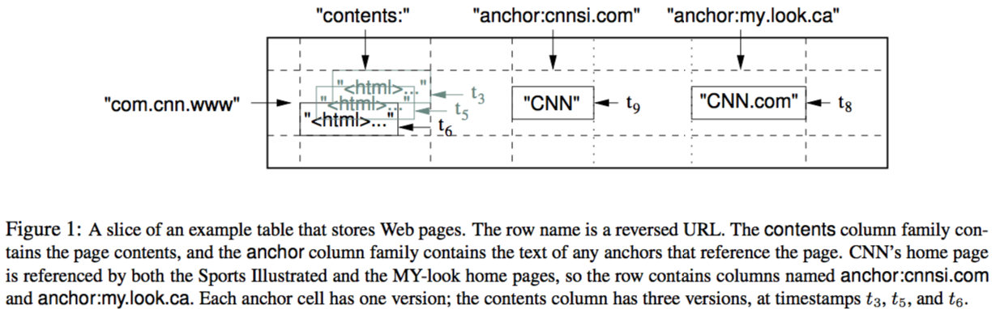
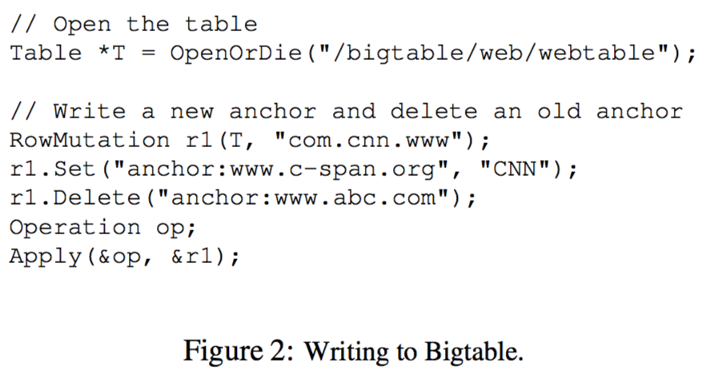
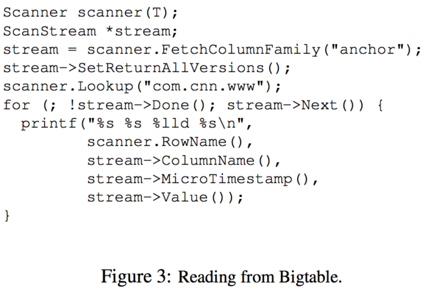
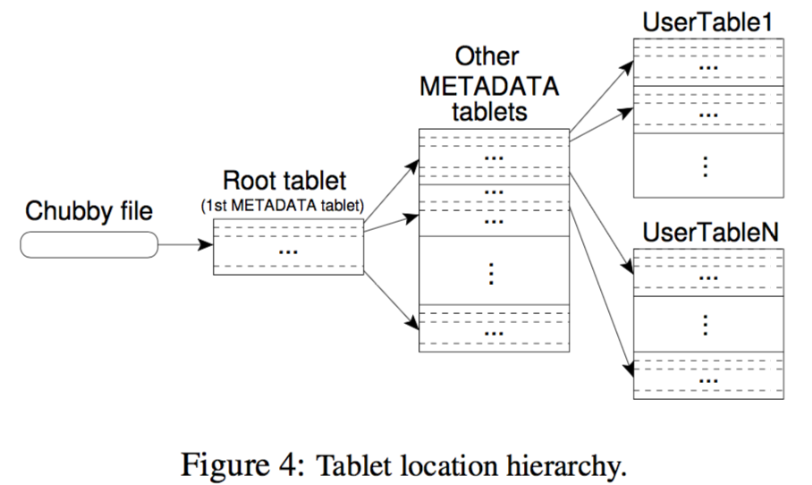
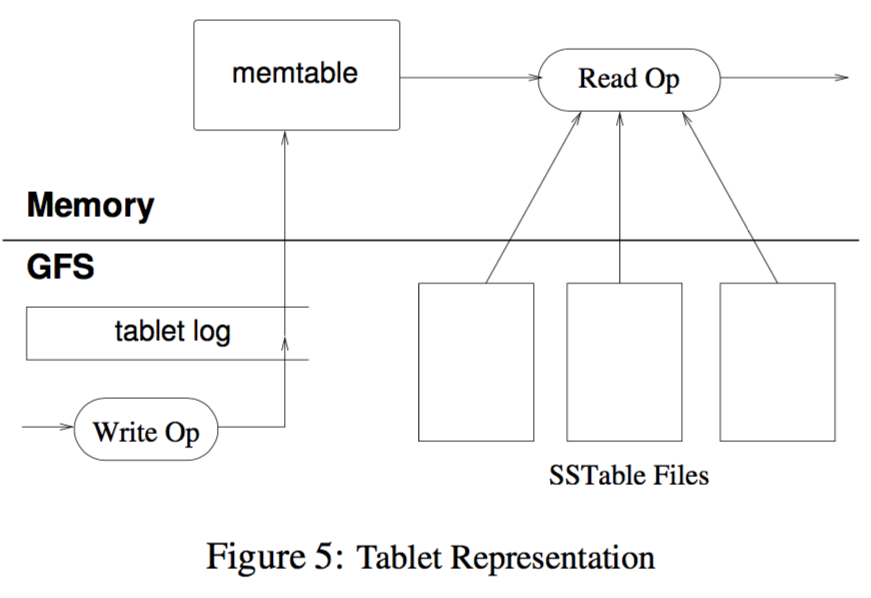
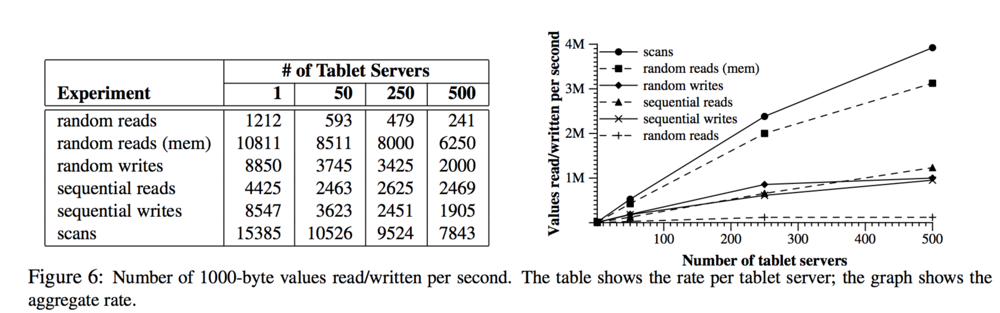
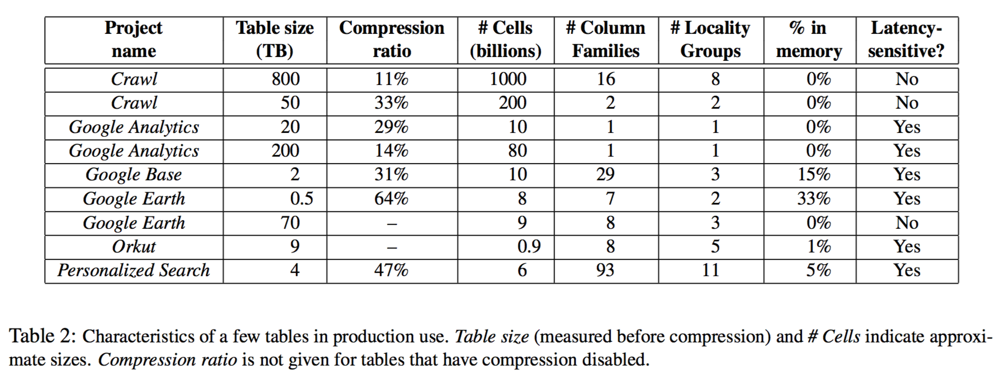

# Bigtable: A Distributed Storage System for Structured Data

Fay Chang, Jeffrey Dean, Sanjay Ghemawat, Wilson C. Hsieh, Deborah A. WallachMike Burrows, Tushar Chandra, Andrew Fikes, Robert E. Gruber

ffay,jeff,sanjay,wilsonh,kerr,m3b,tushar,fikes,gruberg@google.com

Google, Inc.

## Abstract
Bigtable is a distributed storage system for managing
structured data that is designed to scale to a very large
size: petabytes of data across thousands of commodity
servers. Many projects at Google store data in Bigtable,
including web indexing, Google Earth, and Google Finance. These applications place very different demands
on Bigtable, both in terms of data size (from URLs to
web pages to satellite imagery) and latency requirements
(from backend bulk processing to real-time data serving).
Despite these varied demands, Bigtable has successfully
provided a flexible, high-performance solution for all of
these Google products. In this paper we describe the simple data model provided by Bigtable, which gives clients
dynamic control over data layout and format, and we describe the design and implementation of Bigtable.

## 1 Introduction
Over the last two and a half years we have designed,
implemented, and deployed a distributed storage system
for managing structured data at Google called Bigtable.
Bigtable is designed to reliably scale to petabytes of
data and thousands of machines. Bigtable has achieved
several goals: wide applicability, scalability, high per formance, and high availability. Bigtable is used by
more than sixty Google products and projects, includ ing Google Analytics, Google Finance, Orkut, Person alized Search, Writely, and Google Earth. These prod ucts use Bigtable for a variety of demanding workloads,
which range from throughput-oriented batch-processing
jobs to latency-sensitive serving of data to end users.
The Bigtable clusters used by these products span a wide
range of configurations, from a handful to thousands of
servers, and store up to several hundred terabytes of data.  

In many ways, Bigtable resembles a database: it shares
many implementation strategies with databases. Paral lel databases [14] and main-memory databases [13] have
achieved scalability and high performance, but Bigtableprovides a different interface than such systems. Bigtabledoes not support a full relational data model; instead, itprovides clients with a simple data model that supportsdynamic control over data layout and format, and al-lows clients to reason about the locality properties of thedata represented in the underlying storage. Data is in-dexed using row and column names that can be arbitrarystrings. Bigtable also treats data as uninterpreted strings,although clients often serialize various forms of struc-tured and semi-structured data into these strings. Clientscan control the locality of their data through carefulchoices in their schemas. Finally, Bigtable schema pa-rameters let clients dynamically control whether to servedata out of memory or from disk.  

Section 2 describes the data model in more detail, andSection 3 provides an overview of the client API. Sec-tion 4 briefly describes the underlying Google infrastruc-ture on which Bigtable depends. Section 5 describes thefundamentals of the Bigtable implementation, and Sec-tion 6 describes some of the refinements that we madeto improve Bigtable’s performance. Section 7 providesmeasurements of Bigtable’s performance. We describeseveral examples of how Bigtable is used at Googlein Section 8, and discuss some lessons we learned indesigning and supporting Bigtable in Section 9. Fi-nally, Section 10 describes related work, and Section 11presents our conclusions.

## 2 Data Model
A Bigtable is a sparse, distributed, persistent multi-dimensional sorted map. The map is indexed by a rowkey, column key, and a timestamp; each value in the mapis an uninterpreted array of bytes.

```
(row:string, column:string, time:int64) -> string
```



We settled on this data model after examining a variety
of potential uses of a Bigtable-like system. As one con crete example that drove some of our design decisions,
suppose we want to keep a copy of a large collection of
web pages and related information that could be used by
many different projects; let us call this particular table
the Webtable. In Webtable, we would use URLs as row
keys, various aspects of web pages as column names, and
store the contents of the web pages in the contents: col umn under the timestamps when they were fetched, as
illustrated in Figure 1.
 
### Rows
The row keys in a table are arbitrary strings (currently up
to 64KB in size, although 10-100 bytes is a typical size
for most of our users). Every read or write of data under
a single row key is atomic (regardless of the number of
different columns being read or written in the row), a
design decision that makes it easier for clients to reason
about the system’s behavior in the presence of concurrent
updates to the same row.
Bigtable maintains data in lexicographic order by row
key. The row range for a table is dynamically partitioned.
Each row range is called a tablet, which is the unit of dis tribution and load balancing. As a result, reads of short
row ranges are efficient and typically require communi cation with only a small number of machines. Clients
can exploit this property by selecting their row keys so
that they get good locality for their data accesses. For
example, in Webtable, pages in the same domain are
grouped together into contiguous rows by reversing the
hostname components of the URLs. For example, we
store data for maps.google.com/index.html under the
key com.google.maps/index.html. Storing pages from
the same domain near each other makes some host and
domain analyses more efficient.

### Column Families

Column keys are grouped into sets called column fami-lies, which form the basic unit of access control. All datastored in a column family is usually of the same type (wecompress data in the same column family together). Acolumn family must be created before data can be storedunder any column key in that family; after a family hasbeen created, any column key within the family can beused. It is our intent that the number of distinct columnfamilies in a table be small (in the hundreds at most), andthat families rarely change during operation. In contrast,a table may have an unbounded number of columns.A column key is named using the following syntax:family:qualifier. Column family names must be print-able, but qualifiers may be arbitrary strings. An exam-ple column family for the Webtable is language, whichstores the language in which a web page was written. Weuse only one column key in the language family, and itstores each web page’s language ID. Another useful col-umn family for this table is anchor; each column key inthis family represents a single anchor, as shown in Fig-ure 1. The qualifier is the name of the referring site; thecell contents is the link text.

Access control and both disk and memory account-ing are performed at the column-family level.In ourWebtable example, these controls allow us to manageseveral different types of applications: some that add newbase data, some that read the base data and create derivedcolumn families, and some that are only allowed to viewexisting data (and possibly not even to view all of theexisting families for privacy reasons).

### Timestamps

Each cell in a Bigtable can contain multiple versions ofthe same data; these versions are indexed by timestamp.Bigtable timestamps are 64-bit integers. They can be as-signed by Bigtable, in which case they represent (cid:147)realtime(cid:148) in microseconds, or be explicitly assigned by client



applications. Applications that need to avoid collisions
must generate unique timestamps themselves. Different
versions of a cell are stored in decreasing timestamp or der, so that the most recent versions can be read first.
To make the management of versioned data less oner ous, we support two per-column-family settings that tell
Bigtable to garbage-collect cell versions automatically.
The client can specify either that only the last n versions
of a cell be kept, or that only new-enough versions be
kept (e.g., only keep values that were written in the last
seven days).
In our Webtable example, we set the timestamps of
the crawled pages stored in the contents: column to
the times at which these page versions were actually
crawled. The garbage-collection mechanism described
above lets us keep only the most recent three versions of
every page.

## 3 API
The Bigtable API provides functions for creating and
deleting tables and column families.

It also provides
functions for changing cluster, table, and column family
metadata, such as access control rights.
Client applications can write or delete values in
Bigtable, look up values from individual rows, or iter ate over a subset of the data in a table. Figure 2 shows
C++ code that uses a RowMutation abstraction to per form a series of updates. (Irrelevant details were elided
to keep the example short.) The call to Apply performs
an atomic mutation to the Webtable: it adds one anchor
to www.cnn.com and deletes a different anchor.
Figure 3 shows C++ code that uses a Scanner ab straction to iterate over all anchors in a particular row.
Clients can iterate over multiple column families, and
there are several mechanisms for limiting the rows,
columns, and timestamps produced by a scan. For ex ample, we could restrict the scan above to only produce
anchors whose columns match the regular expression
anchor:*.cnn.com, or to only produce anchors whose
 timestamps fall within ten days of the current time.



Bigtable supports several other features that allow theuser to manipulate data in more complex ways. First,Bigtable supports single-row transactions, which can beused to perform atomic read-modify-write sequences ondata stored under a single row key. Bigtable does not cur-rently support general transactions across row keys, al-though it provides an interface for batching writes acrossrow keys at the clients. Second, Bigtable allows cellsto be used as integer counters. Finally, Bigtable sup-ports the execution of client-supplied scripts in the ad-dress spaces of the servers. The scripts are written in alanguage developed at Google for processing data calledSawzall [28]. At the moment, our Sawzall-based APIdoes not allow client scripts to write back into Bigtable,but it does allow various forms of data transformation,filtering based on arbitrary expressions, and summariza-tion via a variety of operators.

Bigtable can be used with MapReduce [12], a frame-work for running large-scale parallel computations de-veloped at Google. We have written a set of wrappersthat allow a Bigtable to be used both as an input sourceand as an output target for MapReduce jobs.

## 4 Building Blocks

Bigtable is built on several other pieces of Google in-frastructure. Bigtable uses the distributed Google FileSystem (GFS) [17] to store log and data files. A Bigtablecluster typically operates in a shared pool of machinesthat run a wide variety of other distributed applications,and Bigtable processes often share the same machineswith processes from other applications. Bigtable de-pends on a cluster management system for schedulingjobs, managing resources on shared machines, dealingwith machine failures, and monitoring machine status.  

The Google SSTable file format is used internally tostore Bigtable data. An SSTable provides a persistent,ordered immutable map from keys to values, where bothkeys and values are arbitrary byte strings. Operations areprovided to look up the value associated with a specified key, and to iterate over all key/value pairs in a specified
key range. Internally, each SSTable contains a sequence
of blocks (typically each block is 64KB in size, but this
is configurable). A block index (stored at the end of the
SSTable) is used to locate blocks; the index is loaded
into memory when the SSTable is opened. A lookup
can be performed with a single disk seek: we first find
the appropriate block by performing a binary search in
the in-memory index, and then reading the appropriate
block from disk. Optionally, an SSTable can be com pletely mapped into memory, which allows us to perform
lookups and scans without touching disk.  

Bigtable relies on a highly-available and persistent
distributed lock service called Chubby [8]. A Chubby
service consists of five active replicas, one of which is
elected to be the master and actively serve requests. The
service is live when a majority of the replicas are running
and can communicate with each other. Chubby uses the
Paxos algorithm [9, 23] to keep its replicas consistent in
the face of failure. Chubby provides a namespace that
consists of directories and small files. Each directory or
file can be used as a lock, and reads and writes to a file
are atomic. The Chubby client library provides consis tent caching of Chubby files. Each Chubby client main tains a session with a Chubby service. A client’s session
expires if it is unable to renew its session lease within the
lease expiration time. When a client’s session expires, it
loses any locks and open handles. Chubby clients can
also register callbacks on Chubby files and directories
for notification of changes or session expiration.  

Bigtable uses Chubby for a variety of tasks: to ensure
that there is at most one active master at any time; to
store the bootstrap location of Bigtable data (see Sec tion 5.1); to discover tablet servers and finalize tablet
server deaths (see Section 5.2); to store Bigtable schema
information (the column family information for each ta ble); and to store access control lists. If Chubby becomes
unavailable for an extended period of time, Bigtable be comes unavailable. We recently measured this effect
in 14 Bigtable clusters spanning 11 Chubby instances.
The average percentage of Bigtable server hours during
which some data stored in Bigtable was not available due
to Chubby unavailability (caused by either Chubby out ages or network issues) was 0.0047%. The percentage
for the single cluster that was most affected by Chubby
unavailability was 0.0326%.

## 5 Implementation

The Bigtable implementation has three major compo nents: a library that is linked into every client, one mas ter server, and many tablet servers. Tablet servers can be dynamically added (or removed) from a cluster to acco-modate changes in workloads.

The master is responsible for assigning tablets to tabletservers, detecting the addition and expiration of tabletservers, balancing tablet-server load, and garbage col-lection of files in GFS. In addition, it handles schemachanges such as table and column family creations.Each tablet server manages a set of tablets (typicallywe have somewhere between ten to a thousand tablets pertablet server). The tablet server handles read and writerequests to the tablets that it has loaded, and also splitstablets that have grown too large.

As with many single-master distributed storage sys-tems [17, 21], client data does not move through the mas-ter: clients communicate directly with tablet servers forreads and writes. Because Bigtable clients do not rely onthe master for tablet location information, most clientsnever communicate with the master. As a result, the mas-ter is lightly loaded in practice.

A Bigtable cluster stores a number of tables. Each ta-ble consists of a set of tablets, and each tablet containsall data associated with a row range. Initially, each tableconsists of just one tablet. As a table grows, it is auto-matically split into multiple tablets, each approximately100-200 MB in size by default.

### 5.1 Tablet Location

We use a three-level hierarchy analogous to that of a B+-tree [10] to store tablet location information (Figure 4).


The first level is a file stored in Chubby that containsthe location of the root tablet. The root tablet containsthe location of all tablets in a special METADATA table.Each METADATA tablet contains the location of a set ofuser tablets. The root tablet is just the first tablet in the METADATA table, but is treated specially(cid:151)it is never split(cid:151)to ensure that the tablet location hierarchy has nomore than three levels.

The METADATA table stores the location of a tabletunder a row key that is an encoding of the tablet’s table identifier and its end row. Each METADATA row stores approximately 1KB of data in memory. With a modest limit of 128 MB METADATA tablets, our three-level lo cation scheme is sufficient to address 234 tablets (or 261 bytes in 128 MB tablets).   

The client library caches tablet locations. If the client
does not know the location of a tablet, or if it discov ers that cached location information is incorrect, then
it recursively moves up the tablet location hierarchy.
If the client’s cache is empty, the location algorithm
requires three network round-trips, including one read
from Chubby. If the client’s cache is stale, the location
algorithm could take up to six round-trips, because stale
cache entries are only discovered upon misses (assuming
that METADATA tablets do not move very frequently).
Although tablet locations are stored in memory, so no
GFS accesses are required, we further reduce this cost
in the common case by having the client library prefetch
tablet locations: it reads the metadata for more than one
tablet whenever it reads the METADATA table.   

We also store secondary information in the
METADATA table, including a log of all events per taining to each tablet (such as when a server begins
serving it). This information is helpful for debugging
and performance analysis.

### 5.2 Tablet Assignment
Each tablet is assigned to one tablet server at a time. The
master keeps track of the set of live tablet servers, and
the current assignment of tablets to tablet servers, in cluding which tablets are unassigned. When a tablet is
unassigned, and a tablet server with sufficient room for
the tablet is available, the master assigns the tablet by
sending a tablet load request to the tablet server.   

Bigtable uses Chubby to keep track of tablet servers.
When a tablet server starts, it creates, and acquires an
exclusive lock on, a uniquely-named file in a specific
Chubby directory. The master monitors this directory
(the servers directory) to discover tablet servers. A tablet
server stops serving its tablets if it loses its exclusive
lock: e.g., due to a network partition that caused the
server to lose its Chubby session. (Chubby provides an
efficient mechanism that allows a tablet server to check
whether it still holds its lock without incurring network
traffic.) A tablet server will attempt to reacquire an ex clusive lock on its file as long as the file still exists. If the
file no longer exists, then the tablet server will never be
able to serve again, so it kills itself. Whenever a tablet
server terminates (e.g., because the cluster management
system is removing the tablet server’s machine from the
cluster), it attempts to release its lock so that the master
will reassign its tablets more quickly.   

The master is responsible for detecting when a tabletserver is no longer serving its tablets, and for reassign-ing those tablets as soon as possible. To detect when atablet server is no longer serving its tablets, the masterperiodically asks each tablet server for the status of itslock. If a tablet server reports that it has lost its lock,or if the master was unable to reach a server during itslast several attempts, the master attempts to acquire anexclusive lock on the server’s file. If the master is able toacquire the lock, then Chubby is live and the tablet serveris either dead or having trouble reaching Chubby, so themaster ensures that the tablet server can never serve againby deleting its server file. Once a server’s file has beendeleted, the master can move all the tablets that were pre-viously assigned to that server into the set of unassignedtablets. To ensure that a Bigtable cluster is not vulnera-ble to networking issues between the master and Chubby,the master kills itself if its Chubby session expires. How-ever, as described above, master failures do not changethe assignment of tablets to tablet servers.

When a master is started by the cluster managementsystem, it needs to discover the current tablet assign-ments before it can change them. The master executesthe following steps at startup.

(1) The master grabsa unique master lock in Chubby, which prevents con-current master instantiations. (2) The master scans theservers directory in Chubby to find the live servers.(3) The master communicates with every live tabletserver to discover what tablets are already assigned toeach server. (4) The master scans the METADATA tableto learn the set of tablets. Whenever this scan encountersa tablet that is not already assigned, the master adds thetablet to the set of unassigned tablets, which makes thetablet eligible for tablet assignment.

One complication is that the scan of the METADATAtable cannot happen until the METADATA tablets havebeen assigned. Therefore, before starting this scan (step4), the master adds the root tablet to the set of unassignedtablets if an assignment for the root tablet was not discovered during step 3. This addition ensures that the roottablet will be assigned. Because the root tablet containsthe names of all METADATA tablets, the master knowsabout all of them after it has scanned the root tablet.The set of existing tablets only changes when a table is created or deleted, two existing tablets are mergedto form one larger tablet, or an existing tablet is splitinto two smaller tablets. The master is able to keeptrack of these changes because it initiates all but the last.Tablet splits are treated specially since they are initi-ated by a tablet server. The tablet server commits thesplit by recording information for the new tablet in the METADATA table. When the split has committed, it notifies the master. In case the split notification is lost because the tablet server or the master died), the master
detects the new tablet when it asks a tablet server to load
the tablet that has now split. The tablet server will notify
the master of the split, because the tablet entry it finds in
the METADATA table will specify only a portion of the
tablet that the master asked it to load.

### 5.3 Tablet Serving
The persistent state of a tablet is stored in GFS, as illus trated in Figure 5. Updates are committed to a commit
log that stores redo records. Of these updates, the re cently committed ones are stored in memory in a sorted
buffer called a memtable; the older updates are stored in a
sequence of SSTables. To recover a tablet, a tablet server



reads its metadata from the METADATA table. This meta data contains the list of SSTables that comprise a tablet
and a set of a redo points, which are pointers into any
commit logs that may contain data for the tablet. The
server reads the indices of the SSTables into memory and
reconstructs the memtable by applying all of the updates
that have committed since the redo points.
When a write operation arrives at a tablet server, the
server checks that it is well-formed, and that the sender
is authorized to perform the mutation. Authorization is
performed by reading the list of permitted writers from a
Chubby file (which is almost always a hit in the Chubby
client cache). A valid mutation is written to the commit
log. Group commit is used to improve the throughput of
lots of small mutations [13, 16]. After the write has been
committed, its contents are inserted into the memtable.
When a read operation arrives at a tablet server, it is
similarly checked for well-formedness and proper autho rization. A valid read operation is executed on a merged
view of the sequence of SSTables and the memtable.
Since the SSTables and the memtable are lexicograph ically sorted data structures, the merged view can be
formed efficiently.
Incoming read and write operations can continue
while tablets are split and merged.

### 5.4 Compactions

As write operations execute, the size of the memtable in-creases. When the memtable size reaches a threshold, thememtable is frozen, a new memtable is created, and thefrozen memtable is converted to an SSTable and writtento GFS. This minor compaction process has two goals:it shrinks the memory usage of the tablet server, and itreduces the amount of data that has to be read from thecommit log during recovery if this server dies. Incoming read and write operations can continue while com-pactions occur.

Every minor compaction creates a new SSTable. If thisbehavior continued unchecked, read operations mightneed to merge updates from an arbitrary number ofSSTables. Instead, we bound the number of such filesby periodically executing a merging compaction in thebackground. A merging compaction reads the contentsof a few SSTables and the memtable, and writes out anew SSTable. The input SSTables and memtable can bediscarded as soon as the compaction has finished.A merging compaction that rewrites all SSTablesinto exactly one SSTable is called a major compaction.SSTables produced by non-major compactions can con-tain special deletion entries that suppress deleted data inolder SSTables that are still live. A major compaction,on the other hand, produces an SSTable that containsno deletion information or deleted data. Bigtable cy-cles through all of its tablets and regularly applies majorcompactions to them. These major compactions allowBigtable to reclaim resources used by deleted data, andalso allow it to ensure that deleted data disappears fromthe system in a timely fashion, which is important forservices that store sensitive data.

## 6 Refinements

The implementation described in the previous sectionrequired a number of refinements to achieve the highperformance, availability, and reliability required by ourusers. This section describes portions of the implementation in more detail in order to highlight these refinements.

### Locality groups

Clients can group multiple column families together intoa locality group. A separate SSTable is generated foreach locality group in each tablet. Segregating columnfamilies that are not typically accessed together into sep-arate locality groups enables more efficient reads. Forexample, page metadata in Webtable (such as languageand checksums) can be in one locality group, and thecontents of the page can be in a different group: an application that wants to read the metadata does not need
to read through all of the page contents.
In addition, some useful tuning parameters can be
specified on a perlocality group basis. For example, a lo cality group can be declared to be in-memory. SSTables
for in-memory locality groups are loaded lazily into the
memory of the tablet server. Once loaded, column fam ilies that belong to such locality groups can be read
without accessing the disk. This feature is useful for
small pieces of data that are accessed frequently: we
use it internally for the location column family in the
METADATA table.

### Caching for read performance

To improve read performance, tablet servers use two lev-els of caching. The Scan Cache is a higher-level cachethat caches the key-value pairs returned by the SSTableinterface to the tablet server code. The Block Cache is alower-level cache that caches SSTables blocks that wereread from GFS. The Scan Cache is most useful for appli-cations that tend to read the same data repeatedly. TheBlock Cache is useful for applications that tend to readdata that is close to the data they recently read (e.g., se-quential reads, or random reads of different columns inthe same locality group within a hot row).

### Compression
Clients can control whether or not the SSTables for a
locality group are compressed, and if so, which com pression format is used. The user-specified compres sion format is applied to each SSTable block (whose size is controllable via a locality group specific tuning pa rameter). Although we lose some space by compress ing each block separately, we benefit in that small por tions of an SSTable can be read without decompress ing the entire file. Many clients use a two-pass custom compression scheme. The first pass uses Bentley and
McIlroy’s scheme [6], which compresses long common
strings across a large window. The second pass uses a
fast compression algorithm that looks for repetitions in
a small 16 KB window of the data. Both compression
passes are very fast---they encode at 100(cid:150)200 MB/s, and
decode at 400-1000 MB/s on modern machines.
Even though we emphasized speed instead of space re duction when choosing our compression algorithms, this
two-pass compression scheme does surprisingly well.
For example,

in Webtable, we use this compression
scheme to store Web page contents. In one experiment,
we stored a large number of documents in a compressed
locality group. For the purposes of the experiment, we
limited ourselves to one version of each document in stead of storing all versions available to us. The scheme
achieved a 10-to-1 reduction in space. This is much
better than typical Gzip reductions of 3-to-1 or 4-to-1
on HTML pages because of the way Webtable rows are
laid out: all pages from a single host are stored close
to each other. This allows the Bentley-McIlroy algo rithm to identify large amounts of shared boilerplate in
pages from the same host. Many applications, not just
Webtable, choose their row names so that similar data
ends up clustered, and therefore achieve very good com pression ratios. Compression ratios get even better when
we store multiple versions of the same value in Bigtable.

### Bloom filters

As described in Section 5.3, a read operation has to readfrom all SSTables that make up the state of a tablet.If these SSTables are not in memory, we may end updoing many disk accesses. We reduce the number ofaccesses by allowing clients to specify that Bloom fil-ters [7] should be created for SSTables in a particu-lar locality group. A Bloom filter allows us to askwhether an SSTable might contain any data for a spec-ified row/column pair. For certain applications, a smallamount of tablet server memory used for storing Bloomfilters drastically reduces the number of disk seeks re-quired for read operations. Our use of Bloom filtersalso implies that most lookups for non-existent rows orcolumns do not need to touch disk.

### Commit-log implementation

If we kept the commit log for each tablet in a separatelog file, a very large number of files would be writtenconcurrently in GFS. Depending on the underlying filesystem implementation on each GFS server, these writescould cause a large number of disk seeks to write to thedifferent physical log files. In addition, having separatelog files per tablet also reduces the effectiveness of thegroup commit optimization, since groups would tend tobe smaller. To fix these issues, we append mutationsto a single commit log per tablet server, co-minglingmutations for different tablets in the same physical logfile [18, 20].

Using one log provides significant performance ben-efits during normal operation, but it complicates recov-ery. When a tablet server dies, the tablets that it servedwill be moved to a large number of other tablet servers:each server typically loads a small number of the orig-inal server’s tablets. To recover the state for a tablet,the new tablet server needs to reapply the mutations forthat tablet from the commit log written by the originaltablet server. However, the mutations for these tablets were co-mingled in the same physical log file. One ap proach would be for each new tablet server to read this
full commit log file and apply just the entries needed for
the tablets it needs to recover. However, under such a
scheme, if 100 machines were each assigned a single
tablet from a failed tablet server, then the log file would
be read 100 times (once by each server).  

We avoid duplicating log reads by first sort the keys log entries in order of keys (table; row name; log sequence number).
In the sorted output, all mutations for a particular tablet are
contiguous and can therefore be read efficiently with one
disk seek followed by a sequential read. To parallelize
the sorting, we partition the log file into 64 MB seg ments, and sort each segment in parallel on different
tablet servers. This sorting process is coordinated by the
master and is initiated when a tablet server indicates that
it needs to recover mutations from some commit log file.  

Writing commit logs to GFS sometimes causes perfor mance hiccups for a variety of reasons (e.g., a GFS server
machine involved in the write crashes, or the network
paths traversed to reach the particular set of three GFS
servers is suffering network congestion, or is heavily
loaded). To protect mutations from GFS latency spikes,
each tablet server actually has two log writing threads,
each writing to its own log file; only one of these two
threads is actively in use at a time. If writes to the ac tive log file are performing poorly, the log file writing is
switched to the other thread, and mutations that are in
the commit log queue are written by the newly active log
writing thread. Log entries contain sequence numbers
to allow the recovery process to elide duplicated entries
resulting from this log switching process.

### Speeding up tablet recovery
If the master moves a tablet from one tablet server to
another, the source tablet server first does a minor com paction on that tablet. This compaction reduces recov ery time by reducing the amount of uncompacted state in
the tablet server’s commit log. After finishing this com paction, the tablet server stops serving the tablet. Before
it actually unloads the tablet, the tablet server does an other (usually very fast) minor compaction to eliminate
any remaining uncompacted state in the tablet server’s
log that arrived while the first minor compaction was
being performed. After this second minor compaction
is complete, the tablet can be loaded on another tablet
server without requiring any recovery of log entries.

### Exploiting immutability
Besides the SSTable caches, various other parts of the
Bigtable system have been simplified by the fact that all of the SSTables that we generate are immutable. For ex-ample, we do not need any synchronization of accessesto the file system when reading from SSTables. As a re-sult, concurrency control over rows can be implementedvery efficiently. The only mutable data structure that isaccessed by both reads and writes is the memtable. To re-duce contention during reads of the memtable, we makeeach memtable row copy-on-write and allow reads andwrites to proceed in parallel.

Since SSTables are immutable, the problem of perma-nently removing deleted data is transformed to garbagecollecting obsolete SSTables. Each tablet’s SSTables areregistered in the METADATA table. The master removesobsolete SSTables as a mark-and-sweep garbage collec-tion [25] over the set of SSTables, where the METADATAtable contains the set of roots.

Finally, the immutability of SSTables enables us tosplit tablets quickly. Instead of generating a new set ofSSTables for each child tablet, we let the child tabletsshare the SSTables of the parent tablet.

## 7 Performance Evaluation

We set up a Bigtable cluster with N tablet servers tomeasure the performance and scalability of Bigtable asN is varied. The tablet servers were configured to use 1GB of memory and to write to a GFS cell consisting of1786 machines with two 400 GB IDE hard drives each.N client machines generated the Bigtable load used forthese tests. (We used the same number of clients as tabletservers to ensure that clients were never a bottleneck.)Each machine had two dual-core Opteron 2 GHz chips,enough physical memory to hold the working set of allrunning processes, and a single gigabit Ethernet link.The machines were arranged in a two-level tree-shapedswitched network with approximately 100-200 Gbps ofaggregate bandwidth available at the root. All of the ma-chines were in the same hosting facility and therefore theround-trip time between any pair of machines was lessthan a millisecond.

The tablet servers and master, test clients, and GFSservers all ran on the same set of machines. Every ma-chine ran a GFS server. Some of the machines also raneither a tablet server, or a client process, or processesfrom other jobs that were using the pool at the same timeas these experiments.

R is the distinct number of Bigtable row keys involvedin the test. R was chosen so that each benchmark read orwrote approximately 1 GB of data per tablet server.  

The sequential write benchmark used row keys withnames 0 to R (cid:0) 1. This space of row keys was parti-tioned into 10N equal-sized ranges. These ranges wereassigned to the N clients by a central scheduler that as



signed the next available range to a client as soon as the
client finished processing the previous range assigned to
it. This dynamic assignment helped mitigate the effects
of performance variations caused by other processes run ning on the client machines. We wrote a single string un der each row key. Each string was generated randomly
and was therefore uncompressible. In addition, strings
under different row key were distinct, so no cross-row
compression was possible. The random write benchmark
was similar except that the row key was hashed modulo
R immediately before writing so that the write load was
spread roughly uniformly across the entire row space for
the entire duration of the benchmark.  

The sequential read benchmark generated row keys in
exactly the same way as the sequential write benchmark,
but instead of writing under the row key, it read the string
stored under the row key (which was written by an earlier
invocation of the sequential write benchmark). Similarly,
the random read benchmark shadowed the operation of
the random write benchmark.  

The scan benchmark is similar to the sequential read
benchmark, but uses support provided by the Bigtable
API for scanning over all values in a row range. Us ing a scan reduces the number of RPCs executed by the
benchmark since a single RPC fetches a large sequence
of values from a tablet server.  

The random reads (mem) benchmark is similar to the
random read benchmark, but the locality group that con tains the benchmark data is marked as in-memory, and
therefore the reads are satisfied from the tablet server’s
memory instead of requiring a GFS read. For just this
benchmark, we reduced the amount of data per tablet
server from 1 GB to 100 MB so that it would fit com fortably in the memory available to the tablet server.  

Figure 6 shows two views on the performance of our
benchmarks when reading and writing 1000-byte values
to Bigtable. The table shows the number of operations
per second per tablet server; the graph shows the aggre gate number of operations per second.

### Single tablet-server performance

Let us first consider performance with just one tabletserver. Random reads are slower than all other operationsby an order of magnitude or more. Each random read in-volves the transfer of a 64 KB SSTable block over thenetwork from GFS to a tablet server, out of which only asingle 1000-byte value is used. The tablet server executesapproximately 1200 reads per second, which translatesinto approximately 75 MB/s of data read from GFS. Thisbandwidth is enough to saturate the tablet server CPUsbecause of overheads in our networking stack, SSTableparsing, and Bigtable code, and is also almost enoughto saturate the network links used in our system. MostBigtable applications with this type of an access patternreduce the block size to a smaller value, typically 8KB.Random reads from memory are much faster sinceeach 1000-byte read is satisfied from the tablet server’slocal memory without fetching a large 64 KB block fromGFS.

Random and sequential writes perform better than ran-dom reads since each tablet server appends all incomingwrites to a single commit log and uses group commit tostream these writes efficiently to GFS. There is no sig-nificant difference between the performance of randomwrites and sequential writes; in both cases, all writes tothe tablet server are recorded in the same commit log.Sequential reads perform better than random readssince every 64 KB SSTable block that is fetched fromGFS is stored into our block cache, where it is used toserve the next 64 read requests.

Scans are even faster since the tablet server can returna large number of values in response to a single clientRPC, and therefore RPC overhead is amortized over alarge number of values.

### Scaling

Aggregate throughput increases dramatically, by over afactor of a hundred, as we increase the number of tabletservers in the system from 1 to 500. For example, the 


clusters.
performance of random reads from memory increases by
almost a factor of 300 as the number of tablet server in creases by a factor of 500. This behavior occurs because
the bottleneck on performance for this benchmark is the
individual tablet server CPU.  

However, performance does not increase linearly. For
most benchmarks, there is a significant drop in per-server
throughput when going from 1 to 50 tablet servers. This
drop is caused by imbalance in load in multiple server
configurations, often due to other processes contending
for CPU and network. Our load balancing algorithm at tempts to deal with this imbalance, but cannot do a per fect job for two main reasons: rebalancing is throttled to
reduce the number of tablet movements (a tablet is un available for a short time, typically less than one second,
when it is moved), and the load generated by our bench marks shifts around as the benchmark progresses.  

The random read benchmark shows the worst scaling
(an increase in aggregate throughput by only a factor of
100 for a 500-fold increase in number of servers). This
behavior occurs because (as explained above) we transfer
one large 64KB block over the network for every 1000 byte read. This transfer saturates various shared 1 Gi gabit links in our network and as a result, the per-server
throughput drops significantly as we increase the number
of machines.

## 8 Real Applications

As of August 2006, there are 388 non-test Bigtable clus ters running in various Google machine clusters, with a
combined total of about 24,500 tablet servers. Table 1
shows a rough distribution of tablet servers per cluster.
Many of these clusters are used for development pur poses and therefore are idle for significant periods. One
group of 14 busy clusters with 8069 total tablet servers
saw an aggregate volume of more than 1.2 million re quests per second, with incoming RPC traffic of about
741 MB/s and outgoing RPC traffic of about 16 GB/s.  

Table 2 provides some data about a few of the tables
currently in use. Some tables store data that is served
to users, whereas others store data for batch processing;
the tables range widely in total size, average cell size,
percentage of data served from memory, and complexityof the table schema. In the rest of this section, we brieflydescribe how three product teams use Bigtable.

### 8.1 Google Analytics

Google Analytics (analytics.google.com) is a servicethat helps webmasters analyze traffic patterns at theirweb sites.

It provides aggregate statistics, such as thenumber of unique visitors per day and the page viewsper URL per day, as well as site-tracking reports, such asthe percentage of users that made a purchase, given thatthey earlier viewed a specific page.

To enable the service, webmasters embed a smallJavaScript program in their web pages. This programis invoked whenever a page is visited. It records variousinformation about the request in Google Analytics, suchas a user identifier and information about the page be-ing fetched. Google Analytics summarizes this data andmakes it available to webmasters.

We briefly describe two of the tables used by GoogleAnalytics. The raw click table ((cid:152)200 TB) maintains arow for each end-user session. The row name is a tuplecontaining the website’s name and the time at which thesession was created. This schema ensures that sessionsthat visit the same web site are contiguous, and that theyare sorted chronologically. This table compresses to 14%of its original size.

The summary table ((cid:152)20 TB) contains various prede-fined summaries for each website. This table is gener-ated from the raw click table by periodically scheduledMapReduce jobs. Each MapReduce job extracts recentsession data from the raw click table. The overall sys-tem’s throughput is limited by the throughput of GFS.This table compresses to 29% of its original size.

### 8.2 Google Earth

Google operates a collection of services that provideusers with access to high-resolution satellite imagery ofthe world’s surface, both through the web-based GoogleMaps interface (maps.google.com) and through theGoogle Earth (earth.google.com) custom client soft-ware. These products allow users to navigate across theworld’s surface: they can pan, view, and annotate satel-lite imagery at many different levels of resolution. Thissystem uses one table to preprocess data, and a differentset of tables for serving client data.

The preprocessing pipeline uses one table to store rawimagery. During preprocessing, the imagery is cleanedand consolidated into final serving data. This table con-tains approximately 70 terabytes of data and therefore isserved from disk. The images are efficiently compressedalready, so Bigtable compression is disabled.



Each row in the imagery table corresponds to a sin gle geographic segment. Rows are named to ensure that
adjacent geographic segments are stored near each other.
The table contains a column family to keep track of the
sources of data for each segment. This column family
has a large number of columns: essentially one for each
raw data image. Since each segment is only built from a
few images, this column family is very sparse.
The preprocessing pipeline relies heavily on MapRe duce over Bigtable to transform data. The overall system
processes over 1 MB/sec of data per tablet server during
some of these MapReduce jobs.
The serving system uses one table to index data stored
in GFS. This table is relatively small ((cid:152)500 GB), but it
must serve tens of thousands of queries per second per
datacenter with low latency. As a result, this table is
hosted across hundreds of tablet servers and contains in memory column families.

### 8.3 Personalized Search
Personalized Search (www.google.com/psearch) is an
opt-in service that records user queries and clicks across
a variety of Google properties such as web search, im ages, and news. Users can browse their search histories
to revisit their old queries and clicks, and they can ask
for personalized search results based on their historical
Google usage patterns.
Personalized Search stores each user’s data in
Bigtable. Each user has a unique userid and is assigned
a row named by that userid. All user actions are stored
in a table. A separate column family is reserved for each
type of action (for example, there is a column family that
stores all web queries). Each data element uses as its
Bigtable timestamp the time at which the corresponding
user action occurred. Personalized Search generates user
profiles using a MapReduce over Bigtable. These user
profiles are used to personalize live search results.

The Personalized Search data is replicated across several Bigtable clusters to increase availability and to reduce latency due to distance from clients. The Personal-ized Search team originally built a client-side replicationmechanism on top of Bigtable that ensured eventual con-sistency of all replicas. The current system now uses areplication subsystem that is built into the servers.The design of the Personalized Search storage systemallows other groups to add new per-user information intheir own columns, and the system is now used by manyother Google properties that need to store per-user con-figuration options and settings. Sharing a table amongstmany groups resulted in an unusually large number ofcolumn families. To help support sharing, we added asimple quota mechanism to Bigtable to limit the stor-age consumption by any particular client in shared ta-bles; this mechanism provides some isolation betweenthe various product groups using this system for per-userinformation storage.

## 9 Lessons

In the process of designing, implementing, maintaining,and supporting Bigtable, we gained useful experienceand learned several interesting lessons.

One lesson we learned is that large distributed sys-tems are vulnerable to many types of failures, not justthe standard network partitions and fail-stop failures as-sumed in many distributed protocols. For example, wehave seen problems due to all of the following causes:memory and network corruption, large clock skew, hungmachines, extended and asymmetric network partitions,bugs in other systems that we are using (Chubby for ex-ample), overflow of GFS quotas, and planned and un-planned hardware maintenance. As we have gained moreexperience with these problems, we have addressed themby changing various protocols. For example, we addedchecksumming to our RPC mechanism. We also handled
some problems by removing assumptions made by one
part of the system about another part. For example, we
stopped assuming a given Chubby operation could return
only one of a fixed set of errors.  

Another lesson we learned is that it is important to
delay adding new features until it is clear how the new
features will be used. For example, we initially planned
to support general-purpose transactions in our API. Be cause we did not have an immediate use for them, how ever, we did not implement them. Now that we have
many real applications running on Bigtable, we have
been able to examine their actual needs, and have discov ered that most applications require only single-row trans actions. Where people have requested distributed trans actions, the most important use is for maintaining sec ondary indices, and we plan to add a specialized mech anism to satisfy this need. The new mechanism will
be less general than distributed transactions, but will be
more efficient (especially for updates that span hundreds
of rows or more) and will also interact better with our
scheme for optimistic cross-data-center replication.  

A practical lesson that we learned from supporting
Bigtable is the importance of proper system-level mon itoring (i.e., monitoring both Bigtable itself, as well as
the client processes using Bigtable). For example, we ex tended our RPC system so that for a sample of the RPCs,
it keeps a detailed trace of the important actions done on
behalf of that RPC. This feature has allowed us to de tect and fix many problems such as lock contention on
tablet data structures, slow writes to GFS while com mitting Bigtable mutations, and stuck accesses to the
METADATA table when METADATA tablets are unavail able. Another example of useful monitoring is that ev ery Bigtable cluster is registered in Chubby. This allows
us to track down all clusters, discover how big they are,
see which versions of our software they are running, how
much traffic they are receiving, and whether or not there
are any problems such as unexpectedly large latencies.  

The most important lesson we learned is the value
of simple designs. Given both the size of our system
(about 100,000 lines of non-test code), as well as the
fact that code evolves over time in unexpected ways, we
have found that code and design clarity are of immense
help in code maintenance and debugging. One exam ple of this is our tablet-server membership protocol. Our
first protocol was simple: the master periodically issued
leases to tablet servers, and tablet servers killed them selves if their lease expired. Unfortunately, this proto col reduced availability significantly in the presence of
network problems, and was also sensitive to master re covery time. We redesigned the protocol several times
until we had a protocol that performed well. However,
the resulting protocol was too complex and depended on
the behavior of Chubby features that were seldom exer-cised by other applications. We discovered that we werespending an inordinate amount of time debugging ob-scure corner cases, not only in Bigtable code, but also inChubby code. Eventually, we scrapped this protocol andmoved to a newer simpler protocol that depends solelyon widely-used Chubby features.

## 10 Related Work

The Boxwood project [24] has components that overlapin some ways with Chubby, GFS, and Bigtable, since itprovides for distributed agreement, locking, distributedchunk storage, and distributed B-tree storage.

In eachcase where there is overlap, it appears that the Box-wood’s component is targeted at a somewhat lower levelthan the corresponding Google service. The Boxwoodproject’s goal is to provide infrastructure for buildinghigher-level services such as file systems or databases,while the goal of Bigtable is to directly support clientapplications that wish to store data.

Many recent projects have tackled the problem of pro-viding distributed storage or higher-level services overwide area networks, often at (cid:147)Internet scale.(cid:148) This in-cludes work on distributed hash tables that began withprojects such as CAN [29], Chord [32], Tapestry [37],and Pastry [30]. These systems address concerns that donot arise for Bigtable, such as highly variable bandwidth,untrusted participants, or frequent reconfiguration; de-centralized control and Byzantine fault tolerance are notBigtable goals.

In terms of the distributed data storage model that onemight provide to application developers, we believe thekey-value pair model provided by distributed B-trees ordistributed hash tables is too limiting. Key-value pairsare a useful building block, but they should not be theonly building block one provides to developers. Themodel we chose is richer than simple key-value pairs,and supports sparse semi-structured data. Nonetheless,it is still simple enough that it lends itself to a very effi-cient flat-file representation, and it is transparent enough(via locality groups) to allow our users to tune importantbehaviors of the system.

Several database vendors have developed paralleldatabases that can store large volumes of data. Oracle’sReal Application Cluster database [27] uses shared disksto store data (Bigtable uses GFS) and a distributed lockmanager (Bigtable uses Chubby). IBM’s DB2 ParallelEdition [4] is based on a shared-nothing [33] architecturesimilar to Bigtable. Each DB2 server is responsible fora subset of the rows in a table which it stores in a localrelational database. Both products provide a completerelational model with transactions.
 
Bigtable locality groups realize similar compression
and disk read performance benefits observed for other
systems that organize data on disk using column-based
rather than row-based storage, including C-Store [1, 34]
and commercial products such as Sybase IQ [15, 36],
SenSage [31], KDB+ [22], and the ColumnBM storage
layer in MonetDB/X100 [38]. Another system that does
vertical and horizontal data partioning into flat files and
achieves good data compression ratios is AT&T’s Day tona database [19]. Locality groups do not support CPU cache-level optimizations, such as those described by
Ailamaki [2].
The manner in which Bigtable uses memtables and
SSTables to store updates to tablets is analogous to the
way that the Log-Structured Merge Tree [26] stores up dates to index data.

In both systems, sorted data is
buffered in memory before being written to disk, and
reads must merge data from memory and disk.
C-Store and Bigtable share many characteristics: both
systems use a shared-nothing architecture and have two
different data structures, one for recent writes, and one
for storing long-lived data, with a mechanism for mov ing data from one form to the other. The systems dif fer significantly in their API: C-Store behaves like a
relational database, whereas Bigtable provides a lower
level read and write interface and is designed to support
many thousands of such operations per second per server.
C-Store is also a (cid:147)read-optimized relational DBMS(cid:148),
whereas Bigtable provides good performance on both
read-intensive and write-intensive applications.
Bigtable’s load balancer has to solve some of the same
kinds of load and memory balancing problems faced by
shared-nothing databases (e.g., [11, 35]). Our problem is
somewhat simpler: (1) we do not consider the possibility
of multiple copies of the same data, possibly in alternate
forms due to views or indices; (2) we let the user tell us
what data belongs in memory and what data should stay
on disk, rather than trying to determine this dynamically;
(3) we have no complex queries to execute or optimize.

Given the unusual interface to Bigtable, an interest-ing question is how difficult it has been for our users toadapt to using it. New users are sometimes uncertain ofhow to best use the Bigtable interface, particularly if theyare accustomed to using relational databases that supportgeneral-purpose transactions. Nevertheless, the fact thatmany Google products successfully use Bigtable demon-strates that our design works well in practice.

We are in the process of implementing several additional Bigtable features, such as support for secondaryindices and infrastructure for building cross-data-centerreplicated Bigtables with multiple master replicas. Wehave also begun deploying Bigtable as a service to prod-uct groups, so that individual groups do not need to main-tain their own clusters. As our service clusters scale,we will need to deal with more resource-sharing issueswithin Bigtable itself [3, 5].

Finally, we have found that there are significant ad-vantages to building our own storage solution at Google.We have gotten a substantial amount of flexibility fromdesigning our own data model for Bigtable.

In addi-tion, our control over Bigtable’s implementation, andthe other Google infrastructure upon which Bigtable de-pends, means that we can remove bottlenecks and ineffi-ciencies as they arise.

## Acknowledgements

We thank the anonymous reviewers, David Nagle, andour shepherd Brad Calder, for their feedback on this pa-per. The Bigtable system has benefited greatly from thefeedback of our many users within Google. In addition,we thank the following people for their contributions toBigtable: Dan Aguayo, Sameer Ajmani, Zhifeng Chen,Bill Coughran, Mike Epstein, Healfdene Goguen, RobertGriesemer, Jeremy Hylton, Josh Hyman, Alex Khesin,Joanna Kulik, Alberto Lerner, Sherry Listgarten, MikeMaloney, Eduardo Pinheiro, Kathy Polizzi, Frank Yellin,and Arthur Zwiegincew.


## 11 Conclusions
We have described Bigtable, a distributed system for
storing structured data at Google. Bigtable clusters have
been in production use since April 2005, and we spent
roughly seven person-years on design and implementa tion before that date. As of August 2006, more than sixty
projects are using Bigtable. Our users like the perfor mance and high availability provided by the Bigtable im plementation, and that they can scale the capacity of their
clusters by simply adding more machines to the system
as their resource demands change over time.

## References
[1] ABADI, D. J., MADDEN, S. R., AND FERREIRA,M. C. Integrating compression and execution in column-oriented database systems. Proc. of SIGMOD (2006).[2] AILAMAKI, A., DEWITT, D. J., HILL, M. D., AND SK-OUNAKIS, M. Weaving relations for cache performance.In The VLDB Journal (2001), pp. 169(cid:150)180.

[3] BANGA, G., DRUSCHEL, P., AND MOGUL, J. C. Re-source containers: A new facility for resource manage-ment in server systems. In Proc. of the 3rd OSDI (Feb.1999), pp. 45(cid:150)58.

[4] BARU, C. K., FECTEAU, G., GOYAL, A., HSIAO,H., JHINGRAN, A., PADMANABHAN, S., COPELAND,
G. P., AND WILSON, W. G. DB2 parallel edition. IBM

Systems Journal 34, 2 (1995), 292(cid:150)322.

[22] KX.COM. kx.com/products/database.php. Product page.[23] LAMPORT, L. The part-time parliament. ACM TOCS 16,- [5] BAVIER, A., BOWMAN, M., CHUN, B., CULLER, D.,

KARLIN, S., PETERSON, L., ROSCOE, T., SPALINK, T.,

AND WAWRZONIAK, M. Operating system support for

planetary-scale network services. In Proc. of the 1st NSDI

(Mar. 2004), pp. 253(cid:150)266.
 [6] BENTLEY, J. L., AND MCILROY, M. D. Data compres
In Data Compression

sion using long common strings.

Conference (1999), pp. 287(cid:150)295.
 [7] BLOOM, B. H. Space/time trade-offs in hash coding with

allowable errors. CACM 13, 7 (1970), 422(cid:150)426.
 [8] BURROWS, M. The Chubby lock service for loosely
In Proc. of the 7th OSDI

coupled distributed systems.

(Nov. 2006).
 [9] CHANDRA, T., GRIESEMER, R., AND REDSTONE, J.

Paxos made live (cid:151) An engineering perspective. In Proc.

of PODC (2007).
 [10] COMER, D. Ubiquitous B-tree. Computing Surveys 11, 2

(June 1979), 121(cid:150)137.
 [11] COPELAND, G. P., ALEXANDER, W., BOUGHTER,

E. E., AND KELLER, T. W. Data placement in Bubba. In

Proc. of SIGMOD (1988), pp. 99(cid:150)108.
 [12] DEAN, J., AND GHEMAWAT, S. MapReduce: Simplified

data processing on large clusters. In Proc. of the 6th OSDI

(Dec. 2004), pp. 137(cid:150)150.
 [13] DEWITT, D., KATZ, R., OLKEN, F., SHAPIRO, L.,

STONEBRAKER, M., AND WOOD, D.

Implementation

techniques for main memory database systems. In Proc.

of SIGMOD (June 1984), pp. 1(cid:150)8.
 [14] DEWITT, D. J., AND GRAY, J. Parallel database sys
tems: The future of high performance database systems.

CACM 35, 6 (June 1992), 85(cid:150)98.
 [15] FRENCH, C. D. One size fits all database architectures

do not work for DSS. In Proc. of SIGMOD (May 1995),

pp. 449(cid:150)450.
 [16] GAWLICK, D., AND KINKADE, D. Varieties of concur
rency control in IMS/VS fast path. Database Engineering

Bulletin 8, 2 (1985), 3(cid:150)10.
 [17] GHEMAWAT, S., GOBIOFF, H., AND LEUNG, S.-T. The

Google file system. In Proc. of the 19th ACM SOSP (Dec.

2003), pp. 29(cid:150)43.
 [18] GRAY, J. Notes on database operating systems. In Oper
ating Systems (cid:151) An Advanced Course, vol. 60 of Lecture

Notes in Computer Science. Springer-Verlag, 1978.
 [19] GREER, R. Daytona and the fourth-generation language

Cymbal. In Proc. of SIGMOD (1999), pp. 525(cid:150)526.
 [20] HAGMANN, R. Reimplementing the Cedar file system

In Proc. of the 11th

using logging and group commit.

SOSP (Dec. 1987), pp. 155(cid:150)162.
 [21] HARTMAN, J. H., AND OUSTERHOUT, J. K. The Zebra

In Proc. of the 14th SOSP

striped network file system.

(Asheville, NC, 1993), pp. 29(cid:150)43.

2 (1998), 133(cid:150)169.

[24] MACCORMICK,

J., MURPHY, N., NAJORK, M.,THEKKATH, C. A., AND ZHOU, L. Boxwood: Abstrac-tions as the foundation for storage infrastructure. In Proc.of the 6th OSDI (Dec. 2004), pp. 105(cid:150)120.

[25] MCCARTHY, J. Recursive functions of symbolic expres-sions and their computation by machine. CACM 3, 4 (Apr.1960), 184(cid:150)195.

[26] O’NEIL, P., CHENG, E., GAWLICK, D., AND O’NEIL,E. The log-structured merge-tree (LSM-tree). Acta Inf.33, 4 (1996), 351(cid:150)385.

[27] ORACLE.COM. www.oracle.com/technology/products/-database/clustering/index.html. Product page.

[28] PIKE, R., DORWARD, S., GRIESEMER, R., AND QUIN-LAN, S.

Interpreting the data: Parallel analysis withSawzall. Scientific Programming Journal 13, 4 (2005),227(cid:150)298.

[29] RATNASAMY, S., FRANCIS, P., HANDLEY, M., KARP,R., AND SHENKER, S. A scalable content-addressablenetwork. In Proc. of SIGCOMM (Aug. 2001), pp. 161(cid:150)172.

[30] ROWSTRON, A., AND DRUSCHEL, P. Pastry: Scal-able, distributed object location and routing for large-scale peer-to-peer systems. In Proc. of Middleware 2001(Nov. 2001), pp. 329(cid:150)350.

[31] SENSAGE.COM.

sensage.com/products-sensage.htm.Product page.

[32] STOICA, I., MORRIS, R., KARGER, D., KAASHOEK,M. F., AND BALAKRISHNAN, H. Chord: A scalablepeer-to-peer lookup service for Internet applications. InProc. of SIGCOMM (Aug. 2001), pp. 149(cid:150)160.

[33] STONEBRAKER, M.

The case for shared nothing.Database Engineering Bulletin 9, 1 (Mar. 1986), 4(cid:150)9.[34] STONEBRAKER, M., ABADI, D. J., BATKIN, A., CHEN,X., CHERNIACK, M., FERREIRA, M., LAU, E., LIN,A., MADDEN, S., O’NEIL, E., O’NEIL, P., RASIN,A., TRAN, N., AND ZDONIK, S. C-Store: A column-oriented DBMS. In Proc. of VLDB (Aug. 2005), pp. 553(cid:150)564.

[35] STONEBRAKER, M., AOKI, P. M., DEVINE, R.,LITWIN, W., AND OLSON, M. A. Mariposa: A new ar-chitecture for distributed data. In Proc. of the Tenth ICDE(1994), IEEE Computer Society, pp. 54(cid:150)65.

[36] SYBASE.COM.

www.sybase.com/products/database-servers/sybaseiq. Product page.

[37] ZHAO, B. Y., KUBIATOWICZ, J., AND JOSEPH, A. D.Tapestry: An infrastructure for fault-tolerant wide-arealocation and routing. Tech. Rep. UCB/CSD-01-1141, CSDivision, UC Berkeley, Apr. 2001.

[38] ZUKOWSKI, M., BONCZ, P. A., NES, N., AND HEMAN,S. MonetDB/X100 (cid:151) A DBMS in the CPU cache. IEEEData Eng. Bull. 28, 2 (2005), 17(cid:150)22.
