# Finding a needle in Haystack: Facebook’s photo storage

Doug Beaver, Sanjeev Kumar, Harry C. Li, Jason Sobel, Peter Vajgel,

Facebook Inc.

{doug, skumar, hcli, jsobel, pv}@facebook.com

**Abstract:** This paper describes Haystack, an object storage system optimized for Facebook’s Photos application. Facebook currently stores over 260 billion images,
which translates to over 20 petabytes of data. Users upload one billion new photos (∼60 terabytes) each week
and Facebook serves over one million images per second at peak. Haystack provides a less expensive and
higher performing solution than our previous approach,
which leveraged network attached storage appliances
over NFS. Our key observation is that this traditional
design incurs an excessive number of disk operations
because of metadata lookups. We carefully reduce this
per photo metadata so that Haystack storage machines
can perform all metadata lookups in main memory. This
choice conserves disk operations for reading actual data
and thus increases overall throughput.

## 1 Introduction

Sharing photos is one of Facebook’s most popular features. To date, users have uploaded over 65 billion pho-
tos making Facebook the biggest photo sharing website
in the world. For each uploaded photo, Facebook generates and stores four images of different sizes, which
translates to over 260 billion images and more than 20
petabytes of data. Users upload one billion new photos
(∼60 terabytes) each week and Facebook serves over
one million images per second at peak. As we expect
these numbers to increase in the future, photo storage
poses a significant challenge for Facebook’s infrastructure.

This paper presents the design and implementation
of Haystack, Facebook’s photo storage system that has
been in production for the past 24 months. Haystack is
an object store [7, 10, 12, 13, 25, 26] that we designed
for sharing photos on Facebook where data is written
once, read often, never modified, and rarely deleted. We
engineered our own storage system for photos because
traditional filesystems perform poorly under our workload.

In our experience, we find that the disadvantages of
a traditional POSIX [21] based filesystem are directo-
ries and per file metadata. For the Photos application
most of this metadata, such as permissions, is unused
and thereby wastes storage capacity. Yet the more sig-
nificant cost is that the file’s metadata must be read from
disk into memory in order to find the file itself. While
insignificant on a small scale, multiplied over billions
of photos and petabytes of data, accessing metadata is
the throughput bottleneck. We found this to be our key
problem in using a network attached storage (NAS) ap-
pliance mounted over NFS. Several disk operations were
necessary to read a single photo: one (or typically more)
to translate the filename to an inode number, another to
read the inode from disk, and a final one to read the
file itself. In short, using disk IOs for metadata was the
limiting factor for our read throughput. Observe that in
practice this problem introduces an additional cost as we
have to rely on content delivery networks (CDNs), such
as Akamai [2], to serve the majority of read traffic.

Given the disadvantages of a traditional approach,
we designed Haystack to achieve four main goals:

**High throughput and low latency**. Our photo storage
systems have to keep up with the requests users make.
Requests that exceed our processing capacity are either
ignored, which is unacceptable for user experience, or
handled by a CDN, which is expensive and reaches a
point of diminishing returns. Moreover, photos should
be served quickly to facilitate a good user experience.
Haystack achieves high throughput and low latency
by requiring at most one disk operation per read. We
accomplish this by keeping all metadata in main mem-
ory, which we make practical by dramatically reducing
the per photo metadata necessary to find a photo on disk.

**Fault-tolerant**. In large scale systems, failures happen
every day. Our users rely on their photos being available
and should not experience errors despite the inevitable
server crashes and hard drive failures. It may happen
that an entire datacenter loses power or a cross-country
link is severed. Haystack replicates each photo in
geographically distinct locations. If we lose a machine
we introduce another one to take its place, copying data
for redundancy as necessary.

**Cost-effective**. Haystack performs better and is less
expensive than our previous NFS-based approach. We
quantify our savings along two dimensions: Haystack’s
cost per terabyte of usable storage and Haystack’s read
rate normalized for each terabyte of usable storage^1.
In Haystack, each usable terabyte costs∼28%less
and processes∼4x more reads per second than an
equivalent terabyte on a NAS appliance.

**Simple**. In a production environment we cannot over-
state the strength of a design that is straight-forward
to implement and to maintain. As Haystack is a new
system, lacking years of production-level testing, we
paid particular attention to keeping it simple. That
simplicity let us build and deploy a working system in a
few months instead of a few years.

This work describes our experience with Haystack
from conception to implementation of a production
quality system serving billions of images a day. Our
three main contributions are:

- Haystack, an object storage system optimized for
    the efficient storage and retrieval of billions of pho-
    tos.
- Lessons learned in building and scaling an inex-
    pensive, reliable, and available photo storage sys-
    tem.
- A characterization of the requests made to Face-
    book’s photo sharing application.

We organize the remainder of this paper as fol-
lows. Section 2 provides background and highlights
the challenges in our previous architecture. We de-
scribe Haystack’s design and implementation in Sec-
tion 3. Section 4 characterizes our photo read and write
workload and demonstrates that Haystack meets our de-
sign goals. We draw comparisons to related work in Sec-
tion 5 and conclude this paper in Section 6.

## 2 Background & Previous Design

In this section, we describe the architecture that ex-
isted before Haystack and highlight the major lessons
we learned. Because of space constraints our discus-
sion of this previous design elides several details of a
production-level deployment.

### 2.1 Background

We begin with a brief overview of the typical design
for how web servers, content delivery networks (CDNs),
and storage systems interact to serve photos on a popular
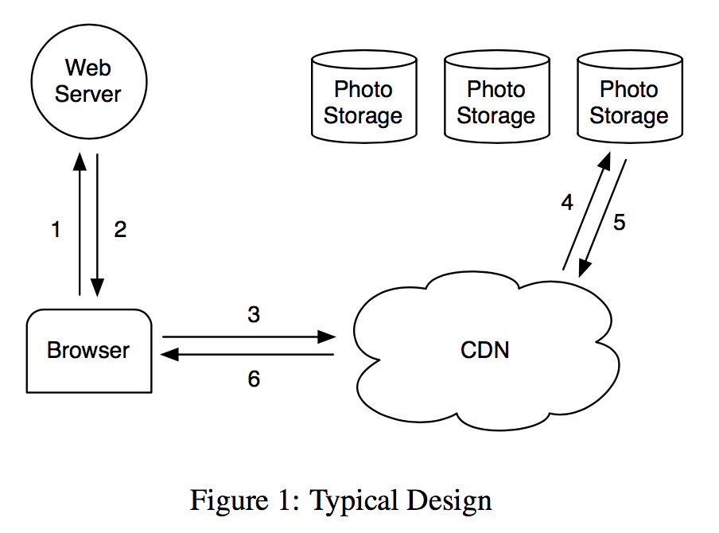

site. Figure 1 depicts the steps from the moment when
a user visits a page containing an image until she down-
loads that image from its location on disk. When visiting
a page the user’s browser first sends an HTTP request
to a web server which is responsible for generating the
markup for the browser to render. For each image the
web server constructs a URL directing the browser to a
location from which to download the data. For popular
sites this URL often points to a CDN. If the CDN has
the image cached then the CDN responds immediately
with the data. Otherwise, the CDN examines the URL,
which has enough information embedded to retrieve the
photo from the site’s storage systems. The CDN then
updates its cached data and sends the image to the user’s
browser.

### 2.2 NFS-based Design

In our first design we implemented the photo storage
system using an NFS-based approach. While the rest
of this subsection provides more detail on that design,
the major lesson we learned is that CDNs by themselves
do not offer a practical solution to serving photos on a
social networking site. CDNs do effectively serve the
hottest photos— profile pictures and photos that have
been recently uploaded—but a social networking site
like Facebook also generates a large number of requests
for less popular (often older) content, which we refer to
as thelong tail. Requests from the long tail account for a
significant amount of our traffic, almost all of which ac-
cesses the backing photo storage hosts as these requests
typically miss in the CDN. While it would be very con-
venient to cache all of the photos for this long tail, doing
so would not be cost effective because of the very large
cache sizes required.

Our NFS-based design stores each photo in its own
file on a set of commercial NAS appliances. A set of
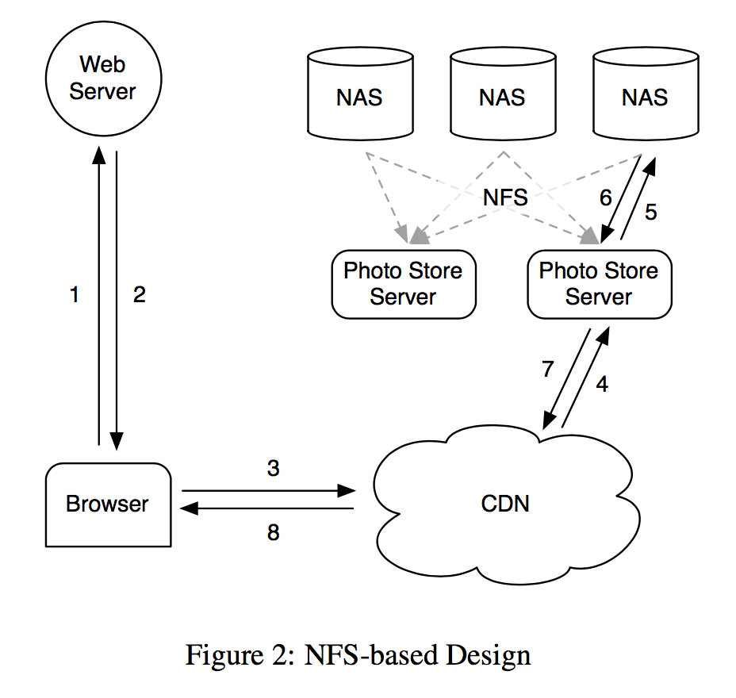
machines, Photo Store servers, then mount all the vol-
umes exported by these NAS appliances over NFS. Fig-
ure 2 illustrates this architecture and shows Photo Store
servers processing HTTP requests for images. From an
image’s URL a Photo Store server extracts the volume
and full path to the file, reads the data over NFS, and
returns the result to the CDN.

We initially stored thousands of files in each directory
of an NFS volume which led to an excessive number of
disk operations to read even a single image. Because
of how the NAS appliances manage directory metadata,
placing thousands of files in a directory was extremely
inefficient as the directory’s blockmap was too large to
be cached effectively by the appliance. Consequently
it was common to incur more than 10 disk operations to
retrieve a single image. After reducing directory sizes to
hundreds of images per directory, the resulting system
would still generally incur 3 disk operations to fetch an
image: one to read the directory metadata into memory,
a second to load the inode into memory, and a third to
read the file contents.

To further reduce disk operations we let the Photo
Store servers explicitly cache file handles returned by
the NAS appliances. When reading a file for the first
time a Photo Store server opens a file normally but also
caches the filename to file handle mapping in mem-
cache [18]. When requesting a file whose file handle
is cached, a Photo Store server opens the file directly
using a custom system call,openbyfilehandle, that
we added to the kernel. Regrettably, this file handle
cache provides only a minor improvement as less pop-
ular photos are less likely to be cached to begin with.
One could argue that an approach in which all file han-
dles are stored in memcache might be a workable solu-
tion. However, that only addresses part of the problem
as it relies on the NAS appliance having all of its in-
odes in main memory, an expensive requirement for tra-
ditional filesystems. The major lesson we learned from
the NAS approach is that focusing only on caching—
whether the NAS appliance’s cache or an external cache
like memcache—has limited impact for reducing disk
operations. The storage system ends up processing the
long tail of requests for less popular photos, which are
not available in the CDN and are thus likely to miss in
our caches.

### 2.3 Discussion

It would be difficult for us to offer precise guidelines
for when or when not to build a custom storage system.
However, we believe it still helpful for the community
to gain insight into why we decided to build Haystack.

Faced with the bottlenecks in our NFS-based design,
we explored whether it would be useful to build a sys-
tem similar to GFS [9]. Since we store most of our user
data in MySQL databases, the main use cases for files
in our system were the directories engineers use for de-
velopment work, log data, and photos. NAS appliances
offer a very good price/performance point for develop-
ment work and for log data. Furthermore, we leverage
Hadoop [11] for the extremely large log data. Serving
photo requests in the long tail represents a problem for
which neither MySQL, NAS appliances, nor Hadoop are
well-suited.

One could phrase the dilemma we faced as exist-
ing storage systems lacked the right RAM-to-disk ra-
tio. However, there is norightratio. The system just
needsenoughmain memory so that all of the filesystem
metadata can be cached at once. In our NAS-based ap-
proach, one photo corresponds to one file and each file
requires at least one inode, which is hundreds of bytes
large. Having enough main memory in this approach is
not cost-effective. To achieve a better price/performance
point, we decided to build a custom storage system that
reduces the amount of filesystem metadata per photo so
that having enough main memory is dramatically more
cost-effective than buying more NAS appliances.

## 3 Design & Implementation


Facebook uses a CDN to serve popular images and
leverages Haystack to respond to photo requests in the
long tail efficiently. When a web site has an I/O bot-
tleneck serving static content the traditional solution is
to use a CDN. The CDN shoulders enough of the bur-
den so that the storage system can process the remaining
tail. At Facebook a CDN would have to cache an unreasonably large amount of the static content in order for
traditional (and inexpensive) storage approaches not to
be I/O bound.

Understanding that in the near future CDNs would not
fully solve our problems, we designed Haystack to ad-
dress the critical bottleneck in our NFS-based approach:
disk operations. We accept that requests for less popu-
lar photos may require disk operations, but aim to limit
the number of such operations to only the ones neces-
sary for reading actual photo data. Haystack achieves
this goal by dramatically reducing the memory used for
filesystem metadata, thereby making it practical to keep
all this metadata in main memory.

Recall that storing a single photo per file resulted
in more filesystem metadata than could be reasonably
cached. Haystack takes a straight-forward approach:
it stores multiple photos in a single file and therefore
maintains very large files. We show that this straight-
forward approach is remarkably effective. Moreover, we
argue that its simplicity is its strength, facilitating rapid
implementation and deployment. We now discuss how
this core technique and the architectural components
surrounding it provide a reliable and available storage
system. In the following description of Haystack, we
distinguish between two kinds of metadata. Applica-
tion metadatadescribes the information needed to con-
struct a URL that a browser can use to retrieve a photo.
Filesystem metadataidentifies the data necessary for a
host to retrieve the photos that reside on that host’s disk.

### 3.1 Overview

The Haystack architecture consists of 3 core compo-
nents: the Haystack Store, Haystack Directory, and
Haystack Cache. For brevity we refer to these com-
ponents with ‘Haystack’ elided. The Store encapsu-
lates the persistent storage system for photos and is the
only component that manages the filesystem metadata
for photos. We organize the Store’s capacity byphys-
ical volumes. For example, we can organize a server’s
10 terabytes of capacity into 100 physical volumes each
of which provides 100 gigabytes of storage. We further
group physical volumes on different machines intologi-
cal volumes. When Haystack stores a photo on a logical
volume, the photo is written to all corresponding physi-
cal volumes. This redundancy allows us to mitigate data
loss due to hard drive failures, disk controller bugs, etc.
The Directory maintains the logical to physical mapping
along with other application metadata, such as the log-
ical volume where each photo resides and the logical
volumes with free space. The Cache functions as our in-
ternal CDN, which shelters the Store from requests for
the most popular photos and provides insulation if up-
stream CDN nodes fail and need to refetch content.
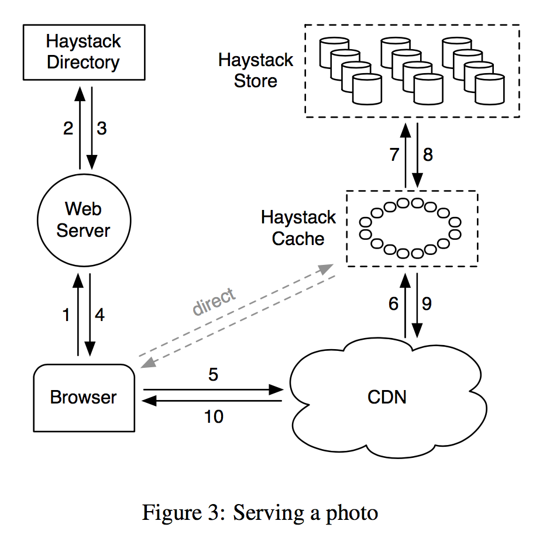

Figure 3 illustrates how the Store, Directory, and
Cache components fit into the canonical interactions be-
tween a user’s browser, web server, CDN, and storage
system. In the Haystack architecture the browser can be
directed to either the CDN or the Cache. Note that while
the Cache is essentially a CDN, to avoid confusion we
use ‘CDN’ to refer to external systems and ‘Cache’ to
refer to our internal one that caches photos. Having an
internal caching infrastructure gives us the ability to re-
duce our dependence on external CDNs.
When a user visits a page the web server uses the Di-
rectory to construct a URL for each photo. The URL
contains several pieces of information, each piece cor-
responding to the sequence of steps from when a user’s
browser contacts the CDN (or Cache) to ultimately re-
trieving a photo from a machine in the Store. A typical
URL that directs the browser to the CDN looks like the
following:

```
http://〈CDN〉/〈Cache〉/〈Machine id〉/〈Logical volume, Photo〉
```

The first part of the URL specifies from which CDN
to request the photo. The CDN can lookup the photo
internally using only the last part of the URL: the logical
volume and the photo id. If the CDN cannot locate the
photo then it strips the CDN address from the URL and
contacts the Cache. The Cache does a similar lookup to
find the photo and, on a miss, strips the Cache address
from the URL and requests the photo from the specified
Store machine. Photo requests that go directly to the
Cache have a similar workflow except that the URL is
missing the CDN specific information.
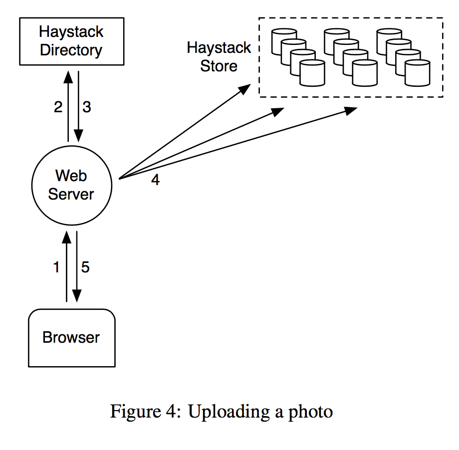

Figure 4 illustrates the upload path in Haystack.
When a user uploads a photo she first sends the data to a
web server. Next, that server requests a write-enabled
logical volume from the Directory. Finally, the web
server assigns a unique id to the photo and uploads it
to each of the physical volumes mapped to the assigned
logical volume.

### 3.2 Haystack Directory

The Directory serves four main functions. First, it pro-
vides a mapping from logical volumes to physical vol-
umes. Web servers use this mapping when uploading
photos and also when constructing the image URLs for
a page request. Second, the Directory load balances
writes across logical volumes and reads across physi-
cal volumes. Third, the Directory determines whether
a photo request should be handled by the CDN or by
the Cache. This functionality lets us adjust our depen-
dence on CDNs. Fourth, the Directory identifies those
logical volumes that are read-only either because of op-
erational reasons or because those volumes have reached
their storage capacity. We mark volumes as read-only at
the granularity of machines for operational ease.

When we increase the capacity of the Store by adding
new machines, those machines are write-enabled; only
write-enabled machines receive uploads. Over time the
available capacity on these machines decreases. When a
machine exhausts its capacity, we mark it as read-only.
In the next subsection we discuss how this distinction
has subtle consequences for the Cache and Store.

The Directory is a relatively straight-forward compo-
nent that stores its information in a replicated database
accessed via a PHP interface that leverages memcache
to reduce latency. In the event that we lose the data on
a Store machine we remove the corresponding entry in
the mapping and replace it when a new Store machine is
brought online.

### 3.3 Haystack Cache


The Cache receives HTTP requests for photos from
CDNs and also directly from users’ browsers. We or-
ganize the Cache as a distributed hash table and use a
photo’s id as the key to locate cached data. If the Cache
cannot immediately respond to the request, then the
Cache fetches the photo from the Store machine iden-
tified in the URL and replies to either the CDN or the
user’s browser as appropriate.

We now highlight an important behavioral aspect of
the Cache. It caches a photo only if two conditions
are met:(a)the request comes directly from a user and
not the CDN and(b)the photo is fetched from a write-
enabled Store machine. The justification for the first
condition is that our experience with the NFS-based de-
sign showed post-CDN caching is ineffective as it is un-
likely that a request that misses in the CDN would hit in
our internal cache. The reasoning for the second is in-
direct. We use the Cache to shelter write-enabled Store
machines from reads because of two interesting proper-
ties: photos are most heavily accessed soon after they
are uploaded and filesystems for our workload gener-
ally perform better when doing either reads or writes
but not both (Section 4.1). Thus the write-enabled Store
machines would see the most reads if it were not for
the Cache. Given this characteristic, an optimization we
plan to implement is to proactively push recently up-
loaded photos into the Cache as we expect those photos
to be read soon and often.

### 3.4 Haystack Store


The interface to Store machines is intentionally basic.
Reads make very specific and well-contained requests
asking for a photo with a given id, for a certain logical
volume, and from a particular physical Store machine.
The machine returns the photo if it is found. Otherwise,
the machine returns an error.

Each Store machine manages multiple physical vol-
umes. Each volume holds millions of photos. For
concreteness, the reader can think of a physical vol-
ume as simply a very large file (100 GB) saved as
‘/hay/haystack<logical volume id>’. A Store machine
can access a photo quickly using only the id of the cor-
responding logical volume and the file offset at which
the photo resides. This knowledge is the keystone of
the Haystack design: retrieving the filename, offset, and
size for a particular photo without needing disk opera-
tions. A Store machine keeps open file descriptors for
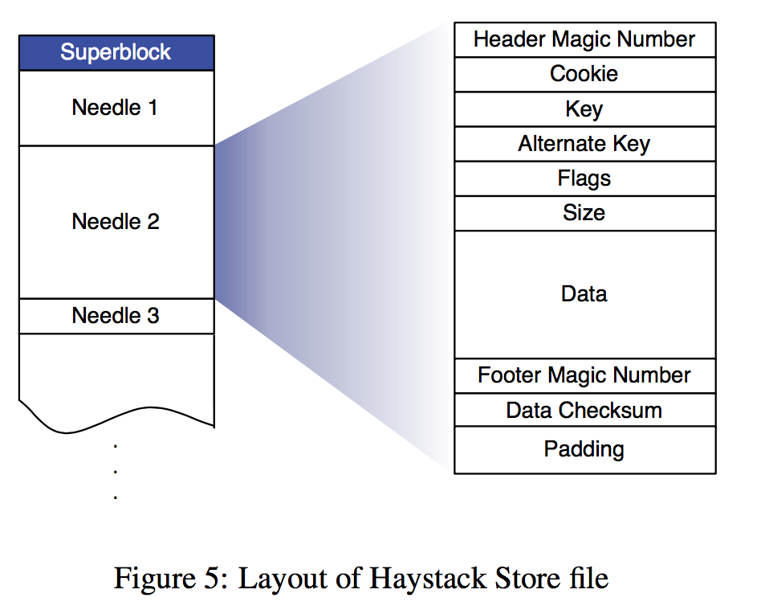
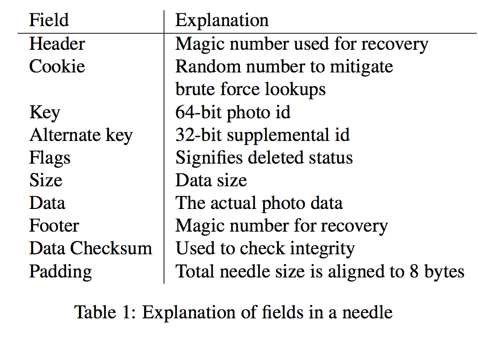
each physical volume that it manages and also an in-
memory mapping of photo ids to the filesystem meta-
data (i.e., file, offset and size in bytes) critical for re-
trieving that photo.

We now describe the layout of each physical volume
and how to derive the in-memory mapping from that
volume. A Store machine represents a physical volume
as a large file consisting of a superblock followed by
a sequence ofneedles. Each needle represents a photo
stored in Haystack. Figure 5 illustrates a volume file and
the format of each needle. Table 1 describes the fields
in each needle.

To retrieve needles quickly, each Store machine main-
tains an in-memory data structure for each of its vol-
umes. That data structure maps pairs of (key, alter-
nate key)^2 to the corresponding needle’s flags, size in
bytes, and volume offset. After a crash, a Store machine
can reconstruct this mapping directly from the volume
file before processing requests. We now describe how
a Store machine maintains its volumes and in-memory
mapping while responding to read, write, and delete re-
quests (the only operations supported by the Store).

####3.4.1 Photo Read
When a Cache machine requests a photo it supplies the
logical volume id, key, alternate key, and cookie to the
Store machine. The cookie is a number embedded in
the URL for a photo. The cookie’s value is randomly
assigned by and stored in the Directory at the time that
the photo is uploaded. The cookie effectively eliminates
attacks aimed at guessing valid URLs for photos.

When a Store machine receives a photo request from a
Cache machine, the Store machine looks up the relevant
metadata in its in-memory mappings. If the photo has
not been deleted the Store machine seeks to the appro-
priate offset in the volume file, reads the entire needle
from disk (whose size it can calculate ahead of time),
and verifies the cookie and the integrity of the data. If
these checks pass then the Store machine returns the
photo to the Cache machine.

####3.4.2 Photo Write

When uploading a photo into Haystack web servers pro-
vide the logical volume id, key, alternate key, cookie,
and data to Store machines. Each machine syn-
chronously appends needle images to its physical vol-
ume files and updates in-memory mappings as needed.
While simple, this append-only restriction complicates
some operations that modify photos, such as rotations.
As Haystack disallows overwriting needles, photos can
only be modified by adding an updated needle with the
same key and alternate key. If the new needle is written
to a different logical volume than the original, the Direc-
tory updates its application metadata and future requests
will never fetch the older version. If the new needle is
written to the same logical volume, then Store machines
append the new needle to the same corresponding physi-
cal volumes. Haystack distinguishes such duplicate nee-
dles based on their offsets. That is, the latest version of a
needle within a physical volume is the one at the highest
offset.

####3.4.3 Photo Delete

Deleting a photo is straight-forward. A Store machine
sets the delete flag in both the in-memory mapping
and synchronously in the volume file. Requests to get
deleted photos first check the in-memory flag and return
errors if that flag is enabled. Note that the space occu-
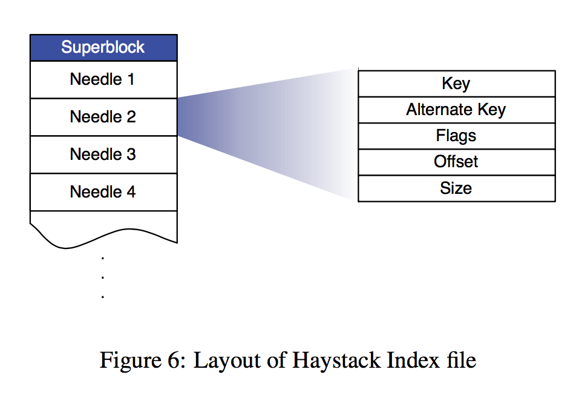
pied by deleted needles is for the moment lost. Later,
we discuss how to reclaim deleted needle space by com-
pacting volume files.

#### 3.4.4 The Index File

Store machines use an important optimization—thein-
dex file—when rebooting. While in theory a machine
can reconstruct its in-memory mappings by reading all
of its physical volumes, doing so is time-consuming as
the amount of data (terabytes worth) has to all be read
from disk. Index files allow a Store machine to build its
in-memory mappings quickly, shortening restart time.

Store machines maintain an index file for each of
their volumes. The index file is a checkpoint of the in-
memory data structures used to locate needles efficiently
on disk. An index file’s layout is similar to a volume
file’s, containing a superblock followed by a sequence
of index records corresponding to each needle in the su-
perblock. These records must appear in the same order
as the corresponding needles appear in the volume file.
Figure 6 illustrates the layout of the index file and Ta-
ble 2 explains the different fields in each record.

Restarting using the index is slightly more compli-
cated than just reading the indices and initializing the
in-memory mappings. The complications arise because
index files are updated asynchronously, meaning that
index files may represent stale checkpoints. When we
write a new photo the Store machine synchronously ap-
pends a needle to the end of the volume file and asyn-
chronously appends a record to the index file. When
we delete a photo, the Store machine synchronously sets
the flag in that photo’s needle without updating the in-
dex file. These design decisions allow write and delete
operations to return faster because they avoid additional
synchronous disk writes. They also cause two side ef-
fects we must address: needles can exist without corre-
sponding index records and index records do not reflect
deleted photos.


We refer to needles without corresponding index
records asorphans. During restarts, a Store machine
sequentially examines each orphan, creates a match-
ing index record, and appends that record to the index
file. Note that we can quickly identify orphans because
the last record in the index file corresponds to the last
non-orphan needle in the volume file. To complete the
restart, the Store machine now initializes its in-memory
mappings using only the index files.

Since index records do not reflect deleted photos, a
Store machine may retrieve a photo that has in fact been
deleted. To address this issue, after a Store machine
reads the entire needle for a photo, that machine can
then inspect the deleted flag. If a needle is marked as
deleted the Store machine updates its in-memory map-
ping accordingly and notifies the Cache that the object
was not found.

#### 3.4.5 Filesystem


We describe Haystack as an object store that utilizes
a generic Unix-like filesystem, but some filesystems
are better suited for Haystack than others. In partic-
ular, the Store machines should use a filesystem that
does not need much memory to be able to perform ran-
dom seeks within a large file quickly. Currently, each
Store machine uses XFS [24], an extent based file sys-
tem. XFS has two main advantages for Haystack. First,
the blockmaps for several contiguous large files can
be small enough to be stored in main memory. Sec-
ond, XFS provides efficient file preallocation, mitigat-
ing fragmentation and reining in how large block maps
can grow.

Using XFS, Haystack can eliminate disk operations
for retrieving filesystem metadata when reading a photo.
This benefit, however, does not imply that Haystack can
guaranteeevery photo read will incur exactly one disk
operation. There exists corner cases where the filesys-
tem requires more than one disk operation when photo
data crosses extents or RAID boundaries. Haystack pre-
allocates 1 gigabyte extents and uses 256 kilobyte RAID
stripe sizes so that in practice we encounter these cases
rarely.

### 3.5 Recovery from failures

Like many other large-scale systems running on com-
modity hardware [5, 4, 9], Haystack needs to tolerate
a variety of failures: faulty hard drives, misbehaving
RAID controllers, bad motherboards, etc. We use two
straight-forward techniques to tolerate failures—one for
detection and another for repair.

To proactively find Store machines that are having
problems, we maintain a background task, dubbedpitch-
fork, that periodically checks the health of each Store
machine. Pitchfork remotely tests the connection to
each Store machine, checks the availability of each vol-
ume file, and attempts to read data from the Store ma-
chine. If pitchfork determines that a Store machine con-
sistently fails these health checks then pitchfork auto-
matically marks all logical volumes that reside on that
Store machine as read-only. We manually address the
underlying cause for the failed checks offline.

Once diagnosed, we may be able to fix the prob-
lem quickly. Occasionally, the situation requires a more
heavy-handedbulk syncoperation in which we reset the
data of a Store machine using the volume files supplied
by a replica. Bulk syncs happen rarely (a few each
month) and are simple albeit slow to carry out. The main
bottleneck is that the amount of data to be bulk synced is
often orders of magnitude greater than the speed of the
NIC on each Store machine, resulting in hours for mean
time to recovery. We are actively exploring techniques
to address this constraint.

### 3.6 Optimizations

We now discuss several optimizations important to
Haystack’s success.

####3.6.1 Compaction

Compaction is an online operation that reclaims the
space used by deleted and duplicate needles (needles
with the same key and alternate key). A Store machine
compacts a volume file by copying needles into a new
file while skipping any duplicate or deleted entries. Dur-
ing compaction, deletes go to both files. Once this pro-
cedure reaches the end of the file, it blocks any further
modifications to the volume and atomically swaps the
files and in-memory structures.

We use compaction to free up space from deleted pho-
tos. The pattern for deletes is similar to photo views:
young photos are a lot more likely to be deleted. Over
the course of a year, about 25% of the photos get deleted.

####3.6.2 Saving more memory

As described, a Store machine maintains an in-memory
data structure that includes flags, but our current system
only uses the flags field to mark a needle as deleted. We
eliminate the need for an in-memory representation of
flags by setting the offset to be 0 for deleted photos. In
addition, Store machines do not keep track of cookie
values in main memory and instead check the supplied
cookie after reading a needle from disk. Store machines
reduce their main memory footprints by 20% through
these two techniques.

Currently, Haystack uses on average 10 bytes of main
memory per photo. Recall that we scale each uploaded
image to four photos all with the same key (64 bits), dif-
ferent alternate keys (32 bits), and consequently differ-
ent data sizes (16 bits). In addition to these 32 bytes,
Haystack consumes approximately 2 bytes per image
in overheads due to hash tables, bringing the total for
four scaled photos of the same image to 40 bytes. For
comparison, consider that anxfsinodetstructure in
Linux is 536 bytes.
#### 3.6.3 Batch upload
Since disks are generally better at performing large se-
quential writes instead of small random writes, we batch
uploads together when possible. Fortunately, many
users upload entire albums to Facebook instead of single
pictures, providing an obvious opportunity to batch the
photos in an album together. We quantify the improve-
ment of aggregating writes together in Section 4.

## 4 Evaluation

We divide our evaluation into four parts. In the first we
characterize the photo requests seen by Facebook. In
the second and third we show the effectiveness of the
Directory and Cache, respectively. In the last we ana-
lyze how well the Store performs using both synthetic
and production workloads.

### 4.1 Characterizing photo requests

Photos are one of the primary kinds of content that users
share on Facebook. Users upload millions of photos ev-
ery day and recently uploaded photos tend to be much
more popular than older ones. Figure 7 illustrates how
popular each photo is as a function of the photo’s age.
To understand the shape of the graph, it is useful to dis-
cuss what drives Facebook’s photo requests.

#### 4.1.1 Features that drive photo requests

Two features are responsible for 98% of Facebook’s
photo requests: News Feed and albums. The News Feed
feature shows users recent content that their friends have
shared. The album feature lets a user browse her friends’
pictures. She can view recently uploaded photos and
also browse all of the individual albums.

Figure 7 shows a sharp rise in requests for photos that
are a few days old. News Feed drives much of the traffic
for recent photos and falls sharply away around 2 days
when many stories stop being shown in the default Feed
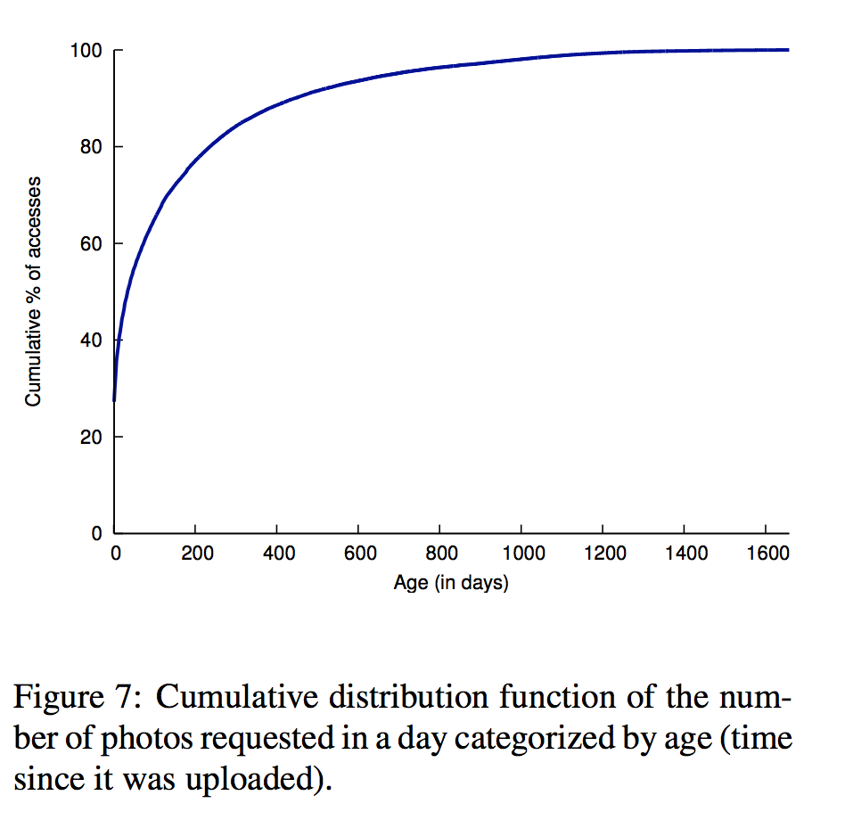
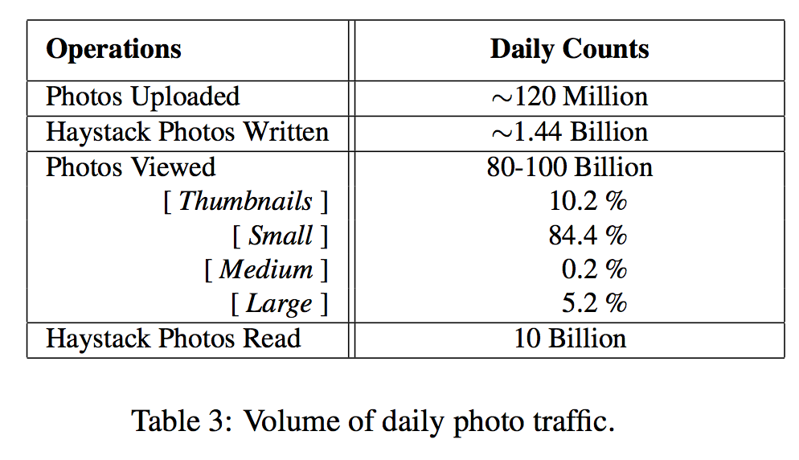

view. There are two key points to highlght from the fig-
ure. First, the rapid decline in popularity suggests that
caching at both CDNs and in the Cache can be very ef-
fective for hosting popular content. Second, the graph
has a long tail implying that a significant number of re-
quests cannot be dealt with using cached data.

####4.1.2 Traffic Volume

Table 3 shows the volume of photo traffic on Facebook.
The number of Haystack photos written is 12 times the
number of photos uploaded since our application scales
each image to 4 sizes and saves each size in 3 different
locations. The table shows that Haystack responds to
approximately 10% of all photo requests from CDNs.
Observe that smaller images account for most of the
photos viewed. This trait underscores our desire to min-
imize metadata overhead as inefficiencies can quickly
add up. Additionally, reading smaller images is typi-
cally a more latency sensitive operation for Facebook as
they are displayed in the News Feed whereas larger im-
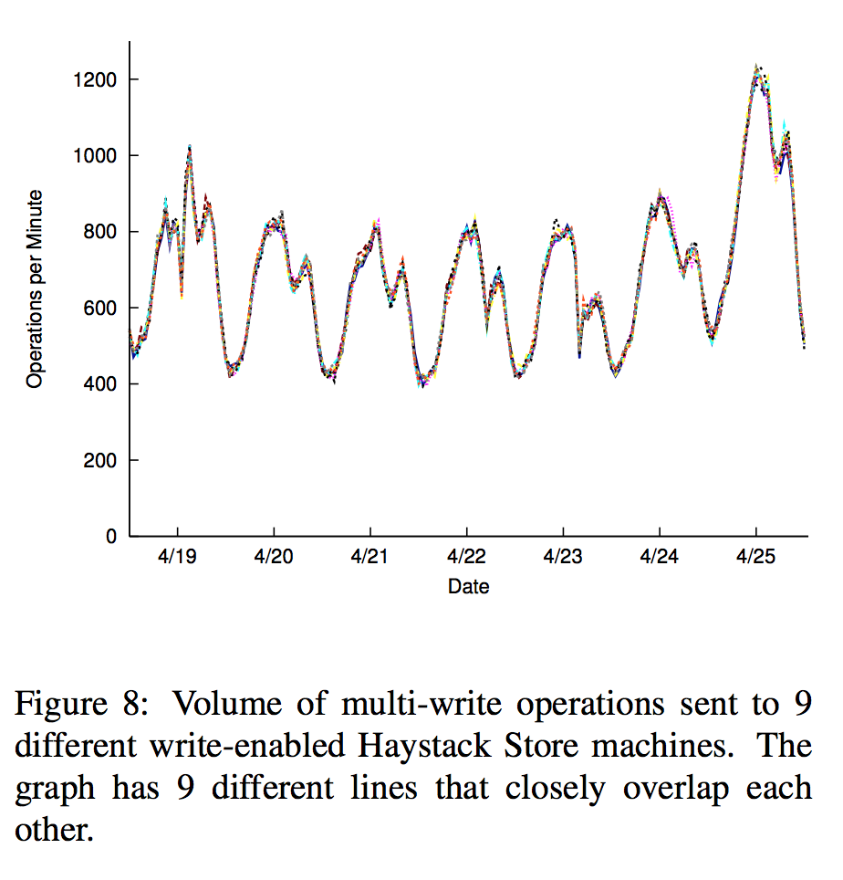
ages are shown in albums and can be prefetched to hide
latency.

### 4.2 Haystack Directory


The Haystack Directory balances reads and writes
across Haystack Store machines. Figure 8 depicts that as
expected, the Directory’s straight-forward hashing pol-
icy to distribute reads and writes is very effective. The
graph shows the number of multi-write operations seen
by 9 different Store machines which were deployed into
production at the same time. Each of these boxes store a
different set of photos. Since the lines are nearly indis-
tinguishable, we conclude that the Directory balances
writes well. Comparing read traffic across Store ma-
chines shows similarly well-balanced behavior.

### 4.3 Haystack Cache

Figure 9 shows the hit rate for the Haystack Cache. Re-
call that the Cache only stores a photo if it is saved on
a write-enabled Store machine. These photos are rel-
atively recent, which explains the high hit rates of ap-
proximately 80%. Since the write-enabled Store ma-
chines would also see the greatest number of reads, the
Cache is effective in dramatically reducing the read re-
quest rate for the machines that would be most affected.

### 4.4 Haystack Store


Recall that Haystack targets the long tail of photo re-
quests and aims to maintain high-throughput and low-
latency despite seemingly random reads. We present
performance results of Store machines on both synthetic
and production workloads.
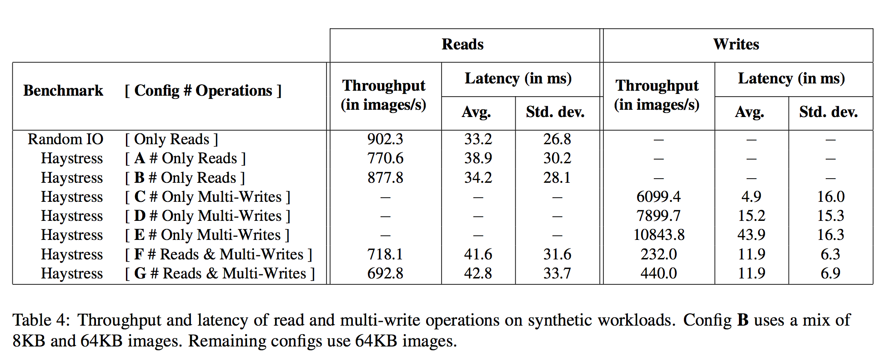
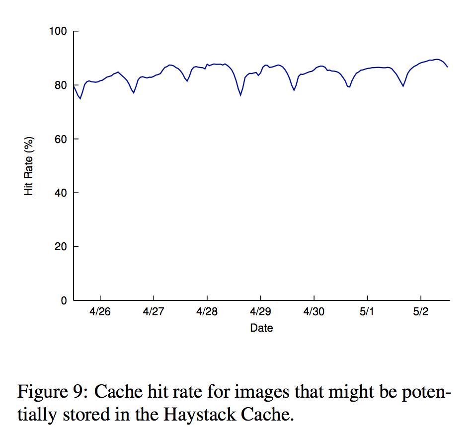

####4.4.1 Experimental setup

We deploy Store machines on commodity storage
blades. The typical hardware configuration of a 2U stor-
age blade has 2 hyper-threaded quad-core Intel Xeon
CPUs, 48 GB memory, a hardware raid controller with
256–512MB NVRAM, and 12 x 1TB SATA drives.

Each storage blade provides approximately 9TB of
capacity, configured as a RAID-6 partition managed by
the hardware RAID controller. RAID-6 provides ade-
quate redundancy and excellent read performance while
keeping storage costs down. The controller’s NVRAM
write-back cache mitigates RAID-6’s reduced write per-
formance. Since our experience suggests that caching
photos on Store machines is ineffective, we reserve the
NVRAM fully for writes. We also disable disk caches
in order to guarantee data consistency in the event of a
crash or power loss.

####4.4.2 Benchmark performance

We assess the performance of a Store machine using two
benchmarks: Randomio [22] and Haystress. Randomio
is an open-source multithreaded disk I/O program that
we use to measure the raw capabilities of storage de-
vices. It issues random 64KB reads that use direct I/O to
make sector aligned requests and reports the maximum
sustainable throughput. We use Randomio to establish a
baseline for read throughput against which we can com-
pare results from our other benchmark.

Haystress is a custom built multi-threaded program
that we use to evaluate Store machines for a variety of
synthetic workloads. It communicates with a Store ma-
chine via HTTP (as the Cache would) and assesses the
maximum read and write throughput a Store machine
can maintain. Haystress issues random reads over a
large set of dummy images to reduce the effect of the
machine’s buffer cache; that is, nearly all reads require
a disk operation. In this paper, we use seven different
Haystress workloads to evaluate Store machines.

Table 4 characterizes the read and write throughputs
and associated latencies that a Store machine can sus-
tain under our benchmarks. WorkloadAperforms ran-
dom reads to 64KB images on a Store machine with 201
volumes. The results show that Haystack delivers 85%
of the raw throughput of the device while incurring only
17% higher latency.

We attribute a Store machine’s overhead to four fac-
tors: (a) it runs on top of the filesystem instead of access-
ing disk directly; (b) disk reads are larger than 64KB as
entire needles need to be read; (c) stored images may
not be aligned to the underlying RAID-6 device stripe
size so a small percentage of images are read from more
than one disk; and (d) CPU overhead of Haystack server
(index access, checksum calculations, etc.)

In workload **B**, we again examine a read-only work-
load but alter 70% of the reads so that they request
smaller size images (8KB instead of 64KB). In practice,
we find that most requests are not for the largest size
images (as would be shown in albums) but rather for the
thumbnails and profile pictures.

Workloads **C,D**, and **E** show a Store machine’s write
throughput. Recall that Haystack can batch writes to-
gether. Workloads **C,D**, and **E** group 1, 4, and 16 writes
into a single multi-write, respectively. The table shows
that amortizing the fixed cost of writes over 4 and 16
images improves throughput by 30% and 78% respec-
tively. As expected, this reduces per image latency, as
well.

Finally, we look at the performance in the presence
of both read and write operations. Workload **F** uses a
mix of 98% reads and 2% multi-writes while **G** uses
a mix of 96% reads and 4% multi-writes where each
multi-write writes 16 images. These ratios reflect what
is often observed in production. The table shows that the
Store delivers high read throughput even in the presence
of writes.

####4.4.3 Production workload

The section examines the performance of the Store on
production machines. As noted in Section 3, there
are two classes of Stores–write-enabled and read-only.
Write-enabled hosts service read and write requests,
read-only hosts only service read requests. Since these
two classes have fairly different traffic characteristics,
we analyze a group of machines in each class. All ma-
chines have the same hardware configuration.

Viewed at a per-second granularity, there can be large
spikes in the volume of photo read and write operations
that a Store box sees. To ensure reasonable latency even
in the presence of these spikes, we conservatively allo-
cate a large number of write-enabled machines so that
their average utilization is low.

Figure 10 shows the frequency of the different types
of operations on a read-only and a write-enabled Store
machine. Note that we see peak photo uploads on Sun-
day and Monday, with a smooth drop the rest of the
week until we level out on Thursday to Saturday. Then
a new Sunday arrives and we hit a new weekly peak. In
general our footprint grows by 0.2% to 0.5% per day.
As noted in Section 3, write operations to the Store
are always multi-writes on production machines to
amortize the fixed cost of write operations. Finding
groups of images is fairly straightforward since 4 dif-
ferent sizes of each photo is stored in Haystack. It is
also common for users to upload a batch of photos into
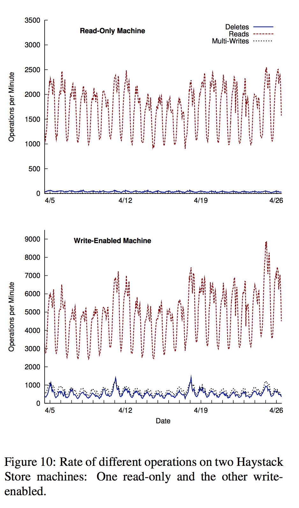

a photo album. As a combination of these two factors,
the average number of images written per multi-write
for this write-enabled machine is 9.27.

Section 4.1.2 explained that both read and delete rates
are high for recently uploaded photos and drop over
time. This behavior can be also be observed in Fig-
ure 10; the write-enabled boxes see many more requests
(even though some of the read traffic is served by the
Cache).

Another trend worth noting: as more data gets written
to write-enabled boxes the volume of photos increases,
resulting in an increase in the read request rate.
Figure 11 shows the latency of read and multi-write
operations on the same two machines as Figure 10 over
the same period.

The latency of multi-write operations is fairly low
(between 1 and 2 milliseconds) and stable even as the
volume of traffic varies dramatically. Haystack 
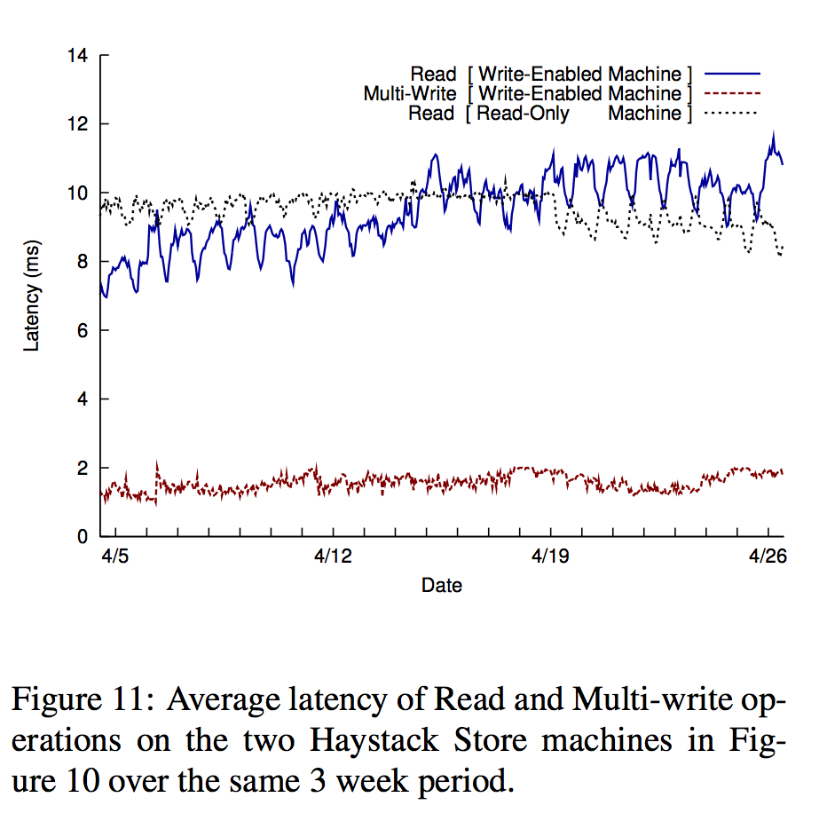

machines have a NVRAM-backed raid controller which
buffers writes for us. As described in Section 3, the
NVRAM allows us to write needles asynchronously and
then issue a single fsync to flush the volume file once the
multi-write is complete. Multi-write latencies are very
flat and stable.

The latency of reads on a read-only box is also fairly
stable even as the volume of traffic varies significantly
(up to 3x over the 3 week period). For a write-enabled
box the read performance is impacted by three primary
factors. First, as the number of photos stored on the ma-
chine increases, the read traffic to that machine also in-
creases (compare week-over-week traffic in figure 10).
Second, photos on write-enabled machines are cached
in the Cache while they are not cached for a read-only
machine^3. This suggests that the buffer cache would be
more effective for a read-only machine. Third, recently
written photos are usually read back immediately be-
cause Facebook highlights recent content. Such reads on
Write-enabled boxes will always hit in the buffer cache
and improve the hit rate of the buffer cache. The shape
of the line in the figure is the result of a combination of
these three factors.

The CPU utilization on the Store machines is low.
CPU idle time varies between 92-96%.

## 5 Related Work

To our knowledge, Haystack targets a new design point
focusing on the long tail of photo requests seen by a
large social networking website.

**Filesystems** Haystack takes after log-structured filesys-
tems [23] which Rosenblum and Ousterhout designed
to optimize write throughput with the idea that most
reads could be served out of cache. While measure-
ments [3] and simulations [6] have shown that log-
structured filesystems have not reached their full poten-
tial in local filesystems, the core ideas are very relevant
to Haystack. Photos are appended to physical volume
files in the Haystack Store and the Haystack Cache shel-
ters write-enabled machines from being overwhelmed
by the request rate for recently uploaded data. The key
differences are(a)that the Haystack Store machines
write their data in such a way that they can efficiently
serve reads once they become read-only and(b)the read
request rate for older data decreases over time.

Several works [8, 19, 28] have proposed how to
manage small files and metadata more efficiently. The
common thread across these contributions is how to
group related files and metadata together intelligently.
Haystack obviates these problems since it maintains
metadata in main memory and users often upload
related photos in bulk.

**Object-based storage** Haystack’s architecture shares
many similarities with object storage systems proposed
by Gibson et al. [10] in Network-Attached Secure Disks
(NASD). The Haystack Directory and Store are perhaps
most similar to the File and Storage Manager concepts,
respectively, in NASD that separate the logical storage
units from the physical ones. In OBFS [25], Wang et
al. build a user-level object-based filesystem that is 251 th
the size of XFS. Although OBFS achieves greater write
throughput than XFS, its read throughput (Haystack’s
main concern) is slightly worse.

**Managing metadata** Weil et al. [26, 27] address
scaling metadata management in Ceph, a petabyte-scale
object store. Ceph further decouples the mapping from
logical units to physical ones by introducing generating
functions instead of explicit mappings. Clients cancal-
culatethe appropriate metadata rather than look it up.
Implementing this technique in Haystack remains future
work. Hendricks et. al [13] observe that traditional
metadata pre-fetching algorithms are less effective for
object stores because related objects, which are identi-
fied by a unique number, lack the semantic groupings
that directories implicitly impose. Their solution is to
embed inter-object relationships into the object id. This
idea is orthogonal to Haystack as Facebook explicitly
stores these semantic relationships as part of the social
graph. In Spyglass [15], Leung et al. propose a design
for quickly and scalably searching through metadata
of large-scale storage systems. Manber and Wu also
propose a way to search through entire filesystems in
GLIMPSE [17]. Patil et al. [20] use a sophisticated
algorithm in GIGA+ to manage the metadata associated
with billions of files per directory. We engineered a
simpler solution than many existing works as Haystack
does not have to provide search features nor traditional
UNIX filesystem semantics.

**Distributed filesystems** Haystack’s notion of a logi-
cal volume is similar to Lee and Thekkath’s [14]vir-
tual disksin Petal. The Boxwood project [16] explores
using high-level data structures as the foundation for
storage. While compelling for more complicated al-
gorithms, abstractions like B-trees may not have high
impact on Haystack’s intentionally lean interface and
semantics. Similarly, Sinfonia’s [1]mini-transactions
and PNUTS’s [5] database functionality provide more
features and stronger guarantees than Haystack needs.
Ghemawat et al. [9] designed the Google File System
for a workload consisting mostly of append operations
and large sequential reads. Bigtable [4] provides a stor-
age system for structured data and offers database-like
features for many of Google’s projects. It is unclear
whether many of these features make sense in a system
optimized for photo storage.

## 6 Conclusion

This paper describes Haystack, an object storage sys-
tem designed for Facebook’s Photos application. We de-
signed Haystack to serve the long tail of requests seen
by sharing photos in a large social network. The key
insight is to avoid disk operations when accessing meta-
data. Haystack provides a fault-tolerant and simple solu-
tion to photo storage at dramatically less cost and higher
throughput than a traditional approach using NAS appli-
ances. Furthermore, Haystack is incrementally scalable,
a necessary quality as our users upload hundreds of mil-
lions of photos each week.

## References

```
[1] M. K. Aguilera, A. Merchant, M. Shah, A. Veitch, and C. Kara-
manolis. Sinfonia: a new paradigm for building scalable dis-
tributed systems. InSOSP ’07: Proceedings of twenty-first ACM
SIGOPS symposium on Operating systems principles, pages
159–174, New York, NY, USA, 2007. ACM.
[2] Akamai. http://www.akamai.com/.
[3] M. G. Baker, J. H. Hartman, M. D. Kupfer, K. W. Shirriff, and
J. K. Ousterhout. Measurements of a distributed file system. In
Proc. 13th SOSP, pages 198–212, 1991.
[4] F. Chang, J. Dean, S. Ghemawat, W. C. Hsieh, D. A. Wallach,
M. Burrows, T. Chandra, A. Fikes, and R. E. Gruber. Bigtable:
A distributed storage system for structured data.ACM Trans.
Comput. Syst., 26(2):1–26, 2008.
[5] B. F. Cooper, R. Ramakrishnan, U. Srivastava, A. Silberstein,
P. Bohannon, H.-A. Jacobsen, N. Puz, D. Weaver, and R. Yer-
neni. Pnuts: Yahoo!’s hosted data serving platform.Proc. VLDB
Endow., 1(2):1277–1288, 2008.
[6] M. Dahlin, R. Wang, T. Anderson, and D. Patterson. Cooper-
ative Caching: Using Remote Client Memory to Improve File
System Performance. InProceedings of the First Symposium on
Operating Systems Design and Implementation, pages 267–280,
Nov 1994.
[7] M. Factor, K. Meth, D. Naor, O. Rodeh, and J. Satran. Object
storage: the future building block for storage systems. InLGDI
’05: Proceedings of the 2005 IEEE International Symposium on
Mass Storage Systems and Technology, pages 119–123, Wash-
ington, DC, USA, 2005. IEEE Computer Society.
[8] G. R. Ganger and M. F. Kaashoek. Embedded inodes and ex-
plicit grouping: exploiting disk bandwidth for small files. In
ATEC ’97: Proceedings of the annual conference on USENIX
Annual Technical Conference, pages 1–1, Berkeley, CA, USA,
1997. USENIX Association.
[9] S. Ghemawat, H. Gobioff, and S.-T. Leung. The google file
system. InProc. 19th SOSP, pages 29–43. ACM Press, 2003.
[10] G. A. Gibson, D. F. Nagle, K. Amiri, J. Butler, F. W. Chang,
H. Gobioff, C. Hardin, E. Riedel, D. Rochberg, and J. Zelenka.
A cost-effective, high-bandwidth storage architecture.SIGOPS
Oper. Syst. Rev., 32(5):92–103, 1998.
[11] The hadoop project. [http://hadoop.apache.org/.](http://hadoop.apache.org/.)
[12] S. He and D. Feng. Design of an object-based storage device
based on i/o processor.SIGOPS Oper. Syst. Rev., 42(6):30–35,
2008.
[13] J. Hendricks, R. R. Sambasivan, S. Sinnamohideen, and G. R.
Ganger. Improving small file performance in object-based
storage. Technical Report 06-104, Parallel Data Laboratory,
Carnegie Mellon University, 2006.
[14] E. K. Lee and C. A. Thekkath. Petal: distributed virtual disks. In
ASPLOS-VII: Proceedings of the seventh international confer-
ence on Architectural support for programming languages and
operating systems, pages 84–92, New York, NY, USA, 1996.
ACM.
[15] A. W. Leung, M. Shao, T. Bisson, S. Pasupathy, and E. L. Miller.
Spyglass: fast, scalable metadata search for large-scale storage
systems. InFAST ’09: Proccedings of the 7th conference on File
and storage technologies, pages 153–166, Berkeley, CA, USA,
2009. USENIX Association.
[16] J. MacCormick, N. Murphy, M. Najork, C. A. Thekkath, and
L. Zhou. Boxwood: abstractions as the foundation for storage
infrastructure. InOSDI’04: Proceedings of the 6th conference
on Symposium on Opearting Systems Design & Implementation,
pages 8–8, Berkeley, CA, USA, 2004. USENIX Association.
[17] U. Manber and S. Wu. Glimpse: a tool to search through entire
file systems. InWTEC’94: Proceedings of the USENIX Winter
1994 Technical Conference on USENIX Winter 1994 Technical
Conference, pages 4–4, Berkeley, CA, USA, 1994. USENIX As-
sociation.
[18] memcache. [http://memcached.org/.](http://memcached.org/.)
[19] S. J. Mullender and A. S. Tanenbaum. Immediate files.Softw.
Pract. Exper., 14(4):365–368, 1984.


[20] S. V. Patil, G. A. Gibson, S. Lang, and M. Polte. Giga+: scalable
directories for shared file systems. InPDSW ’07: Proceedings of
the 2nd international workshop on Petascale data storage, pages
26–29, New York, NY, USA, 2007. ACM.
[21] Posix. [http://standards.ieee.org/regauth/posix/.](http://standards.ieee.org/regauth/posix/.)
[22] Randomio. [http://members.optusnet.com.au/clausen/ideas/randomio/index.html.](http://members.optusnet.com.au/clausen/ideas/randomio/index.html.)

[23] M. Rosenblum and J. K. Ousterhout. The design and implemen-
tation of a log-structured file system.ACM Trans. Comput. Syst.,
10(1):26–52, 1992.
[24] A. Sweeney, D. Doucette, W. Hu, C. Anderson, M. Nishimoto,
and G. Peck. Scalability in the xfs file system. InATEC ’96:
Proceedings of the 1996 annual conference on USENIX Annual
Technical Conference, pages 1–1, Berkeley, CA, USA, 1996.
USENIX Association.

[25] F. Wang, S. A. Brandt, E. L. Miller, and D. D. E. Long. Obfs: A
file system for object-based storage devices. InIn Proceedings
of the 21st IEEE / 12TH NASA Goddard Conference on Mass
Storage Systems and Technologies, pages 283–300, 2004.
[26] S. A. Weil, S. A. Brandt, E. L. Miller, D. D. E. Long, and
C. Maltzahn. Ceph: a scalable, high-performance distributed
file system. InOSDI ’06: Proceedings of the 7th symposium on
Operating systems design and implementation, pages 307–320,
Berkeley, CA, USA, 2006. USENIX Association.
[27] S. A. Weil, K. T. Pollack, S. A. Brandt, and E. L. Miller. Dy-
namic metadata management for petabyte-scale file systems. In
SC ’04: Proceedings of the 2004 ACM/IEEE conference on Su-
percomputing, page 4, Washington, DC, USA, 2004. IEEE Com-
puter Society.

[28] Z. Zhang and K. Ghose. hfs: a hybrid file system prototype for
improving small file and metadata performance.SIGOPS Oper.
Syst. Rev., 41(3):175–187, 2007.


