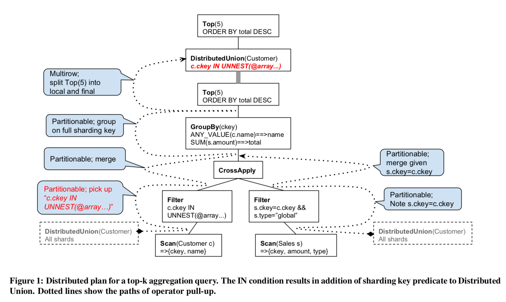
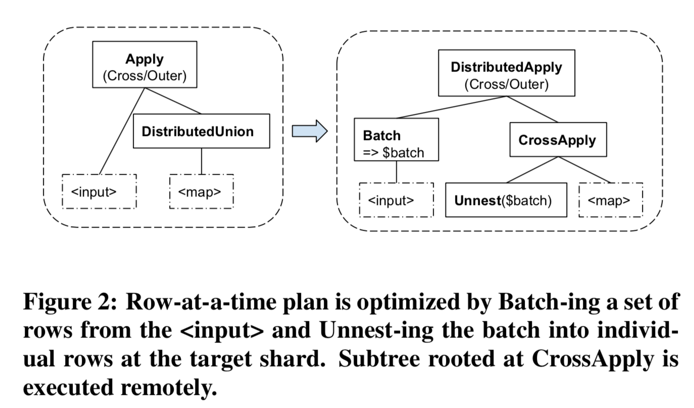
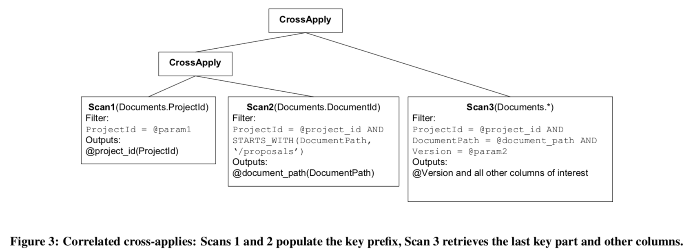
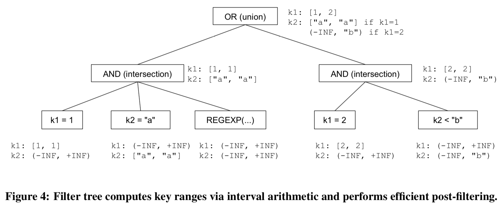

# Spanner: Becoming a SQL System

David F. Bacon Nathan Bales Nico Bruno Brian F. Cooper Adam Dickinson

Andrew Fikes Campbell Fraser Andrey Gubarev Milind Joshi Eugene Kogan

Alexander Lloyd Sergey Melnik Rajesh Rao David Shue Christopher Taylor

Marcel van der Holst Dale Woodford

#### Google, Inc.

## ABSTRACT

Spanner is a globally-distributed data management system that
backs hundreds of mission-critical services at Google. Spanner
is built on ideas from both the systems and database communities. The first Spanner paper published at OSDI’12 focused on the
systems aspects such as scalability, automatic sharding, fault tolerance, consistent replication, external consistency, and wide-area
distribution. This paper highlights the database DNA of Spanner.
We describe distributed query execution in the presence of resharding, query restarts upon transient failures, range extraction that
drives query routing and index seeks, and the improved blockwisecolumnar storage format. We touch upon migrating Spanner to the
common SQL dialect shared with other systems at Google.

## 1. INTRODUCTION

Google’s Spanner [5] started out as a key-value store offering multirow transactions, external consistency, and transparent failover
across datacenters. Over the past 7 years it has evolved into a relational database system. In that time we have added a strongly-typed
schema system and a SQL query processor, among other features.
Initially, some of these database features were “bolted on” – the
first version of our query system used high-level APIs almost like
an external application, and its design did not leverage many of the
unique features of the Spanner storage architecture. However, as
we have developed the system, the desire to make it behave more
like a traditional database has forced the system to evolve. In particular,

- The architecture of the distributed storage stack has driven
    fundamental changes in our query compilation and execu    tion, and
- The demands of the query processor have driven fundamental
    changes in the way we store and manage data.

These changes have allowed us to preserve the massive scalability of Spanner, while offering customers a powerful platform for
database applications. We have previously described the distributed
architecture and data and concurrency model of Spanner [5]. In

Permission to make digital or hard copies of part or all of this work for personal or
classroom use is granted without fee provided that copies are not made or distributed
for profit or commercial advantage and that copies bear this notice and the full citation
on the first page. Copyrights for third-party components of this work must be honored.
For all other uses, contact the owner/author(s).
SIGMOD’17, May 14–19, 2017, Chicago, IL, USA
©c2017 Copyright held by the owner/author(s).
ACM ISBN 978-1-4503-4197-4/17/05.
DOI:http://dx.doi.org/10.1145/3035918.

this paper, we focus on the “database system” aspects of Spanner,
in particular how query execution has evolved and forced the rest
of Spanner to evolve. Most of these changes have occurred since
[5] was written, and in many ways today’s Spanner is very different
from what was described there.
A prime motivation for this evolution towards a more “databaselike” system was driven by the experiences of Google developers
trying to build on previous “key-value” storage systems. The prototypical example of such a key-value system is Bigtable [4], which
continues to see massive usage at Google for a variety of applications. However, developers of many OLTP applications found it
difficult to build these applications without a strong schema system, cross-row transactions, consistent replication and a powerful
query language. The initial response to these difficulties was to
build transaction processing systems on top of Bigtable; an example is Megastore [2]. While these systems provided some of the
benefits of a database system, they lacked many traditional database
features that application developers often rely on. A key example
is a robust query language, meaning that developers had to write
complex code to process and aggregate the data in their applications. As a result, we decided to turn Spanner into a full featured
SQL system, with query execution tightly integrated with the other
architectural features of Spanner (such as strong consistency and
global replication). Spanner’s SQL interface borrows ideas from
the F1 [9] system, which was built to manage Google’s AdWords
data, and included a federated query processor that could access
Spanner and other data sources.
Today, Spanner is widely used as an OLTP database management
system for structured data at Google, and is publicly available in
beta as Cloud Spanner^1 on the Google Cloud Platform (GCP). Currently, over 5,000 databases run in our production instances, and
are used by teams across many parts of Google and its parent company Alphabet. This data is the “source of truth” for a variety of
mission-critical Google databases, incl. AdWords. One of our large
users is the Google Play platform, which executes SQL queries to
manage customer purchases and accounts. Spanner serves tens of
millions of QPS across all of its databases, managing hundreds of
petabytes of data. Replicas of the data are served from datacenters
around the world to provide low latency to scattered clients. Despite this wide replication, the system provides transactional consistency and strongly consistent replicas, as well as high availability. The database features of Spanner, operating at this massive
scale, make it an attractive platform for new development as well
as migration of applications from existing data stores, especially
for “big” customers with lots of data and large workloads. Even
“small” customers benefit from the robust database features, strong

[http://cloud.google.com/spanner](http://cloud.google.com/spanner)


consistency and reliability of the system. “Small” customers often
become “big”.
The Spanner query processor implements a dialect of SQL,
called Standard SQL, that is shared by several query subsystems
within Google (e.g., Dremel/BigQuery OLAP systems^2 ). Standard
SQL is based on standard ANSI SQL, fully using standard features
such as ARRAY and row type (called STRUCT) to support nested
data as a first class citizen (see Section 6 for more details).
Like the lower storage and transactional layers, Spanner’s query
processor is built to serve a mix of transactional and analytical workloads, and to support both low-latency and long-running
queries. Given the distributed nature of data storage in Spanner, the
query processor is itself distributed and uses standard optimization
techniques such as shipping code close to data, parallel processing of parts of a single request on multiple machines, and partition
pruning. While these techniques are not novel, there are certain aspects that are unique to Spanner and are the focus of this paper. In
particular:

- We examine techniques we have developed fordistributed
    query execution, including compilation and execution of
    joins, and consuming query results from parallel workers
    (Section 3).
- We describerange extraction, which is how we decide which
    Spanner servers should process a query, and how to mini    mize the row ranges scanned and locked by each server (Sec    tion 4).
- We discuss how we handle server-side failures withquery
    restarts(Section 5). Unlike most distributed query proces    sors, Spanner fully hides transient failures during query exe    cution. This choice results in simpler applications by allow    ing clients to omit sometimes complex and error-prone retry
    loops. Moreover, transparent restarts enable rolling upgrades
    of the server software without disrupting latency-sensitive
    workloads.
- We discuss our adoption of acommon SQL dialectacross
    multiple query systems at Google including the F1 and Big    Query systems (Section 6). It was designed to address nested
    data modeling and manipulation in a standards-compliant
    fashion. We specifically focus on how we enforce compat    ibility between Spanner and other systems.
- We describe replacing our Bigtable-like SSTable stack with
    a blockwise-columnar store calledRessiwhich is better opti    mized for hybrid OLTP/OLAP query workloads (Section 7).
- We present some of the lessons we learned in production de    ployment of our query system and wrap up with open chal    lenges (Section 8).

## 2. BACKGROUND

We now briefly review the architecture of the Spanner system.
Spanner is a sharded, geo-replicated relational database system. A
database is horizontally row-range sharded. Within a data center,
shards are distributed across multiple servers. Shards are then replicated to multiple, geographically separated datacenters.
A database may contain multiple tables, and the schema may
specifyparent-childrelationships between tables. The child table
is co-located with the parent table. It can be interleaved in the parent, so that all child rows whose primary key is prefixed with key

https://cloud.google.com/bigquery/docs/reference/standard-sql/
parts ‘K’ are stored physically next to the parent row whose key is
‘K’. Shard boundaries are specified as ranges of key prefixes and
preserve row co-location of interleaved child tables.
Spanner’s transactions use a replicated write-ahead redo log, and
the Paxos [6] consensus algorithm is used to get replicas to agree
on the contents of each log entry. In particular, each shard of the
database is assigned to exactly one Paxosgroup(replicated state
machine). A given group may be assigned multiple shards. All
transactions that involve data in a particular group write to a logical
Paxos write-ahead log, which means each log entry is committed
by successfully replicating it to a quorum of replicas. Our implementation uses a form ofMulti-Paxos, in which a single long-lived
leader is elected and can commit multiple log entries in parallel,
to achieve high throughput. Because Paxos can make progress as
long as a majority of replicas are up, we achieve high availability
despite server, network and data center failures [3].
We only replicate log records – each group replica receives log
records via Paxos and applies them independently to its copy of
the group’s data. Non-leader replicas may be temporarily behind
the leader. Replicas apply Paxos log entries in order, so that they
have always applied a consistent prefix of the updates to data in that
group.
Our concurrency control uses a combination of pessimistic locking and timestamps. For blind write and read-modify-write transactions, strict two-phase locking ensures serializability within a given
Paxos group, while two-phase commits (where different Paxos
groups are participants) ensure serializability across the database.
Each committed transaction is assigned a timestamp, and at any
timestamp T there is a single correct database snapshot (reflecting exactly the set of transactions whose commit timestamp≤T).
Reads can be done in lock-freesnapshot transactions, and all data
returned from all reads in the same snapshot transaction comes
from a consistent snapshot of the database at a specified timestamp.Stalereads choose a timestamp in the past to increase the
chance that the nearby replica is caught up enough to serve the read.
Replicas retain several previous data versions to be able to serve
stale reads.Strongreads see the effects of all previously committed
transactions; to ensure this we choose a read timestamp guaranteed
to be greater than the commit timestamp of all possible previous
transactions. Strong reads may have to wait for the nearby replica
to become fully caught up, or may retry at a further away replica
that may be more up-to-date. A replica can serve reads at a timestamp T as long as it has applied all Paxos log records≤T, or has
heard from the leader that there will be no more log records to apply
at timestamps≤T.
Spanner provides a special RPC framework, called thecoprocessor framework, to hide much of the complexity of locating data.
Read and write requests are addressed to a key or key range, not to
a particular server. The coprocessor framework determines which
Paxos group (or groups) owns the data being addressed, and finds
the nearest replica of that group that is sufficiently up-to-date for
the specified concurrency mode. Data shards may move from one
Paxos group to another or be split into smaller shards in new groups
(usually for load balancing reasons). In this case the coprocessor
framework transparently reroutes requests to the new group’s replicas – even if the move happens while the request is in progress.
The coprocessor framework hides a variety of other transient faults
(server failure, network blips, etc) by automatically retrying. This
retrying mechanism turns out to significantly complicate query processing, as we describe in Section 5.
A given replica stores data in an append-only distributed filesystem calledColossus. The storage is based on log-structured merge
trees [8], which support high write throughput and fit well with the


append-only nature of the filesystem. The original file format was
a sorted map called SSTables. As described below, the demands of
the SQL query stack led us to revisit this file format and develop
something that had much higher performance for our workloads.
The Spanner query compiler first transforms an input query into
a relational algebra tree. The optimizing compiler then uses schema
and data properties to rewrite the initial algebraic tree into an efficient execution plan via transformation rules. Some transformations are well-known in the database community, like pushing predicates toward scans, picking indexes, or removing subqueries. Others, specially those regarding distributed plans, are specific to Spanner. Given the nature of query workloads, execution plans (and execution subplans) are cached at different places within Spanner, to
avoid recompilation of common query templates.
Internally, the query compiler extensively uses correlated join
operators, both for algebraic transformations and as physical operators. The logical operators come in two flavors, CrossApply and
OuterApply. These operators are commonly used in lambda calculus and sometimes exposed directly in SQL dialects. Logically,
CrossApply(input, map) evaluates ‘map’ for every tuple from ‘input’ and concatenates the results of ‘map’ evaluations. OuterApply(input, map) emits a row of output even if ‘map’ produced an
empty relation for a particular row from ‘input’. Query compilation results in execution plans with distribution operators that are
responsible for shipping subplans to remote servers and gathering
results to handle partitioned executions. Algebraically, the distribution operators presented below can be thought of as variants of
correlated joins (see Section 3).
Both the compiler and runtime attempt to aggressively perform
partition pruning to minimize the amount of work done by queries
by restricting the data they operate on without changing results.
In that way, the execution of a query starts in a given node, and
is progressively distributed to other nodes by shipping subqueries
and gathering results. The underlying cross-machine calls take into
account data replication and every call may go to any of the replicas. This remote call mechanism has many kinds of latency minimization techniques based on proximity, load and responsiveness
of servers hosting each replica. Servers that actually read data from
storage use sophisticated mechanisms to prune the amount of data
read for a given shard (see Section 4).
We have provided here a brief summary of the aspects of Spanner needed to understand the database challenges and solutions described in the rest of this paper. A more detailed description of
Spanner’s distributed architecture is in [5].

## 3. QUERY DISTRIBUTION

This section describes Spanner’s distributed query processor, which
executes code in parallel on multiple machines hosting the data to
serve both online and long running queries.

## 3.1 Distributed query compilation

The Spanner SQL query compiler uses the traditional approach of
building a relational algebra operator tree and optimizing it using
equivalent rewrites. Query distribution is represented using explicit
operators in the query algebra tree. One of such distribution operators isDistributed Union. It is used to ship a subquery to each shard
of the underlying persistent or temporary data, and to concatenate
the results. This operator provides a building block for more complex distributed operators such as distributed joins between independently sharded tables. Distributed Union is a fundamental operation in Spanner, especially because the sharding of a table may
change during query execution, and after a query restart. A query
may find that the data that was available locally moved away to an
other server. Therefore, we do not rely on static partitioning during
query planning.
A Distributed Union operator is inserted immediately above every Spanner table in the relational algebra. That is, a global scan of
the table is replaced by an explicit distributed operation that does
local scans of table shards, ordering the shards according to the
table key order if necessary:
Scan(T)⇒DistributedUnion[shard⊆T](Scan(shard))
Then, where possible, query tree transformations pull Distributed Union up the tree to push the maximum amount of computation down to the servers responsible for the data shards. In order
for these operator tree transformations to be equivalent, the following property that we callpartitionabilitymust be satisfied for any
relational operation F that we want to push down. Assuming that
the shards are enumerated in the order of table keys, partitionability
requires:
F(Scan(T)) =OrderedUnionAll[shard⊆T](F(Scan(shard)))
Spanner pushes down such basic operations as projection and
filtering below Distributed Union. Being aware of keys or identity
columns of the underlying data set, Spanner can push more complex operations such as grouping and sorting to be executed close
to the data when the sharding columns are a proper subset of grouping or sorting columns. This is possible because Spanner uses range
sharding.
Recall that Spanner supports table interleaving, which is a mechanism of co-locating rows from multiple tables sharing a prefix of
primary keys. Joins between such tables are pushed down below
Distributed Union for the common sharding keys and are executed
locally on each shard. Semantically, these are usually ancestordescendant joins in the table hierarchy and they are executed as
local joins on table shards. Distributed Unions on the same table
that are pulled up through Inner/Semi Join are merged when all
sharding keys are in the equi-join condition.
Spanner also pushes down operations that potentially take as input rows from multiple shards. Examples of such operations are
Top (the general case when the sorting columns are not prefixed by
the sharding columns with matching ordering) and GroupBy (the
general case when the grouping columns do not contain the sharding columns). Spanner does that using well-known multi-stage processing – partial local Top or local aggregation are pushed to table
shards below Distributed Union while results from shards are further merged or grouped on the machine executing the Distributed
Union. Let Op = OpFinal◦OpLocal be an algebraic aggregate expressed as a composition of a local and final computation. Then,
the partitionability criterion that ensures the equivalence of operator tree rewrites becomes:

```
Op(DistributedUnion[shard⊆T](F(Scan(shard)))) =
OpFinal(DistributedUnion[shard⊆T](OpLocal(F(Scan(shard))))
```

Figure 1 illustrates transformations related to query distribution on
the following SQL query

```
SELECT ANY_VALUE(c.name) name,
SUM(s.amount) total
FROM Customer c JOIN Sales s ON c.ckey=s.ckey
WHERE s.type = ’global’ AND
c.ckey IN UNNEST(@customer_key_arr)
GROUP BY c.ckey
ORDER BY total DESC
LIMIT 5
```

which returns top 5 customers from the listcustomer_key_arr
by total sum of sales of a particular kind. Here Customer table
is sharded on ckey and Sales table is interleaved in Customer and


thus shares the sharding key. The final plan executes all logic on the
shards except for selecting TOP 5 from multiple sets of TOP 5 rows
preselected on each shard. The dotted lines show how Distributed
Union operators are pulled up the tree using rewriting rules. When
Distributed Union is being pulled up through Filter operators, it
collects filter expressions involving sharding keys. These filter expressions are merged into a single one which is then pruned to only
restrict sharding keys of the distribution table. The resulting expression is called a sharding key filter expression and is added to
Distributed Union during query compilation.
Note that while the query plan is represented as a single operator
tree, when it comes to execution, the thicker edge below DistributedUnion becomes 1:N cross-machine call that executes the subtree
of the DistributedUnion on servers hosting each of N shards. In the
general case, query compilation results in a query plan with multilevel distribution where a DistributedUnion may contain other DistributedUnion operators in its subtree.

## 3.2 Distributed Execution

At runtime, Distributed Union minimizes latency by using the
Spanner coprocessor framework to route a subquery request addressed to a shard to one of the nearest replicas that can serve the
request. Shard pruning is used to avoid querying irrelevant shards.
Shard pruning leverages the range keys of the shards and depends
on pushing down conditions on sharding keys of tables to the underlying scans.
Before making a remote call to execute its subquery, Distributed
Union performs a runtime analysis of the sharding key filter expression to extract a set of sharding key ranges, using the technique
described in Section 4. The extracted set of ranges is guaranteed to
fully cover all table rows on which the subquery may yield results.
The guarantee comes from the fact that the sharding key filter logically subsumes the filter expressions that the table scan operators
in the subquery will use to restrict the scanned row ranges. In the
example of Figure 1, Distributed Union will generate a point range
for each key in@customer_key_arrafter removing duplicate
keys. The last step before making the remote call is to map sharding key ranges to a set of shards. That set is typically minimal, i.e.,
the subquery will be sent only to the relevant shards.
When the sharding key range extracted from the filter expression
covers the entire table, Distributed Union may change its subquery
evaluation strategy. Instead of sending the subquery to every shard
of the table and making a cross-machine call per shard, Distributed
Union may send a single call to every server hosting a group of
shards belonging to the target table. Since a group may host multiple shards of the same table, this strategy minimizes the number of
cross-machine calls made during query evaluation.
Distributed Union reduces latency by dispatching subqueries to
each shard or group in parallel. There is a mechanism to restrict the
degree of parallelism to better isolate load from multiple queries.
On large shards, query processing may be further parallelized between subshards. For that, Spanner’s storage layer maintains a list
of evenly distributed split points for choosing such subshards.
During execution, Distributed Union may detect that the target
shards are hosted locally on the server and can avoid making the
remote call by executing its subquery locally. Shard affinity is typical for small databases that can fit into a single server or for shards
sharing the key prefix. This is an important latency optimization
as many Spanner SQL queries at Google operate on rows from
multiple tables sharing the same sharding key, typically describing
an object such as User, and a majority of such row sets are small
enough to fit into a single shard.

## 3.3 Distributed joins


Another important topic in query distribution are joins between independently distributed tables. While this topic is too large to cover



exhaustively in this paper we want to highlight the design of one
type of such a join, the batched apply join. Its primary use case
is to join a secondary index and its independently distributed base
table; it is also used for executing Inner/Left/Semi-joins with predicates involving the keys of the remote table.
Apply-style joins that are correlated on table keys work very well
in a single-machine query processing environment where the storage layer supports seeks. However, a naive implementation of such
operators as Apply Join, Cross Join, or Nested Loop Join in a distributed environment involves a cross-machine call made per each
row coming from the left input of the join operator. This is prohibitively expensive due to query latency and computing resource
consumption. Spanner implements a Distributed Apply operator
by extending Distributed Union and implementing Apply style join
in a batched manner – as two joins, a distributed join that applies
batches of rows from the input to remote subquery, and another that
applies rows from each batch to the original join’s subquery locally
on a shard. Figure 2 shows schematically the transformation we
use. The resulting Distributed Apply operator combines functionality of Cross Apply or Outer Apply with Distributed Union operator.
Distributed Apply allows Spanner to minimize the number of
cross-machine calls for key-based joins and parallelize the execution. It also allows turning full table scans into a series of minimal
range scans. Often the left side of a key-based join is selective
enough that it fits into a single batch yielding a single remote call.
Spanner extends optimizations traditionally made for key lookup
joins (equi-joins) to the general Inner, Left Outer and Semi joins
which can be correlated to constrain sharding keys of the right table.
Distributed Apply performs shard pruning using the following
steps, which assume batching as outlined in Figure 2:

1. Evaluate the sharding key filter expression for each row of
    the batch using column values from each row. This step ex    tracts the minimal set of sharding key ranges for each row in
    the batch.
2. Merge the sharding key ranges for all rows from (1) into a
    single set.
3. Compute the minimal set of shards to send the batch to by
    intersecting the sharding keys ranges from (2) with the shard
    boundaries.
4. Construct a minimal batch for each shard by intersecting the
    sharding key ranges from (2) with the shard boundaries.

Like Distributed Union, Distributed Apply can execute its subquery in parallel on multiple shards. Locally on each shard, seek
range extraction takes care of scanning a minimal amount of data
from the shard to answer the query.

## 3.4 Query distribution APIs

Spanner exposes two kinds of APIs for issuing queries and consuming results. The single-consumer API is used when a single client
process consumes the results of a query. The parallel-consumer
API is used for consuming query results in parallel from multiple processes usually running on multiple machines. This API is
designed for data processing pipelines and map-reduce type systems that use multiple machines to join Spanner data with data
from other systems or to perform data transformations outside of
Spanner.

### Single-consumer API

A query executed via Spanner’s client API is sent initially to a root
server that orchestrates further distributed execution. Fundamentally, any Spanner server hosting data can function as a root server.
Spanner attempts to route the query directly to the server that owns
all or part of the data referenced by the query via a process called
location hint extraction. Upon the first execution of a query, its
physical plan is analyzed to detect an outermost distribution operator containing a sharding key expression. In general, this expression may contain references to query parameters. It is then
converted into a special pattern that encodes how to obtain sharding keys as a function of query parameters. This pattern, called a
location hint, is cached on the client. In subsequent executions, the
client can cheaply compute where to send the query without any
further analysis.
Location hints help minimize the number of cross-machine calls
for an important class of queries, such as point lookup queries,
where Spanner users expect low latency. For example, for table
Parent with a single sharding key columnkeyquery

```
SELECT p.*,
ARRAY(SELECT AS STRUCT c.*
FROM Child AS c WHERE c.pkey = p.key)
FROM Parent AS p WHERE p.key = @t
```

will be sent directly to a server owning the shard of Parent that
containskey=@twhile

```
SELECT p.* FROM Index AS i
JOIN Parent AS p ON p.key = i.foreign_key
WHERE i.indexed_col BETWEEN @start AND @end
```

will be sent to a server owning the shard with indexed_col=
@start, assuming that Index is sharded on indexed_col.

### Parallel-consumer API

Distributed data processing systems shard their work to be performed on multiple machines in parallel. In many cases this is
compulsory: at Spanner’s scale, the results of some queries are
prohibitively large to be consumed on one machine. When such
systems need to access Spanner data they still want to push some
processing such as filtering and object denormalization to be done
in the database close to the data. They use Spanner’s parallelconsumer API in two stages. The first is to divide the work between
the desired number of clients. The API receives a SQL query and
the desired degree of parallelism, and returns a set of opaque query
partition descriptors. In the second stage, the query is executed on
the individual partitions, normally using requests initiated in parallel from separate machines. The parallel-consumer API guarantees
that the concatenation of results from all the partitions yields the
same unordered set of rows as for the query submitted through the
single-consumer API. For this to work, Spanner requires queries
used in the parallel-consumer API to beroot partitionable. Spanner uses the properties of the Distributed Union operator to test for
partitionability – the query plan must contain a Distributed Union
as the root of the final operator tree after query compilation.
For example, if table Parent has 10 shards [−∞, 100), [100,200),
.. ., [900,+∞) each hosted under a dedicated Paxos group, a snapshot query. 

```
SELECT p.*,
ARRAY(SELECT c.col FROM Child AS c
WHERE c.pkey = p.pkey)
FROM Parent AS p
```

submitted via the single-consumer API at a specified timestamp
will go to a root server and will be distributed from there 10 ways
to each of the shards. When this query is requested to be partitioned
5 ways, the partitioning API will return 5 partition descriptors each
comprising 2 of the table shards. Then, at execution time, each of
the 5 clients will directly call 2 of the assigned shards to execute the
query and merge the results. In both cases the overall query results
will be identical up to the order of rows.

## 4. QUERY RANGE EXTRACTION

## 4.1 Problem statement

Query range extraction refers to the process of analyzing a query
and determining what portions of tables are referenced by the
query. The referenced row ranges are expressed as intervals of primary key values. Spanner employs several flavors of range extraction:

- Distribution range extraction: Knowing what table shards are
    referenced by the query is essential for routing the query to
    the servers hosting those shards.
- Seek range extraction: Once the query arrives at a Spanner
    server, we figure out what fragments of the relevant shard to
    read from the underlying storage stack. Depending on the
    structure of primary keys and the sizes of tables, converting
    full-shard scans to seeks into smaller key ranges could make
    a big difference in query execution time. The cost of range
    extraction may however outweigh the benefit of converting
    full scans to seeks, so efficient algorithms are critical.
- Lock range extraction: In this case, the extracted key ranges
    determine what fragments of the table are to be locked (for
    pessimistic transaction concurrency), or checked for poten    tial pending modifications (for snapshot transactions). Lock
    range extraction improves concurrency by allowing to re    place a single lock of a large range with one or more fine    grained locks covering a subset of the large range. The trade    off here is with holding too many locks.

To illustrate these three purposes, consider a table “Documents”
with key columns (ProjectId, DocumentPath, Timestamp) where
ProjectId is the sharding key used for data distribution. Consider a
query:

```
SELECT d.*
FROM Documents d
WHERE d.ProjectId = @param
AND STARTS_WITH(d.DocumentPath, ’/proposals’)
AND d.Version = @param
```

@param1 and @param2 are query parameters, i.e., are known at
the beginning of query execution. Let us assume that the values of
these parameters are P001 and 2017-01-01 respectively. Further, let
us say that ten documents in that project have the prefix “/proposals” in their DocumentPath: “/proposals/doc1”, “/proposals/doc2”,
etc. With that, range extraction should give us the following information (for readability, we represent intervals as points):

- Distribution ranges are simply (P001), i.e., we route the
    query to the shard corresponding to P001.
- Seek ranges are (P001, /proposals/doc1, 2017-01-01), (P001,
    /proposals/doc2, 2017-01-01), etc. Notice that a read on the
    key range is needed to determine the relevant documents.
- Spanner supports column-level locking. For the key
    columns, lock range extraction yields a single lock range
    (P001, /proposals). For non-key columns, the minimal lock
    ranges coincide with the seek ranges.
In the above example, range extraction is done on the WHERE
clause that has a simple conjunctive predicate on the key columns.
The extracted seek ranges represent the minimal fragments of the
table that need to be accessed. In general, predicates can be much
more complex. Furthermore, observe that range extraction needs to
be done at runtime to be able to interleave data access with range
calculation, i.e., fully integrated with the query processor.
Below we outline some details and properties of our approach to
range extraction. The main differences between distribution range,
seek range, and lock range extraction are in the choice of the key
prefix length used for the specifying the key intervals. In the above
example, distribution range extraction uses a key prefix of length 1
(ProjectId) while seek range extraction uses the prefix of length 3
(ProjectId, DocumentPath, Version). Henceforth, we assume that
the key prefix length has been specified.

## 4.2 Compile-time rewriting

Our implementation of range extraction in Spanner relies on two
main techniques: At compile time, we normalize and rewrite a filtered scan expression into a tree of correlated self-joins that extract
the ranges for successive key columns. At runtime, we use a special
data structure called a filter tree for both computing the ranges via
bottom-up interval arithmetic and for efficient evaluation of postfiltering conditions.
Figure 3 illustrates the rewriting into correlated self-joins for the
sample query on Documents table. The rewritten plan contains
three scans, one of which ranges over a constant expression (Scan1)
while the other two scans are correlated (Scan2, Scan3). Logically,
the filters on the scans used in the rewriting are obtained by pruning the original expression to contain only the references that are
in scope for a particular scan. Specifically, Scan1 has an associated filter that fixes the value of ProjectId to @param1. Hence, it
can directly emit@project_idto be used for constructing the
key ranges, without performing any data access. Scan2 takes a parameter@project_idproduced by Scan1, while Scan3 depends
on the outputs of Scan1 and Scan2. The physical implementation
of Scan2 finds the first document whose path starts with /proposals (e.g., /proposals/doc1), and then directly seeks to the next-larger
value (/proposals/doc2) skipping all versions of doc1. Scan3 is special since it is the right-most scan in the tree of cross-applies, and
is responsible for emitting all of the columns of interest.
Compile-time rewriting performs a number of expression normalization steps, including the following:

- NOT is pushed to the leaf predicates. This transformation is
    linear in the size of the expression. We do not translate filter



- The leaves of the predicate tree that reference key columns
    are normalized by isolating the key references. For example,
    1 > kbecomesk < 1 , NOT(k > 1 ) becomesk <= 1, etc.
- Small integer intervals are discretized. For example, k BE    TWEEN 5 AND 7 returns an explicit enumeration 5 , 6 , 7.
    Large intervals, such as k BETWEEN 5 AND 7000 are con    sidered non-enumerable and may cause reading the actual
    values of k from the underlying table.
- Complex conditions that contain subqueries or expensive li    brary functions, arithmetic, etc. are eliminated for the pur    poses of range extraction.

In the above example, the original filter expression can be fully
absorbed by the correlated join plan. This is possible for more complex expressions but not in the general case. For example, given a
table with a two-part primary key (k1, k2), the expression

(k1=1 AND k2="a") OR (k1=2 AND k2="b")

produces a correlated join plan that directly emits two composite
keys (1, "a") and (2, "b") that are used to seek into the table. In
general, however, the rewritten plan contains a post-filter that ensures that the semantics of the rewritten query matches that of the
original expression. To illustrate, consider the filter

(k1=1 AND k2="a" AND
REGEXP_MATCH(value, @param)) OR
(k1=2 AND k2<"b")

Here, compile-time transformation needs to produce a plan that
seeks into (1, "a") and applies the regular expression in a postfiltering step. In principle, the original condition can always be
used as-is for post-filtering but results in loss of efficiency due to
redundant predicate evaluation.

## 4.3 Filter tree

The filter tree is a runtime data structure we developed that is simultaneously used for extracting the key ranges via bottom-up intersection / union of intervals, and for post-filtering the rows emitted by
the correlated self-joins. The filter tree is shared across all correlated scans produced by the compile-time rewriting. The filter tree
memoizes the results of predicates whose values have not changed,
and prunes the interval computation.
To illustrate, consider the filter tree obtained for the REGEXP
condition above, shown in Figure 4. Range extraction is done one
key column at a time. Every leaf node in the filter tree is assigned
the initial interval for each key column. Nodes that contain no conditions or complex conditions on a particular key column are assigned the infinite interval for that column. Since we first translate
the filter condition into a positive form, the interval logic amounts
to performing intersections and unions for AND and OR nodes, respectively. For example, to extract the ranges for integer k1, we
intersect the intervals at the AND nodes to obtain point ranges [1,
1] and [2, 2], respectively, which are then combined into [1, 2] at
the OR node.
When k2 ranges are extracted, the value of k1 is known. That
is, we can prune away the branches of the tree that contain unsatisfiable conditions or tautologies. Unsatisfiable nodes correspond
to empty intervals, while nodes whose Boolean value istruecorrespond to infinite intervals. For example, extracting k2 ranges for
k1=2 makes the left-most AND node unsatisfiable, so that it produces an empty range, and hence we extract k2 as a single interval
(-INF, “b”). When the filter tree is used for post-filter evaluation,
the unsatisfiable branches are not visited either, resulting in efficient execution.
To summarize, in this section we introduced the compile-time
and runtime mechanisms used for range extraction. Spanner goes
beyond restricting reads via simple equality and range filter predicates involving constants or parameters. Instead, it uses runtime
analysis of complex expressions that generate multiple column values or multiple ranges, and cannot be easily rewritten into simple
conditions. Range extraction often produces minimal key ranges,
even for complex expressions. However, the range computation is
in general an approximation because isolating key columns in predicates can be arbitrarily complex (e.g., may require solving polynomials) and has diminishing returns. In particular, distribution
range extraction may not be perfect, and hence must be considered
a heuristic, although a heavily used one. In the worst case, we may
send a subquery to an irrelevant shard, and in that case, the subquery will execute on that shard and will return no rows. Finally,
the tradeoffs of seeks vs. scans and granularity of locking involve
optimization decisions that can be very tricky and are beyond the
scope of this paper.
To summarize, in this section we introduced the compile-time
and runtime mechanisms used for range extraction in Spanner.


While many other systems restrict reads based on simple equality and range filter predicates involving constants or parameters,
Spanner goes further and uses runtime analysis of complex expressions that generate multiple column values or multiple ranges and
cannot be easily rewritten into simple range or equality predicates.
Range extraction often produces minimal key ranges, even for complex expressions. However, the range computation is in general
an approximation because isolating key columns in predicates can
be arbitrarily complex (e.g., may require solving polynomials) and
has diminishing returns. In particular, distribution range extraction
may not be perfect, and hence must be considered an optimization,
although a heavily used one. In the worst case, we may send a
subquery to an irrelevant shard, and in that case, the subquery will
execute on that shard and will return no rows. Finally, the tradeoffs
of seeks vs. scans and granularity of locking involve optimization
decisions that can be very tricky and are beyond the scope of this
paper.

## 5. QUERY RESTARTS

Spanner automatically compensates for failures, resharding, and
binary rollouts, affecting request latencies in a minimal way. The
client library transparently resumes execution of snapshot queries
if transient errors or other system events occur, even when partial
results have been consumed by user’s code. In a read-modifywrite transaction, a failure often results in the loss of locks (held
in-memory only) and thus requires the transaction to be aborted
and retried. The material in this section applies mostly to queries
with snapshot concurrency, including queries with strong concurrency, which make up the majority of queries handled by Spanner. Remote subqueries executed as part of a client query by Spanner servers are also restartable. In this section, we explain how
restarts are used, the benefits they provide, and outline the technical
challenges in their implementation. Solutions to those challenges
include new flavors of query distribution operators and rewriting
rules, extensions to the internal iterator interfaces, etc. We defer
them to a separate paper.

## 5.1 Usage scenarios and benefits

Hiding transient failures.Spanner fully hides transient failures
during query execution. This is unlike most other distributed query
processors that hide some transient failures but not necessarily all.
This means that a snapshot transaction will never return an error
on which the client needs to retry. Non-transient errors such as
“deadline exceeded” or “snapshot data has been garbage collected”
must still be expected by clients.

The list of transient failures Spanner hides includes generic ones
such as network disconnects, machine reboots, and process crashes,
as well as two more Spanner-specific classes of events that are
treated as retriable failures: distributed wait and data movement.
Distributed wait boils down to retrying external and internal requests on replicas of the shard instead of being blocked waiting
until a given process recovers or fails. Potential blocking events include server overload, replica data being unavailable in the storage
layer, and the replica not being caught up to the desired timestamp.
The second class of events treated as transient failures is related
to data ownership and comes from the fact that query and read requests do not block data resharding and movement processes: data
ownership and shard boundaries may change during the lifetime of
a query.
Spanner’s failure handling implementation is optimized to minimize wasted work when recovering from transient failures. This
approach to failure handling resulted in many benefits for Spanner
users as well as for internal Spanner design choices, yet has been a
source of considerable complexity.
Simpler programming model: no retry loops. Retry loops in
database client code is a source of hard to troubleshoot bugs, since
writing a retry loop with proper backoff is not trivial. Many projects
wanted to spread multiple requests performed within a single snapshot transaction among multiple modules or code layers and that
was notoriously hard to do cleanly when retries were needed. Spanner users are encouraged to set realistic request deadlines and do
not need to write retry loops around snapshot transactions and standalone read-only queries.
Streaming pagination through query results.Traditionally, interactive applications use paging to retrieve results of a single query
in portions that fit into memory and constitute a reasonable chunk
of work to do on the client side or on a middle tier. Often batch processing jobs also use paging to define portions of data to process in
a single shot – to fit all data in memory or to account on failures in
non-Spanner systems they use data from. These queries may look
as follows:
```
SELECT ... FROM t WHERE ...
ORDER BY some_col LIMIT @page_size
OFFSET @to_skip
```

```
SELECT ... FROM t WHERE some_col > @last_value
ORDER BY some_col
LIMIT @page_size
```

Sometimes paging is the only reason for introducing sorting into
a query. Spanner enables efficient use of long-running queries in
stead of paging queries. Client code may stop consuming query
results for prolonged periods of time (respecting the request deadline) without hogging server resources.
Improved tail latency for online requests.Spanner’s ability to
hide transient failures and to redo minimal amount of work when
restarting after a failure helps decrease tail latency for online requests. This is particularly important for blended transactional and
analytical query workloads that access considerable resources in
parallel on many machines. Such workloads are used in a number
of Google’s systems.
Forward progress for long-running queries. For long-running
queries where the total running time of the query is comparable to
mean time to failure it is important to have execution environment
that ensures forward progress in case of transient failures. Otherwise, some queries may not finish in reasonable time (usually
limited by garbage collection interval), even with retry loops.
Recurrent rolling upgrades. This is an internal benefit which
has been extremely important for the agility of Spanner development and the ability to deploy bug fixes quickly. Support for query
restarts complements other resumable operations like schema upgrades and online index building, and allows the Spanner team to
deploy new server versions regularly, without significantly affecting request latency and system load. For the past few years of
widespread Spanner use inside Google there were very few moments when no Spanner zone was being upgraded to a new version, mostly during brief holiday lulls. Given that Spanner runs
on a large number of machines inside of Google’s data centers, the
ability to gradually upgrade all machines to a new version within
a week or so while running few versions concurrently has been a
cornerstone of Spanner’s development agility.
Simpler Spanner internal error handling. As Spanner uses
restartable RPCs not only for client-server calls but also for internal
server-server calls, it simplified the architecture in regards to failure handling. Whenever a server cannot execute a request, whether
it is a server-wide reason such as memory or CPU overuse, or related to a problematic shard or a dependent service failure, Spanner
server can just return an internal retry error code and rely on the
restart mechanism to not waste considerable amount of resources
when the request is retried, potentially on a different server hosting
another replica of same shard.

## 5.2 Contract and requirements

To support restarts Spanner extended its RPC mechanism with an
additional parameter, a restart token. Restart tokens accompany all
query results, sent in batches, one restart token per batch. This
opaque restart token blob, when added as a special parameter to
the original request prevents the rows already returned to the client
to be returned again. The restart contract makes no repeatability
guarantees. For example,SELECT* FROM T LIMIT 100is
free to return any set of 100 rows from table T. If this query is
restarted after returning 30 rows, none of the 30 returned rows will
be duplicated and the query will return 70 more rows. However,
those may not be the same 70 rows the query would have returned
with no restart.
One way to hide transient failures is by buffering all results in
persistent memory before delivering to the client and ensuring forward progress on transient failures by persisting intermediate results produced by each processing node. This approach does not
work well for systems aiming at low latencies and requires the intermediate results to be persisted as reliably as the primary storage.
Instead, we implemented fully streaming request processing
where neither intermediate nor final results hit persistent storage
for the purpose of restartability (individual operators such as Sort
may choose to persist intermediate results to reduce memory pressure). A streaming implementation is relatively straightforward for
restarts of range scans with stateless operations such as projections
and filters. If the scan is implemented as a forward-only cursor
on top of the underlying table, it would suffice to record the cursor
position, e.g., as encoded primary key, and the snapshot timestamp.
However, implementing restarts of SQL queries of arbitrary
complexity is far from trivial. Rewriting approaches such as augmenting the original query with identity columns for every row of
intermediate and final result looked impossible in the general case.
Therefore, we implemented SQL query restarts inside the query
processor by capturing the distributed state of the query plan being
executed. An obvious requirement for restart tokens is that they
should have a small size and be cheap to produce in terms of CPU
resources. Beyond that, the restart implementation has to overcome
the following challenges:
Dynamic resharding.Spanner uses query restarts to continue execution when a server loses ownership of a shard or boundaries of
a shard change. That is, a request targeted to a key range needs
to cope with ongoing splitting, merging, and moving of the data.
In this environment, the query processor does not have the guarantee that the server covering a range of keys will receive a given
subquery once. For example, if a server has executed a part of a
query on shard [20, 30) and was interrupted, another or the same
server hosting a merged shard [10, 40) may receive the same request again. So, the query processor has to incorporate its progress
in the table’s key space in the restart token in order to be able to
support the restart guarantees, even in presence of complex data
transformations.
Non-determinism.Many opportunities for improving query performance in a distributed environment present sources of nondeterministic execution, which causes result rows to be returned
in some non-repeatable order. This is a big challenge for implementing restarts because it makes it difficult to fast-forward query
execution to a given state without keeping track of large intermediate results. For example, the result order of executing a subquery
on multiple shards in parallel might depend on server and network
load; the result order of a blocking operator may depend on the
amount of memory buffers it is allowed to use; floating point results may be sensitive to the order of the inputs.
All of these sources of non-repeatability need to be accounted
for and compensated to preserve the restart contract.
Restarts across server versions. A new version of the server
code may introduce subtle changes to the query processor. These
changes need to be addressed to preserve restartability. The following aspects of Spanner must be compatible across these versions:

- Restart token wire format.Serialization format of restart to    ken must be versioned and must be able to be parsed by the
    previous and the next version of the server.
- Query plan.A query that started on version N and is restarted
    on version N+1 should be executed by the same operator tree,
    even when compiling the same SQL statement would result
    in a different plan in version N+1.
- Operator behavior.Operators must be able to interpret their
    portions of restart token the same way as the previous and the
    next version of the server. Operators must also not change
    behavior across versions even when a particular operator is
    invoked without a restart token, i.e., if an upstream operator
    relies on repeatable input order the operator must not change
    the order without respect to the version of restart token.


Overall, support for restarts came at a considerable engineering
cost. Among other things, it required developing a restart token versioning mechanism, processes that force explicit versioning upon
incompatible changes, and a framework to catch incompatibilities.
Addressing those challenges was hard, but worth it because transparent restarts improve user-perceived system stability and provide
important flexibility in other aspects of Spanner’s design.
Next we discuss two other subcomponents of Spanner, along
with interesting real-life problems we had to solve in those areas.

## 6. COMMON SQL DIALECT

Spanner’s SQL engine shares a common SQL dialect, called “Standard SQL”, with several other systems at Google including internal
systems such as F1 [9] and Dremel [7] (among others), and external
systems such as BigQuery^3. In collaboration with those teams, we
have defined a common data model, type system, syntax, semantics, and function library that the systems share. For users within
Google, this lowers the barrier of working across the systems. A developer or data analyst who writes SQL against a Spanner database
can transfer their understanding of the language to Dremel without concern over subtle differences in syntax, NULL handling, etc.
Making that work seamlessly required a significant investment in
tooling and processes, which is the subject of this section. A more
in-depth discussion of the language itself, its design principles, a
formal specification, notes on deficiencies of the published SQL
standard, and standardization challenges in a large company, deserve to be covered in a separate publication.
The effort to standardize our own implementations both covers
gaps in the SQL standard where details are unclear or left to the implementation and covers our own Google specific extensions. Before defining our own SQL dialect, we did consider other options.
Using the front end of an open-source SQL processing system,
such as Postgres, would have accomplished several of the same
goals including filling the gaps left by the SQL standard and ensuring uniform syntax/semantics across our systems. We ruled out
this approach because internal systems at Google make heavy use
of Protocol Buffers in their applications, and we wanted Protocol
Buffer message and enum types to be first class types in our SQL
language. Another departure we felt was important (from both the
SQL standard and existing SQL compilers) is in our basic types.
For example, we choose to support a UTF8-basedSTRINGtype
which maps better to Protocol Buffers and the programming languages heavily used at Google, rather than the traditionalCHAR
andVARCHARtypes.
To ensure consistency between systems, several shared components were built as a collaboration between teams, referred to internally as the GoogleSQL library.
The first shared component is thecompiler front-end. This component performs parsing, name resolution, type checking, and semantic validation. Sharing this component prevents many subtle
divergences that could otherwise arrive in, for example, coercion
of types in function signature matching, or scoping of alias names.
Another benefit is consistent error messages produced for semantic errors across systems. The compiler front-end outputs a data
structure called a “Resolved Abstract Syntax Tree (AST)”, which
contains the type information and linked schema objects. This data
structure is consumed by the various systems and converted into
their respective algebras.
The second shared component is alibrary of scalar functions.
Even though the semantics of scalar functions are all defined in
the language specification and user documentation, direct sharing

[bigquery](https://cloud.google.com/bigquery)
reduces the chances for divergence in corner cases and brings consistency to runtime errors such as overflow checking.
The third component is ashared testing frameworkand shared
tests. These tests primarily fall into two categories, compliance
tests and coverage tests.
The compliance tests are a suite of developer written queries
each with a hard-coded result or supplied result checking procedure. Each feature added to the compiler front-end is accompanied
by a set of compliance queries that the developer believes explores
the primary use and corner cases of the feature. As systems later
implement the feature, they enable the compliance test queries associated with the feature.
Compliance test queries can only go so far, as they are developer
written. We also have coverage tests that use a random query generation tool and a reference engine implementation to check query
results. The test framework supplies both the system under test and
the reference engine with the same schema and dataset, then compares the query results. This setup finds many wrong result and
constraint violation bugs before they enter production.
The reference implementation produces an annotated query result, where scalar values (e.g., doubles) are marked imprecise if
they are produced by an implementation-dependent computation,
such as AVG aggregate. Similarly, lists of rows are labeled ordered
or unordered depending on whether they were sorted with an ORDER BY clause or not. If the reference implementation cannot find
a unique annotated result the test skips result verification and uses
the query as a smoke test. This happens, for example, when the random query generator adds LIMIT without a sufficient ORDER BY.
In unit tests, around 10% of randomly generated queries skip verification because the reference implementation cannot find a unique
annotated result.
The primary random query generation tool that we use targets the
Resolved AST. This tool is a graph of node generators. Each node
generator corresponds to a kind of Resolved AST node. For example, the Resolved AST has a FilterScan node type, so the random
query generator has a FilterScanNodeGenerator. The FilterScanNodeGenerator (itself a node in the random query generator’s graph)
has edges to a logical expression generator that chooses from several node generators that can generate boolean expression Resolved
AST nodes for the condition, and a logical scan generator that
chooses from several node generators that can produce scan Resolved AST nodes for the filter input. In some cases we have more
than one generator node for a given Resolved AST node kind to
target important query patterns. As an example, we might want a
special generator for building filters scans with key joins. Systems
can add their own node generator types, and inject them via a configuration API. Similarly, users can configure parameters for the
size of query to generate or which scalar functions to use.
A key problem with both compliance and randomized tests is
finding blind spots. Some bugs found by the random tests, for instance, signal a gap in compliance tests that we are able to fill.
When bugs do get through the random query testing and are caught
by another test or by our customers’ tests, we use these bugs as an
opportunity to identify and close gaps in the random generator.
The random query generation tool and the reference implementation are used together in unit tests and in system integration tests
that run continuously generating millions of random queries per
day. Over time, we have added random schema and random data
generation to stretch their coverage even further.

## 7. BLOCKWISE-COLUMNAR STORAGE

Spanner originally used significant parts of the Bigtable [4] code
base, in particular the on-disk data format and block cache. This
was a good decision at the time because it allowed effort and innovation to be focused on distribution, replication, and scaling. The
SSTable(sorted string table) data format inherited from Bigtable
is optimized for schemaless NoSQL data consisting primarily of
large strings. It is self-describing and therefore highly redundant,
and traversal of individual columns within the same locality group
is particularly inefficient.
Because Spanner scales so well horizontally, SSTables have
proven to be remarkably robust even when used for schematized
data consisting largely of small values, often traversed by column.
But they are ultimately a poor fit and leave a lot of performance on
the table.
Ressiis the new low-level storage format for Spanner, which
will be entering production in the first half of 2017. It is designed
from the ground up for handling SQL queries over large-scale, distributed databases comprising both OLTP and OLAP workloads.
Below we give a brief overview of Ressi and discuss the challenges
of migrating a large production system.

### Ressi data layout

As with SSTables, Ressi stores a database as an LSM tree, whose
layers are periodically compacted. Within each layer, Ressi organizes data into blocks in row-major order, but lays out the data
within a block in column-major order (essentially, the PAX layout [1]). Ressi supports Spanner’sINTERLEAVE IN PARENT
directive by storing rows of child tables in the same (or nearby)
blocks as their parent rows. A multi-level index provides fast binary search for random key access.
Since Spanner is a time-versioned database, there may be many
values of a particular row-key/column, with different timestamps.
Ressi divides the values into an active file, which contains only the
most recent values, and an inactive file, which may contain many
older versions (or none). This allows queries for the most recent
data to avoid loading old versions. Large (multi-page) values are
also segregated into separate files. This allows rapid scans of tables
without paying the I/O costs of reading large values until they are
actually needed.
Internally, Ressi’s fundamental data structure is the vector, which
is an ordinally indexed sequence of homogeneously typed values.
Within a block, each column is represented by one or multiple vectors. Ressi can operate directly on vectors in compressed form.

### Live migration from SSTables to Ressi

Migrating the storage format from SSTable to Ressi for a globally
replicated, highly available database like Spanner requires both extraordinary care in conversion to ensure data integrity and minimal,
reversible rollout to avoid user-visible latency spikes or outages.
Not only must user data be preserved in its entirety, the entire migration process must be minimally invasive and perturb ongoing
user workloads as little as possible.
Spanner is capable of live data migrations via bulk data movement and transactions. Recall that Spanner shards data into groups
each of which defines a set of Paxos-replicated table partitions.
Spanner’s data movement mechanism, which moves data between
groups, provides a means to first change the specification of a
group, including per-replica storage format, and then actuate the
new specification by moving data from the old groups to the new.
This allows for a group-by-group conversion either to new format
replicas, to mixed format replicas for testing and verification, or
back to SSTables for rollback.
Spanner’s data movement mechanism copies data (and converts
as needed) from the current group, which continues to serve live
data from a full set of replicas, to the new group. Once all data has
reached the new group it can take over responsibility for serving
requests. The format change is pushed gradually to minimize the
impact to live traffic.

## 8. LESSONS LEARNED AND CHALLENGES

The initial focus of Spanner was on scalability and fault-tolerance,
much as was the case for many systems at Google. In the last few
years Spanner has increasingly become a fully-fledged database
system. Production deployment with internal customers taught us
a great deal about the requirements of web scale database applications, and shaped the techniques we presented in this paper. Aggressive focus on horizontal scalability enabled widespread deployment without investing too heavily in single machine performance.
The latter is one of the areas where we are making continuous improvements, such as upgrading lower level storage to Ressi.
The original API of Spanner provided NoSQL methods for point
lookups and range scans of individual and interleaved tables. While
NoSQL methods provided a simple path to launching Spanner, and
continue to be useful in simple retrieval scenarios, SQL has provided significant additional value in expressing more complex data
access patterns and pushing computation to the data. Internal SQL
adoption increased after we switched to a common Google-wide
SQL dialect. In the year prior to releasing the common dialect, the
SQL query volume increased by a factor of two. In the year after,
the SQL query volume increased by a factor of five. During that
year, we observed a 4-fold increase in the number of internal distribution calls in queries, which attests to growing query complexity.
Potential Cloud customers are overwhelmingly interested in using
SQL.
Just like SQL syntax and semantics, transactional guarantees of
database products vary widely from one system to another. Spanner supports very strong guarantees that establish a global order
among transactions, called external consistency. Within a given
read-modify-write transaction, however, Spanner imposes a constraint that all updates must be committed as the last step of the
transaction. Overcoming this limitation requires supporting reading the uncommitted results within an active transaction. While we
have seen comparatively little demand for this feature internally,
supporting such semantics improves compatibility with other SQL
systems and their ecosystems and is on our long-term radar.
Since the OSDI’12 paper, Spanner continued improving its TrueTime epsilon, the measure of clock drift between servers. This
has simplified certain aspects of query processing, in particular,
timestamp picking for SQL queries. The fragments of tables referenced in a query can often be read from different replicas. Picking the oldest timestamp that reflects all changes made to the data
within the scope of the query increases the freedom of replica selection and can improve performance. We found that query analysis
for the purpose of timestamp picking can be foregone for reads at
now+epsilon.
Spanner offers a wide array of physical data layout options.
These include geographic placement, replication, using protocol
buffers vs. interleaved tables, vertical partitioning of tables within
shards, etc. Internally, Spanner engineers spend a fraction of their
time reviewing the schema designs for new internal applications.
In many cases, schema reviews helped avoid production challenges
later on.
We have barely touched on query optimization. Due to the
declarative nature of SQL and the varying degrees of user sophistication, query optimization in Spanner is as relevant as in traditional database systems. In contrast to many established database
products, Spanner has a very short development cycle, with new
versions coming online on a roughly bi-weekly schedule. Given
that Spanner backs mission-critical systems, performance regressions of any kind are extremely undesirable. Optimizer-caused
regressions are among the most sensitive, with potential order-ofmagnitude swings. Innovating in query optimization while preserving the workload stability is a big challenge. We expect to report
more on this subject in the future.
Despite the critique of one-fits-all systems [10], combining
OLTP, OLAP, and full-text search capabilities in a single system remains at the top of customer priorities. Large-scale deployment and
monitoring of multiple systems with different availability guarantees, transactional semantics, rollout cycles, and language and API
quirks is a major burden on customers. It is our goal to make Spanner perform well and be cost-effective across a broad spectrum of
use cases over time.

## 9. CONCLUSIONS

Several aspects of a DBMS architecture had to be rethought to accommodate the scale at which Spanner operates: Spanner was designed from the beginning to run exclusively as a service; there is
a huge economy of scale in centralizing and automating the human load of database management. Spanner does not use static table partitioning. Shard boundaries may change dynamically due to
load balancing or reconfiguration; a query may see different table
partitioning layouts across restarts. The communication layer of
Spanner uses remote calls that are addressed to logical data ranges,
not to compute nodes or processors directly; calls are routed to
the best replica. A variety of replication configurations are used
to reduce read/write latencies and replication cost of dissimilar
workloads. Table shards can become unavailable without affecting workloads on other data stored in the same table(s). Database
metadata, which includes schema versions and data placement information, is managed as data due to its volume. Last but not least,
Spanner’s control plane, which monitors server health, SLOs, data
placement, lock conflicts, availability of the storage layer, etc. has
evolved into a complex database application of its own.
Stepping back, it is important to understand Spanner’s relationship to the NoSQL movement. NoSQL was born out of the necessity to build highly available systems that operate at scale at a
comparatively low cost. In web companies, scalability has never
been subject to compromise, hence all Google’s systems, including
Spanner, start there. Scale exacerbates failures and growth issues
dramatically. A scalable data management system must address
manageability early on to remain viable. For Spanner, that meant
transparent failover across clusters and the ability to reshard data
easily upon expanding the system. These properties are perhaps
the most fundamental; they can be offered by a key-value store
(e.g., Cloud Bigtable^4 ) that makes no use of SQL yet allows developing applications that were not possible to build cost-effectively
on off-the-shelf DBMSes.
ACID transactions spanning arbitrary rows/keys is the nexthardest barrier for scalable data management systems. Transactions are essential for mission-critical applications, in which any inconsistency, even temporary, is unacceptable. Making ACID work
at scale is extremely difficult, and required substantial innovation
in Spanner, as discussed in [5]. A scalable, manageable, transactional key-value store is perhaps the lowest common denominator
for building enterprise-strength global storage systems. It has been
demonstrated by our colleagues from the F1 team that a transactional NoSQL core can be used to build a scalable SQL DBMS [9].

[bigtable](https://cloud.google.com/bigtable)
They developed a schema management layer, relational abstractions, and a SQL query processor as a separate service that ran
on top of an early version of Spanner and used its key-range retrieval APIs. Their work contributed tremendously toward stabilizing the core of Spanner, and culminated in migrating the AdWords
database away from sharded MySQL. Stabilizing the transactional
NoSQL core and building a mature control plane took years of development effort, and involved addressing a myriad of extremely
unlikely failure conditions that do eventually happen at scale.
Building on F1’s experience, and embracing the relational model
and SQL natively, in a tightly coupled fashion has been the latest
big leap for Spanner. In this paper, we touched upon several areas we had to address to enable and leverage such tight coupling,
including distributed execution, query restarts, and key range extraction. We made a big investment in Google-internal SQL standardization, especially to support nested data to facilitate efficient
access to structured objects and ease of schema evolution in applications. We observed that both the loosely coupled (in case of
F1) and tightly coupled SQL designs can be deployed successfully,
and even simultaneously, on a transactional NoSQL core. A detailed exploration of the pros and cons of these designs is still outstanding. But it is perhaps fair to say that from the perspective of
many engineers working on the Google infrastructure, the SQL vs.
NoSQL dichotomy may no longer be relevant.
Our path to making Spanner a SQL system lead us through the
milestones of addressing scalability, manageability, ACID transactions, relational model, schema DDL with indexing of nested data,
to SQL. For other development organizations that will need to go
a similar path we would recommend starting off with the relational
model early on, once a scalable, available storage core is in place;
well-known relational abstractions speed up the development and
reduce the costs of foreseeable future migration.

## Acknowledgements

The work described in this paper is a result of collaboration between many engineers at Google. In the author list we included the
engineers who directly contributed to writing this paper, and for the
areas described in more technical depth those who made significant
contributions related to the content or its technical direction.
Many other engineers contributed code and ideas: Eric Veach,
Ovidiu Platon, Alex Thomson, Laramie Leavitt, Magda Balazinska
(as a visiting professor), Aditya Rastogi, Eric Li, Ciprian Clinciu,
Anna Korsun, Hai Huang, Kan Qiao, Phong Vo, Li Yin, Sean Dorward, Wilson Hsieh, Dan Glick, Karthik Kalyanaraman, Andrey
Khorlin, Mike Mammarella, JJ Furman, Christopher Heiser, David
Mwaura, Sebastian Kanthak, Cliff Frey, Brian Vance, David Nagle, Kapil Gupta, Deepti Srivastava, Damian Reeves, and Dominic
Preuss.
Colleagues who we collaborated with on the common SQL language framework include: Jeff Shute, David Wilhite, Mosha Pasumansky, Andrey Ulanov, Bart Samwel, Daniel Delorey, John
Cieslewicz, Elliott Brossard, Karl Schnaitter, Piyush Pratik Das,
Felix Weigel, Sean Quinlan, David Shevitz, and Ruth Wang.
We thank Joe Hellerstein for insightful comments and improvement suggestions on the draft of this paper.

## 10. REFERENCES

```
[1] A. Ailamaki, D. J. DeWitt, and M. D. Hill. Data Page
Layouts for Relational Databases on Deep Memory
Hierarchies.The VLDB Journal, 11(3):198–215, Nov. 2002.
[2] J. Baker, C. Bond, J. C. Corbett, J. Furman, A. Khorlin,
J. Larson, J.-M. Leon, Y. Li, A. Lloyd, and V. Yushprakh.
Megastore: Providing Scalable, Highly Available Storage for
Interactive Services. InProceedings of the Conference on
Innovative Data system Research (CIDR), pp. 223–234,
2011.
[3] E. Brewer. Spanner, TrueTime and the CAP Theorem.
Technical Report,
https://research.google.com/pubs/pub45855.html, 2017.
[4] F. Chang, J. Dean, S. Ghemawat, W. C. Hsieh, D. A.
Wallach, M. Burrows, T. Chandra, A. Fikes, and R. Gruber.
Bigtable: A Distributed Storage System for Structured Data.
In7th Symposium on Operating Systems Design and
Implementation (OSDI ’06), November 6-8, Seattle, WA,
USA, pp. 205–218, 2006.
[5] J. C. Corbett, J. Dean, M. Epstein, A. Fikes, C. Frost,
J. Furman, S. Ghemawat, A. Gubarev, C. Heiser,
P. Hochschild, W. Hsieh, S. Kanthak, E. Kogan, H. Li,
A. Lloyd, S. Melnik, D. Mwaura, D. Nagle, S. Quinlan,
R. Rao, L. Rolig, Y. Saito, M. Szymaniak, C. Taylor,
R. Wang, and D. Woodford. Spanner: Google’s
Globally-Distributed Database. InTenth USENIX Symposium
on Operating Systems Design and Implementation (OSDI
12), pp. 261–264, Hollywood, CA, Oct. 2012.
[6] L. Lamport. The part-time parliament.ACM Transactions on
Computer Systems (TOCS), 16(2):133–169, 1998.
[7] S. Melnik, A. Gubarev, J. J. Long, G. Romer, S. Shivakumar,
M. Tolton, and T. Vassilakis. Dremel: Interactive Analysis of
Web-Scale Datasets.Communications of the ACM,
54:114–123, 2011.
[8] P. O’Neil, E. Cheng, D. Gawlick, and E. O’Neil. The
log-structured merge-tree (LSM-tree).Acta Informatica,
33(4):351–385, 1996.
[9] J. Shute, M. Oancea, S. Ellner, B. Handy, E. Rollins,
B. Samwel, R. Vingralek, C. Whipkey, X. Chen,
B. Jegerlehner, et al. F1: The Fault-Tolerant Distributed
RDBMS Supporting Google’s Ad Business. InProceedings
of the 2012 ACM SIGMOD International Conference on
Management of Data, pp. 777–778. ACM, 2012.
[10] M. Stonebraker and U. Cetintemel. “One size fits all”: an
idea whose time has come and gone. In21st International
Conference on Data Engineering (ICDE’05), pp. 2–11.
IEEE, 2005.
```


