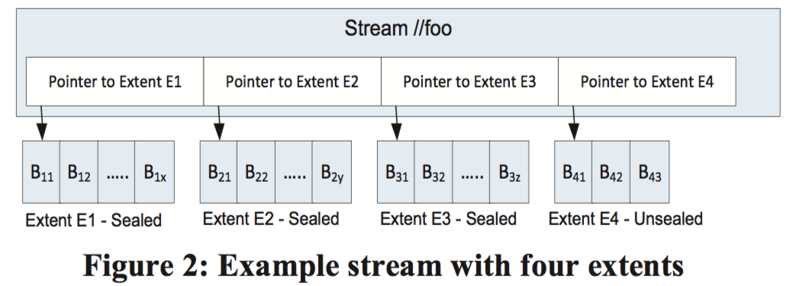
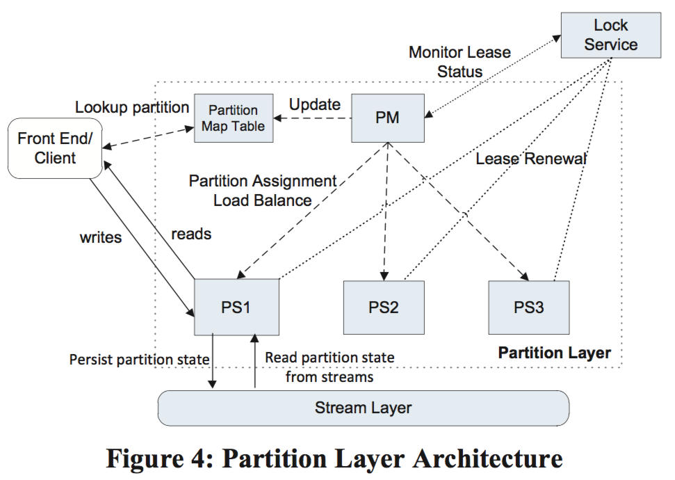
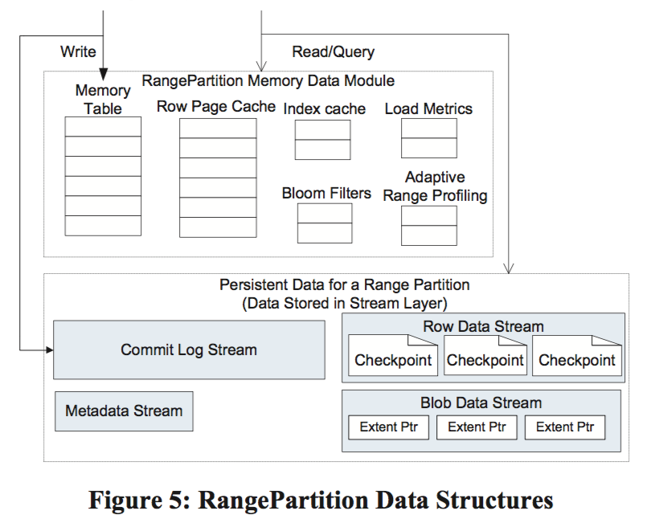
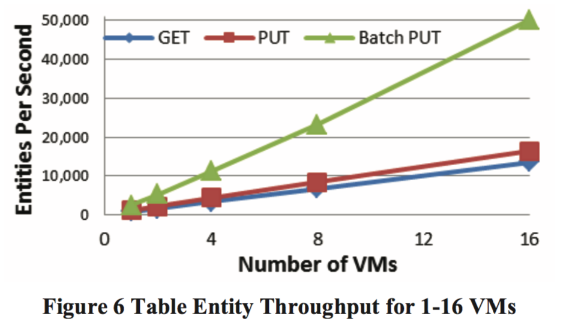
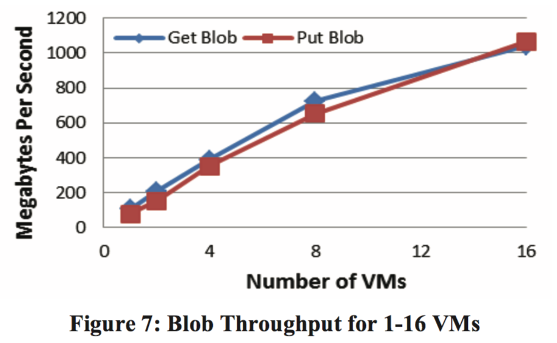
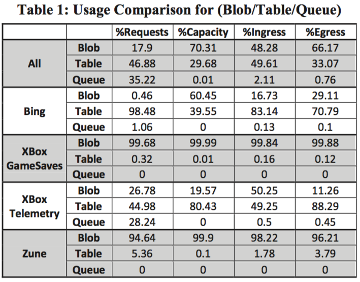

# Windows Azure Storage: A Highly Available

# Cloud Storage Service with Strong Consistency

Brad Calder, Ju Wang, Aaron Ogus, Niranjan Nilakantan, Arild Skjolsvold, Sam McKelvie, Yikang Xu,

Shashwat Srivastav, Jiesheng Wu, Huseyin Simitci, Jaidev Haridas, Chakravarthy Uddaraju,

Hemal Khatri, Andrew Edwards, Vaman Bedekar, Shane Mainali, Rafay Abbasi, Arpit Agarwal,

Mian Fahim ul Haq, Muhammad Ikram ul Haq, Deepali Bhardwaj, Sowmya Dayanand,

Anitha Adusumilli, Marvin McNett, Sriram Sankaran, Kavitha Manivannan, Leonidas Rigas

Microsoft

## Abstract

Windows Azure Storage (WAS) is a cloud storage system that
provides customers the ability to store seemingly limitless
amounts of data for any duration of time. WAS customers have
access to their data from anywhere at any time and only pay for
what they use and store. In WAS, data is stored durably using
both local and geographic replication to facilitate disaster
recovery. Currently, WAS storage comes in the form of Blobs
(files), Tables (structured storage), and Queues (message
delivery). In this paper, we describe the WAS architecture, global
namespace, and data model, as well as its resource provisioning,
load balancing, and replication systems.

## 1. Introduction

Windows Azure Storage (WAS) is a scalable cloud storage
system that has been in production since November 2008. It is
used inside Microsoft for applications such as social networking
search, serving video, music and game content, managing medical
records, and more. In addition, there are thousands of customers
outside Microsoft using WAS, and anyone can sign up over the
Internet to use the system.

WAS provides cloud storage in the form of Blobs (user files),
Tables (structured storage), and Queues (message delivery).
These three data abstractions provide the overall storage and
workflow for many applications. A common usage pattern we see
is incoming and outgoing data being shipped via Blobs, Queues
providing the overall workflow for processing the Blobs, and
intermediate service state and final results being kept in Tables or
Blobs.
An example of this pattern is an ingestion engine service built on
Windows Azure to provide near real-time Facebook and Twitter
search. This service is one part of a larger data processing
pipeline that provides publically searchable content (via our
search engine, Bing) within 15 seconds of a Facebook or Twitter
user’s posting or status update. Facebook and Twitter send the
raw public content to WAS (e.g., user postings, user status
updates, etc.) to be made publically searchable. This content is
stored in WAS Blobs. The ingestion engine annotates this data
with user auth, spam, and adult scores; content classification; and
classification for language and named entities. In addition, the
engine crawls and expands the links in the data. While
processing, the ingestion engine accesses WAS Tables at high
rates and stores the results back into Blobs. These Blobs are then
folded into the Bing search engine to make the content publically
searchable. The ingestion engine uses Queues to manage the flow
of work, the indexing jobs, and the timing of folding the results
into the search engine. As of this writing, the ingestion engine for
Facebook and Twitter keeps around 350TB of data in WAS
(before replication). In terms of transactions, the ingestion engine
has a peak traffic load of around 40,000 transactions per second
and does between two to three billion transactions per day (see Section 7 for discussion of additional workload profiles).

In the process of building WAS, feedback from potential internal
and external customers drove many design decisions. Some key
design features resulting from this feedback include:
Strong Consistency – Many customers want strong consistency:
especially enterprise customers moving their line of business
applications to the cloud. They also want the ability to perform
conditional reads, writes, and deletes for optimistic concurrency
control [12] on the strongly consistent data. For this, WAS
provides three properties that the CAP theorem [2] claims are
difficult to achieve at the same time: strong consistency, high
availability, and partition tolerance (see Section 8).
Global and Scalable Namespace/Storage – For ease of use,
WAS implements a global namespace that allows data to be stored
and accessed in a consistent manner from any location in the
world. Since a major goal of WAS is to enable storage of massive
amounts of data, this global namespace must be able to address
exabytes of data and beyond. We discuss our global namespace
design in detail in Section 2.
(^) Permission to make digital or hard copies of all or part of this work for
personal or classroom use is granted without fee provided that copies are
not made or distributed for profit or commercial advantage and that copies
bear this notice and the full citation on the first page. To copy otherwise, to
republish, to post on servers or to redistribute to lists, requires prior
specific permission and/or a fee.
_SOSP '11_ , October 23-26, 2011, Cascais, Portugal.
Copyright © 2011 ACM 978-1-4503-0977-6/11/10 ... $10.00.

**Disaster Recovery** – WAS stores customer data across multiple
data centers hundreds of miles apart from each other. This
redundancy provides essential data recovery protection against
disasters such as earthquakes, wild fires, tornados, nuclear reactor
meltdown, etc.

**Multi-tenancy and Cost of Storage** – To reduce storage cost,
many customers are served from the same shared storage
infrastructure. WAS combines the workloads of many different
customers with varying resource needs together so that
significantly less storage needs to be provisioned at any one point
in time than if those services were run on their own dedicated
hardware.

We describe these design features in more detail in the following
sections. The remainder of this paper is organized as follows.
Section 2 describes the global namespace used to access the WAS
Blob, Table, and Queue data abstractions. Section 3 provides a
high level overview of the WAS architecture and its three layers:
Stream, Partition, and Front-End layers. Section 4 describes the
stream layer, and Section 5 describes the partition layer. Section
6 shows the throughput experienced by Windows Azure
applications accessing Blobs and Tables. Section 7 describes
some internal Microsoft workloads using WAS. Section 8
discusses design choices and lessons learned. Section 9 presents
related work, and Section 10 summarizes the paper.

## 2. Global Partitioned Namespace

A key goal of our storage system is to provide a single global
namespace that allows clients to address all of their storage in the
cloud and scale to arbitrary amounts of storage needed over time.
To provide this capability we leverage DNS as part of the storage
namespace and break the storage namespace into three parts: an
account name, a partition name, and an object name. As a result,
all data is accessible via a URI of the form:

http(s):// **AccountName** .<service>^1 .core.windows.net/ **PartitionNa
me** / **ObjectName**

The **AccountName** is the customer selected account name for
accessing storage and is part of the DNS host name. The
AccountName DNS translation is used to locate the primary
storage cluster and data center where the data is stored. This
primary location is where all requests go to reach the data for that
account. An application may use multiple AccountNames to store
its data across different locations.

In conjunction with the AccountName, the **PartitionName** locates
the data once a request reaches the storage cluster. The
PartitionName is used to scale out access to the data across
storage nodes based on traffic needs.

When a PartitionName holds many objects, the **ObjectName**
identifies individual objects within that partition. The system
supports atomic transactions across objects with the same
PartitionName value. The ObjectName is optional since, for some
types of data, the PartitionName uniquely identifies the object
within the account.

This naming approach enables WAS to flexibly support its three
data abstractions^2. For Blobs, the full blob name is the
PartitionName. For Tables, each entity (row) in the table has a

(^1) <service> specifies the service type, which can be **blob** , **table** , or **queue**.
(^2) APIs for Windows Azure Blobs, Tables, and Queues can be found here:
[http://msdn.microsoft.com/en-us/library/dd179355.aspx](http://msdn.microsoft.com/en-us/library/dd179355.aspx)
primary key that consists of two properties: the PartitionName and
the ObjectName. This distinction allows applications using
Tables to group rows into the same partition to perform atomic
transactions across them. For Queues, the queue name is the
PartitionName and each message has an ObjectName to uniquely
identify it within the queue.

## 3. High Level Architecture


Here we present a high level discussion of the WAS architecture
and how it fits into the Windows Azure Cloud Platform.

### 3.1 Windows Azure Cloud Platform

The Windows Azure Cloud platform runs many cloud services
across different data centers and different geographic regions.
The Windows Azure Fabric Controller is a resource provisioning
and management layer that provides resource allocation,
deployment/upgrade, and management for cloud services on the
Windows Azure platform. WAS is one such service running on
top of the Fabric Controller.
The Fabric Controller provides node management, network
configuration, health monitoring, starting/stopping of service
instances, and service deployment for the WAS system. In
addition, WAS retrieves network topology information, physical
layout of the clusters, and hardware configuration of the storage
nodes from the Fabric Controller. WAS is responsible for
managing the replication and data placement across the disks and
load balancing the data and application traffic within the storage
cluster.

### 3.2 WAS Architectural Components

An important feature of WAS is the ability to store and provide
access to an immense amount of storage (exabytes and beyond).
We currently have 70 petabytes of raw storage in production and
are in the process of provisioning a few hundred more petabytes
of raw storage based on customer demand for 2012.
The WAS production system consists of Storage Stamps and the
Location Service (shown in Figure 1).


Storage Stamps – A storage stamp is a cluster of N racks of
storage nodes, where each rack is built out as a separate fault
domain with redundant networking and power. Clusters typically
range from 10 to 20 racks with 18 disk-heavy storage nodes per
rack. Our first generation storage stamps hold approximately 2PB
of raw storage each. Our next generation stamps hold up to 30PB
of raw storage each.

To provide low cost cloud storage, we need to keep the storage
provisioned in production as highly utilized as possible. Our goal
is to keep a storage stamp around 70% utilized in terms of
capacity, transactions, and bandwidth. We try to avoid going
above 80% because we want to keep 20% in reserve for (a) disk
short stroking to gain better seek time and higher throughput by
utilizing the outer tracks of the disks and (b) to continue providing
storage capacity and availability in the presence of a rack failure
within a stamp. When a storage stamp reaches 70% utilization,
the location service migrates accounts to different stamps using
inter-stamp replication (see Section 3.4).

**Location Service (LS)** – The location service manages all the
storage stamps. It is also responsible for managing the account
namespace across all stamps. The LS allocates accounts to storage
stamps and manages them across the storage stamps for disaster
recovery and load balancing. The location service itself is
distributed across two geographic locations for its own disaster
recovery.

WAS provides storage from multiple locations in each of the three
geographic regions: North America, Europe, and Asia. Each
location is a data center with one or more buildings in that
location, and each location holds multiple storage stamps. To
provision additional capacity, the LS has the ability to easily add
new regions, new locations to a region, or new stamps to a
location. Therefore, to increase the amount of storage, we deploy
one or more storage stamps in the desired location’s data center
and add them to the LS. The LS can then allocate new storage
accounts to those new stamps for customers as well as load
balance (migrate) existing storage accounts from older stamps to
the new stamps.

Figure 1 shows the location service with two storage stamps and
the layers within the storage stamps. The LS tracks the resources
used by each storage stamp in production across all locations.
When an application requests a new account for storing data, it
specifies the location affinity for the storage (e.g., US North).
The LS then chooses a storage stamp within that location as the
primary stamp for the account using heuristics based on the load
information across all stamps (which considers the fullness of the
stamps and other metrics such as network and transaction
utilization). The LS then stores the account metadata information
in the chosen storage stamp, which tells the stamp to start taking
traffic for the assigned account. The LS then updates DNS to
allow requests to now route from the name
https://AccountName.service.core.windows.net/ to that storage
stamp’s virtual IP (VIP, an IP address the storage stamp exposes
for external traffic).

### 3.3 Three Layers within a Storage Stamp

Also shown in Figure 1 are the three layers within a storage
stamp. From bottom up these are:

**Stream Layer** – This layer stores the bits on disk and is in charge
of distributing and replicating the data across many servers to
keep data durable within a storage stamp. The stream layer can be
thought of as a distributed file system layer within a stamp. It
understands files, called “streams” (which are ordered lists of
large storage chunks called “extents”), how to store them, how to
replicate them, etc., but it does not understand higher level object
constructs or their semantics. The data is stored in the stream
layer, but it is accessible from the partition layer. In fact, partition
servers (daemon processes in the partition layer) and stream
servers are co-located on each storage node in a stamp.

Partition Layer – The partition layer is built for (a) managing
and understanding higher level data abstractions (Blob, Table,
Queue), (b) providing a scalable object namespace, (c) providing
transaction ordering and strong consistency for objects, (d) storing
object data on top of the stream layer, and (e) caching object data
to reduce disk I/O.
Another responsibility of this layer is to achieve scalability by
partitioning all of the data objects within a stamp. As described
earlier, all objects have a PartitionName; they are broken down
into disjointed ranges based on the PartitionName values and
served by different partition servers. This layer manages which
partition server is serving what PartitionName ranges for Blobs,
Tables, and Queues. In addition, it provides automatic load
balancing of PartitionNames across the partition servers to meet
the traffic needs of the objects.
Front-End (FE) layer – The Front-End (FE) layer consists of a
set of stateless servers that take incoming requests. Upon
receiving a request, an FE looks up the AccountName,
authenticates and authorizes the request, then routes the request to
a partition server in the partition layer (based on the
PartitionName). The system maintains a Partition Map that keeps
track of the PartitionName ranges and which partition server is
serving which PartitionNames. The FE servers cache the Partition
Map and use it to determine which partition server to forward
each request to. The FE servers also stream large objects directly
from the stream layer and cache frequently accessed data for
efficiency.

#### 3.4 Two Replication Engines

Before describing the stream and partition layers in detail, we first
give a brief overview of the two replication engines in our system
and their separate responsibilities.
Intra-Stamp Replication (stream layer) – This system provides
synchronous replication and is focused on making sure all the
data written into a stamp is kept durable within that stamp. It
keeps enough replicas of the data across different nodes in
different fault domains to keep data durable within the stamp in
the face of disk, node, and rack failures. Intra-stamp replication
is done completely by the stream layer and is on the critical path
of the customer’s write requests. Once a transaction has been
replicated successfully with intra-stamp replication, success can
be returned back to the customer.
Inter-Stamp Replication (partition layer) – This system
provides asynchronous replication and is focused on replicating
data across stamps. Inter-stamp replication is done in the
background and is off the critical path of the customer’s request.
This replication is at the object level, where either the whole
object is replicated or recent delta changes are replicated for a
given account. Inter-stamp replication is used for (a) keeping a
copy of an account’s data in two locations for disaster recovery
and (b) migrating an account’s data between stamps. Inter-stamp
replication is configured for an account by the location service
and performed by the partition layer.
Inter-stamp replication is focused on replicating objects and the
transactions applied to those objects, whereas intra-stamp
replication is focused on replicating blocks of disk storage that are
used to make up the objects.
We separated replication into intra-stamp and inter-stamp at these
two different layers for the following reasons. Intra-stamp
replication provides durability against hardware failures, which
occur frequently in large scale systems, whereas inter-stamp
replication provides geo-redundancy against geo-disasters, which

are rare. It is crucial to provide intra-stamp replication with low
latency, since that is on the critical path of user requests; whereas
the focus of inter-stamp replication is optimal use of network
bandwidth between stamps while achieving an acceptable level of
replication delay. They are different problems addressed by the
two replication schemes.

Another reason for creating these two separate replication layers
is the namespace each of these two layers has to maintain.
Performing intra-stamp replication at the stream layer allows the
amount of information that needs to be maintained to be scoped
by the size of a single storage stamp. This focus allows all of the
meta-state for intra-stamp replication to be cached in memory for
performance (see Section 4 ), enabling WAS to provide fast

replication with strong consistency by quickly committing
transactions within a single stamp for customer requests. In
contrast, the partition layer combined with the location service
controls and understands the global object namespace across
stamps, allowing it to efficiently replicate and maintain object
state across data centers.

## 4. Stream Layer

The stream layer provides an internal interface used only by the
partition layer. It provides a file system like namespace and API,
except that all writes are append-only. It allows clients (the
partition layer) to open, close, delete, rename, read, append to, and
concatenate these large files, which are called streams. A stream
is an ordered list of extent pointers, and an extent is a sequence of
append blocks.

Figure 2 shows stream “//foo”, which contains (pointers to) four
extents (E1, E2, E3, and E4). Each extent contains a set of blocks
that were appended to it. E1, E2 and E3 are sealed extents. It
means that they can no longer be appended to; only the last extent
in a stream (E4) can be appended to. If an application reads the
data of the stream from beginning to end, it would get the block
contents of the extents in the order of E1, E2, E3 and E4.



In more detail these data concepts are:

**Block** – This is the minimum unit of data for writing and reading.
A block can be up to _N_ bytes (e.g. 4MB). Data is written
(appended) as one or more concatenated blocks to an extent,
where blocks do not have to be the same size. The client does an
append in terms of blocks and controls the size of each block. A
client read gives an offset to a stream or extent, and the stream
layer reads as many blocks as needed at the offset to fulfill the
length of the read. When performing a read, the entire contents of
a block are read. This is because the stream layer stores its
checksum validation at the block level, one checksum per block.
The whole block is read to perform the checksum validation, and
it is checked on every block read. In addition, all blocks in the
system are validated against their checksums once every few days
to check for data integrity issues.

**Extent** – Extents are the unit of replication in the stream layer,
and the default replication policy is to keep three replicas within a
storage stamp for an extent. Each extent is stored in an NTFS file
and consists of a sequence of blocks. The target extent size used
by the partition layer is 1GB. To store small objects, the partition
layer appends many of them to the same extent and even in the
same block; to store large TB-sized objects (Blobs), the object is
broken up over many extents by the partition layer. The partition
layer keeps track of what streams, extents, and byte offsets in the
extents in which objects are stored as part of its index.
Streams – Every stream has a name in the hierarchical namespace
maintained at the stream layer, and a stream looks like a big file to
the partition layer. Streams are appended to and can be randomly
read from. A stream is an ordered list of pointers to extents
which is maintained by the Stream Manager. When the extents are
concatenated together they represent the full contiguous address
space in which the stream can be read in the order they were
added to the stream. A new stream can be constructed by
concatenating extents from existing streams, which is a fast
operation since it just updates a list of pointers. Only the last
extent in the stream can be appended to. All of the prior extents
in the stream are immutable.

## 4.1 Stream Manager and Extent Nodes


The two main architecture components of the stream layer are the
Stream Manager (SM) and Extent Node (EN) (shown in Figure 3).


Stream Manager (SM) – The SM keeps track of the stream
namespace, what extents are in each stream, and the extent
allocation across the Extent Nodes (EN). The SM is a standard
Paxos cluster [13] as used in prior storage systems [3], and is off
the critical path of client requests. The SM is responsible for (a)
maintaining the stream namespace and state of all active streams
and extents, (b) monitoring the health of the ENs, (c) creating and
assigning extents to ENs, (d) performing the lazy re-replication of
extent replicas that are lost due to hardware failures or
unavailability, (e) garbage collecting extents that are no longer
pointed to by any stream, and (f) scheduling the erasure coding of
extent data according to stream policy (see Section 4.4).
The SM periodically polls (syncs) the state of the ENs and what
extents they store. If the SM discovers that an extent is replicated
on fewer than the expected number of ENs, a re-replication of the
extent will lazily be created by the SM to regain the desired level
of replication. For extent replica placement, the SM randomly
chooses ENs across different fault domains, so that they are stored
on nodes that will not have correlated failures due to power,
network, or being on the same rack.

The SM does not know anything about blocks, just streams and
extents. The SM is off the critical path of client requests and does
not track each block append, since the total number of blocks can
be huge and the SM cannot scale to track those. Since the stream
and extent state is only tracked within a single stamp, the amount
of state can be kept small enough to fit in the SM’s memory. The
only client of the stream layer is the partition layer, and the
partition layer and stream layer are co-designed so that they will
not use more than 50 million extents and no more than 100,
streams for a single storage stamp given our current stamp sizes.
This parameterization can comfortably fit into 32GB of memory
for the SM.

**Extent Nodes (EN)** – Each extent node maintains the storage for
a set of extent replicas assigned to it by the SM. An EN has _N_
disks attached, which it completely controls for storing extent
replicas and their blocks. An EN knows nothing about streams,
and only deals with extents and blocks. Internally on an EN
server, every extent on disk is a file, which holds data blocks and
their checksums, and an index which maps extent offsets to blocks
and their file location. Each extent node contains a view about the
extents it owns and where the peer replicas are for a given extent.
This view is a cache kept by the EN of the global state the SM
keeps. ENs only talk to other ENs to replicate block writes
(appends) sent by a client, or to create additional copies of an
existing replica when told to by the SM. When an extent is no
longer referenced by any stream, the SM garbage collects the
extent and notifies the ENs to reclaim the space.

## 4.2 Append Operation and Sealed Extent

Streams can only be appended to; existing data cannot be
modified. The append operations are atomic: either the entire data
block is appended, or nothing is. Multiple blocks can be
appended at once, as a single atomic “multi-block append”
operation. The minimum read size from a stream is a single
block. The “multi-block append” operation allows us to write a
large amount of sequential data in a single append and to later
perform small reads. The contract used between the client
(partition layer) and the stream layer is that the multi-block
append will occur atomically, and if the client never hears back
for a request (due to failure) the client should retry the request (or
seal the extent). This contract implies that the client needs to
expect the same block to be appended more than once in face of
timeouts and correctly deal with processing duplicate records. The
partition layer deals with duplicate records in two ways (see
Section 5 for details on the partition layer streams). For the
metadata and commit log streams, all of the transactions written
have a sequence number and duplicate records will have the same
sequence number. For the row data and blob data streams, for
duplicate writes, only the last write will be pointed to by the
RangePartition data structures, so the prior duplicate writes will
have no references and will be garbage collected later.

An extent has a target size, specified by the client (partition layer),
and when it fills up to that size the extent is sealed at a block
boundary, and then a new extent is added to the stream and
appends continue into that new extent. Once an extent is **sealed** it
can no longer be appended to. A sealed extent is immutable, and
the stream layer performs certain optimizations on sealed extents
like erasure coding cold extents. Extents in a stream do not have
to be the same size, and they can be sealed anytime and can even
grow arbitrarily large.

## 4.3 Stream Layer Intra-Stamp Replication

The stream layer and partition layer are co-designed to provide
strong consistency at the object transaction level. The correctness
of the partition layer providing strong consistency is built upon
the following guarantees from the stream layer:

1. Once a record is appended and acknowledged back to the
  client, any later reads of that record from any replica will see the
  same data (the data is immutable).
2. Once an extent is sealed, any reads from any sealed replica will
  always see the same contents of the extent.
  The data center, Fabric Controller, and WAS have security
  mechanisms in place to guard against malicious adversaries, so
  the stream replication does not deal with such threats. We
  consider faults ranging from disk and node errors to power
  failures, network issues, bit-flip and random hardware failures, as
  well as software bugs. These faults can cause data corruption;
  checksums are used to detect such corruption. The rest of the
  section discusses the intra-stamp replication scheme within this
  context.

### 4.3.1 Replication Flow

As shown in Figure 3, when a stream is first created (step A), the
SM assigns three replicas for the first extent (one primary and two
secondary) to three extent nodes (step B), which are chosen by the
SM to randomly spread the replicas across different fault and
upgrade domains while considering extent node usage (for load
balancing). In addition, the SM decides which replica will be the
primary for the extent. Writes to an extent are always performed
from the client to the primary EN, and the primary EN is in charge
of coordinating the write to two secondary ENs. The primary EN
and the location of the three replicas never change for an extent
while it is being appended to (while the extent is unsealed ).
Therefore, no leases are used to represent the primary EN for an
extent, since the primary is always fixed while an extent is
unsealed.
When the SM allocates the extent, the extent information is sent
back to the client, which then knows which ENs hold the three
replicas and which one is the primary. This state is now part of
the stream’s metadata information held in the SM and cached on
the client. When the last extent in the stream that is being
appended to becomes sealed, the same process repeats. The SM
then allocates another extent, which now becomes the last extent
in the stream, and all new appends now go to the new last extent
for the stream.
For an extent, every append is replicated three times across the
extent’s replicas. A client sends all write requests to the primary
EN, but it can read from any replica, even for unsealed extents.
The append is sent to the primary EN for the extent by the client,
and the primary is then in charge of (a) determining the offset of
the append in the extent, (b) ordering (choosing the offset of) all
of the appends if there are concurrent append requests to the same
extent outstanding, (c) sending the append with its chosen offset
to the two secondary extent nodes, and (d) only returning success
for the append to the client after a successful append has occurred
to disk for all three extent nodes. The sequence of steps during an
append is shown in Figure 3 (labeled with numbers). Only when
all of the writes have succeeded for all three replicas will the
primary EN then respond to the client that the append was a
success. If there are multiple outstanding appends to the same
extent, the primary EN will respond success in the order of their
offset (commit them in order) to the clients. As appends commit
in order for a replica, the last append position is considered to be
the current commit length of the replica. We ensure that the bits
are the same between all replicas by the fact that the primary EN
for an extent never changes, it always picks the offset for appends,

appends for an extent are committed in order, and how extents are
sealed upon failures (discussed in Section 4.3.2).

When a stream is opened, the metadata for its extents is cached at
the client, so the client can go directly to the ENs for reading and
writing without talking to the SM until the next extent needs to be
allocated for the stream. If during writing, one of the replica’s
ENs is not reachable or there is a disk failure for one of the
replicas, a write failure is returned to the client. The client then
contacts the SM, and the extent that was being appended to is
sealed by the SM at its current commit length (see Section 4.3.2).
At this point the sealed extent can no longer be appended to. The
SM will then allocate a new extent with replicas on different
(available) ENs, which makes it now the last extent of the stream.
The information for this new extent is returned to the client. The
client then continues appending to the stream with its new extent.
This process of sealing by the SM and allocating the new extent is
done on average within 20ms. A key point here is that the client
can continue appending to a stream as soon as the new extent has
been allocated, and it does not rely on a specific node to become
available again.

For the newly sealed extent, the SM will create new replicas to
bring it back to the expected level of redundancy in the
background if needed.

### 4.3.2 Sealing

From a high level, the SM coordinates the sealing operation
among the ENs; it determines the commit length of the extent
used for sealing based on the commit length of the extent replicas.
Once the sealing is done, the commit length will never change
again.

To seal an extent, the SM asks all three ENs their current length.
During sealing, either all replicas have the same length, which is
the simple case, or a given replica is longer or shorter than another
replica for the extent. This latter case can only occur during an
append failure where some but not all of the ENs for the replica
are available (i.e., some of the replicas get the append block, but
not all of them). We guarantee that the SM will seal the extent
even if the SM may not be able to reach all the ENs involved.
When sealing the extent, the SM will choose the smallest commit
length based on the available ENs it can talk to. This will not
cause data loss since the primary EN will not return success
unless all replicas have been written to disk for all three ENs. This
means the smallest commit length is sure to contain all the writes
that have been acknowledged to the client. In addition, it is also
fine if the final length contains blocks that were never
acknowledged back to the client, since the client (partition layer)
correctly deals with these as described in Section 4.2. During the
sealing, all of the extent replicas that were reachable by the SM
are sealed to the commit length chosen by the SM.

Once the sealing is done, the commit length of the extent will
never be changed. If an EN was not reachable by the SM during
the sealing process but later becomes reachable, the SM will force
the EN to synchronize the given extent to the chosen commit
length. This ensures that once an extent is sealed, all its available
replicas (the ones the SM can eventually reach) are bitwise
identical.

### 4.3.3 Interaction with Partition Layer

An interesting case is when, due to network partitioning, a client
(partition server) is still able to talk to an EN that the SM could
not talk to during the sealing process. This section explains how
the partition layer handles this case.

The partition layer has two different read patterns:

1. **Read records at known locations.** The partition layer uses two
  types of data streams (row and blob). For these streams, it always
  reads at specific locations (extent+offset, length). More
  importantly, the partition layer will only read these two streams
  using the location information returned from a previous successful
  append at the stream layer. That will only occur if the append was
  successfully committed to all three replicas. The replication
  scheme guarantees such reads always see the same data.
2. **Iterate all records sequentially in a stream on partition
  load.** Each partition has two additional streams (metadata and
  commit log). These are the only streams that the partition layer
  will read sequentially from a starting point to the very last record
  of a stream. This operation only occurs when the partition is loaded (explained in Section 5). The partition layer ensures that
no useful appends from the partition layer will happen to these
two streams during partition load. Then the partition and stream
layer together ensure that the same sequence of records is returned
on partition load.
At the start of a partition load, the partition server sends a “check
for commit length” to the primary EN of the last extent of these
two streams. This checks whether all the replicas are available and
that they all have the same length. If not, the extent is sealed and
reads are only performed, during partition load, against a replica
sealed by the SM. This ensures that the partition load will see all
of its data and the exact same view, even if we were to repeatedly
load the same partition reading from different sealed replicas for
the last extent of the stream.

## 4.4 Erasure Coding Sealed Extents


To reduce the cost of storage, WAS erasure codes sealed extents
for Blob storage. WAS breaks an extent into N roughly equal
sized fragments at block boundaries. Then, it adds M error
correcting code fragments using Reed-Solomon for the erasure
coding algorithm [19]. As long as it does not lose more than M
fragments (across the data fragments + code fragments), WAS can
recreate the full extent.
Erasure coding sealed extents is an important optimization, given
the amount of data we are storing. It reduces the cost of storing
data from three full replicas within a stamp, which is three times
the original data, to only 1.3x – 1.5x the original data, depending
on the number of fragments used. In addition, erasure coding
actually increases the durability of the data when compared to
keeping three replicas within a stamp.

## 4.5 Read Load-Balancing

When reads are issued for an extent that has three replicas, they
are submitted with a “deadline” value which specifies that the
read should not be attempted if it cannot be fulfilled within the
deadline. If the EN determines the read cannot be fulfilled within
the time constraint, it will immediately reply to the client that the
deadline cannot be met. This mechanism allows the client to
select a different EN to read that data from, likely allowing the
read to complete faster.
This method is also used with erasure coded data. When reads
cannot be serviced in a timely manner due to a heavily loaded
spindle to the data fragment, the read may be serviced faster by
doing a reconstruction rather than reading that data fragment. In
this case, reads (for the range of the fragment needed to satisfy the
client request) are issued to all fragments of an erasure coded
extent, and the first N responses are used to reconstruct the desired
fragment.

## 4.6 Spindle Anti-Starvation

Many hard disk drives are optimized to achieve the highest
possible throughput, and sacrifice fairness to achieve that goal.
They tend to prefer reads or writes that are sequential. Since our
system contains many streams that can be very large, we observed
in developing our service that some disks would lock into
servicing large pipelined reads or writes while starving other
operations. On some disks we observed this could lock out non-
sequential IO for as long as 2300 milliseconds. To avoid this
problem we avoid scheduling new IO to a spindle when there is
over 100ms of expected pending IO already scheduled or when
there is any pending IO request that has been scheduled but not
serviced for over 200ms. Using our own custom IO scheduling
allows us to achieve fairness across reads/writes at the cost of
slightly increasing overall latency on some sequential requests.

## 4.7 Durability and Journaling

The durability contract for the stream layer is that when data is
acknowledged as written by the stream layer, there must be at
least three durable copies of the data stored in the system. This
contract allows the system to maintain data durability even in the
face of a cluster-wide power failure. We operate our storage
system in such a way that all writes are made durable to power
safe storage before they are acknowledged back to the client.

As part of maintaining the durability contract while still achieving
good performance, an important optimization for the stream layer
is that on each extent node we reserve a whole disk drive or SSD
as a **journal drive** for all writes into the extent node. The journal
drive [11] is dedicated solely for writing a single sequential
journal of data, which allows us to reach the full write throughput
potential of the device. When the partition layer does a stream
append, the data is written by the primary EN while in parallel
sent to the two secondaries to be written. When each EN
performs its append, it (a) writes all of the data for the append to
the journal drive and (b) queues up the append to go to the data
disk where the extent file lives on that EN. Once either succeeds,
success can be returned. If the journal succeeds first, the data is
also buffered in memory while it goes to the data disk, and any
reads for that data are served from memory until the data is on the
data disk. From that point on, the data is served from the data
disk. This also enables the combining of contiguous writes into
larger writes to the data disk, and better scheduling of concurrent
writes and reads to get the best throughput. It is a tradeoff for
good latency at the cost of an extra write off the critical path.

Even though the stream layer is an append-only system, we found
that adding a journal drive provided important benefits, since the
appends do not have to contend with reads going to the data disk
in order to commit the result back to the client. The journal
allows the append times from the partition layer to have more
consistent and lower latencies. Take for example the partition
layer’s commit log stream, where an append is only as fast as the
slowest EN for the replicas being appended to. For small appends
to the commit log stream without journaling we saw an average
end-to-end stream append latency of 30ms. With journaling we
see an average append latency of 6ms. In addition, the variance of
latencies decreased significantly.

## 5. Partition Layer

The partition layer stores the different types of objects and
understands what a transaction means for a given object type
(Blob, Table, or Queue). The partition layer provides the (a) data
model for the different types of objects stored, (b) logic and
semantics to process the different types of objects, (c) massively
scalable namespace for the objects, (d) load balancing to access
objects across the available partition servers, and (e) transaction
ordering and strong consistency for access to objects.

### 5.1 Partition Layer Data Model

The partition layer provides an important internal data structure
called an Object Table (OT). An OT is a massive table which can
grow to several petabytes. Object Tables are dynamically broken
up into RangePartitions (based on traffic load to the table) and
spread across Partition Servers (Section 5.2) in a stamp. A
RangePartition is a contiguous range of rows in an OT from a
given low-key to a high-key. All RangePartitions for a given OT
are non-overlapping, and every row is represented in some
RangePartition.
The following are the Object Tables used by the partition layer.
The Account Table stores metadata and configuration for each
storage account assigned to the stamp. The Blob Table stores all
blob objects for all accounts in the stamp. The Entity Table stores
all entity rows for all accounts in the stamp; it is used for the
public Windows Azure Table data abstraction. The Message
Table stores all messages for all accounts’ queues in the stamp.
The Schema Table keeps track of the schema for all OTs. The
Partition Map Table keeps track of the current RangePartitions for
all Object Tables and what partition server is serving each
RangePartition. This table is used by the Front-End servers to
route requests to the corresponding partition servers.
Each of the above OTs has a fixed schema stored in the Schema
Table. The primary key for the Blob Table, Entity Table, and
Message Table consists of three properties: AccountName,
PartitionName, and ObjectName. These properties provide the
indexing and sort order for those Object Tables.

#### 5.1.1 Supported Data Types and Operations

The property types supported for an OT’s schema are the standard
simple types (bool, binary, string, DateTime, double, GUID,
int32, int64). In addition, the system supports two special types –
DictionaryType and BlobType. The DictionaryType allows for
flexible properties (i.e., without a fixed schema) to be added to a
row at any time. These flexible properties are stored inside of the
dictionary type as (name, type, value) tuples. From a data access
standpoint, these flexible properties behave like first-order
properties of the row and are queryable just like any other
property in the row. The BlobType is a special property used to
store large amounts of data and is currently used only by the Blob
Table. BlobType avoids storing the blob data bits with the row
properties in the “row data stream”. Instead, the blob data bits
are stored in a separate “blob data stream” and a pointer to the
blob’s data bits (list of “extent + offset, length” pointers) is stored
in the BlobType’s property in the row. This keeps the large data
bits separated from the OT’s queryable row property values stored
in the row data stream.
OTs support standard operations including insert, update, and
delete operations on rows as well as query/get operations. In
addition, OTs allows batch transactions across rows with the same
PartitionName value. The operations in a single batch are
committed as a single transaction. Finally, OTs provide snapshot
isolation to allow read operations to happen concurrently with
writes.

### 5.2 Partition Layer Architecture

The partition layer has three main architectural components as
shown in Figure 4: a Partition Manager (PM), Partition Servers
(PS), and a Lock Service.


**Partition Manager (PM)** – Responsible for keeping track of and
splitting the massive Object Tables into RangePartitions and
assigning each RangePartition to a Partition Server to serve access
to the objects. The PM splits the Object Tables into _N_
RangePartitions in each stamp, keeping track of the current
RangePartition breakdown for each OT and to which partition
servers they are assigned. The PM stores this assignment in the
Partition Map Table. The PM ensures that each RangePartition is
assigned to exactly one active partition server at any time, and that
two RangePartitions do not overlap. It is also responsible for load
balancing RangePartitions among partition servers. Each stamp
has multiple instances of the PM running, and they all contend for
a leader lock that is stored in the Lock Service (see below). The
PM with the lease is the active PM controlling the partition layer.

**Partition Server (PS)** – A partition server is responsible for
serving requests to a set of RangePartitions assigned to it by the
PM. The PS stores all the persistent state of the partitions into
streams and maintains a memory cache of the partition state for
efficiency. The system guarantees that no two partition servers
can serve the same RangePartition at the same time by using
leases with the Lock Service. This allows the PS to provide
strong consistency and ordering of concurrent transactions to
objects for a RangePartition it is serving. A PS can concurrently
serve multiple RangePartitions from different OTs. In our
deployments, a PS serves on average ten RangePartitions at any
time.

**Lock Service –** A Paxos Lock Service [3,13] is used for leader
election for the PM. In addition, each PS also maintains a lease
with the lock service in order to serve partitions. We do not go
into the details of the PM leader election, or the PS lease
management, since the concepts used are similar to those
described in the Chubby Lock [3] paper.

On partition server failure, all _N_ RangePartitions served by the
failed PS are assigned to available PSs by the PM. The PM will
choose _N_ (or fewer) partition servers, based on the load on those
servers. The PM will assign a RangePartition to a PS, and then
update the Partition Map Table specifying what partition server is
serving each RangePartition. This allows the Front-End layer to
find the location of RangePartitions by looking in the Partition
Map Table (see Figure 4). When the PS gets a new assignment it
will start serving the new RangePartitions for as long as the PS
holds its partition server lease.

### 5.3 RangePartition Data Structures

A PS serves a RangePartition by maintaining a set of in-memory
data structures and a set of persistent data structures in streams.

#### 5.3.1 Persistent Data Structure

A RangePartition uses a Log-Structured Merge-Tree [17,4] to
maintain its persistent data. Each Object Table’s RangePartition
consists of its own set of streams in the stream layer, and the
streams belong solely to a given RangePartition, though the
underlying extents can be pointed to by multiple streams in
different RangePartitions due to RangePartition splitting. The
following are the set of streams that comprise each RangePartition
(shown in Figure 5):


Metadata Stream – The metadata stream is the root stream for a
RangePartition. The PM assigns a partition to a PS by providing
the name of the RangePartition’s metadata stream. The metadata
stream contains enough information for the PS to load a
RangePartition, including the name of the commit log stream and
data streams for that RangePartition, as well as pointers
(extent+offset) into those streams for where to start operating in
those streams (e.g., where to start processing in the commit log
stream and the root of the index for the row data stream). The PS
serving the RangePartition also writes in the metadata stream the
status of outstanding split and merge operations that the
RangePartition may be involved in.
Commit Log Stream – Is a commit log used to store the recent
insert, update, and delete operations applied to the RangePartition
since the last checkpoint was generated for the RangePartition.
Row Data Stream – Stores the checkpoint row data and index for
the RangePartition.
Blob Data Stream – Is only used by the Blob Table to store the
blob data bits.
Each of the above is a separate stream in the stream layer owned
by an Object Table’s RangePartition.
Each RangePartition in an Object Table has only one data stream,
except the Blob Table. A RangePartition in the Blob Table has a
“row data stream” for storing its row checkpoint data (the blob
index), and a separate “blob data stream” for storing the blob data
bits for the special BlobType described earlier.

#### 5.3.2 In-Memory Data Structures

A partition server maintains the following in-memory components
as shown in Figure 5:
Memory Table – This is the in-memory version of the commit
log for a RangePartition, containing all of the recent updates that
have not yet been checkpointed to the row data stream. When a
lookup occurs the memory table is checked to find recent updates
to the RangePartition.

**Index Cache** – This cache stores the checkpoint indexes of the
row data stream. We separate this cache out from the row data
cache to make sure we keep as much of the main index cached in
memory as possible for a given RangePartition.

**Row Data Cache** – This is a memory cache of the checkpoint row
data pages. The row data cache is read-only. When a lookup
occurs, both the row data cache and the memory table are
checked, giving preference to the memory table.

**Bloom Filters** – If the data is not found in the memory table or
the row data cache, then the index/checkpoints in the data stream
need to be searched. It can be expensive to blindly examine them
all. Therefore a bloom filter is kept for each checkpoint, which
indicates if the row being accessed _may_ be in the checkpoint.

We do not go into further details about these components, since
these are similar to those in [17,4].

### 5.4 Data Flow

When the PS receives a write request to the RangePartition (e.g.,
insert, update, delete), it appends the operation into the commit
log, and then puts the newly changed row into the memory table.
Therefore, all the modifications to the partition are recorded
persistently in the commit log, and also reflected in the memory
table. At this point success can be returned back to the client (the
FE servers) for the transaction. When the size of the memory table
reaches its threshold size or the size of the commit log stream
reaches its threshold, the partition server will write the contents of
the memory table into a checkpoint stored persistently in the row
data stream for the RangePartition. The corresponding portion of
the commit log can then be removed. To control the total number
of checkpoints for a RangePartition, the partition server will
periodically combine the checkpoints into larger checkpoints, and
then remove the old checkpoints via garbage collection.

For the Blob Table’s RangePartitions, we also store the Blob data
bits directly into the commit log stream (to minimize the number
of stream writes for Blob operations), but those data bits are not
part of the row data so they are not put into the memory table.
Instead, the BlobType property for the row tracks the location of
the Blob data bits (extent+offset, length). During checkpoint, the
extents that would be removed from the commit log are instead
concatenated to the RangePartition’s Blob data stream. Extent
concatenation is a fast operation provided by the stream layer
since it consists of just adding pointers to extents at the end of the
Blob data stream without copying any data.

A PS can start serving a RangePartition by “loading” the partition.
Loading a partition involves reading the metadata stream of the
RangePartition to locate the active set of checkpoints and
replaying the transactions in the commit log to rebuild the in-
memory state. Once these are done, the PS has the up-to-date
view of the RangePartition and can start serving requests.

### 5.5 RangePartition Load Balancing

A critical part of the partition layer is breaking these massive
Object Tables into RangePartitions and automatically load
balancing them across the partition servers to meet their varying
traffic demands.

The PM performs three operations to spread load across partition
servers and control the total number of partitions in a stamp:

**Load Balance** – This operation identifies when a given PS has
too much traffic and reassigns one or more RangePartitions to less
loaded partition servers.
Split – This operation identifies when a single RangePartition has
too much load and splits the RangePartition into two or more
smaller and disjoint RangePartitions, then load balances
(reassigns) them across two or more partition servers.
Merge – This operation merges together cold or lightly loaded
RangePartitions that together form a contiguous key range within
their OT. Merge is used to keep the number of RangePartitions
within a bound proportional to the number of partition servers in a
stamp.
WAS keeps the total number of partitions between a low
watermark and a high watermark (typically around ten times the
partition server count within a stamp). At equilibrium, the
partition count will stay around the low watermark. If there are
unanticipated traffic bursts that concentrate on a single
RangePartition, it will be split to spread the load. When the total
RangePartition count is approaching the high watermark, the
system will increase the merge rate to eventually bring the
RangePartition count down towards the low watermark.
Therefore, the number of RangePartitions for each OT changes
dynamically based upon the load on the objects in those tables.
Having a high watermark of RangePartitions ten times the number
of partition servers (a storage stamp has a few hundred partition
servers) was chosen based on how big we can allow the stream
and extent metadata to grow for the SM, and still completely fit
the metadata in memory for the SM. Keeping many more
RangePartitions than partition servers enables us to quickly
distribute a failed PS or rack’s load across many other PSs. A
given partition server can end up serving a single extremely hot
RangePartition, tens of lightly loaded RangePartitions, or a
mixture in-between, depending upon the current load to the
RangePartitions in the stamp. The number of RangePartitions for
the Blob Table vs. Entity Table vs. Message Table depends upon
the load on the objects in those tables and is continuously
changing within a storage stamp based upon traffic.
For each stamp, we typically see 75 splits and merges and 200
RangePartition load balances per day.

#### 5.5.1 Load Balance Operation Details

We track the load for each RangePartition as well as the overall
load for each PS. For both of these we track
(a) transactions/second, (b) average pending transaction count,
(c) throttling rate, (d) CPU usage, (e) network usage, (f) request
latency, and (g) data size of the RangePartition. The PM
maintains heartbeats with each PS. This information is passed
back to the PM in responses to the heartbeats. If the PM sees a
RangePartition that has too much load based upon the metrics,
then it will decide to split the partition and send a command to the
PS to perform the split. If instead a PS has too much load, but no
individual RangePartition seems to be too highly loaded, the PM
will take one or more RangePartitions from the PS and reassign
them to a more lightly loaded PS.
To load balance a RangePartition, the PM sends an offload
command to the PS, which will have the RangePartition write a
current checkpoint before offloading it. Once complete, the PS
acks back to the PM that the offload is done. The PM then
assigns the RangePartition to its new PS and updates the Partition
Map Table to point to the new PS. The new PS loads and starts
serving traffic for the RangePartition. The loading of the
RangePartition on the new PS is very quick since the commit log
is small due to the checkpoint prior to the offload.

#### 5.5.2 Split Operation

WAS splits a RangePartition due to too much load as well as the
size of its row or blob data streams. If the PM identifies either
situation, it tells the PS serving the RangePartition to split based
upon load or size. The PM makes the decision to split, but the PS
chooses the key (AccountName, PartitionName) where the
partition will be split. To split based upon size, the
RangePartition maintains the total size of the objects in the
partition and the split key values where the partition can be
approximately halved in size, and the PS uses that to pick the key
for where to split. If the split is based on load, the PS chooses the
key based upon Adaptive Range Profiling [16]. The PS
adaptively tracks which key ranges in a RangePartition have the
most load and uses this to determine on what key to split the
RangePartition.

To split a RangePartition (B) into two new RangePartitions (C,D),
the following steps are taken.

1. The PM instructs the PS to split B into C and D.
2. The PS in charge of B checkpoints B, then stops serving traffic
  briefly during step 3 below.
3. The PS uses a special stream operation “MultiModify” to take
  each of B’s streams (metadata, commit log and data) and creates
  new sets of streams for C and D respectively with the same
  extents in the same order as in B. This step is very fast, since a
  stream is just a list of pointers to extents. The PS then appends
  the new partition key ranges for C and D to their metadata
  streams.
4. The PS starts serving requests to the two new partitions C and
  D for their respective disjoint PartitionName ranges.
5. The PS notifies the PM of the split completion, and the PM
  updates the Partition Map Table and its metadata information
  accordingly. The PM then moves one of the split partitions to a
  different PS.

#### 5.5.3 Merge Operation

To merge two RangePartitions, the PM will choose two
RangePartitions C and D with adjacent PartitionName ranges that
have low traffic. The following steps are taken to merge C and D
into a new RangePartition E.

1. The PM moves C and D so that they are served by the same PS.
  The PM then tells the PS to merge (C,D) into E.
2. The PS performs a checkpoint for both C and D, and then
  briefly pauses traffic to C and D during step 3.
3. The PS uses the MultiModify stream command to create a new
  commit log and data streams for E. Each of these streams is the
  concatenation of all of the extents from their respective streams in
  C and D. This merge means that the extents in the new commit
  log stream for E will be all of C’s extents in the order they were in
  C’s commit log stream followed by all of D’s extents in their
  original order. This layout is the same for the new row and Blob
  data stream(s) for E.
4. The PS constructs the metadata stream for E, which contains
  the names of the new commit log and data stream, the combined
  key range for E, and pointers (extent+offset) for the start and end
  of the commit log regions in E’s commit log derived from C and
  D, as well as the root of the data index in E’s data streams.
5. At this point, the new metadata stream for E can be correctly
  loaded, and the PS starts serving the newly merged RangePartition
  E.
6. The PM then updates the Partition Map Table and its metadata information to reflect the merge.

### 5.6 Partition Layer Inter-Stamp Replication

Thus far we have talked about an AccountName being associated
(via DNS) to a single location and storage stamp, where all data
access goes to that stamp. We call this the primary stamp for an
account. An account actually has one or more secondary stamps
assigned to it by the Location Service, and this primary/secondary
stamp information tells WAS to perform inter-stamp replication
for this account from the primary stamp to the secondary
stamp(s).
One of the main scenarios for inter-stamp replication is to geo-
replicate an account’s data between two data centers for disaster
recovery. In this scenario, a primary and secondary location is
chosen for the account. Take, for example, an account, for which
we want the primary stamp (P) to be located in US South and the
secondary stamp (S) to be located in US North. When
provisioning the account, the LS will choose a stamp in each
location and register the AccountName with both stamps such that
the US South stamp (P) takes live traffic and the US North stamp
(S) will take only inter-stamp replication (also called geo-
replication) traffic from stamp P for the account. The LS updates
DNS to have hostname AccountName .service.core.windows.net
point to the storage stamp P’s VIP in US South. When a write
comes into stamp P for the account, the change is fully replicated
within that stamp using intra-stamp replication at the stream layer
then success is returned to the client. After the update has been
committed in stamp P, the partition layer in stamp P will
asynchronously geo-replicate the change to the secondary stamp S
using inter-stamp replication. When the change arrives at stamp
S, the transaction is applied in the partition layer and this update
fully replicates using intra-stamp replication within stamp S.
Since the inter-stamp replication is done asynchronously, recent
updates that have not been inter-stamp replicated can be lost in the
event of disaster. In production, changes are geo-replicated and
committed on the secondary stamp within 30 seconds on average
after the update was committed on the primary stamp.
Inter-stamp replication is used for both account geo-replication
and migration across stamps. For disaster recovery, we may need
to perform an abrupt failover where recent changes may be lost,
but for migration we perform a clean failover so there is no data
loss. In both failover scenarios, the Location Service makes an
active secondary stamp for the account the new primary and
switches DNS to point to the secondary stamp’s VIP. Note that
the URI used to access the object does not change after failover.
This allows the existing URIs used to access Blobs, Tables and
Queues to continue to work after failover.

## 6. Application Throughput

For our cloud offering, customers run their applications as a
tenant (service) on VMs. For our platform, we separate
computation and storage into their own stamps (clusters) within a
data center since this separation allows each to scale
independently and control their own load balancing. Here we
examine the performance of a customer application running from
their hosted service on VMs in the same data center as where their
account data is stored. Each VM used is an extra-large VM with
full control of the entire compute node and a 1Gbps NIC. The
results were gathered on live shared production stamps with
internal and external customers.

Figure 6 shows the WAS Table operation throughput in terms of
the entities per second ( _y_ -axis) for 1-16 VMs ( _x_ -axis) performing
random 1KB single entity get and put requests against a single
100GB Table. It also shows batch inserts of 100 entities at a time

- a common way applications insert groups of entities into a WAS
  Table. Figure 7 shows the throughput in megabytes per second
  ( _y_ -axis) for randomly getting and putting 4MB blobs vs. the
  number of VMs used ( _x_ -axis). All of the results are for a single
  storage account.




These results show a linear increase in scale is achieved for
entities/second as the application scales out the amount of
computing resources it uses for accessing WAS Tables. For
Blobs, the throughput scales linearly up to eight VMs, but tapers
off as the aggregate throughput reaches the network capacity on
the client side where the test traffic was generated. The results
show that, for Table operations, batch puts offer about three times
more throughput compared to single entity puts. That is because
the batch operation significantly reduces the number of network
roundtrips and requires fewer stream writes. In addition, the
Table read operations have slightly lower throughput than write
operations. This difference is due to the particular access pattern
of our experiment, which randomly accesses a large key space on
a large data set, minimizing the effect of caching. Writes on the
other hand always result in sequential writes to the journal.

## 7. Workload Profiles

Usage patterns for cloud-based applications can vary significantly.
Section 1 already described a near-real time ingestion engine to

provide Facebook and Twitter search for Bing. In this section we
describe a few additional internal services using WAS, and give
some high-level metrics of their usage.

The XBox GameSaves service was announced at E3 this year and
will provide a new feature in Fall 2011 for providing saved game
data into the cloud for millions of XBox users. This feature will
enable subscribed users to upload their game progress into the

WAS cloud storage service, which they can then access from any
XBox console they sign into. The backing storage for this feature
leverages Blob and Table storage.
The XBox Telemetry service stores console-generated diagnostics
and telemetry information for later secure retrieval and offline
processing. For example, various Kinect related features running
on Xbox 360 generate detailed usage files which are uploaded to
the cloud to analyze and improve the Kinect experience based on
customer opt-in. The data is stored directly into Blobs, and
Tables are used to maintain metadata information about the files.
Queues are used to coordinate the processing and the cleaning up
of the Blobs.
Microsoft’s Zune backend uses Windows Azure for media file
storage and delivery, where files are stored as Blobs.
Table 1 shows the relative breakdown among Blob, Table, and
Queue usage across all (All) services (internal and external) using
WAS as well as for the services described above. The table
shows the breakdown of requests, capacity usage, and ingress and
egress traffic for Blobs, Tables and Queues.
Notice that, the percentage of requests for all services shows that
about 17.9% of all requests are Blob requests, 46.88% of the
requests are Table operations and 35.22% are Queue requests for
all services using WAS. But in terms of capacity, 70.31% of
capacity is in Blobs, 29.68% of capacity is used by Tables, and
0.01% used by Queues. “%Ingress” is the percentage breakdown
of incoming traffic (bytes) among Blob, Table, and Queue;
“%Egress” is the same for outbound traffic (bytes). The results
show that different customers have very different usage patterns.
In term of capacity usage, some customers (e.g., Zune and Xbox
GameSaves) have mostly unstructured data (such as media files)
and put those into Blobs, whereas other customers like Bing and
XBox Telemetry that have to index a lot of data have a significant
amount of structured data in Tables. Queues use very little space
compared to Blobs and Tables, since they are primarily used as a
communication mechanism instead of storing data over a long
period of time.



## 8. Design Choices and Lessons Learned

Here, we discuss a few of our WAS design choices and relate
some of the lessons we have learned thus far.
Scaling Computation Separate from Storage – Early on we
decided to separate customer VM-based computation from storage
for Windows Azure. Therefore, nodes running a customer’s
service code are separate from nodes providing their storage. As a
result, we can scale our supply of computation cores and storage
independently to meet customer demand in a given data center.
This separation also provides a layer of isolation between
compute and storage given its multi-tenancy usage, and allows
both of the systems to load balance independently.

Given this decision, our goal from the start has been to allow
computation to efficiently access storage with high bandwidth
without the data being on the same node or even in the same rack.
To achieve this goal we are in the process of moving towards our
next generation data center networking architecture [10], which
flattens the data center networking topology and provides full
bisection bandwidth between compute and storage.

**Range Partitions vs. Hashing** – We decided to use range-based
partitioning/indexing instead of hash-based indexing (where the
objects are assigned to a server based on the hash values of their
keys) for the partition layer’s Object Tables. One reason for this
decision is that range-based partitioning makes performance
isolation easier since a given account’s objects are stored together
within a set of RangePartitions (which also provides efficient
object enumeration). Hash-based schemes have the simplicity of
distributing the load across servers, but lose the locality of objects
for isolation and efficient enumeration. The range partitioning
allows WAS to keep a customer’s objects together in their own set
of partitions to throttle and isolate potentially abusive accounts.

For these reasons, we took the range-based approach and built an
automatic load balancing system (Section 5.5) to spread the load
dynamically according to user traffic by splitting and moving
partitions among servers.

A downside of range partitioning is scaling out access to
sequential access patterns. For example, if a customer is writing
all of their data to the very end of a table’s key range (e.g., insert
key 2011-06-30:12:00:00, then key 2011-06-30:12:00:02, then
key 2011-06:30-12:00:10), all of the writes go to the very last
RangePartition in the customer’s table. This pattern does not take
advantage of the partitioning and load balancing our system
provides. In contrast, if the customer distributes their writes
across a large number of PartitionNames, the system can quickly
split the table into multiple RangePartitions and spread them
across different servers to allow performance to scale linearly
with load (as shown in Figure 6). To address this sequential
access pattern for RangePartitions, a customer can always use
hashing or bucketing for the PartitionName, which avoids the
above sequential access pattern issue.

**Throttling/Isolation** – At times, servers become overloaded by
customer requests. A difficult problem was identifying which
storage accounts should be throttled when this happens and
making sure well-behaving accounts are not affected.

Each partition server keeps track of the request rate for
AccountNames and PartitionNames. Because there are a large
number of AccountNames and PartitionNames it may not be
practical to keep track of them all. The system uses a Sample-
Hold algorithm [7] to track the request rate history of the top _N_
busiest AccountNames and PartitionNames. This information is
used to determine whether an account is well-behaving or not
(e.g., whether the traffic backs off when it is throttled). If a server
is getting overloaded, it uses this information to selectively
throttle the incoming traffic, targeting accounts that are causing
the issue. For example, a PS computes a throttling probability of
the incoming requests for each account based on the request rate
history for the account (those with high request rates will have a
larger probability being throttled, whereas accounts with little
traffic will not). In addition, based on the request history at the
AccountName and PartitionName levels, the system determines
whether the account has been well-behaving. Load balancing will
try to keep the servers within an acceptable load, but when access
patterns cannot be load balanced (e.g., high traffic to a single
PartitionName, high sequential access traffic, repetitive sequential
scanning, etc.), the system throttles requests of such traffic
patterns when they are too high.
Automatic Load Balancing – We found it crucial to have
efficient automatic load balancing of partitions that can quickly
adapt to various traffic conditions. This enables WAS to maintain
high availability in this multi-tenancy environment as well as deal
with traffic spikes to a single user’s storage account. Gathering
the adaptive profile information, discovering what metrics are
most useful under various traffic conditions, and tuning the
algorithm to be smart enough to effectively deal with different
traffic patterns we see in production were some of the areas we
spent a lot of time working on before achieving a system that
works well for our multi-tenancy environment.
We started with a system that used a single number to quantify
“load” on each RangePartition and each server. We first tried the
product of request latency and request rate to represent the load on
a PS and each RangePartition. This product is easy to compute
and reflects the load incurred by the requests on the server and
partitions. This design worked well for the majority of the load
balancing needs (moving partitions around), but it did not
correctly capture high CPU utilization that can occur during scans
or high network utilization. Therefore, we now take into
consideration request, CPU, and network loads to guide load
balancing. However, these metrics are not sufficient to correctly
guide splitting decisions.
For splitting, we introduced separate mechanisms to trigger splits
of partitions, where we collect hints to find out whether some
partitions are reaching their capacity across several metrics. For
example, we can trigger partition splits based on request
throttling, request timeouts, the size of a partition, etc. Combining
split triggers and the load balancing allows the system to quickly
split and load balance hot partitions across different servers.
From a high level, the algorithm works as follows. Every N
seconds (currently 15 seconds) the PM sorts all RangePartitions
based on each of the split triggers. The PM then goes through
each partition, looking at the detailed statistics to figure out if it
needs to be split using the metrics described above (load,
throttling, timeouts, CPU usage, size, etc.). During this process,
the PM picks a small number to split for this quantum, and
performs the split action on those.
After doing the split pass, the PM sorts all of the PSs based on
each of the load balancing metrics - request load, CPU load and
network load. It then uses this to identify which PSs are
overloaded versus lightly loaded. The PM then chooses the PSs
that are heavily loaded and, if there was a recent split from the
prior split pass, the PM will offload one of those RangePartitions
to a lightly loaded server. If there are still highly loaded PSs
(without a recent split to offload), the PM offloads
RangePartitions from them to the lightly loaded PSs.
The core load balancing algorithm can be dynamically “swapped
out” via configuration updates. WAS includes scripting language
support that enables customizing the load balancing logic, such as
defining how a partition split can be triggered based on different
system metrics. This support gives us flexibility to fine-tune the
load balancing algorithm at runtime as well as try new algorithms
according to various traffic patterns observed.

**Separate Log Files per RangePartition** – Performance isolation
for storage accounts is critical in a multi-tenancy environment.
This requirement is one of the reasons we used separate log
streams for each RangePartition, whereas BigTable [4] uses a
single log file across all partitions on the same server. Having
separate log files enables us to isolate the load time of a
RangePartition to just the recent object updates in that
RangePartition.

**Journaling** – When we originally released WAS, it did not have
journaling. As a result, we experienced many hiccups with
read/writes contending with each other on the same drive,
noticeably affecting performance. We did not want to write to
two log files (six replicas) like BigTable [4] due to the increased
network traffic. We also wanted a way to optimize small writes,
especially since we wanted separate log files per RangePartition.
These requirements led us to the journal approach with a single
log file per RangePartition. We found this optimization quite
effective in reducing the latency and providing consistent
performance.

**Append-only System** – Having an append-only system and
sealing an extent upon failure have greatly simplified the
replication protocol and handling of failure scenarios. In this
model, the data is never overwritten once committed to a replica,
and, upon failures, the extent is immediately sealed. This model
allows the consistency to be enforced across all the replicas via
their commit lengths.

Furthermore, the append-only system has allowed us to keep
snapshots of the previous states at virtually no extra cost, which
has made it easy to provide snapshot/versioning features. It also
has allowed us to efficiently provide optimizations like erasure
coding. In addition, append-only has been a tremendous benefit
for diagnosing issues as well as repairing/recovering the system in
case something goes wrong. Since the history of changes is
preserved, tools can easily be built to diagnose issues and to repair
or recover the system from a corrupted state back to a prior known
consistent state. When operating a system at this scale, we cannot
emphasize enough the benefit we have seen from using an
append-only system for diagnostics and recovery.

An append-based system comes with certain costs. An efficient
and scalable garbage collection (GC) system is crucial to keep the
space overhead low, and GC comes at a cost of extra I/O. In
addition, the data layout on disk may not be the same as the
virtual address space of the data abstraction stored, which led us
to implement prefetching logic for streaming large data sets back
to the client.

**End-to-end Checksums** – We found it crucial to keep checksums
for user data end to end. For example, during a blob upload, once
the Front-End server receives the user data, it immediately
computes the checksum and sends it along with the data to the
backend servers. Then at each layer, the partition server and the
stream servers verify the checksum before continuing to process
it. If a mismatch is detected, the request is failed. This prevents
corrupted data from being committed into the system. We have
seen cases where a few servers had hardware issues, and our end-
to-end checksum caught such issues and helped maintain data
integrity. Furthermore, this end-to-end checksum mechanism also
helps identify servers that consistently have hardware issues so we
can take them out of rotation and mark them for repair.

**Upgrades** – A rack in a storage stamp is a fault domain. A
concept orthogonal to fault domain is what we call an upgrade
domain (a set of servers briefly taken offline at the same time
during a rolling upgrade). Servers for each of the three layers are
spread evenly across different fault and upgrade domains for the
storage service. This way, if a fault domain goes down, we lose at
most 1/X of the servers for a given layer, where X is the number
of fault domains. Similarly, during a service upgrade at most 1/Y
of the servers for a given layer are upgraded at a given time,
where Y is the number of upgrade domains. To achieve this, we
use rolling upgrades, which enable us to maintain high availability
when upgrading the storage service, and we upgrade a single
upgrade domain at a time. For example, if we have ten upgrade
domains, then upgrading a single domain would potentially
upgrade ten percent of the servers from each layer at a time.
During a service upgrade, storage nodes may go offline for a few
minutes before coming back online. We need to maintain
availability and ensure that enough replicas are available at any
point in time. Even though the system is built to tolerate isolated
failures, these planned (massive) upgrade “failures” can be more
efficiently dealt with instead of being treated as abrupt massive
failures. The upgrade process is automated so that it is tractable to
manage a large number of these large-scale deployments. The
automated upgrade process goes through each upgrade domain
one at a time for a given storage stamp. Before taking down an
upgrade domain, the upgrade process notifies the PM to move the
partitions out of that upgrade domain and notifies the SM to not
allocate new extents in that upgrade domain. Furthermore, before
taking down any servers, the upgrade process checks with the SM
to ensure that there are sufficient extent replicas available for each
extent outside the given upgrade domain. After upgrading a given
domain, a set of validation tests are run to make sure the system is
healthy before proceeding to the next upgrade domain. This
validation is crucial for catching issues during the upgrade process
and stopping it early should an error occur.
Multiple Data Abstractions from a Single Stack – Our system
supports three different data abstraction from the same storage
stack: Blobs, Tables and Queues. This design enables all data
abstractions to use the same intra-stamp and inter-stamp
replication, use the same load balancing system, and realize the
benefits from improvements in the stream and partition layers. In
addition, because the performance needs of Blobs, Tables, and
Queues are different, our single stack approach enables us to
reduce costs by running all services on the same set of hardware.
Blobs use the massive disk capacity, Tables use the I/O spindles
from the many disks on a node (but do not require as much
capacity as Blobs), and Queues mainly run in memory.
Therefore, we are not only blending different customer’s
workloads together on shared resources, we are also blending
together Blob, Table, and Queue traffic across the same set of
storage nodes.
Use of System-defined Object Tables – We chose to use a fixed
number of system defined Object Tables to build Blob, Table, and
Queue abstractions instead of exposing the raw Object Table
semantics to end users. This decision reduces management by our
system to only the small set of schemas of our internal, system
defined Object Tables. It also provides for easy maintenance and
upgrade of the internal data structures and isolates changes of
these system defined tables from end user data abstractions.
Offering Storage in Buckets of 100TBs – We currently limit the
amount of storage for an account to be no more than 100TB. This
constraint allows all of the storage account data to fit within a
given storage stamp, especially since our initial storage stamps
held only two petabytes of raw data (the new ones hold 20-30PB).
To obtain more storage capacity within a single data center,
customers use more than one account within that location. This
ended up being a reasonable tradeoff for many of our large
customers (storing petabytes of data), since they are typically
already using multiple accounts to partition their storage across
different regions and locations (for local access to data for their
customers). Therefore, partitioning their data across accounts
within a given location to add more storage often fits into their
existing partitioning design. Even so, it does require large
services to have account level partitioning logic, which not all
customers naturally have as part of their design. Therefore, we
plan to increase the amount of storage that can be held within a
given storage account in the future.

**CAP Theorem** – WAS provides high availability with strong
consistency guarantees. This combination seems to violate the
CAP theorem [2], which says a distributed system cannot have
availability, consistency, and partition tolerance at the same time.
However, our system, in practice, provides all three of these
properties within a storage stamp. This situation is made possible
through layering and designing our system around a specific fault
model.

The stream layer has a simple append-only data model, which
provides high availability in the face of network partitioning and
other failures, whereas the partition layer, built upon the stream
layer, provides strong consistency guarantees. This layering
allows us to decouple the nodes responsible for providing strong
consistency from the nodes storing the data with availability in the
face of network partitioning. This decoupling and targeting a
specific set of faults allows our system to provide high availability
and strong consistency in face of various classes of failures we see
in practice. For example, the type of network partitioning we
have seen within a storage stamp are node failures and top-of-rack
(TOR) switch failures. When a TOR switch fails, the given rack
will stop being used for traffic — the stream layer will stop using
that rack and start using extents on available racks to allow
streams to continue writing. In addition, the partition layer will
reassign its RangePartitions to partition servers on available racks
to allow all of the data to continue to be served with high
availability and strong consistency. Therefore, our system is
designed to be able to provide strong consistency with high
availability for the network partitioning issues that are likely to
occur in our system (at the node level as well as TOR failures).

**High-performance Debug Logging** – We used an extensive
debug logging infrastructure throughout the development of
WAS. The system writes logs to the local disks of the storage
nodes and provides a grep-like utility to do a distributed search
across all storage node logs. We do not push these verbose logs
off the storage nodes, given the volume of data being logged.

When bringing WAS to production, reducing logging for
performance reasons was considered. The utility of verbose
logging though made us wary of reducing the amount of logging
in the system. Instead, the logging system was optimized to
vastly increase its performance and reduce its disk space overhead
by automatically tokenizing and compressing output, achieving a
system that can log 100’s of MB/s with little application
performance impact per node. This feature allows retention of
many days of verbose debug logs across a cluster. The high-
performance logging system and associated log search tools are
critical for investigating any problems in production in detail
without the need to deploy special code or reproduce problems.

**Pressure Point Testing** – It is not practical to create tests for all
combinations of all complex behaviors that can occur in a large
scale distributed system. Therefore, we use what we call Pressure
Points to aid in capturing these complex behaviors and
interactions. The system provides a programmable interface for all
of the main operations in our system as well as the points in the
system to create faults. Some examples of these pressure point
commands are: checkpoint a RangePartition, combine a set of
RangePartition checkpoints, garbage collect a RangePartition,
split/merge/load balance RangePartitions, erasure code or un-
erasure code an extent, crash each type of server in a stamp, inject
network latencies, inject disk latencies, etc.
The pressure point system is used to trigger all of these
interactions during a stress run in specific orders or randomly.
This system has been instrumental in finding and reproducing
issues from complex interactions that might have taken years to
naturally occur on their own.

## 9. Related Work

Prior studies [9] revealed the challenges in achieving strong
consistency and high availability in a poorly-connected network
environment. Some systems address this by reducing consistency
guarantees to achieve high availability [22,14,6]. But this shifts
the burden to the applications to deal with conflicting views of
data. For instance, Amazon’s SimpleDB was originally
introduced with an eventual consistency model and more recently
added strongly consistent operations [23]. Van Renesse et. al. [20]
has shown, via Chain Replication, the feasibility of building large-
scale storage systems providing both strong consistency and high
availability, which was later extended to allow reading from any
replica [21]. Given our customer needs for strong consistency, we
set out to provide a system that can provide strong consistency
with high availability along with partition tolerance for our fault
model.
As in many other highly-available distributed storage systems
[6,14,1,5], WAS also provides geo-redundancy. Some of these
systems put geo-replication on the critical path of the live
application requests, whereas we made a design trade-off to take a
classical asynchronous geo-replication approach [18] and leave it
off the critical path. Performing the geo-replication completely
asynchronously allows us to provide better write latency for
applications, and allows more optimizations, such as batching and
compaction for geo-replication, and efficient use of cross-data
center bandwidth. The tradeoff is that if there is a disaster and an
abrupt failover needs to occur, then there is unavailability during
the failover and a potential loss of recent updates to a customer’s
account.
The closest system to ours is GFS [8,15] combined with BigTable
[4]. A few differences from these prior publications are: (1) GFS
allows relaxed consistency across replicas and does not guarantee
that all replicas are bitwise the same, whereas WAS provides that
guarantee, (2) BigTable combines multiple tablets into a single
commit log and writes them to two GFS files in parallel to avoid
GFS hiccups, whereas we found we could work around both of
these by using journaling in our stream layer, and (3) we provide a
scalable Blob storage system and batch Table transactions
integrated into a BigTable-like framework. In addition, we
describe how WAS automatically load balances, splits, and
merges RangePartitions according to application traffic demands.

## 10. Conclusions

The Windows Azure Storage platform implements essential
services for developers of cloud based solutions. The combination
of strong consistency, global partitioned namespace, and disaster
recovery has been important customer features in WAS’s multi-
tenancy environment. WAS runs a disparate set of workloads with
various peak usage profiles from many customers on the same set
of hardware. This significantly reduces storage cost since the
amount of resources to be provisioned is significantly less than the
sum of the peak resources required to run all of these workloads
on dedicated hardware.

As our examples demonstrate, the three storage abstractions,
Blobs, Tables, and Queues, provide mechanisms for storage and
workflow control for a wide range of applications. Not mentioned,
however, is the ease with which the WAS system can be
utilized. For example, the initial version of the Facebook/Twitter
search ingestion engine took one engineer only two months from
the start of development to launching the service. This experience
illustrates our service's ability to empower customers to easily
develop and deploy their applications to the cloud.

Additional information on Windows Azure and Windows Azure

Storage is available at http://www.microsoft.com/windowsazure/.

## Acknowledgements

We would like to thank Geoff Voelker, Greg Ganger, and
anonymous reviewers for providing valuable feedback on this
paper.

We would like to acknowledge the creators of Cosmos (Bing’s
storage system): Darren Shakib, Andrew Kadatch, Sam McKelvie,
Jim Walsh and Jonathan Forbes. We started Windows Azure 5
years ago with Cosmos as our intra-stamp replication system. The
data abstractions and append-only extent-based replication system presented in Section 4 was created by them. We extended
Cosmos to create our stream layer by adding mechanisms to allow
us to provide strong consistency in coordination with the partition
layer, stream operations to allow us to efficiently split/merge
partitions, journaling, erasure coding, spindle anti-starvation, read
load-balancing, and other improvements.

We would also like to thank additional contributors to Windows
Azure Storage: Maneesh Sah, Matt Hendel, Kavitha Golconda,
Jean Ghanem, Joe Giardino, Shuitao Fan, Justin Yu, Dinesh
Haridas, Jay Sreedharan, Monilee Atkinson, Harshawardhan
Gadgil, Phaneesh Kuppahalli, Nima Hakami, Maxim Mazeev,
Andrei Marinescu, Garret Buban, Ioan Oltean, Ritesh Kumar,
Richard Liu, Rohit Galwankar, Brihadeeshwar Venkataraman,
Jayush Luniya, Serdar Ozler, Karl Hsueh, Ming Fan, David
Goebel, Joy Ganguly, Ishai Ben Aroya, Chun Yuan, Philip Taron,
Pradeep Gunda, Ryan Zhang, Shyam Antony, Qi Zhang, Madhav
Pandya, Li Tan, Manish Chablani, Amar Gadkari, Haiyong Wang,
Hakon Verespej, Ramesh Shankar, Surinder Singh, Ryan Wu,
Amruta Machetti, Abhishek Singh Baghel, Vineet Sarda, Alex
Nagy, Orit Mazor, and Kayla Bunch.

Finally we would like to thank Amitabh Srivastava, G.S. Rana,
Bill Laing, Satya Nadella, Ray Ozzie, and the rest of the Windows
Azure team for their support.

## Reference

```
[1] J. Baker et al., "Megastore: Providing Scalable, Highly
Available Storage for Interactive Services," in Conf. on
Innovative Data Systems Research , 2011.
[2] Eric A. Brewer, "Towards Robust Distributed Systems.
(Invited Talk)," in Principles of Distributed Computing ,
Portland, Oregon, 2000.
[3] M. Burrows, "The Chubby Lock Service for Loosely-
Coupled Distributed Systems," in OSDI , 2006.
```
```
[4] F. Chang et al., "Bigtable: A Distributed Storage System for
Structured Data," in OSDI , 2006.
[5] B. Cooper et al., "PNUTS: Yahoo!'s Hosted Data Serving
Platform," VLDB , vol. 1, no. 2, 2008.
[6] G. DeCandia et al., "Dynamo: Amazon's Highly Available
Key-value Store," in SOSP , 2007.
[7] Cristian Estan and George Varghese, "New Directions in
Traffic Measurement and Accounting," in SIGCOMM , 2002.
[8] S. Ghemawat, H. Gobioff, and S.T. Leung, "The Google
File System," in SOSP , 2003.
[9] J. Gray, P. Helland, P. O'Neil, and D. Shasha, "The Dangers
of Replication and a Solution," in SIGMOD , 1996.
[10] Albert Greenberg et al., "VL2: A Scalable and Flexible Data
Center Network," Communications of the ACM , vol. 54, no.
3, pp. 95-104, 2011.
[11] Y. Hu and Q. Yang, "DCD—Disk Caching Disk: A New
Approach for Boosting I/O Performance," in ISCA , 1996.
[12] H.T. Kung and John T. Robinson, "On Optimistic Methods
for Concurrency Control," ACM Transactions on Database
Systems , vol. 6, no. 2, pp. 213-226, June 1981.
[13] Leslie Lamport, "The Part-Time Parliament," ACM
Transactions on Computer Systems , vol. 16, no. 2, pp. 133-
169, May 1998.
[14] A. Malik and P. Lakshman, "Cassandra: a decentralized
structured storage system," SIGOPS Operating System
Review , vol. 44, no. 2, 2010.
[15] M. McKusick and S. Quinlan, "GFS: Evolution on Fast-
forward," ACM File Systems , vol. 7, no. 7, 2009.
[16] S. Mysore, B. Agrawal, T. Sherwood, N. Shrivastava, and S.
Suri, "Profiling over Adaptive Ranges," in Symposium on
Code Generation and Optimization , 2006.
[17] P. O'Neil, E. Cheng, D. Gawlick, and E. O'Neil, "The Log-
Structured Merge-Tree (LSM-tree)," Acta Informatica -
ACTA , vol. 33, no. 4, 1996.
[18] H. Patterson et al., "SnapMirror: File System Based
Asynchronous Mirroring for Disaster Recovery," in
USENIX-FAST , 2002.
[19] Irving S. Reed and Gustave Solomon, "Polynomial Codes
over Certain Finite Fields," Journal of the Society for
Industrial and Applied Mathematics , vol. 8, no. 2, pp. 300-
304, 1960.
[20] R. Renesse and F. Schneider, "Chain Replication for
Supporting High Throughput and Availability," in USENIX-
OSDI , 2004.
[21] J. Terrace and M. Freedman, "Object Storage on CRAQ:
High-throughput chain replication for read-mostly
workloads," in USENIX'09 , 2009.
[22] D. Terry, K. Petersen M. Theimer, A. Demers, M. Spreitzer,
and C. Hauser, "Managing Update Conflicts in Bayou, A
Weakly Connected Replicated Storage System," in ACM
SOSP , 1995.
[23] W. Vogel, "All Things Distributed - Choosing Consistency,"
in
http://www.allthingsdistributed.com/2010/02/strong_consist
ency_simpledb.html , 2010.
```

